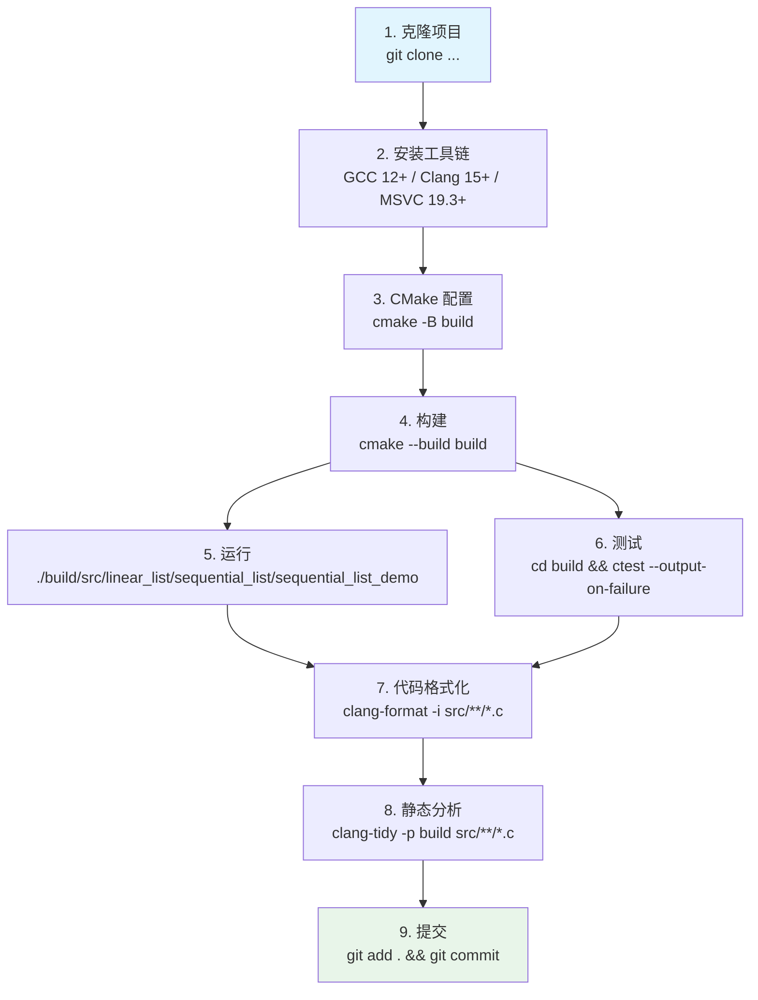
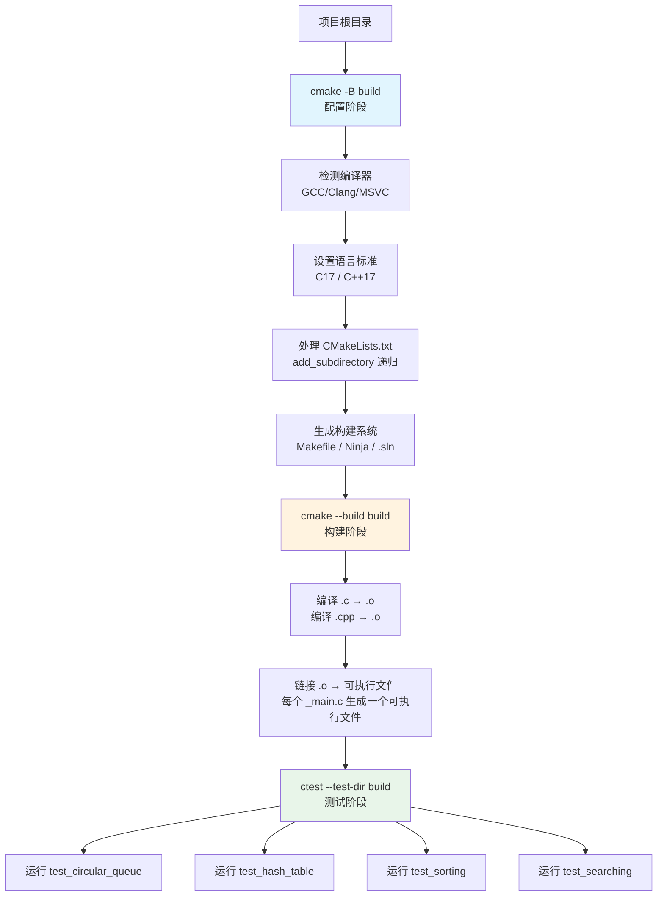
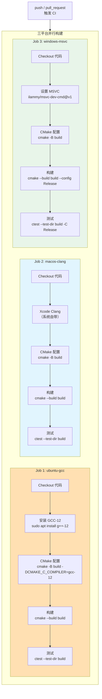

# 代码导读与开发指南

> 本文档是数据结构与算法学习项目的核心参考手册，涵盖代码导读、开发环境搭建、CMake 构建体系、工具链配置、编码规范与贡献指南等内容。

---

## 推荐阅读顺序

1. 先读 [项目总览](01-项目总览.md) 了解项目全局定位与模块划分
2. 阅读 [学习路径与参考资料](../learning/01-学习路径与参考资料.md) 了解推荐学习路线
3. 根据学习需要阅读 [数据结构详解](../learning/02-数据结构详解.md) 或 [算法详解](../learning/03-算法详解.md)
3. 遇到编译或代码理解问题时参考本文档的「代码导读」与「常见问题」部分
4. 准备搭建开发环境时阅读「开发环境搭建」章节
5. 需要理解构建系统时阅读「CMake 构建体系深度讲解」章节
6. 准备贡献代码时阅读「开发规范」与「贡献指南」部分

### 开发工作流图

下图展示了从克隆项目到提交代码的完整开发工作流，涵盖环境搭建、构建、测试、格式化与静态分析等关键步骤：



---

## 代码导读

### 目录结构解读

```
data-structures-and-algorithms/
├── .clang-format              # 代码格式化配置
├── .clang-tidy                # 静态分析配置
├── CMakeLists.txt             # 根 CMake 构建脚本
├── Doxyfile                   # Doxygen 文档生成配置
├── docs/                      # 文档目录
├── python/                    # Python 实现与辅助脚本
│   ├── algorithms/            #   算法与数据结构 Python 实现（74 个模块）
│   │   ├── sorting/           #     排序算法
│   │   ├── searching/         #     搜索算法
│   │   ├── string_algorithm/  #     字符串算法
│   │   ├── dynamic_programming/ #   动态规划
│   │   ├── greedy/            #     贪心算法
│   │   ├── backtracking/      #     回溯法
│   │   ├── divide_and_conquer/ #    分治法
│   │   ├── data_structures/   #     数据结构
│   │   ├── bit_manipulation/  #     位运算
│   │   └── run_all.py         #     一键测试
│   ├── sorting_comparison.py  #   排序性能比较
│   ├── search_comparison.py   #   搜索性能比较
│   ├── dp_verify.py           #   DP 正确性验证
│   ├── graph_visualization.py #   图可视化
│   └── hash_analysis.py       #   哈希表 ASL 分析
├── src/                       # 源代码目录
│   ├── linear_list/           # 线性表模块
│   │   ├── sequential_list/   #   顺序表
│   │   ├── singly_linked_list/#   单链表
│   │   ├── doubly_linked_list/#   双链表
│   │   ├── circular_linked_list/ # 循环链表
│   │   └── skip_list/         #   跳表
│   ├── stack/                 # 栈模块
│   │   ├── sequential_stack/  #   顺序栈
│   │   └── linked_stack/      #   链式栈
│   ├── queue/                 # 队列模块
│   │   ├── circular_queue/    #   循环队列
│   │   ├── linked_queue/      #   链式队列
│   │   ├── deque/             #   双端队列
│   │   └── priority_queue/    #   优先队列
│   ├── tree/                  # 树模块
│   │   ├── binary_tree/       #   二叉树
│   │   ├── binary_search_tree/#   二叉搜索树
│   │   ├── avl_tree/          #   AVL 平衡树
│   │   ├── huffman_tree/      #   哈夫曼树
│   │   └── trie/              #   字典树
│   ├── graph/                 # 图模块
│   │   ├── adjacency_matrix/  #   邻接矩阵
│   │   ├── adjacency_list/    #   邻接表
│   │   └── union_find/        #   并查集
│   ├── hash_table/            # 哈希表模块
│   ├── heap/                  # 堆模块
│   │   ├── max_heap/          #   最大堆
│   │   └── min_heap/          #   最小堆
│   ├── sorting/               # 排序算法模块
│   ├── searching/             # 搜索算法模块
│   ├── string_algorithm/      # 字符串算法模块
│   ├── bit_manipulation/      # 位运算模块
│   ├── math/                  # 数学算法模块
│   └── advanced_algorithm/    # 高级算法模块
│       ├── backtracking/      #   回溯
│       ├── divide_and_conquer/#   分治
│       ├── dynamic_programming/ # 动态规划
│       └── greedy/            #   贪心
└── tests/                     # 测试目录
    ├── self_test.h            #   自定义测试框架
    ├── test_circular_queue.c
    ├── test_hash_table.c
    ├── test_sorting.cpp
    └── test_searching.cpp
```

每个源代码子模块遵循统一的文件组织模式：

| 文件 | 说明 |
|------|------|
| `xxx.h` | 头文件，包含类型定义与函数声明 |
| `xxx.c` / `xxx.cpp` | 核心实现 |
| `xxx_main.c` / `xxx_main.cpp` | 可执行程序入口，包含演示与测试调用 |
| `CMakeLists.txt` | 模块级构建脚本 |

### 命名规范

#### 文件命名

| 类型 | 命名规范 | 示例 |
|------|---------|------|
| 头文件 | 小写下划线 | `circular_queue.h` |
| C 源文件 | 小写下划线 | `circular_queue.c` |
| C++ 源文件 | 小写下划线 | `binary_search.cpp` |
| 测试文件 | test_ 前缀 | `test_circular_queue.c` |
| 多版本文件 | _vN 后缀 | `sequential_list_v1.cpp` |
| 主入口文件 | _main 后缀 | `circular_queue_main.c` |

#### 代码命名

| 类型 | 命名规范 | 示例 |
|------|---------|------|
| 函数 | 大驼峰 / 小写下划线 | `EnQueue()` / `insertNode()` |
| 结构体（C） | 大驼峰 + _t 后缀 | `SqQueue` |
| 结构体/类（C++） | 大驼峰 | `BinaryTree`、`SkipList` |
| 宏常量 | 全大写下划线 | `MAXSIZE`、`STACKINCREATEMENT` |
| 局部变量 | 小写下划线 | `front`、`rear`、`curr_sum` |
| 类成员变量 | 下划线后缀 | `header_`、`level_` |

### 代码风格示例

#### C 语言风格

```c
typedef struct {
    QElemType data[MAXSIZE];
    int front;
    int rear;
} SqQueue;

bool EnQueue(SqQueue *Q, QElemType e)
{
    if (QueueFull(Q))
        return false;
    Q->data[Q->rear] = e;
    Q->rear = (Q->rear + 1) % MAXSIZE;
    return true;
}
```

#### C++ 语言风格

```cpp
class SkipList {
public:
    SkipList();
    ~SkipList();

    void Insert(int key, int value);
    bool Search(int key, int &value);
    bool Delete(int key);

private:
    SkipNode *header_;
    int level_;
};
```

### 典型模块导读

#### 顺序表模块

**入口文件**: [sequential_list_v1.cpp](../../src/linear_list/sequential_list/sequential_list_v1.cpp)

**核心结构**:

```cpp
typedef struct
{
    int *data;
    int  size;
    int length;
} SqList;
```

**关键函数**:
- `InitList()` — 初始化顺序表
- `InsList()` — 插入元素（含动态扩容）
- `DelList()` — 删除元素
- `LocateElem()` — 按值查找

**阅读建议**: 从 `main()` 函数入手，跟踪 `InitList` → `InsList` → `DelList` 的调用链。

---

#### 循环队列模块

**入口文件**: [circular_queue.h](../../src/queue/circular_queue/circular_queue.h)、[circular_queue.c](../../src/queue/circular_queue/circular_queue.c)

**核心结构**:

```c
typedef struct {
    QElemType data[MAXSIZE];
    int front;
    int rear;
} SqQueue;
```

**关键函数**:
- `InitQueue()` — 初始化队列
- `EnQueue()` — 入队
- `DeQueue()` — 出队
- `QueueEmpty()` / `QueueFull()` — 判空/判满

**阅读建议**: 理解 `(rear + 1) % MAXSIZE == front` 判满条件的原理——牺牲一个存储单元以区分空与满状态。

---

#### 二叉树模块

**入口文件**: [binary_tree_v1.cpp](../../src/tree/binary_tree/binary_tree_v1.cpp)

**核心结构**:

```cpp
typedef struct BitNode
{
    int data;
    struct BitNode *lchild, *rchild;
} BiTNode, *BiNode;
```

**关键函数**:
- `CreateBiTree()` — 创建二叉树
- `PreOrde()` / `InOrder()` / `PostOrde()` — 三种递归遍历
- `LevelOrder()` — 层序遍历（队列实现）

**阅读建议**: 先理解递归遍历的原理，再学习层序遍历的队列实现。

---

#### 排序算法模块

**入口文件**: [sequential_list_sorting.cpp](../../src/sorting/sequential_list_sorting.cpp)

**实现的排序算法**:
- 直接插入排序 `InsertSort()`
- 折半插入排序 `BInsertSort()`
- 希尔排序 `ShellSort()`
- 冒泡排序 `BubbleSort()`
- 快速排序 `QuickSort()`
- 选择排序 `SelectSort()`
- 堆排序 `HeapSort()`
- 归并排序 `MergeSort()`

**阅读建议**: 按算法复杂度从低到高阅读：冒泡 → 插入 → 选择 → 希尔 → 快排 → 堆排 → 归并。

---

#### 图模块

**邻接矩阵**: [adjacency_matrix.c](../../src/graph/adjacency_matrix/adjacency_matrix.c)

**邻接表**: [adjacency_list.c](../../src/graph/adjacency_list/adjacency_list.c)

**关键算法**:
- DFS/BFS 遍历
- Prim 最小生成树
- Kruskal 最小生成树
- Dijkstra 单源最短路径
- Floyd 全源最短路径
- 拓扑排序

**阅读建议**: 先理解图的两种存储结构，再学习各种图算法。

---

#### Python 算法包

**入口文件**: [run_all.py](../../python/algorithms/run_all.py)

**包结构**:

```
python/algorithms/
├── __init__.py
├── run_all.py                 # 一键测试（74 个模块）
├── sorting/                   # 排序算法（10 种）
├── searching/                 # 搜索算法（4 种）
├── string_algorithm/          # 字符串算法（8 种）
├── dynamic_programming/       # 动态规划（11 种）
├── greedy/                    # 贪心算法（3 种）
├── backtracking/              # 回溯法（4 种）
├── divide_and_conquer/        # 分治法（2 种）
├── data_structures/           # 数据结构（23 种）
├── bit_manipulation/          # 位运算
├── graph/                     # 图算法
└── math_algorithm/            # 数学算法
```

**运行测试**:

```bash
cd python
python -m algorithms.run_all
```

**辅助脚本**:

| 脚本 | 用途 | 依赖 |
|------|------|------|
| [sorting_comparison.py](../../python/sorting_comparison.py) | 排序算法性能比较 | 基础库 |
| [search_comparison.py](../../python/search_comparison.py) | 搜索算法性能比较 | 基础库 |
| [dp_verify.py](../../python/dp_verify.py) | DP 正确性验证（与暴力法对比） | 基础库 |
| [graph_visualization.py](../../python/graph_visualization.py) | 图结构可视化（BFS/DFS/MST） | networkx, matplotlib |
| [hash_analysis.py](../../python/hash_analysis.py) | 哈希表 ASL 理论与实测对比 | 基础库 |

**阅读建议**: Python 实现与 C/C++ 实现一一对应，建议对照阅读同一算法的两种语言实现，理解语言特性对算法表达的影响。

---

## 开发环境搭建

本章节参照各工具官方文档，提供 Windows、Ubuntu、macOS 三大平台的开发环境搭建步骤。

### Windows：MSVC + CMake

#### 前置条件

- Windows 10 1809+ 或 Windows 11
- 磁盘空间 ≥ 10 GB（Visual Studio 安装较大）

#### 步骤一：安装 Visual Studio 2022

1. 访问 [Visual Studio 下载页](https://visualstudio.microsoft.com/zh-hans/downloads/)，下载 **Community** 版本（免费）
2. 运行安装程序，在「工作负荷」选项中勾选 **「使用 C++ 的桌面开发」**
3. 在右侧「安装详细信息」中确认以下组件已选中：
   - MSVC v143 - VS 2022 C++ x64/x86 生成工具
   - Windows 11 SDK（或 Windows 10 SDK）
4. 点击「安装」，等待完成

> 参考文档：[Visual Studio 官方安装指南](https://learn.microsoft.com/zh-cn/visualstudio/install/install-visual-studio)

#### 步骤二：安装 CMake

**方式 A — 通过 Visual Studio 安装（推荐）**：

在 Visual Studio Installer 中，确认「使用 C++ 的桌面开发」工作负荷下已勾选 **「CMake 工具 for Windows」**，Visual Studio 2022 默认包含此组件。

**方式 B — 独立安装**：

1. 访问 [CMake 官方下载页](https://cmake.org/download/)，下载 Windows x64 Installer（`.msi`）
2. 安装时勾选 **「Add CMake to the system PATH for all users」**
3. 完成安装

> 参考文档：[CMake 官方安装文档](https://cmake.org/install/)

#### 步骤三：验证安装

打开 **Developer Command Prompt for VS 2022**（从开始菜单搜索），执行：

```powershell
cl /Bv
cmake --version
```

预期输出包含 MSVC 版本号（≥ 19.3）和 CMake 版本号（≥ 3.16）。

#### 步骤四：构建项目

```powershell
cd /d <项目根目录>
cmake -B build -G "Visual Studio 17 2022"
cmake --build build --config Release
```

### Ubuntu：GCC + CMake

#### 前置条件

- Ubuntu 20.04 LTS 或更高版本
- sudo 权限

#### 步骤一：安装 GCC / G++

```bash
sudo apt-get update
sudo apt-get install -y gcc-12 g++-12
```

设置 GCC-12 为默认版本：

```bash
sudo update-alternatives --install /usr/bin/gcc gcc /usr/bin/gcc-12 100
sudo update-alternatives --install /usr/bin/g++ g++ /usr/bin/g++-12 100
```

> 参考文档：[GCC 官方安装文档](https://gcc.gnu.org/install/)

#### 步骤二：安装 CMake

```bash
sudo apt-get install -y cmake
```

如果 apt 仓库中的 CMake 版本低于 3.16，可通过 Kitware 官方 PPA 安装更新版本：

```bash
sudo apt-get install -y gpg wget
wget -O - https://apt.kitware.com/keys/kitware-archive-latest.asc | sudo gpg --dearmor -o /usr/share/keyrings/kitware-archive-keyring.gpg
echo "deb [signed-by=/usr/share/keyrings/kitware-archive-keyring.gpg] https://apt.kitware.com/ubuntu $(lsb_release -cs) main" | sudo tee /etc/apt/sources.list.d/kitware.list >/dev/null
sudo apt-get update
sudo apt-get install -y cmake
```

> 参考文档：[Kitware APT Repository](https://apt.kitware.com/)

#### 步骤三：验证安装

```bash
gcc --version
g++ --version
cmake --version
```

预期输出 GCC 版本 ≥ 12，CMake 版本 ≥ 3.16。

#### 步骤四：构建项目

```bash
cd <项目根目录>
cmake -B build
cmake --build build
```

### macOS：Xcode Command Line Tools + CMake

#### 前置条件

- macOS 12 Monterey 或更高版本
- Homebrew 包管理器（推荐）

#### 步骤一：安装 Xcode Command Line Tools

```bash
xcode-select --install
```

弹出安装对话框后点击「安装」。如已安装 Xcode.app，可切换到 Xcode 自带的工具链：

```bash
sudo xcode-select -s /Applications/Xcode.app/Contents/Developer
```

> 参考文档：[Apple 开发者工具文档](https://developer.apple.com/xcode/resources/)

#### 步骤二：安装 CMake

**方式 A — 通过 Homebrew 安装（推荐）**：

```bash
brew install cmake
```

**方式 B — 官方安装包**：

访问 [CMake 官方下载页](https://cmake.org/download/)，下载 macOS `.dmg` 安装包，拖入 `/Applications` 并配置 PATH。

> 参考文档：[Homebrew 官方文档](https://docs.brew.sh/)

#### 步骤三：验证安装

```bash
clang --version
cmake --version
```

预期输出 Apple Clang 版本 ≥ 15，CMake 版本 ≥ 3.16。

#### 步骤四：构建项目

```bash
cd <项目根目录>
cmake -B build
cmake --build build
```

### 可选工具安装

| 工具 | Ubuntu | macOS | Windows | 用途 |
|------|--------|-------|---------|------|
| clang-format | `sudo apt install clang-format` | `brew install clang-format` | 随 Visual Studio 安装 | 代码格式化 |
| clang-tidy | `sudo apt install clang-tidy` | `brew install clang-tidy` | 随 Visual Studio 安装 | 静态分析 |
| Doxygen | `sudo apt install doxygen` | `brew install doxygen` | `choco install doxygen` | 文档生成 |
| Python 3.10+ | `sudo apt install python3` | `brew install python` | [python.org](https://www.python.org/downloads/) | 辅助验证脚本 |
| Git | `sudo apt install git` | `brew install git` | `winget install Git.Git` | 版本控制 |

---

## CMake 构建体系深度讲解

本章节参照 [CMake 官方文档](https://cmake.org/cmake/help/latest/)，深度讲解项目的 CMake 构建体系。

**CMake 构建流程图**：

下图展示了 CMake 从配置到测试的完整三阶段流程：配置阶段检测编译器与生成构建系统，构建阶段编译链接生成可执行文件，测试阶段运行各模块测试用例：



### 根 CMakeLists.txt 逐行解析

```cmake
cmake_minimum_required(VERSION 3.16)
```

设定项目所需的最低 CMake 版本为 3.16。选择 3.16 的原因：
- 支持 `CMAKE_C_STANDARD` / `CMAKE_CXX_STANDARD` 的 `REQUIRED` 属性（3.8+ 引入）
- 支持 `FetchContent` 模块（3.11+ 引入）
- 支持 `file(GLOB_RECURSE CONFIGURE_DEPENDS)` （3.12+ 引入）
- 广泛兼容 Ubuntu 20.04 LTS 的 apt 仓库版本

> 参考：[cmake_minimum_required 官方文档](https://cmake.org/cmake/help/latest/command/cmake_minimum_required.html)

```cmake
project(data_structures_and_algorithms LANGUAGES C CXX)
```

声明项目名称为 `data_structures_and_algorithms`，并指定使用 C 和 C++ 两种语言。`LANGUAGES` 关键字告诉 CMake 需要检测对应的编译器。省略 `VERSION` 参数意味着不设置项目版本号。

> 参考：[project() 官方文档](https://cmake.org/cmake/help/latest/command/project.html)

```cmake
set(CMAKE_C_STANDARD 17)
set(CMAKE_C_STANDARD_REQUIRED ON)
set(CMAKE_CXX_STANDARD 17)
set(CMAKE_CXX_STANDARD_REQUIRED ON)
```

| 变量 | 值 | 含义 |
|------|----|------|
| `CMAKE_C_STANDARD` | 17 | 使用 C17 标准（ISO/IEC 9899:2018） |
| `CMAKE_C_STANDARD_REQUIRED` | ON | 编译器不支持 C17 时报错而非降级 |
| `CMAKE_CXX_STANDARD` | 17 | 使用 C++17 标准（ISO/IEC 14882:2017） |
| `CMAKE_CXX_STANDARD_REQUIRED` | ON | 编译器不支持 C++17 时报错而非降级 |

选择 C17/C++17 的原因：
- C17 是 C 语言的最新稳定标准（C23 尚未广泛支持），修复了 C11 的缺陷报告
- C++17 提供了结构化绑定、`std::optional`、`if constexpr` 等实用特性
- GCC 12+、Clang 15+、MSVC 19.3+ 均完整支持

> 参考：[CMAKE_<LANG>__STANDARD 官方文档](https://cmake.org/cmake/help/latest/variable/CMAKE_LANG_STANDARD.html)

```cmake
add_compile_options(-Wall -Wextra)
```

全局添加编译选项 `-Wall` 和 `-Wextra`，对所有目标生效：
- `-Wall`：启用大部分常见警告（如未使用变量、隐式类型转换等）
- `-Wextra`：启用 `-Wall` 未覆盖的额外警告（如缺少返回值、空函数体等）

> 参考：[add_compile_options 官方文档](https://cmake.org/cmake/help/latest/command/add_compile_options.html)

```cmake
add_subdirectory(src/linear_list)
add_subdirectory(src/stack)
add_subdirectory(src/queue)
add_subdirectory(src/tree)
add_subdirectory(src/graph)
add_subdirectory(src/hash_table)
add_subdirectory(src/heap)
add_subdirectory(src/sorting)
add_subdirectory(src/searching)
add_subdirectory(src/string_algorithm)
add_subdirectory(src/advanced_algorithm)
add_subdirectory(src/bit_manipulation)
add_subdirectory(src/math)
add_subdirectory(tests)
```

`add_subdirectory()` 将子目录的 `CMakeLists.txt` 纳入构建树，形成层级结构。

> 参考：[add_subdirectory 官方文档](https://cmake.org/cmake/help/latest/command/add_subdirectory.html)

### add_subdirectory 层级结构

项目采用三级 CMake 层级结构：

```
根 CMakeLists.txt
├── src/linear_list/CMakeLists.txt
│   ├── src/linear_list/sequential_list/CMakeLists.txt
│   ├── src/linear_list/singly_linked_list/CMakeLists.txt
│   ├── src/linear_list/doubly_linked_list/CMakeLists.txt
│   ├── src/linear_list/circular_linked_list/CMakeLists.txt
│   └── src/linear_list/skip_list/CMakeLists.txt
├── src/stack/CMakeLists.txt
│   ├── src/stack/sequential_stack/CMakeLists.txt
│   └── src/stack/linked_stack/CMakeLists.txt
├── src/queue/CMakeLists.txt
│   ├── src/queue/circular_queue/CMakeLists.txt
│   ├── src/queue/linked_queue/CMakeLists.txt
│   ├── src/queue/deque/CMakeLists.txt
│   └── src/queue/priority_queue/CMakeLists.txt
├── src/tree/CMakeLists.txt
│   ├── src/tree/binary_tree/CMakeLists.txt
│   ├── src/tree/binary_search_tree/CMakeLists.txt
│   ├── src/tree/avl_tree/CMakeLists.txt
│   ├── src/tree/huffman_tree/CMakeLists.txt
│   └── src/tree/trie/CMakeLists.txt
├── src/graph/CMakeLists.txt
│   ├── src/graph/adjacency_matrix/CMakeLists.txt
│   ├── src/graph/adjacency_list/CMakeLists.txt
│   └── src/graph/union_find/CMakeLists.txt
├── src/hash_table/CMakeLists.txt
├── src/heap/CMakeLists.txt
│   ├── src/heap/max_heap/CMakeLists.txt
│   └── src/heap/min_heap/CMakeLists.txt
├── src/sorting/CMakeLists.txt
├── src/searching/CMakeLists.txt
├── src/string_algorithm/CMakeLists.txt
├── src/advanced_algorithm/CMakeLists.txt
│   ├── src/advanced_algorithm/backtracking/CMakeLists.txt
│   ├── src/advanced_algorithm/divide_and_conquer/CMakeLists.txt
│   ├── src/advanced_algorithm/dynamic_programming/CMakeLists.txt
│   └── src/advanced_algorithm/greedy/CMakeLists.txt
├── src/bit_manipulation/CMakeLists.txt
├── src/math/CMakeLists.txt
└── tests/CMakeLists.txt
```

**中间层 CMakeLists.txt**（如 `src/linear_list/CMakeLists.txt`）仅包含 `add_subdirectory()` 调用，负责将子模块纳入构建树：

```cmake
add_subdirectory(sequential_list)
add_subdirectory(singly_linked_list)
add_subdirectory(doubly_linked_list)
add_subdirectory(circular_linked_list)
add_subdirectory(skip_list)
```

**叶子层 CMakeLists.txt**（如 `src/linear_list/sequential_list/CMakeLists.txt`）定义具体的可执行目标：

```cmake
add_executable(sequential_list_v2 sequential_list_v2.c)
target_compile_features(sequential_list_v2 PRIVATE c_std_17)

add_executable(sequential_list_v1 sequential_list_v1.cpp)
target_compile_features(sequential_list_v1 PRIVATE cxx_std_17)
```

包含头文件和多个源文件的模块（如 `src/queue/circular_queue/CMakeLists.txt`）：

```cmake
add_executable(circular_queue circular_queue_main.c circular_queue.c)
target_compile_features(circular_queue PRIVATE c_std_17)
```

测试目录（`tests/CMakeLists.txt`）使用 `CMAKE_SOURCE_DIR` 引用源码路径：

```cmake
add_executable(test_circular_queue test_circular_queue.c ${CMAKE_SOURCE_DIR}/src/queue/circular_queue/circular_queue.c)
target_include_directories(test_circular_queue PRIVATE ${CMAKE_SOURCE_DIR}/tests ${CMAKE_SOURCE_DIR})
target_compile_features(test_circular_queue PRIVATE c_std_17)
```

### 常用 CMake 命令与变量

#### 核心命令

| 命令 | 用途 | 官方文档 |
|------|------|---------|
| `cmake_minimum_required` | 设定最低 CMake 版本 | [链接](https://cmake.org/cmake/help/latest/command/cmake_minimum_required.html) |
| `project` | 声明项目名称与语言 | [链接](https://cmake.org/cmake/help/latest/command/project.html) |
| `add_executable` | 定义可执行目标 | [链接](https://cmake.org/cmake/help/latest/command/add_executable.html) |
| `add_library` | 定义库目标 | [链接](https://cmake.org/cmake/help/latest/command/add_library.html) |
| `target_link_libraries` | 链接库到目标 | [链接](https://cmake.org/cmake/help/latest/command/target_link_libraries.html) |
| `target_include_directories` | 添加头文件搜索路径 | [链接](https://cmake.org/cmake/help/latest/command/target_include_directories.html) |
| `target_compile_features` | 声明目标所需的编译特性 | [链接](https://cmake.org/cmake/help/latest/command/target_compile_features.html) |
| `target_compile_options` | 添加目标级编译选项 | [链接](https://cmake.org/cmake/help/latest/command/target_compile_options.html) |
| `add_subdirectory` | 添加子目录构建脚本 | [链接](https://cmake.org/cmake/help/latest/command/add_subdirectory.html) |
| `add_compile_options` | 全局添加编译选项 | [链接](https://cmake.org/cmake/help/latest/command/add_compile_options.html) |
| `set` | 设置 CMake 变量 | [链接](https://cmake.org/cmake/help/latest/command/set.html) |
| `option` | 定义用户可配置的构建选项 | [链接](https://cmake.org/cmake/help/latest/command/option.html) |
| `find_package` | 查找外部依赖 | [链接](https://cmake.org/cmake/help/latest/command/find_package.html) |
| `configure_file` | 生成配置头文件 | [链接](https://cmake.org/cmake/help/latest/command/configure_file.html) |
| `include` | 包含其他 CMake 脚本 | [链接](https://cmake.org/cmake/help/latest/command/include.html) |
| `enable_testing` | 启用测试支持 | [链接](https://cmake.org/cmake/help/latest/command/enable_testing.html) |
| `add_test` | 注册测试用例 | [链接](https://cmake.org/cmake/help/latest/command/add_test.html) |

#### 核心变量

| 变量 | 含义 | 官方文档 |
|------|------|---------|
| `CMAKE_SOURCE_DIR` | 根 CMakeLists.txt 所在目录 | [链接](https://cmake.org/cmake/help/latest/variable/CMAKE_SOURCE_DIR.html) |
| `CMAKE_BINARY_DIR` | 构建根目录 | [链接](https://cmake.org/cmake/help/latest/variable/CMAKE_BINARY_DIR.html) |
| `CMAKE_C_STANDARD` | C 语言标准版本 | [链接](https://cmake.org/cmake/help/latest/variable/CMAKE_C_STANDARD.html) |
| `CMAKE_CXX_STANDARD` | C++ 语言标准版本 | [链接](https://cmake.org/cmake/help/latest/variable/CMAKE_CXX_STANDARD.html) |
| `CMAKE_C_STANDARD_REQUIRED` | C 标准是否强制 | [链接](https://cmake.org/cmake/help/latest/variable/CMAKE_C_STANDARD_REQUIRED.html) |
| `CMAKE_CXX_STANDARD_REQUIRED` | C++ 标准是否强制 | [链接](https://cmake.org/cmake/help/latest/variable/CMAKE_CXX_STANDARD_REQUIRED.html) |
| `CMAKE_C_COMPILER` | C 编译器路径 | [链接](https://cmake.org/cmake/help/latest/variable/CMAKE_C_COMPILER.html) |
| `CMAKE_CXX_COMPILER` | C++ 编译器路径 | [链接](https://cmake.org/cmake/help/latest/variable/CMAKE_CXX_COMPILER.html) |
| `CMAKE_BUILD_TYPE` | 构建类型（Debug/Release） | [链接](https://cmake.org/cmake/help/latest/variable/CMAKE_BUILD_TYPE.html) |
| `CMAKE_INSTALL_PREFIX` | 安装前缀路径 | [链接](https://cmake.org/cmake/help/latest/variable/CMAKE_INSTALL_PREFIX.html) |
| `PROJECT_SOURCE_DIR` | 当前 project() 命令所在目录 | [链接](https://cmake.org/cmake/help/latest/variable/PROJECT_SOURCE_DIR.html) |

#### 作用域关键字

`target_*` 系列命令使用作用域关键字控制属性的传播范围：

| 关键字 | 含义 |
|--------|------|
| `PRIVATE` | 仅影响当前目标，不传播 |
| `INTERFACE` | 仅传播给依赖此目标的其他目标，不影响当前目标 |
| `PUBLIC` | 同时影响当前目标和依赖此目标的其他目标 |

### 自定义构建选项

#### 指定构建类型

```bash
cmake -B build -DCMAKE_BUILD_TYPE=Debug
cmake -B build -DCMAKE_BUILD_TYPE=Release
```

| 构建类型 | 优化级别 | 调试信息 | 适用场景 |
|---------|---------|---------|---------|
| Debug | `-O0` | `-g` | 开发调试 |
| Release | `-O3 -DNDEBUG` | 无 | 性能测试、发布 |
| RelWithDebInfo | `-O2 -g -DNDEBUG` | 部分 | 线上调试 |
| MinSizeRel | `-Os -DNDEBUG` | 无 | 体积优化 |

> 注意：MSVC 生成器（Visual Studio）不使用 `CMAKE_BUILD_TYPE`，而是在 `--build` 阶段通过 `--config` 指定。

#### 指定编译器

```bash
cmake -B build -DCMAKE_C_COMPILER=gcc-12 -DCMAKE_CXX_COMPILER=g++-12
```

#### 启用详细构建输出

```bash
cmake --build build --verbose
```

或配置时设置：

```bash
cmake -B build -DCMAKE_VERBOSE_MAKEFILE=ON
```

#### 添加自定义选项示例

若要为项目添加可选的构建开关（如启用 AddressSanitizer），可在根 `CMakeLists.txt` 中添加：

```cmake
option(ENABLE_ASAN "Enable AddressSanitizer" OFF)
if(ENABLE_ASAN)
    add_compile_options(-fsanitize=address -fno-omit-frame-pointer)
    add_link_options(-fsanitize=address)
endif()
```

使用时：

```bash
cmake -B build -DENABLE_ASAN=ON
```

> 参考：[option() 官方文档](https://cmake.org/cmake/help/latest/command/option.html)

### CMake 官方文档参考

| 资源 | 链接 |
|------|------|
| CMake 最新文档 | https://cmake.org/cmake/help/latest/ |
| CMake 命令索引 | https://cmake.org/cmake/help/latest/manual/cmake-commands.7.html |
| CMake 变量索引 | https://cmake.org/cmake/help/latest/manual/cmake-variables.7.html |
| CMake Tutorial | https://cmake.org/cmake/help/latest/guide/tutorial/index.html |
| CMake User Interaction Guide | https://cmake.org/cmake/help/latest/guide/user-interaction/index.html |

---

## clang-format 配置详解

本章节参照 [LLVM 官方 ClangFormat 文档](https://clang.llvm.org/docs/ClangFormat.html)，逐项解析项目 `.clang-format` 配置。

### 配置项逐项解析

```yaml
BasedOnStyle: LLVM
```

以 LLVM 风格为基础。LLVM 风格是 Clang 项目自身的代码风格，缩进为 2 空格，大括号不换行。本项目在此基础上进行多项自定义覆盖。

> 参考：[ClangFormat Style Options — BasedOnStyle](https://clang.llvm.org/docs/ClangFormatStyleOptions.html)

```yaml
IndentWidth: 4
TabWidth: 4
UseTab: Never
```

| 选项 | 值 | 含义 | 选择原因 |
|------|----|------|---------|
| `IndentWidth` | 4 | 每级缩进 4 个空格 | 4 空格缩进在 C/C++ 社区中最为广泛，可读性优于 2 空格 |
| `TabWidth` | 4 | Tab 显示宽度为 4 | 与 `IndentWidth` 保持一致 |
| `UseTab` | Never | 禁止使用 Tab，全部使用空格 | 避免不同编辑器下 Tab/空格混排导致的对齐问题 |

> 参考：[ClangFormat Style Options — IndentWidth](https://clang.llvm.org/docs/ClangFormatStyleOptions.html)

```yaml
BreakBeforeBraces: Allman
```

大括号前换行（Allman 风格 / BSD 风格）。所有大括号独占一行：

```c
if (condition)
{
    statement;
}
```

而非 K&R 风格（`Attach`）：

```c
if (condition) {
    statement;
}
```

选择 Allman 风格的原因：大括号对齐更直观，便于匹配左右大括号，在嵌套较深的数据结构代码中可读性更好。

> 参考：[ClangFormat Style Options — BreakBeforeBraces](https://clang.llvm.org/docs/ClangFormatStyleOptions.html)

```yaml
AllowShortFunctionsOnASingleLine: None
AllowShortIfStatementsOnASingleLine: Never
AllowShortLoopsOnASingleLine: false
```

| 选项 | 值 | 含义 |
|------|----|------|
| `AllowShortFunctionsOnASingleLine` | None | 禁止将函数体放在同一行，即使是空函数或仅含 return 的函数 |
| `AllowShortIfStatementsOnASingleLine` | Never | 禁止 if 语句体与条件放在同一行 |
| `AllowShortLoopsOnASingleLine` | false | 禁止 while/for 循环体放在同一行 |

选择原因：教学项目注重代码可读性，强制换行使控制流结构一目了然。

```yaml
ColumnLimit: 100
```

每行最大字符数为 100。选择 100 而非 80 的原因：现代显示器宽度充裕，100 字符在保证可读性的同时减少不必要的换行，尤其适合包含较长标识符的数据结构代码。

```yaml
PointerAlignment: Left
```

指针符号 `*` 靠左对齐（贴近变量名）：

```c
int *ptr;
char *str;
```

而非靠右（`Right`）：`int* ptr;` 或居中（`Middle`）。选择左对齐的原因：C 语言声明语法中 `*` 是声明符的一部分，贴近变量名更符合语法语义，且避免多指针声明时的歧义（`int *a, *b;` vs `int* a, b;`）。

```yaml
SpaceBeforeParens: ControlStatements
```

仅在控制语句的括号前添加空格：

```c
if (condition)     // 控制语句：有空格
while (condition)  // 控制语句：有空格
func(arg)          // 函数调用：无空格
```

这是 C/C++ 社区的主流风格，区分控制语句与函数调用。

```yaml
SortIncludes: true
IncludeBlocks: Preserve
```

| 选项 | 值 | 含义 |
|------|----|------|
| `SortIncludes` | true | 自动对 `#include` 指令按字母顺序排序 |
| `IncludeBlocks` | Preserve | 保持 `#include` 块之间的空行分隔，不合并 |

排序 include 可以减少合并冲突，`Preserve` 模式保留开发者手动组织的 include 分组（如系统头文件与项目头文件之间的空行）。

```yaml
AlignConsecutiveMacros: true
AlignConsecutiveDeclarations: false
```

| 选项 | 值 | 含义 |
|------|----|------|
| `AlignConsecutiveMacros` | true | 连续的宏定义对齐 |
| `AlignConsecutiveDeclarations` | false | 不对齐连续的声明 |

宏对齐示例：

```c
#define MAXSIZE       100
#define STACKINCREMENT 10
#define OK             1
#define ERROR          0
```

不对齐声明的原因：声明对齐会在修改变量名时产生大量无关 diff，增加代码审查负担。

### 常用 clang-format 命令

```bash
clang-format --style=file -i src/path/to/file.c
```

| 参数 | 含义 |
|------|------|
| `--style=file` | 使用项目根目录下的 `.clang-format` 文件 |
| `-i` | 就地格式化（in-place） |

**批量格式化**：

```bash
find src -name "*.c" -o -name "*.cpp" -o -name "*.h" | xargs clang-format -i
```

**检查格式是否符合规范（不修改文件）**：

```bash
clang-format --style=file --dry-run -Werror src/path/to/file.c
```

`--dry-run` 仅输出差异，`-Werror` 将格式不一致视为错误（返回非零退出码），适合 CI 流水线使用。

**生成指定风格的配置文件**：

```bash
clang-format --style=LLVM --dump-config > .clang-format
```

### LLVM 官方文档参考

| 资源 | 链接 |
|------|------|
| ClangFormat 文档 | https://clang.llvm.org/docs/ClangFormat.html |
| ClangFormat Style Options | https://clang.llvm.org/docs/ClangFormatStyleOptions.html |
| ClangFormat 配置生成器 | https://zed0.co.uk/clang-format-configurator/ |

---

## clang-tidy 配置详解

本章节参照 [LLVM 官方 clang-tidy 文档](https://clang.llvm.org/extra/clang-tidy/)，解析项目 `.clang-tidy` 配置。

### 启用的检查模块

```yaml
Checks: >
  modernize-*,
  bugprone-*,
  performance-*,
  readability-*,
  -readability-magic-numbers,
  -readability-identifier-length,
  -readability-function-cognitive-complexity
```

#### modernize-*

现代化检查，推荐使用 C++11/14/17 的新特性替代旧写法。典型检查项包括：

| 检查项 | 含义 |
|--------|------|
| `modernize-use-override` | 建议使用 `override` 关键字标记虚函数重写 |
| `modernize-use-nullptr` | 建议使用 `nullptr` 替代 `NULL` 或 `0` |
| `modernize-replace-auto-ptr` | 建议使用 `std::unique_ptr` 替代已废弃的 `std::auto_ptr` |
| `modernize-use-auto` | 在类型明显时建议使用 `auto` |
| `modernize-use-range-for` | 建议使用范围 for 循环 |
| `modernize-pass-by-value` | 建议按值传递+移动代替 const 引用+拷贝 |
| `modernize-use-using` | 建议使用 `using` 替代 `typedef` |

启用原因：教学项目应展示现代 C++ 的最佳实践，避免过时写法误导学习者。

#### bugprone-*

易错模式检查，检测容易引入 bug 的代码模式。典型检查项包括：

| 检查项 | 含义 |
|--------|------|
| `bugprone-argument-comment` | 检查函数调用时是否为参数添加了注释 |
| `bugprone-sizeof-expression` | 检测 `sizeof` 表达式中的可疑用法 |
| `bugprone-suspicious-string-compare` | 检测 `strcmp` 返回值直接用作布尔值 |
| `bugprone-undefined-memory-manipulation` | 检测对不完整类型的 `memcpy` 等操作 |
| `bugprone-unused-raii` | 检测临时 RAII 对象未被使用 |

启用原因：数据结构代码中指针操作密集，bugprone 检查能有效捕获常见错误。

#### performance-*

性能优化检查，检测可能影响性能的代码模式。典型检查项包括：

| 检查项 | 含义 |
|--------|------|
| `performance-unnecessary-value-param` | 建议将只读参数改为 `const` 引用传递 |
| `performance-move-const-arg` | 检测对 const 对象的无效 `std::move` |
| `performance-for-range-copy` | 检测范围 for 循环中不必要的拷贝 |
| `performance-inefficient-string-concatenation` | 检测低效的字符串拼接方式 |

启用原因：数据结构实现应注重性能，避免不必要的拷贝和低效操作。

#### readability-*

可读性检查，提升代码可理解性。典型检查项包括：

| 检查项 | 含义 |
|--------|------|
| `readability-braces-around-statements` | 要求控制语句使用大括号 |
| `readability-const-return-type` | 检测返回类型上的多余 `const` |
| `readability-implicit-bool-conversion` | 检测隐式布尔转换 |

### 禁用的检查项及理由

| 禁用项 | 理由 |
|--------|------|
| `readability-magic-numbers` | 数据结构代码中大量使用自然常量（如数组大小 `MAXSIZE`、哨兵值等），强制命名所有数字会降低代码简洁性 |
| `readability-identifier-length` | 数据结构算法中广泛使用短变量名（如 `i`、`j`、`p`、`q`）是学术惯例，强制最小长度会与教材风格冲突 |
| `readability-function-cognitive-complexity` | 数据结构算法天然具有较高的认知复杂度（如递归、多重循环），强制降低复杂度会破坏算法的原始表达 |

### CheckOptions 逐项解析

```yaml
HeaderFilterRegex: 'src/.*'
```

仅对 `src/` 目录下的头文件执行检查，忽略第三方头文件和构建目录。

```yaml
- key: modernize-use-override.AllowOverrideAndFinal
  value: true
```

允许同时使用 `override` 和 `final` 关键字。当函数既是重写又是最终实现时，两个关键字可同时出现。

```yaml
- key: modernize-use-nullptr.NullMacros
  value: 'NULL'
```

将 `NULL` 宏视为空指针常量，建议替换为 `nullptr`。C 代码中 `NULL` 仍可使用，但 C++ 代码应使用 `nullptr`。

```yaml
- key: modernize-replace-auto-ptr.IncludeStyle
  value: llvm
```

指定 `#include` 风格为 LLVM（使用尖括号 `<>` 包含标准库头文件）。此选项影响 `modernize-replace-auto-ptr` 生成 `#include <memory>` 时的格式。

```yaml
- key: bugprone-argument-comment.StrictMode
  value: false
```

非严格模式：不要求每个参数都添加注释，仅在已有注释格式不匹配时报错。避免对简单函数产生过多噪音。

```yaml
- key: bugprone-sizeof-expression.WarnOnSizeOfIntegerExpression
  value: true
```

对 `sizeof(int)` 等整数类型的 sizeof 表达式发出警告。这类用法通常暗示开发者可能误解了 `sizeof` 的语义（如误以为 `sizeof(ptr)` 返回指向对象的大小）。

```yaml
- key: performance-unnecessary-value-param.AllowedTypes
  value: ''
```

不允许任何类型豁免值传递检查。所有可改为 `const` 引用传递的参数都会被标记，确保性能建议的一致性。

```yaml
- key: readability-braces-around-statements.ShortStatementLines
  value: 0
```

不允许任何单行语句省略大括号。所有 `if`/`else`/`for`/`while`/`do` 语句体必须使用大括号包裹，即使是单条语句。

```yaml
- key: readability-const-return-type.IgnoreMacros
  value: true
```

忽略宏定义中的 `const` 返回类型警告。宏中的 `const` 可能是有意为之或受外部约束，不应强制修改。

```yaml
- key: readability-implicit-bool-conversion.AllowIntegerConditions
  value: false
- key: readability-implicit-bool-conversion.AllowPointerConditions
  value: false
```

禁止整数和指针的隐式布尔转换。要求显式比较：

```c
if (ptr != nullptr)   // 推荐
if (count != 0)       // 推荐

if (ptr)              // 被标记
if (count)            // 被标记
```

选择原因：教学项目应展示显式的条件判断，避免隐式转换带来的理解歧义。

### 常用 clang-tidy 命令

**检查单个文件**：

```bash
clang-tidy src/path/to/file.cpp -- -std=c++17
```

**检查单个 C 文件**：

```bash
clang-tidy src/path/to/file.c -- -std=c17
```

**使用 CMake 编译数据库**（推荐）：

```bash
cmake -B build -DCMAKE_EXPORT_COMPILE_COMMANDS=ON
clang-tidy -p build src/path/to/file.cpp
```

`-p build` 指定编译数据库所在目录，clang-tidy 自动获取正确的编译选项，无需手动传递 `-std` 等参数。

**批量检查**：

```bash
find src -name "*.cpp" -o -name "*.c" | xargs clang-tidy -p build
```

**自动修复**：

```bash
clang-tidy -p build -fix src/path/to/file.cpp
```

`-fix` 自动应用可安全修复的检查项。建议先不使用 `-fix` 查看所有警告，确认后再自动修复。

**仅运行指定检查**：

```bash
clang-tidy -p build -checks='modernize-*' src/path/to/file.cpp
```

**列出所有可用检查**：

```bash
clang-tidy --list-checks -checks='*'
```

### LLVM 官方文档参考

| 资源 | 链接 |
|------|------|
| clang-tidy 文档 | https://clang.llvm.org/extra/clang-tidy/ |
| clang-tidy 检查列表 | https://clang.llvm.org/extra/clang-tidy/checks/list.html |
| clang-tidy 源码（LLVM 项目） | https://github.com/llvm/llvm-project/tree/main/clang-tools-extra/clang-tidy |

---

## 工具链版本兼容性说明和升级指南

### 当前版本兼容性矩阵

| 技术 | 项目要求 | 最新稳定版（2025-05） | 变更风险 | 说明 |
|------|---------|---------------------|---------|------|
| C | C17 | C23 | 低 | C23 向后兼容 C17，现有代码无需修改 |
| C++ | C++17 | C++23 | 低 | C++23 向后兼容 C++17，现有代码无需修改 |
| CMake | 3.16+ | 4.0.3 | **中** | CMake 4.0 移除了对 CMake 2.x 兼容性支持，部分旧策略行为变更 |
| GCC | 12+ | 15.1 | 低 | GCC 向后兼容，高版本仅增加新特性与警告 |
| Clang | 15+ | 20.1.3 | 低 | Clang 向后兼容，高版本仅增加新特性与警告 |
| MSVC | 19.3+ | 19.40+ | 低 | MSVC 向后兼容，高版本增加标准库实现 |
| Python | 3.10+ | 3.14.2 | 低 | Python 辅助脚本仅使用基础库，兼容性良好 |

### CMake 版本升级注意事项

#### CMake 3.x → 4.0 的主要变更

CMake 4.0（2025 年发布）包含以下破坏性变更：

1. **移除 CMP0000 策略的旧行为**：`cmake_minimum_required(VERSION 2.x)` 将产生错误而非警告
2. **移除对 CMake 2.x 兼容模式的隐式支持**：项目必须显式声明最低版本 ≥ 3.5
3. **部分弃用策略转为错误**：先前标记为 `DEPRECATION` 的策略在 4.0 中变为 `NEW` 行为

本项目使用 `cmake_minimum_required(VERSION 3.16)`，不受上述变更影响，可安全升级至 CMake 4.0。

#### 升级建议

- **CI 环境**：保持使用系统包管理器提供的 CMake 版本，除非需要 4.0 的新特性
- **本地开发**：可自由升级至最新版 CMake，项目配置兼容
- **版本选择原则**：`cmake_minimum_required(VERSION 3.16)` 应设为团队中最低 CMake 版本，而非随意提高

### C/C++ 标准升级路径

#### C17 → C23

C23 主要新特性：

| 特性 | 说明 |
|------|------|
| `nullptr` 常量 | C 语言引入类型安全的空指针常量 |
| `bool` / `true` / `false` 成为关键字 | 不再需要 `#include <stdbool.h>` |
| `[[nodiscard]]` 等属性 | C++ 风格的编译器属性 |
| 位精确整数类型 `_BitInt(N)` | 指定位宽的整数类型 |
| `#embed` 预处理指令 | 编译期嵌入二进制文件 |

升级影响：现有 C17 代码无需修改即可在 C23 模式下编译。若要采用 C23 新特性，需确认所有目标编译器支持。

#### C++17 → C++23

C++23 主要新特性：

| 特性 | 说明 |
|------|------|
| `std::expected<T, E>` | 错误处理类型 |
| `std::print` | 类型安全的格式化输出 |
| `std::flat_map` / `std::flat_set` | 基于连续存储的关联容器 |
| `std::stacktrace` | 堆栈跟踪支持 |
| `import std;` | 模块化标准库 |
| `if consteval` | 编译期条件判断 |

升级影响：现有 C++17 代码无需修改即可在 C++23 模式下编译。数据结构教学项目暂不建议升级，C++17 已足够覆盖需求。

### 编译器版本升级建议

| 编译器 | 当前要求 | 升级建议 |
|--------|---------|---------|
| GCC | 12+ | 可升级至 GCC 13/14/15，获得更好的 C++23 支持和诊断信息 |
| Clang | 15+ | 可升级至 Clang 17/18/19/20，获得更好的静态分析能力 |
| MSVC | 19.3+ | 随 Visual Studio 更新自动升级，无需手动管理 |

升级编译器时的验证步骤：

1. 升级编译器版本
2. 清除构建目录：`rm -rf build`（或 Windows 下删除 `build` 文件夹）
3. 重新配置并构建：`cmake -B build && cmake --build build`
4. 运行全部测试：`cmake --build build --target test`
5. 运行 clang-tidy 检查：`clang-tidy -p build src/**/*.cpp`

### CI 环境版本策略

**CI/CD 流水线图**（基于 `.github/workflows/ci.yml` 实际配置）：

下图展示了项目 CI 在 Ubuntu、macOS、Windows 三平台上的并行构建与测试流程：



项目 CI 在三个平台上运行：

| 平台 | 编译器 | 安装方式 | 版本 |
|------|--------|---------|------|
| ubuntu-latest | GCC-12 | `apt-get install gcc-12 g++-12` + `update-alternatives` | 固定 GCC-12 |
| macos-latest | Apple Clang | `xcode-select` | Xcode 自带版本 |
| windows-latest | MSVC | `ilammy/msvc-dev-cmd@v1` | Visual Studio 2022 |

CI 环境升级注意事项：
- Ubuntu 平台通过 `update-alternatives` 固定 GCC 版本，避免 GitHub Actions runner 默认版本变更导致构建失败
- macOS 平台使用 Xcode 自带 Clang，版本随 Xcode 更新而变化
- Windows 平台使用 `ilammy/msvc-dev-cmd@v1` action 配置 MSVC 环境

---

## 开发规范

### 编码规范

#### C 语言规范

1. **头文件保护**：使用 `#ifndef` 宏保护

   ```c
   #ifndef CIRCULAR_QUEUE_H
   #define CIRCULAR_QUEUE_H
   #endif
   ```

2. **函数声明与实现分离**：头文件中声明，源文件中实现

   ```c
   // circular_queue.h
   bool EnQueue(SqQueue *Q, QElemType e);

   // circular_queue.c
   bool EnQueue(SqQueue *Q, QElemType e)
   {
   }
   ```

3. **错误处理**：使用返回值表示成功/失败

   ```c
   bool EnQueue(SqQueue *Q, QElemType e)
   {
       if (QueueFull(Q))
           return false;
       return true;
   }
   ```

#### C++ 语言规范

1. **类声明与实现分离**：头文件中声明，源文件中实现

   ```cpp
   // skip_list.h
   class SkipList {
   public:
       void Insert(int key, int value);
   private:
       SkipNode *header_;
   };

   // skip_list.cpp
   void SkipList::Insert(int key, int value)
   {
   }
   ```

2. **成员变量**：使用下划线后缀

   ```cpp
   private:
       SkipNode *header_;
       int level_;
   ```

3. **RAII**：资源获取即初始化

   ```cpp
   SkipList::SkipList() : header_(CreateNode(0, 0, SKIPLIST_MAX_LEVEL)), level_(1) {}
   SkipList::~SkipList() { Destroy(); }
   ```

### 代码格式化

项目使用 `.clang-format` 配置文件统一代码风格。详细配置说明参见「clang-format 配置详解」章节。

**手动格式化**：

```bash
clang-format -i src/path/to/file.c
```

**批量格式化**：

```bash
find src -name "*.c" -o -name "*.cpp" -o -name "*.h" | xargs clang-format -i
```

### 静态分析

项目使用 `.clang-tidy` 配置文件进行静态分析。详细配置说明参见「clang-tidy 配置详解」章节。

**运行静态分析**：

```bash
clang-tidy src/path/to/file.cpp -- -std=c++17
```

**使用编译数据库**（推荐）：

```bash
cmake -B build -DCMAKE_EXPORT_COMPILE_COMMANDS=ON
clang-tidy -p build src/path/to/file.cpp
```

### 测试规范

#### 测试框架

项目使用自定义的轻量级测试框架，定义在 [self_test.h](../../tests/self_test.h)。

#### 测试宏

| 宏 | 用途 |
|----|------|
| `ASSERT_EQ(a, b)` | 断言相等 |
| `ASSERT_TRUE(expr)` | 断言为真 |
| `ASSERT_FALSE(expr)` | 断言为假 |
| `ASSERT_NULL(ptr)` | 断言为 NULL |
| `ASSERT_NOT_NULL(ptr)` | 断言非 NULL |

#### 测试示例

```c
#include "self_test.h"

void test_EnQueue_DeQueue()
{
    TEST_BEGIN;

    SqQueue Q;
    InitQueue(&Q);

    ASSERT_TRUE(EnQueue(&Q, 1));
    ASSERT_TRUE(EnQueue(&Q, 2));
    ASSERT_EQ(QueueLength(&Q), 2);

    QElemType e;
    ASSERT_TRUE(DeQueue(&Q, &e));
    ASSERT_EQ(e, 1);

    TEST_END;
}

int main()
{
    test_EnQueue_DeQueue();
    return 0;
}
```

### 提交规范

#### Commit Message 格式

```
<type>(<scope>): <subject>

<body>

<footer>
```

**type 类型**：

| type | 含义 |
|------|------|
| `feat` | 新功能 |
| `fix` | 修复 bug |
| `docs` | 文档更新 |
| `style` | 代码格式（不影响功能） |
| `refactor` | 重构 |
| `test` | 测试相关 |
| `chore` | 构建/工具相关 |

**示例**：

```
feat(queue): 添加双端队列实现

- 实现 PushFront/PushBack 操作
- 实现 PopFront/PopBack 操作
- 添加单元测试

Closes #123
```

---

## 常见问题

### 编译问题

**Q: 编译时找不到头文件**

A: 使用 CMake 构建时，`target_include_directories` 会自动处理头文件路径。手动编译时需指定 `-I` 选项：

```bash
gcc -I tests -I src test_circular_queue.c src/queue/circular_queue/circular_queue.c -o test
```

**Q: 链接时出现未定义引用**

A: 确保编译时包含所有需要的源文件：

```bash
gcc test.c src/module1/file1.c src/module2/file2.c -o test
```

使用 CMake 时，确保 `add_executable` 中列出了所有依赖的源文件。

**Q: CMake 配置时提示编译器不支持 C17/C++17**

A: 检查编译器版本是否满足要求（GCC ≥ 12，Clang ≥ 15，MSVC ≥ 19.3）。可通过以下命令指定编译器：

```bash
cmake -B build -DCMAKE_C_COMPILER=gcc-12 -DCMAKE_CXX_COMPILER=g++-12
```

**Q: Windows 下 CMake 找不到 MSVC 编译器**

A: 确保在 **Developer Command Prompt for VS 2022** 中执行 CMake 命令，或使用 Visual Studio 的「打开本地文件夹」功能直接打开项目。

### 运行问题

**Q: 程序运行时崩溃**

A: 检查以下几点：
1. 指针是否正确初始化
2. 数组是否越界访问
3. 内存是否正确释放

使用 AddressSanitizer 定位内存问题：

```bash
cmake -B build -DENABLE_ASAN=ON
cmake --build build
./build/path/to/executable
```

**Q: 测试用例失败**

A: 使用调试器定位问题：

```bash
gdb ./test
(gdb) run
(gdb) bt
```

### 工具问题

**Q: clang-format 版本与项目配置不兼容**

A: 项目 `.clang-format` 使用 `BasedOnStyle: LLVM`，需要 clang-format ≥ 10。建议使用与 clang-tidy 相同版本的 clang-format。

**Q: clang-tidy 报告大量误报**

A: 确保使用编译数据库（`compile_commands.json`）运行 clang-tidy，避免因缺少编译选项导致的误判：

```bash
cmake -B build -DCMAKE_EXPORT_COMPILE_COMMANDS=ON
clang-tidy -p build src/path/to/file.cpp
```

**Q: CMake 构建缓存导致问题**

A: 清除构建缓存后重新配置：

```bash
rm -rf build
cmake -B build
cmake --build build
```

Windows 下：

```powershell
Remove-Item -Recurse -Force build
cmake -B build
cmake --build build
```

---

## 扩展阅读

### 数据结构教材

| 书名 | 作者 | 特点 |
|------|------|------|
| 《数据结构（C语言版）》 | 严蔚敏 | 国内经典教材，与本项目代码风格最为接近 |
| 《算法导论》（Introduction to Algorithms） | CLRS | 理论深度最高，适合进阶学习 |
| 《数据结构与算法分析：C语言描述》 | Mark Allen Weiss | 实践导向，代码质量高 |

### 官方文档与规范

| 资源 | 链接 | 时效性 |
|------|------|--------|
| C17 标准（ISO/IEC 9899:2018） | https://www.iso.org/standard/74528.html | 稳定 |
| C23 标准（ISO/IEC 9899:2024） | https://www.iso.org/standard/74528.html | 最新 |
| C++17 标准（ISO/IEC 14882:2017） | https://isocpp.org/std/the-standard | 稳定 |
| C++23 标准（ISO/IEC 14882:2024） | https://isocpp.org/std/the-standard | 最新 |
| C++ Reference | https://en.cppreference.com/ | 持续更新 |
| CMake 官方文档 | https://cmake.org/cmake/help/latest/ | 持续更新 |
| LLVM ClangFormat 文档 | https://clang.llvm.org/docs/ClangFormat.html | 持续更新 |
| LLVM ClangFormat Style Options | https://clang.llvm.org/docs/ClangFormatStyleOptions.html | 持续更新 |
| LLVM clang-tidy 文档 | https://clang.llvm.org/extra/clang-tidy/ | 持续更新 |
| LLVM clang-tidy 检查列表 | https://clang.llvm.org/extra/clang-tidy/checks/list.html | 持续更新 |
| GCC 官方文档 | https://gcc.gnu.org/onlinedocs/ | 随版本更新 |
| MSVC 文档 | https://learn.microsoft.com/zh-cn/cpp/ | 持续更新 |
| Visual Studio 安装指南 | https://learn.microsoft.com/zh-cn/visualstudio/install/ | 持续更新 |

### 在线学习资源

| 资源 | 链接 | 说明 |
|------|------|------|
| VisuAlgo | https://visualgo.net/ | 数据结构与算法可视化 |
| Big-O Cheat Sheet | https://www.bigocheatsheet.com/ | 复杂度速查表 |
| LeetCode | https://leetcode.com/ | 算法练习平台 |
| Compiler Explorer | https://godbolt.org/ | 在线查看编译器输出 |
| CMake Tutorial | https://cmake.org/cmake/help/latest/guide/tutorial/index.html | CMake 官方教程 |

---

## 贡献指南

### 如何贡献

1. Fork 项目仓库
2. 创建功能分支 (`git checkout -b feature/new-feature`)
3. 编写代码并确保通过格式化和静态分析
4. 提交更改 (`git commit -m 'feat(scope): add new feature'`)
5. 推送到分支 (`git push origin feature/new-feature`)
6. 创建 Pull Request

### 代码审查标准

- [ ] 代码风格符合 `.clang-format` 配置（运行 `clang-format --dry-run -Werror` 无报错）
- [ ] 通过 `.clang-tidy` 静态分析（运行 `clang-tidy -p build` 无新增警告）
- [ ] 通过所有现有测试
- [ ] 添加了新功能的测试用例
- [ ] 文档已更新（如涉及新模块或接口变更）
- [ ] Commit Message 符合规范

### 新增模块指南

添加新数据结构或算法模块时，需完成以下步骤：

1. 在 `src/<module>/` 下创建子目录，包含源文件和 `CMakeLists.txt`
2. 在 `src/<module>/CMakeLists.txt` 中添加 `add_subdirectory(<submodule>)`
3. 在子模块 `CMakeLists.txt` 中定义 `add_executable` 和 `target_compile_features`
4. 在根 `CMakeLists.txt` 中添加 `add_subdirectory(src/<module>)`（如为新模块）
5. 在 `tests/` 目录下添加对应的测试文件
6. 更新相关文档

---
