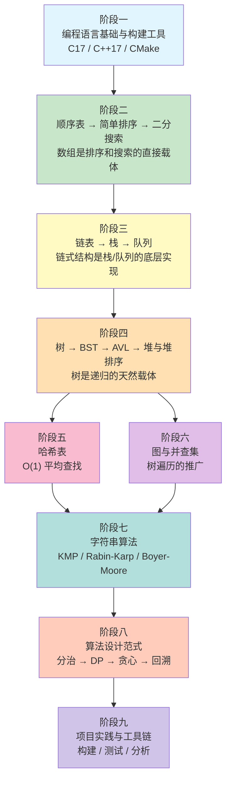

# 数据结构与算法 — 学习路径与参考资料

> 本文档为 `data-structures-and-algorithms` 项目配套的学习路径指南，参照权威教材与官方文档编写。
>
> **核心原则：数据结构与算法交错学习，学完一个数据结构就学依赖它的算法。** 不要把所有数据结构学完再学算法——那样会遗忘前面学的内容，也缺少学算法的动机。
>
> **文档时效性标注**：所有参考资料均标注最近确认可用的年份或版本号。技术标准以标注版本为准，在线资源以标注访问日期为准。
>
> **项目技术栈**：C17 / C++17 / CMake 3.16+ / GCC 12+ / Clang 15+ / MSVC 19.3+ / Python 3.10+

## 对照学习建议

本项目同时提供 C/C++ 和 Python 两种语言的实现，建议采用对照学习法：

| 学习策略 | 说明 |
|---------|------|
| 先 C 后 Python | 先理解 C/C++ 版本的底层细节（指针、内存管理），再用 Python 版本验证理解 |
| 对照阅读 | 同一算法/数据结构，对比两种语言的实现差异，理解语言特性对算法表达的影响 |
| Python 快速验证 | 用 Python 快速实现和验证算法思路，再用 C/C++ 追求性能和底层控制 |
| 运行测试 | 执行 `cd python && python -m algorithms.run_all` 验证所有 74 个 Python 模块 |

**Python 实现目录**：[`python/algorithms/`](../../python/algorithms/)
- `data_structures/` — 23 种数据结构（SequentialList、SinglyLinkedList、BST、AVLTree、Trie、LRUCache、BloomFilter、SegmentTree、FenwickTree、LinkedStack、CircularQueue、LinkedQueue、Deque、PriorityQueue 等）
- `sorting/` — 10 种排序算法
- `searching/` — 4 种搜索算法
- `string_algorithm/` — 8 种字符串算法（含 Rolling Hash、Z Algorithm）
- `dynamic_programming/` — 11 个经典 DP 问题（含 LCS DP、矩阵连乘）
- `graph/` — 6 种图算法（拓扑排序、Dijkstra、Bellman-Ford、Floyd-Warshall、Kruskal、Prim）
- `math_algorithm/` — 数学算法（素数判定、数论、筛法）
- `greedy/` — 3 种贪心算法
- `backtracking/` — 4 种回溯算法
- `divide_and_conquer/` — 2 种分治算法
- `bit_manipulation/` — 位运算技巧

---

## 一、学习路线总览

整个学习路径划分为 **八个阶段**。核心改进：**数据结构与算法交错推进**，学完一个数据结构立刻学依赖它的算法，形成"学结构→用结构→学算法"的闭环。

### 为什么这样排？

| 传统顺序的问题 | 本路径的改进 |
|--------------|------------|
| 所有数据结构学完再学算法，学算法时已遗忘前面的结构 | 学完顺序表立刻学排序和搜索，趁热打铁 |
| 排序放在树/图之后，但冒泡/插入/选择排序只需要数组 | 简单排序紧跟顺序表，高级排序（归并/快排/堆排）放在递归和堆之后 |
| 堆排序和堆分开，割裂了知识联系 | 堆排序和堆放在一起，理解"堆是数据结构，堆排序是堆的应用" |
| 二分搜索放在搜索章节，但它只需要有序数组 | 二分搜索紧跟顺序表，是"有序数组"的直接应用 |
| 回溯放在DP之后，但回溯只需要递归和栈 | 回溯放在分治之后，因为回溯 = DFS + 剪枝，比分治更基础 |

**预计学习周期**：全职学习约 3–4 个月，兼职学习约 6–8 个月。各阶段时间分配见下文详述。

---

## 二、阶段一：编程语言基础与构建工具

**预计用时**：2–3 周

本阶段目标：掌握 C17/C++17 核心语法与内存管理能力，理解 CMake 构建流程，为后续数据结构实现奠定语言基础。

### 1.1 C 语言核心

| 项目 | 内容 |
|------|------|
| **前置知识** | 基本计算机操作能力，了解程序编译概念 |
| **学习目标** | 熟练使用指针、结构体、动态内存分配（malloc/free）、文件 I/O；理解 C17 标准下的类型系统与未定义行为 |
| **对应源码** | 项目中所有 `src/*/` 下的 `.c` 文件均以 C17 编写 |
| **检验方式** | 独立实现一个动态数组（支持扩容、插入、删除），通过 Valgrind 检测无内存泄漏 |
| **Python 对照** | 对照 Python 实现：[`python/algorithms/data_structures/L01_sequential_list.py`](../../python/algorithms/data_structures/L01_sequential_list.py) |

**推荐资料**：

1. **ISO/IEC 9899:2018 (C17 标准)** — 语言行为的最终权威依据。可从 ISO 官网购买，或通过 cppreference 在线查阅标准库摘要。时效性：现行 C 语言国际标准，下一版 C23 已发布但本项目以 C17 为准。
2. **cppreference.com — C 语言参考** — [https://en.cppreference.com/w/c](https://en.cppreference.com/w/c)。免费在线参考，按 C 标准版本标注特性支持情况。时效性：持续更新，2026 年确认可用。
3. **《数据结构（C语言版）》严蔚敏** — 第 1 章 C 语言回顾部分，对指针、结构体、函数参数传递有精炼讲解。时效性：经典教材，多版再印，内容稳定。
4. **gcc.gnu.org — GCC 官方文档** — [https://gcc.gnu.org/onlinedocs/](https://gcc.gnu.org/onlinedocs/)。重点阅读 GCC 12 的 C 语言扩展与警告选项（`-Wall -Wextra -Wpedantic`）。时效性：随 GCC 版本更新，本项目基于 GCC 12+。

### 1.2 C++ 核心与 STL

| 项目 | 内容 |
|------|------|
| **前置知识** | 已完成 1.1 C 语言核心 |
| **学习目标** | 掌握 C++17 特性（结构化绑定、std::optional、std::variant、if constexpr）；理解 RAII、移动语义、模板基础；熟悉 STL 容器与算法 |
| **对应源码** | 项目中所有 `src/*/` 下的 `.cpp` 文件均以 C++17 编写 |
| **检验方式** | 使用 C++17 特性重写阶段 1.1 的动态数组，对比 C 实现与 C++ 实现的内存安全性与代码简洁度 |
| **Python 对照** | 对照 Python 实现：[`python/algorithms/data_structures/L01_sequential_list.py`](../../python/algorithms/data_structures/L01_sequential_list.py) |

**推荐资料**：

1. **ISO/IEC 14882:2020 (C++20 标准)** — 虽然本项目使用 C++17，但 C++20 标准文档包含 C++17 的完整定义。时效性：现行 C++ 国际标准。
2. **cppreference.com — C++ 语言参考** — [https://en.cppreference.com/w/cpp](https://en.cppreference.com/w/cpp)。按 C++ 版本标注特性支持，C++17 标注清晰。时效性：持续更新，2026 年确认可用。
3. **《数据结构与算法分析：C语言描述》Mark Allen Weiss** — 虽以 C 为主，但其算法思路可直接映射到 C++ STL 实现，有助于理解 STL 容器底层原理。时效性：第 2 版（2010）仍为广泛使用的版本。

### 1.3 编译与构建工具

| 项目 | 内容 |
|------|------|
| **前置知识** | 已完成 1.1 和 1.2 |
| **学习目标** | 理解 CMake 构建系统（3.16+）；掌握多编译器构建（GCC 12+ / Clang 15+ / MSVC 19.3+）；能独立配置 CMakeLists.txt |
| **对应源码** | 项目根目录 `CMakeLists.txt` 及各模块子目录的 `CMakeLists.txt` |
| **检验方式** | 在本地分别使用 GCC、Clang、MSVC 三种编译器成功构建本项目，并运行全部测试 |
| **Python 对照** | 执行 `cd python && python -m algorithms.run_all` 验证所有 Python 模块 |

**推荐资料**：

1. **cmake.org — CMake 官方文档** — [https://cmake.org/documentation/](https://cmake.org/documentation/)。重点阅读 `add_library`、`target_link_libraries`、`target_compile_features` 等命令。时效性：随 CMake 版本更新，本项目基于 CMake 3.16+。
2. **llvm.org — LLVM/Clang 官方文档** — [https://llvm.org/docs/](https://llvm.org/docs/)。重点阅读 Clang 命令行选项与诊断信息。时效性：随 LLVM 版本更新，本项目基于 Clang 15+。
3. **gcc.gnu.org — GCC 官方文档** — 重点阅读 GCC 诊断选项与语言标准设置（`-std=c17`、`-std=c++17`）。

---

## 三、阶段二：顺序表 → 简单排序 → 二分搜索

**预计用时**：2–3 周

本阶段目标：掌握顺序表（动态数组），并立刻学习依赖数组的排序和搜索算法。**这是"学结构→用结构→学算法"的第一个闭环。**

> **为什么排序和搜索紧跟顺序表？**
> 冒泡排序、选择排序、插入排序只需要"比较和交换数组元素"这一操作，不需要链表、树、图等任何高级数据结构。二分搜索只需要"有序数组 + 随机访问"。把它们放在顺序表之后是自然的选择——你刚学会数组，就能用它做排序和搜索，既有成就感，又巩固了数组操作。

### 2.1 顺序表（动态数组）

| 项目 | 内容 |
|------|------|
| **前置知识** | 阶段一全部内容；理解指针与动态内存分配 |
| **学习目标** | 掌握顺序表的扩容策略（2 倍扩容，均摊 O(1)）；理解随机访问 O(1) 与插入/删除 O(n) 的原因；理解顺序表与 C++ STL `std::vector` 的对应关系 |
| **对应源码** | [`src/linear_list/sequential_list/`](../../src/linear_list/sequential_list/) |
| **检验方式** | ① 手动实现动态数组，支持扩容、按位插入、按位删除、按值查找；② 分析 2 倍扩容的均摊时间复杂度，对比固定增量扩容 |
| **Python 对照** | 对照 Python 实现：[`python/algorithms/data_structures/L01_sequential_list.py`](../../python/algorithms/data_structures/L01_sequential_list.py) |

**推荐资料**：

1. **《数据结构（C语言版）》严蔚敏** — 第 2 章"线性表"，对顺序表的 C 语言实现有完整代码与图解。时效性：经典教材，内容稳定。
2. **《算法导论》CLRS** — 第 10 章"基本数据结构"。时效性：第 4 版（2022），内容全面更新。
3. **《大话数据结构》程杰** — 第 3 章"线性表"，以通俗语言和大量插图讲解，适合入门。时效性：2011 年首版，2020 年修订版，内容稳定。

**学习要点**：

- 顺序表扩容策略：通常取 2 倍扩容，均摊 O(1) 插入。理解为什么不是固定增量扩容。
- 顺序表 vs 链表的选择：频繁随机访问选顺序表，频繁插入/删除选链表。

### 2.2 简单排序算法（冒泡、选择、插入）

| 项目 | 内容 |
|------|------|
| **前置知识** | 2.1 顺序表（只需要数组的比较与交换操作） |
| **学习目标** | 掌握冒泡排序、选择排序、插入排序的实现；理解 O(n²) 排序的共同特征；理解排序的稳定性概念；理解插入排序在"近乎有序"数据上的优势 |
| **对应源码** | [`src/sorting/sequential_list_sorting.cpp`](../../src/sorting/sequential_list_sorting.cpp) 中的 `BubbleSort()`、`SelectSort()`、`InsertSort()` |
| **检验方式** | ① 对同一随机数据集运行三种排序，对比实际运行时间；② 构造"近乎有序"的数据（只有少量元素乱序），验证插入排序接近 O(n) 的特性 |
| **Python 对照** | 对照 Python 实现：[`python/algorithms/sorting/L02_bubble_sort.py`](../../python/algorithms/sorting/L02_bubble_sort.py)、[`python/algorithms/sorting/L02_selection_sort.py`](../../python/algorithms/sorting/L02_selection_sort.py)、[`python/algorithms/sorting/L02_insertion_sort.py`](../../python/algorithms/sorting/L02_insertion_sort.py) |

**推荐资料**：

1. **《算法导论》CLRS** — 第 2 章"算法基础"（插入排序作为第一个算法讲解），第 2.1 节循环不变式的证明方法。时效性：第 4 版（2022）。
2. **《大话数据结构》程杰** — 第 9 章"排序"，大量图解适合入门。时效性：内容稳定。
3. **VisuAlgo — Sorting 可视化** — [https://visualgo.net/en/sorting](https://visualgo.net/en/sorting)。可逐步观察排序过程中元素的比较与交换。时效性：持续维护，2026 年确认可用。

**排序算法对比**：

| 算法 | 平均时间 | 最坏时间 | 空间 | 稳定性 | 适用场景 |
|------|---------|---------|------|--------|---------|
| 冒泡排序 | O(n²) | O(n²) | O(1) | 稳定 | 教学、小数据 |
| 选择排序 | O(n²) | O(n²) | O(1) | 不稳定 | 小数据、交换代价大 |
| 插入排序 | O(n²) | O(n²) | O(1) | 稳定 | 近乎有序数据、小数据 |

> **与 C++ STL 的关系**：`std::sort` 在数据量小时会自动切换到插入排序（通常阈值 n ≤ 16），因为插入排序在小数据上常数因子小、对缓存友好。理解这一点后，你就能理解为什么 STL 不对小数据使用快排。

### 2.3 二分搜索及其变体

| 项目 | 内容 |
|------|------|
| **前置知识** | 2.1 顺序表（只需要有序数组 + 随机访问） |
| **学习目标** | 掌握标准二分搜索；掌握二分搜索的变体（查找第一个/最后一个等于目标值的元素，即 `lower_bound` / `upper_bound`）；理解二分搜索的正确性（循环不变式） |
| **对应源码** | [`src/searching/binary_search.cpp`](../../src/searching/binary_search.cpp) |
| **检验方式** | ① 实现二分搜索的所有变体（精确匹配、左边界、右边界）；② 在有重复元素的有序数组中，用二分搜索找到目标值的第一个和最后一个位置 |
| **Python 对照** | 对照 Python 实现：[`python/algorithms/searching/L03_binary_search.py`](../../python/algorithms/searching/L03_binary_search.py) |

**推荐资料**：

1. **《算法导论》CLRS** — 第 2.3 节"分治法"（二分搜索作为分治的经典例子）。
2. **Jon Bentley, 《Programming Pearls》** — 第 2 章和第 4 章对二分搜索的正确性有精彩讨论，指出 90% 的程序员写不出正确的二分搜索。时效性：经典著作，内容不过时。
3. **cppreference.com — std::lower_bound** — [https://en.cppreference.com/w/cpp/algorithm/lower_bound](https://en.cppreference.com/w/cpp/algorithm/lower_bound)。理解 STL 的二分搜索接口设计。时效性：持续更新。

---

## 四、阶段三：链表 → 栈 → 队列

**预计用时**：2–3 周

本阶段目标：从顺序存储过渡到链式存储，掌握栈和队列两种操作受限的线性结构。

> **为什么链表、栈、队列放在一起？**
> 链表是栈和队列的底层实现之一。学完链表后学栈（链栈）和队列（链队列），可以立刻看到链表的应用场景。同时，栈和队列又是后续树遍历（栈模拟递归）和图遍历（BFS 用队列、DFS 用栈）的基础。

### 3.1 单链表

| 项目 | 内容 |
|------|------|
| **前置知识** | 2.1 顺序表（理解线性表的逻辑结构）；指针与动态内存分配 |
| **学习目标** | 掌握带头结点单链表的头插法/尾插法/删除/反转；理解链表与顺序表在插入/删除/查找上的性能差异；理解 C++ STL `std::forward_list` 的对应关系 |
| **对应源码** | [`src/linear_list/singly_linked_list/`](../../src/linear_list/singly_linked_list/) |
| **检验方式** | ① 手动实现单链表反转（迭代与递归两种方式）；② 对比链表与顺序表在头部插入 10000 个元素的实际耗时 |
| **Python 对照** | 对照 Python 实现：[`python/algorithms/data_structures/L04_singly_linked_list.py`](../../python/algorithms/data_structures/L04_singly_linked_list.py) |

**推荐资料**：

1. **《数据结构（C语言版）》严蔚敏** — 第 2 章"线性表"链表部分，头插法/尾插法的 C 语言实现完整。
2. **《算法导论》CLRS** — 第 10.2 节"链表"。
3. **VisuAlgo — Linked List 可视化** — [https://visualgo.net/en/list](https://visualgo.net/en/list)。时效性：持续维护，2026 年确认可用。

**学习要点**：

- 链表操作的核心难点：指针操作的正确性，尤其是删除节点时对前驱节点的处理。
- 头结点的作用：统一空表与非空表的操作逻辑，避免对第一个节点的特殊处理。

### 3.2 双向链表与循环链表

| 项目 | 内容 |
|------|------|
| **前置知识** | 3.1 单链表 |
| **学习目标** | 理解双向链表的前后双向遍历；理解循环链表尾指针的妙用（O(1) 访问首尾节点）；理解 C++ STL `std::list` 的底层是双向链表 |
| **对应源码** | [`src/linear_list/doubly_linked_list/`](../../src/linear_list/doubly_linked_list/)、[`src/linear_list/circular_linked_list/`](../../src/linear_list/circular_linked_list/) |
| **检验方式** | ① 实现双向链表的删除操作，对比单链表删除是否需要前驱指针；② 用循环链表解决约瑟夫问题 |
| **Python 对照** | 对照 Python 实现：[`python/algorithms/data_structures/L05_doubly_linked_list.py`](../../python/algorithms/data_structures/L05_doubly_linked_list.py)、[`python/algorithms/data_structures/L06_circular_linked_list.py`](../../python/algorithms/data_structures/L06_circular_linked_list.py) |

**推荐资料**：

1. **《数据结构（C语言版）》严蔚敏** — 第 2 章，双向链表与循环链表的 C 语言实现。
2. **《算法导论》CLRS** — 第 10.2 节，双向链表的哨兵节点（dummy node）设计。

### 3.3 栈

| 项目 | 内容 |
|------|------|
| **前置知识** | 3.1 单链表（链栈的底层是链表）；2.1 顺序表（顺序栈的底层是数组） |
| **学习目标** | 理解 LIFO 原则；掌握顺序栈与链栈的实现；理解栈在递归、表达式求值、括号匹配中的应用；理解 C++ STL `std::stack` 的适配器模式 |
| **对应源码** | [`src/stack/`](../../src/stack/) |
| **检验方式** | ① 使用栈实现中缀表达式转后缀表达式并求值；② 使用栈模拟递归过程（如汉诺塔的非递归实现） |
| **Python 对照** | 对照 Python 实现：[`python/algorithms/data_structures/L07_stack.py`](../../python/algorithms/data_structures/L07_stack.py) |

**推荐资料**：

1. **《数据结构（C语言版）》严蔚敏** — 第 3 章"栈和队列"，对顺序栈的溢出处理与链栈的实现有详细讲解。
2. **《算法导论》CLRS** — 栈作为基本数据结构在多章中出现，第 10.1 节有形式化定义。
3. **VisuAlgo — Stack 可视化** — [https://visualgo.net/en/list](https://visualgo.net/en/list)（在页面中选择 Stack 模式）。时效性：持续维护，2026 年确认可用。

### 3.4 队列

| 项目 | 内容 |
|------|------|
| **前置知识** | 3.1 单链表（链队列的底层是链表）；2.1 顺序表（循环队列的底层是数组） |
| **学习目标** | 理解 FIFO 原则；掌握循环队列的取模运算技巧（解决假溢出）；理解双端队列与优先队列的设计动机；理解 C++ STL `std::queue` / `std::priority_queue` 的对应关系 |
| **对应源码** | [`src/queue/`](../../src/queue/) |
| **检验方式** | ① 实现循环队列，处理队空/队满判定（牺牲一个存储单元 vs 使用计数器）；② 用队列实现 BFS（为阶段六的图遍历做准备） |
| **Python 对照** | 对照 Python 实现：[`python/algorithms/data_structures/L08_queue.py`](../../python/algorithms/data_structures/L08_queue.py) |

**推荐资料**：

1. **《数据结构（C语言版）》严蔚敏** — 第 3 章"栈和队列"，循环队列的讲解是该书经典内容。
2. **《算法导论》CLRS** — 第 10.1 节队列的基本操作，第 6 章优先队列（基于堆的实现）。
3. **《数据结构与算法分析：C语言描述》Mark Allen Weiss** — 第 3 章对队列与双端队列的实现有清晰讲解。

### 3.5 跳表

| 项目 | 内容 |
|------|------|
| **前置知识** | 3.1 单链表；理解概率与期望 |
| **学习目标** | 理解跳表如何通过"概率性平衡"实现 O(log n) 查找；对比跳表与平衡树（AVL/红黑树）的实现复杂度；了解 C++ STL 无跳表但 Java 有 `ConcurrentSkipListMap` |
| **对应源码** | [`src/linear_list/skip_list/`](../../src/linear_list/skip_list/) |
| **检验方式** | 对跳表进行 10 万次随机插入/查找/删除，验证 O(log n) 期望性能 |
| **Python 对照** | 对照 Python 实现：[`python/algorithms/data_structures/L09_skip_list.py`](../../python/algorithms/data_structures/L09_skip_list.py) |

**推荐资料**：

1. **William Pugh, "Skip Lists: A Probabilistic Alternative to Balanced Trees", 1990** — 跳表原始论文，发表于 Communications of the ACM。是理解跳表概率性平衡机制的一手资料。时效性：经典论文，理论不过时。
2. **《算法导论》CLRS** — 跳表不在 CLRS 主线中，但可参考第 14 章"动态顺序统计"的思路。
3. **《大话数据结构》程杰** — 第 3 章线性表部分对跳表有入门讲解。

---

## 五、阶段四：树 → BST → AVL → 堆与堆排序

**预计用时**：4–5 周

本阶段目标：从线性结构跃迁到非线性结构（树），掌握递归思维，并学习依赖树结构的排序算法。

> **为什么堆排序和堆放在一起？**
> 堆是一种数据结构（完全二叉树的数组表示），堆排序是堆的应用（反复取出堆顶）。把它们放在一起，你能理解"数据结构是算法的基础"——没有堆，就没有堆排序。同时，归并排序和快速排序也放在这里，因为它们需要递归思维，而树遍历是理解递归的最佳入口。

### 4.1 二叉树与遍历

| 项目 | 内容 |
|------|------|
| **前置知识** | 3.3 栈（非递归遍历需要栈）；3.4 队列（层序遍历需要队列）；递归思维 |
| **学习目标** | 掌握二叉树的前序/中序/后序/层序遍历（递归与迭代）；理解递归是树操作的核心范式；掌握二叉树的序列化与反序列化 |
| **对应源码** | [`src/tree/binary_tree/`](../../src/tree/binary_tree/) |
| **检验方式** | ① 给定前序 + 中序遍历序列，重建二叉树；② 实现二叉树的非递归遍历（使用栈模拟递归调用栈） |
| **Python 对照** | 对照 Python 实现：[`python/algorithms/data_structures/L10_binary_tree.py`](../../python/algorithms/data_structures/L10_binary_tree.py) |

**推荐资料**：

1. **《数据结构（C语言版）》严蔚敏** — 第 6 章"树和二叉树"，遍历算法的递归与非递归实现均有完整 C 代码。
2. **《算法导论》CLRS** — 第 10.4 节"有根树"的表示方法。
3. **VisuAlgo — BST 可视化** — [https://visualgo.net/en/bst](https://visualgo.net/en/bst)。可交互操作二叉搜索树的插入、删除、查找。时效性：持续维护，2026 年确认可用。

**学习要点**：

- 递归是树操作的核心：树的遍历、查找、修改本质上都是递归。如果你对递归不熟练，这里是最好的练习场。
- 非递归遍历的意义：理解"栈模拟递归"的原理，这是理解编译器调用栈的基础。

### 4.2 二叉搜索树（BST）

| 项目 | 内容 |
|------|------|
| **前置知识** | 4.1 二叉树与遍历 |
| **学习目标** | 掌握 BST 的插入/删除/查找；理解 BST 退化为链表的 worst-case（升序插入）；理解 C++ STL `std::map` / `std::set` 的底层是红黑树（BST 的平衡变体） |
| **对应源码** | [`src/tree/binary_search_tree/`](../../src/tree/binary_search_tree/) |
| **检验方式** | ① 构造一个使 BST 退化为链表的插入序列（如升序插入），验证查找效率退化为 O(n)；② 对比 BST 与有序数组的二分搜索性能 |
| **Python 对照** | 对照 Python 实现：[`python/algorithms/data_structures/L11_binary_search_tree.py`](../../python/algorithms/data_structures/L11_binary_search_tree.py) |

**推荐资料**：

1. **《算法导论》CLRS** — 第 12 章"二叉搜索树"，BST 操作的形式化证明。
2. **《数据结构（C语言版）》严蔚敏** — 第 6 章BST 部分。

### 4.3 AVL 树

| 项目 | 内容 |
|------|------|
| **前置知识** | 4.2 BST（AVL 是 BST 的平衡版本） |
| **学习目标** | 掌握 AVL 树的四种旋转（LL/RR/LR/RL）；理解平衡因子与旋转调整；对比 AVL 与红黑树的设计取舍 |
| **对应源码** | [`src/tree/avl_tree/`](../../src/tree/avl_tree/) |
| **检验方式** | 对同一序列分别插入 BST 和 AVL，对比树的高度 |
| **Python 对照** | 对照 Python 实现：[`python/algorithms/data_structures/L12_avl_tree.py`](../../python/algorithms/data_structures/L12_avl_tree.py) |

**推荐资料**：

1. **G.M. Adelson-Velsky, E.M. Landis, "An Algorithm for the Organization of Information", 1962** — AVL 树原始论文。时效性：经典论文，旋转操作定义至今未变。
2. **《算法导论》CLRS** — 第 13 章"红黑树"（AVL 的对比参照）。AVL 不在 CLRS 主线中，但旋转概念通用。
3. **《数据结构与算法分析：C语言描述》Mark Allen Weiss** — 第 4 章对 AVL 树的四种旋转有详细图解与代码。

### 4.4 哈夫曼树与 Trie

| 项目 | 内容 |
|------|------|
| **前置知识** | 4.1 二叉树；3.4 优先队列（哈夫曼树构建需要优先队列） |
| **学习目标** | 掌握哈夫曼编码的贪心构造过程；理解前缀编码；掌握 Trie 的插入/查找/删除；理解 Trie 与哈希表在字符串检索中的取舍 |
| **对应源码** | [`src/tree/huffman_tree/`](../../src/tree/huffman_tree/)、[`src/tree/trie/`](../../src/tree/trie/) |
| **检验方式** | ① 对一段英文文本统计字符频率，构建哈夫曼树并计算编码后的总比特数；② 实现 Trie 并支持前缀搜索 |
| **Python 对照** | 对照 Python 实现：[`python/algorithms/data_structures/L14_trie.py`](../../python/algorithms/data_structures/L14_trie.py) |

**推荐资料**：

1. **《算法导论》CLRS** — 第 16.3 节"哈夫曼编码"，有严格的最优性证明。
2. **《数据结构（C语言版）》严蔚敏** — 第 6.6 节哈夫曼树与哈夫曼编码。
3. **VisuAlgo — Trie 可视化** — [https://visualgo.net/en/trie](https://visualgo.net/en/trie)。时效性：持续维护，2026 年确认可用。

### 4.5 堆与堆排序

| 项目 | 内容 |
|------|------|
| **前置知识** | 4.1 完全二叉树的概念（堆是完全二叉树的数组表示）；2.1 顺序表（堆的底层是数组） |
| **学习目标** | 掌握最大堆与最小堆的性质；掌握堆的插入（上滤 Sift Up）与删除（下滤 Sift Down）；理解建堆的 O(n) 时间复杂度证明；掌握堆排序；理解 C++ STL `std::priority_queue` 的底层是堆 |
| **对应源码** | [`src/heap/`](../../src/heap/)（堆实现）、[`src/sorting/sequential_list_sorting.cpp`](../../src/sorting/sequential_list_sorting.cpp) 中的 `HeapSort()`（堆排序） |
| **检验方式** | ① 手动在纸上执行建堆过程（自底向上的下滤），验证 O(n) 建堆；② 使用最小堆实现 Top-K 问题（从 1000 万个数中找出最大的 100 个）；③ 对比堆排序与归并排序、快速排序的实际性能 |
| **Python 对照** | 对照 Python 实现：[`python/algorithms/data_structures/L15_max_heap.py`](../../python/algorithms/data_structures/L15_max_heap.py)、[`python/algorithms/data_structures/L15_min_heap.py`](../../python/algorithms/data_structures/L15_min_heap.py)、[`python/algorithms/sorting/L02_heap_sort.py`](../../python/algorithms/sorting/L02_heap_sort.py) |

**推荐资料**：

1. **《算法导论》CLRS** — 第 6 章"堆排序"，对建堆 O(n) 复杂度的证明是该主题最严谨的推导。
2. **《数据结构（C语言版）》严蔚敏** — 堆排序部分，C 语言实现。
3. **Big-O Cheat Sheet** — [https://www.bigocheatsheet.com/](https://www.bigocheatsheet.com/)。可快速查阅堆操作的时间复杂度。时效性：持续维护，2026 年确认可用。

### 4.6 线段树

| 项目 | 内容 |
|------|------|
| **前置知识** | 4.1 二叉树（线段树是完全二叉树的应用）；递归 |
| **学习目标** | 掌握线段树的构建、单点更新、区间查询；理解线段树如何将区间操作转化为 O(log n) 的树操作 |
| **对应源码** | [`src/tree/segment_tree/`](../../src/tree/segment_tree/) |
| **检验方式** | ① 构建线段树并验证区间求和正确性；② 实现单点更新后验证查询结果 |
| **Python 对照** | 对照 Python 实现：[`python/algorithms/data_structures/L16_segment_tree.py`](../../python/algorithms/data_structures/L16_segment_tree.py) |

### 4.7 树状数组（Fenwick Tree）

| 项目 | 内容 |
|------|------|
| **前置知识** | 4.1 二叉树；理解 lowbit 运算 |
| **学习目标** | 掌握树状数组的单点更新和前缀和查询；理解 lowbit(x) = x & (-x) 的原理；对比线段树与树状数组的适用场景 |
| **对应源码** | [`src/tree/fenwick_tree/`](../../src/tree/fenwick_tree/) |
| **检验方式** | ① 实现树状数组，验证前缀和查询正确性；② 对比线段树与树状数组的实现复杂度 |
| **Python 对照** | 对照 Python 实现：[`python/algorithms/data_structures/L17_fenwick_tree.py`](../../python/algorithms/data_structures/L17_fenwick_tree.py) |

### 4.8 高级排序：归并排序与快速排序

| 项目 | 内容 |
|------|------|
| **前置知识** | 4.1 二叉树遍历（递归思维）；2.2 简单排序（理解排序的基本概念） |
| **学习目标** | 掌握归并排序的分治思想与合并操作；掌握快速排序的分区策略（Hoare 分区 vs Lomuto 分区）；理解 O(n log n) 排序的优势；理解快速排序退化为 O(n²) 的条件与避免方法 |
| **对应源码** | [`src/sorting/sequential_list_sorting.cpp`](../../src/sorting/sequential_list_sorting.cpp) 中的 `MergeSort()`、`QuickSort()` |
| **检验方式** | ① 构造使快速排序退化为 O(n²) 的输入（已排序数组 + 首元素 pivot），验证退化现象；② 对比归并排序与快速排序在随机数据上的实际性能 |
| **Python 对照** | 对照 Python 实现：[`python/algorithms/sorting/L02_merge_sort.py`](../../python/algorithms/sorting/L02_merge_sort.py)、[`python/algorithms/sorting/L02_quick_sort.py`](../../python/algorithms/sorting/L02_quick_sort.py) |

**推荐资料**：

1. **C.A.R. Hoare, "Quicksort", The Computer Journal, 1962** — 快速排序原始论文。时效性：经典论文，分区策略至今仍是讨论焦点。
2. **《算法导论》CLRS** — 第 7 章"快速排序"，第 2.3 节"归并排序"。
3. **VisuAlgo — Sorting 可视化** — [https://visualgo.net/en/sorting](https://visualgo.net/en/sorting)。时效性：持续维护，2026 年确认可用。

**高级排序对比**：

| 算法 | 平均时间 | 最坏时间 | 空间 | 稳定性 | 适用场景 |
|------|---------|---------|------|--------|---------|
| 希尔排序 | O(n^1.3) | O(n²) | O(1) | 不稳定 | 中等规模数据 |
| 归并排序 | O(n log n) | O(n log n) | O(n) | 稳定 | 外排序、链表排序 |
| 快速排序 | O(n log n) | O(n²) | O(log n) | 不稳定 | 通用排序首选 |
| 堆排序 | O(n log n) | O(n log n) | O(1) | 不稳定 | 空间受限场景 |

> **与 C++ STL 的关系**：`std::sort` 使用 IntroSort（Musser 1997）——在正常情况下使用快速排序，当递归深度超过 2·log(n) 时切换到堆排序，对小数据切换到插入排序。理解了本阶段的排序算法，你就能完全理解 `std::sort` 的设计。

### 4.9 非比较排序：计数排序、基数排序、桶排序

| 项目 | 内容 |
|------|------|
| **前置知识** | 2.1 顺序表；理解排序下界 Ω(n log n) 只适用于比较排序 |
| **学习目标** | 理解非比较排序如何突破 Ω(n log n) 下界；掌握计数排序、基数排序、桶排序的实现与适用条件 |
| **对应源码** | [`src/sorting/counting_sort.cpp`](../../src/sorting/counting_sort.cpp)、[`src/sorting/radix_sort.cpp`](../../src/sorting/radix_sort.cpp)、[`src/sorting/bucket_sort.cpp`](../../src/sorting/bucket_sort.cpp) |
| **检验方式** | ① 对 0~100 范围内的 10 万个整数，对比计数排序与快速排序的性能；② 构造使桶排序退化为 O(n²) 的数据（所有元素落入同一个桶） |
| **Python 对照** | 对照 Python 实现：[`python/algorithms/sorting/L02_counting_sort.py`](../../python/algorithms/sorting/L02_counting_sort.py)、[`python/algorithms/sorting/L02_radix_sort.py`](../../python/algorithms/sorting/L02_radix_sort.py)、[`python/algorithms/sorting/L02_bucket_sort.py`](../../python/algorithms/sorting/L02_bucket_sort.py) |

**推荐资料**：

1. **《算法导论》CLRS** — 第 8 章"线性时间排序"，对计数排序和基数排序的理论分析是权威参考。
2. **《大话数据结构》程杰** — 第 9 章排序部分，图解友好。

---

## 六、阶段五：哈希表

**预计用时**：1–2 周

本阶段目标：掌握哈希表的设计与冲突解决策略，理解哈希表为什么是 O(1) 平均查找的数据结构。

> **为什么哈希表放在树之后？**
> 哈希表的核心是"通过哈希函数直接定位"，不需要树或图的知识。但理解哈希表的冲突解决（链地址法需要链表、开放地址法需要数组探测）需要线性表基础。放在树之后是因为：学完 BST 和 AVL 后，你会自然产生"有没有比 O(log n) 更快的查找？"的疑问，哈希表的 O(1) 平均查找就是答案。

### 5.1 哈希表

| 项目 | 内容 |
|------|------|
| **前置知识** | 2.1 顺序表（开放地址法的底层是数组）；3.1 链表（链地址法的底层是链表）；取模运算与素数选择 |
| **学习目标** | 理解哈希函数的设计原则（确定性、均匀性、高效性）；掌握链地址法与开放地址法的冲突解决策略；理解装填因子与再哈希（Rehash）；理解 C++ STL `std::unordered_map` / `std::unordered_set` 的底层是链地址法哈希表 |
| **对应源码** | [`src/hash_table/`](../../src/hash_table/) |
| **检验方式** | ① 分别实现链地址法和开放地址法，对比同一数据集下的冲突率与查找性能；② 实现自动扩容的哈希表，验证装填因子阈值对性能的影响 |
| **Python 对照** | 对照 Python 实现：[`python/algorithms/data_structures/L18_hash_table_chaining.py`](../../python/algorithms/data_structures/L18_hash_table_chaining.py)、[`python/algorithms/data_structures/L18_hash_table_open_addressing.py`](../../python/algorithms/data_structures/L18_hash_table_open_addressing.py) |

**推荐资料**：

1. **《算法导论》CLRS** — 第 11 章"哈希表"，对开放地址法的理论分析是权威参考。
2. **《数据结构与算法分析：C语言描述》Mark Allen Weiss** — 第 5 章对哈希函数选择与冲突解决策略有实用建议。
3. **《大话数据结构》程杰** — 第 8 章"查找"中的哈希表部分，入门友好。

### 5.2 布隆过滤器

| 项目 | 内容 |
|------|------|
| **前置知识** | 5.1 哈希表（布隆过滤器使用多个哈希函数）；位数组 |
| **学习目标** | 理解布隆过滤器的概率性特征（允许假阳性，不允许假阴性）；掌握最优参数计算（m = -n·ln(p)/ln²(2)，k = (m/n)·ln(2)） |
| **对应源码** | [`src/hash_table/bloom_filter/`](../../src/hash_table/bloom_filter/) |
| **检验方式** | ① 实现布隆过滤器，验证已添加元素一定返回 true；② 测量假阳性率是否在理论范围内 |
| **Python 对照** | 对照 Python 实现：[`python/algorithms/data_structures/L19_bloom_filter.py`](../../python/algorithms/data_structures/L19_bloom_filter.py) |

### 5.3 LRU 缓存

| 项目 | 内容 |
|------|------|
| **前置知识** | 5.1 哈希表（O(1) 查找）；3.2 双向链表（O(1) 移动节点） |
| **学习目标** | 掌握 LRU 缓存的哈希表+双向链表实现；理解 O(1) 的 get/put 操作原理；理解缓存淘汰策略的设计思想 |
| **对应源码** | [`src/cache/lru_cache/`](../../src/cache/lru_cache/) |
| **检验方式** | ① 实现 LRU 缓存，验证淘汰策略正确性；② 对比不同缓存淘汰策略（LRU vs LFU vs FIFO） |
| **Python 对照** | 对照 Python 实现：[`python/algorithms/data_structures/L20_lru_cache.py`](../../python/algorithms/data_structures/L20_lru_cache.py) |

---

## 七、阶段六：图与并查集

**预计用时**：3–4 周

本阶段目标：掌握图的存储与遍历，理解并查集的路径压缩与按秩合并。

> **为什么图放在树之后？**
> 图是树的推广（树是无环连通图）。图遍历（DFS/BFS）是树遍历的推广——DFS 用栈（递归），BFS 用队列。你在阶段三和阶段四已经掌握了栈、队列和递归，现在可以自然地理解图遍历。

### 6.1 图的存储与遍历

| 项目 | 内容 |
|------|------|
| **前置知识** | 4.1 树遍历（图遍历是树遍历的推广）；3.3 栈（DFS 需要）；3.4 队列（BFS 需要） |
| **学习目标** | 掌握邻接矩阵与邻接表两种存储方式及其适用场景；掌握 BFS 与 DFS；了解最小生成树（Kruskal/Prim）与最短路径（Dijkstra） |
| **对应源码** | [`src/graph/`](../../src/graph/) |
| **检验方式** | ① 分别用邻接矩阵和邻接表实现 BFS/DFS，对比时间复杂度与空间复杂度；② 用 Dijkstra 算法求单源最短路径 |
| **Python 对照** | 对照 Python 实现：[`python/algorithms/data_structures/L22_adjacency_list.py`](../../python/algorithms/data_structures/L22_adjacency_list.py)、[`python/algorithms/data_structures/L21_adjacency_matrix.py`](../../python/algorithms/data_structures/L21_adjacency_matrix.py) |

**推荐资料**：

1. **《算法导论》CLRS** — 第 22 章"基本的图算法"（BFS/DFS/拓扑排序），第 23 章"最小生成树"，第 24 章"单源最短路径"。这是图算法最系统的教材讲解。
2. **《数据结构（C语言版）》严蔚敏** — 第 7 章"图"，邻接矩阵与邻接表的 C 语言实现。
3. **VisuAlgo — Graph 可视化** — [https://visualgo.net/en/graphds](https://visualgo.net/en/graphds)（图存储）与 [https://visualgo.net/en/dfsbfs](https://visualgo.net/en/dfsbfs)（BFS/DFS）。时效性：持续维护，2026 年确认可用。

### 6.2 并查集

| 项目 | 内容 |
|------|------|
| **前置知识** | 6.1 图的基本概念（并查集用于判断连通性） |
| **学习目标** | 掌握并查集的 Find 与 Union 操作；理解路径压缩与按秩合并；理解并查集在 Kruskal 最小生成树中的应用 |
| **对应源码** | [`src/graph/union_find/`](../../src/graph/union_find/) |
| **检验方式** | ① 使用并查集判断无向图是否存在环；② 对比无优化、仅路径压缩、路径压缩+按秩合并三种实现的实际性能 |
| **Python 对照** | 对照 Python 实现：[`python/algorithms/data_structures/L23_union_find.py`](../../python/algorithms/data_structures/L23_union_find.py) |

**推荐资料**：

1. **《算法导论》CLRS** — 第 21 章"用于不相交集合的数据结构"，路径压缩与按秩合并的均摊分析。
2. **R.E. Tarjan, "Efficiency of a Good But Not Linear Set Union Algorithm", 1975** — 路径压缩的均摊分析原始论文。时效性：经典论文，结论至今未变。

### 6.3 拓扑排序

| 项目 | 内容 |
|------|------|
| **前置知识** | 6.1 图的存储与遍历；队列（Kahn 算法需要队列） |
| **学习目标** | 掌握 Kahn 算法（BFS + 入度计数）；理解有向无环图（DAG）的拓扑序；理解环检测 |
| **对应源码** | [`src/graph/topological_sort/`](../../src/graph/topological_sort/) |
| **Python 对照** | 对照 Python 实现：[`python/algorithms/graph/L24_topological_sort.py`](../../python/algorithms/graph/L24_topological_sort.py) |

### 6.4 最短路径算法

| 项目 | 内容 |
|------|------|
| **前置知识** | 6.1 图的存储与遍历；优先队列（Dijkstra 需要）；6.2 并查集（无直接依赖） |
| **学习目标** | 掌握 Dijkstra（贪心，O((V+E)logV)）、Bellman-Ford（动态规划，O(VE)，处理负权边）、Floyd-Warshall（O(V³)，全源最短路） |
| **对应源码** | [`src/graph/dijkstra/`](../../src/graph/dijkstra/)、[`src/graph/bellman_ford/`](../../src/graph/bellman_ford/)、[`src/graph/floyd_warshall/`](../../src/graph/floyd_warshall/) |
| **Python 对照** | 对照 Python 实现：[`python/algorithms/graph/L25_dijkstra.py`](../../python/algorithms/graph/L25_dijkstra.py)、[`L26_bellman_ford.py`](../../python/algorithms/graph/L26_bellman_ford.py)、[`L27_floyd_warshall.py`](../../python/algorithms/graph/L27_floyd_warshall.py) |

### 6.5 最小生成树

| 项目 | 内容 |
|------|------|
| **前置知识** | 6.1 图的存储与遍历；6.2 并查集（Kruskal 需要） |
| **学习目标** | 掌握 Kruskal（贪心 + 并查集，O(ElogE)）和 Prim（贪心 + 优先队列，O((V+E)logV)） |
| **对应源码** | [`src/graph/kruskal/`](../../src/graph/kruskal/)、[`src/graph/prim/`](../../src/graph/prim/) |
| **Python 对照** | 对照 Python 实现：[`python/algorithms/graph/L28_kruskal.py`](../../python/algorithms/graph/L28_kruskal.py)、[`L29_prim.py`](../../python/algorithms/graph/L29_prim.py) |

---

## 八、阶段七：字符串算法

**预计用时**：2–3 周

本阶段目标：掌握经典字符串匹配算法与回文/子串问题的高效解法。

> **为什么字符串算法放在图之后？**
> 字符串算法（如 KMP 的 next 数组、Boyer-Moore 的坏字符表）需要构造辅助数据结构，这需要一定的算法设计能力。同时，LCS（最长公共子序列）是动态规划问题，放在阶段八的 DP 之前作为预习是合适的。

### 7.1 字符串匹配算法

| 项目 | 内容 |
|------|------|
| **前置知识** | 阶段一至阶段六；理解字符串的基本表示（C 风格字符串与 C++ std::string） |
| **学习目标** | 掌握 KMP 算法的 next 数组构造与匹配过程；掌握 Rabin-Karp 滚动哈希方法；掌握 Boyer-Moore 的坏字符规则与好后缀规则；理解各算法的适用场景 |
| **对应源码** | [`src/string_algorithm/`](../../src/string_algorithm/) |
| **检验方式** | ① 手动计算 KMP 的 next 数组（对模式串 "ababaaababaa"）；② 在大文本（>1MB）中分别使用三种算法搜索同一模式串，对比运行时间 |
| **Python 对照** | 对照 Python 实现：[`python/algorithms/string_algorithm/L30_kmp.py`](../../python/algorithms/string_algorithm/L30_kmp.py)、[`python/algorithms/string_algorithm/L30_rabin_karp.py`](../../python/algorithms/string_algorithm/L30_rabin_karp.py)、[`python/algorithms/string_algorithm/L30_boyer_moore.py`](../../python/algorithms/string_algorithm/L30_boyer_moore.py) |

**推荐资料**：

1. **D.E. Knuth, J.H. Morris, V.R. Pratt, "Fast Pattern Matching in Strings", SIAM Journal on Computing, 1977** — KMP 算法原始论文。时效性：经典论文，next 数组构造方法至今未变。
2. **R.S. Boyer, J.S. Moore, "A Fast String Searching Algorithm", Communications of the ACM, 1977** — Boyer-Moore 算法原始论文。时效性：经典论文，坏字符/好后缀规则定义至今未变。
3. **《算法导论》CLRS** — 第 32 章"字符串匹配"，对朴素算法、Rabin-Karp、KMP 有严格的理论分析。
4. **VisuAlgo — String Matching 可视化** — [https://visualgo.net/en/stringmatching](https://visualgo.net/en/stringmatching)。时效性：持续维护，2026 年确认可用。

### 7.2 回文与子串问题

| 项目 | 内容 |
|------|------|
| **前置知识** | 7.1 字符串匹配算法；动态规划基础（LCS 需要，可预习阶段八的 DP） |
| **学习目标** | 掌握 Manacher 算法求最长回文子串（O(n) 时间）；掌握最长公共子序列（LCS）的动态规划解法 |
| **对应源码** | [`src/string_algorithm/manacher.cpp`](../../src/string_algorithm/manacher.cpp)、[`src/string_algorithm/lcs.cpp`](../../src/string_algorithm/lcs.cpp) |
| **检验方式** | ① 使用 Manacher 算法求字符串 "abacabadabacaba" 的最长回文子串；② 实现 LCS 并输出具体的最长公共子序列（而非仅长度） |
| **Python 对照** | 对照 Python 实现：[`python/algorithms/string_algorithm/L30_manacher.py`](../../python/algorithms/string_algorithm/L30_manacher.py)、[`python/algorithms/string_algorithm/L30_lcs.py`](../../python/algorithms/string_algorithm/L30_lcs.py) |

**推荐资料**：

1. **《算法导论》CLRS** — 第 14.4 节 LCS（最长公共子序列）的动态规划解法。
2. **《数据结构与算法分析：C语言描述》Mark Allen Weiss** — 字符串算法章节。
3. **LeetCode** — [https://leetcode.com/](https://leetcode.com/)。推荐题目：LeetCode 5（最长回文子串）、LeetCode 1143（最长公共子序列）。时效性：持续运营，2026 年确认可用。

### 7.3 滚动哈希与 Z 算法

| 项目 | 内容 |
|------|------|
| **前置知识** | 7.1 字符串匹配算法；哈希函数 |
| **学习目标** | 掌握滚动哈希（O(1) 窗口滑动）；掌握 Z 算法（扩展 KMP，O(n) 计算 Z 数组） |
| **对应源码** | [`src/string_algorithm/rolling_hash.cpp`](../../src/string_algorithm/rolling_hash.cpp)、[`src/string_algorithm/30_z_algorithm.cpp`](../../src/string_algorithm/30_z_algorithm.cpp) |
| **Python 对照** | 对照 Python 实现：[`python/algorithms/string_algorithm/L30_rolling_hash.py`](../../python/algorithms/string_algorithm/L30_rolling_hash.py)、[`L30_z_algorithm.py`](../../python/algorithms/string_algorithm/L30_z_algorithm.py) |

---

## 九、阶段八：算法设计范式（分治 → 动态规划 → 贪心 → 回溯）

**预计用时**：4–5 周

本阶段目标：掌握算法设计的四大范式，能够识别问题模式并选择合适的算法策略。

> **为什么是这个顺序？**
> 1. **分治最先**：你已经学过归并排序和快速排序（阶段四），它们就是分治的经典应用。现在是从"用过分治"到"理解分治范式"的升华。
> 2. **动态规划第二**：DP 是分治的进阶——当子问题重叠时，分治会重复计算，DP 通过记忆化避免重复。理解分治是理解 DP 的前提。
> 3. **贪心第三**：贪心是 DP 的特例——当问题满足贪心选择性质时，不需要考虑所有子问题，直接选局部最优。理解 DP 是理解贪心的前提（贪心能做的 DP 都能做，但反过来不行）。
> 4. **回溯最后**：回溯 = DFS + 剪枝。你已经学过 DFS（阶段六的图遍历），回溯是 DFS 在组合优化问题上的应用。

### 8.1 分治算法

| 项目 | 内容 |
|------|------|
| **前置知识** | 4.8 归并排序与快速排序（分治的经典应用） |
| **学习目标** | 掌握分治的三步模式（分解 → 解决 → 合并）；掌握主定理（Master Theorem）分析分治算法的复杂度；理解分治与 DP 的区别（子问题是否独立、是否重叠） |
| **对应源码** | [`src/advanced_algorithm/divide_and_conquer/`](../../src/advanced_algorithm/divide_and_conquer/) |
| **检验方式** | ① 使用分治法实现最近点对问题；② 使用主定理分析归并排序、快速排序、Strassen 矩阵乘法的复杂度 |
| **Python 对照** | 对照 Python 实现：[`python/algorithms/divide_and_conquer/L33_closest_pair.py`](../../python/algorithms/divide_and_conquer/L33_closest_pair.py)、[`python/algorithms/divide_and_conquer/L33_max_subarray_dc.py`](../../python/algorithms/divide_and_conquer/L33_max_subarray_dc.py) |

**推荐资料**：

1. **《算法导论》CLRS** — 第 4 章"分治策略"，主定理的证明与应用是该书的标志性内容。
2. **《数据结构与算法分析：C语言描述》Mark Allen Weiss** — 分治章节，最近点对问题的讲解清晰。

### 8.2 动态规划（DP）

| 项目 | 内容 |
|------|------|
| **前置知识** | 8.1 分治（DP 是分治 + 记忆化）；递归与记忆化 |
| **学习目标** | 掌握 DP 的两个要素（最优子结构、重叠子问题）；掌握自顶向下（记忆化搜索）与自底向上（迭代填表）两种实现方式；掌握经典 DP 问题：背包、最长递增子序列、编辑距离、区间 DP |
| **对应源码** | [`src/advanced_algorithm/dynamic_programming/`](../../src/advanced_algorithm/dynamic_programming/) |
| **检验方式** | ① 实现 0-1 背包与完全背包，对比状态转移方程的差异；② 实现 LeetCode 72（编辑距离），从暴力递归 → 记忆化 → 迭代 DP 逐步优化 |
| **Python 对照** | 对照 Python 实现：[`python/algorithms/dynamic_programming/`](../../python/algorithms/dynamic_programming/)（含 knapsack_01、knapsack_complete、edit_distance、lis 等 9 个模块）

> **新增 DP 模块**：动态规划部分现已新增 LCS DP（最长公共子序列 DP 解法）和矩阵连乘（Matrix Chain Multiplication）两个经典问题，对应 Python 实现分别为 [`python/algorithms/dynamic_programming/L31_lcs_dp.py`](../../python/algorithms/dynamic_programming/L31_lcs_dp.py) 和 [`python/algorithms/dynamic_programming/L31_matrix_chain.py`](../../python/algorithms/dynamic_programming/L31_matrix_chain.py)。

**推荐资料**：

1. **《算法导论》CLRS** — 第 14 章"动态规划"，对钢条切割、矩阵链乘法、LCS、最优二叉搜索树有严格推导。这是 DP 理论最系统的教材。
2. **《数据结构与算法分析：C语言描述》Mark Allen Weiss** — 动态规划章节，问题选择偏实用。
3. **LeetCode** — DP 专题：[https://leetcode.com/tag/dynamic-programming/](https://leetcode.com/tag/dynamic-programming/)。时效性：持续运营，2026 年确认可用。

### 8.3 贪心算法

| 项目 | 内容 |
|------|------|
| **前置知识** | 8.2 DP（贪心是 DP 的特例——贪心选择性质 + 最优子结构） |
| **学习目标** | 理解贪心选择性质与最优子结构的区别；掌握经典贪心问题：活动选择、Huffman 编码、Dijkstra 最短路径、Kruskal 最小生成树；理解贪心算法的正确性证明方法（交换论证法） |
| **对应源码** | [`src/advanced_algorithm/greedy/`](../../src/advanced_algorithm/greedy/) |
| **检验方式** | ① 实现活动选择问题，用交换论证法证明贪心策略的正确性；② 对比贪心与 DP 在背包问题上的差异（贪心不能解决 0-1 背包） |
| **Python 对照** | 对照 Python 实现：[`python/algorithms/greedy/`](../../python/algorithms/greedy/)（含 activity_selection、fractional_knapsack、interval_scheduling）

**推荐资料**：

1. **《算法导论》CLRS** — 第 16 章"贪心算法"，对贪心选择性质的证明是该主题最严谨的参考。
2. **《数据结构（C语言版）》严蔚敏** — 哈夫曼编码与最小生成树的贪心策略。

### 8.4 回溯算法

| 项目 | 内容 |
|------|------|
| **前置知识** | 6.1 图的 DFS（回溯本质是 DFS + 剪枝）；3.3 栈（回溯的调用栈） |
| **学习目标** | 理解回溯 = DFS + 状态重置 + 剪枝；掌握经典问题：N 皇后、子集/组合/排列、数独；掌握剪枝策略的设计 |
| **对应源码** | [`src/advanced_algorithm/backtracking/`](../../src/advanced_algorithm/backtracking/) |
| **检验方式** | ① 实现 N 皇后问题（N=8），统计解的个数（92 个）；② 在全排列问题中添加剪枝条件，对比剪枝前后的搜索节点数 |
| **Python 对照** | 对照 Python 实现：[`python/algorithms/backtracking/`](../../python/algorithms/backtracking/)（含 n_queens、permutations、combinations、subset_sum）

**推荐资料**：

1. **《算法导论》CLRS** — 回溯法在 CLRS 中未单独成章，但 DFS 框架在第 22 章有详细讲解。
2. **《大话数据结构》程杰** — 对回溯的入门讲解较友好。
3. **LeetCode** — 回溯专题：[https://leetcode.com/tag/backtracking/](https://leetcode.com/tag/backtracking/)。推荐题目：LeetCode 46（全排列）、LeetCode 51（N 皇后）。

---

## 十、阶段九：项目实践与工具链

**预计用时**：2–3 周（贯穿全程，此处为系统化整理）

本阶段目标：将所学知识整合到本项目中，掌握工程化开发流程。

### 9.1 位运算与数学算法

| 项目 | 内容 |
|------|------|
| **前置知识** | C/C++ 位操作语法；基本数论知识 |
| **学习目标** | 掌握位运算的常见技巧（判断奇偶、交换两数、求绝对值、位图）；掌握数学算法（最大公约数、素数判定、快速幂、模运算） |
| **对应源码** | [`src/bit_manipulation/`](../../src/bit_manipulation/)、[`src/math/`](../../src/math/) |
| **检验方式** | ① 使用位运算实现不用临时变量交换两个整数；② 实现快速幂算法计算 a^b mod m（处理大数溢出） |
| **Python 对照** | 对照 Python 实现：[`python/algorithms/bit_manipulation/bit_tricks.py`](../../python/algorithms/bit_manipulation/bit_tricks.py) |

**推荐资料**：

1. **ISO/IEC 9899:2018 (C17 标准)** — 第 5.2.4.2.1 节整数类型的取值范围，第 6.5 节位运算符的语义定义。
2. **《算法导论》CLRS** — 第 31 章"数论算法"，GCD、模运算、素数测试。
3. **cppreference.com — 位运算参考** — [https://en.cppreference.com/w/c/language/operator_arithmetic](https://en.cppreference.com/w/c/language/operator_arithmetic)。时效性：持续更新，2026 年确认可用。

### 9.2 数学算法

| 项目 | 内容 |
|------|------|
| **前置知识** | C/C++ 基础；数论基础 |
| **学习目标** | 掌握素数判定（试除法 + Miller-Rabin）、数论算法（GCD/LCM/快速幂/模逆/组合数/卡特兰数）、素数筛法（埃氏筛） |
| **对应源码** | [`src/math/`](../../src/math/) |
| **Python 对照** | 对照 Python 实现：[`python/algorithms/math_algorithm/L36_prime.py`](../../python/algorithms/math_algorithm/L36_prime.py)、[`L36_number_theory.py`](../../python/algorithms/math_algorithm/L36_number_theory.py)、[`L36_sieve.py`](../../python/algorithms/math_algorithm/L36_sieve.py) |

### 9.3 项目构建与测试

| 项目 | 内容 |
|------|------|
| **前置知识** | 1.3 编译与构建工具；各阶段数据结构与算法实现 |
| **学习目标** | 熟悉本项目的 CMake 构建流程；理解多模块项目的组织方式；掌握单元测试的编写与执行 |
| **对应源码** | 项目根目录 `CMakeLists.txt` 及各模块 |
| **检验方式** | 为自己实现的数据结构模块编写完整的单元测试，覆盖边界条件（空结构、单元素、大容量） |

**推荐资料**：

1. **cmake.org — CMake 官方文档** — [https://cmake.org/documentation/](https://cmake.org/documentation/)。重点阅读 `enable_testing()`、`add_test()`、CTest 相关内容。
2. **gcc.gnu.org — GCC 官方文档** — 重点阅读 `-fsanitize=address`（ASan）与 `-fsanitize=undefined`（UBSan）选项，用于检测内存错误与未定义行为。

### 9.4 代码质量与性能分析

| 项目 | 内容 |
|------|------|
| **前置知识** | 9.3 项目构建与测试 |
| **学习目标** | 掌握静态分析工具（cppcheck、clang-tidy）；掌握动态分析工具（Valgrind、ASan）；掌握性能剖析（perf、gprof）；理解 Big-O 分析与实际性能的关系 |
| **对应源码** | 全项目 |
| **检验方式** | 对项目中排序模块进行性能剖析，找出热点函数，尝试优化（如对快速排序使用三数取中法选择 pivot） |

**推荐资料**：

1. **llvm.org — Clang-Tidy 文档** — [https://clang.llvm.org/extra/clang-tidy/](https://clang.llvm.org/extra/clang-tidy/)。时效性：随 LLVM 版本更新，本项目基于 Clang 15+。
2. **Valgrind 官方文档** — [https://valgrind.org/docs/](https://valgrind.org/docs/)。重点阅读 Memcheck 工具手册。时效性：持续维护，2026 年确认可用。
3. **Big-O Cheat Sheet** — [https://www.bigocheatsheet.com/](https://www.bigocheatsheet.com/)。复杂度速查参考。

---

## 十一、权威参考资料清单

以下按类型分类，按推荐优先级排序。

### 11.1 教材

| 序号 | 名称 | 作者 | 适用阶段 | 时效性说明 |
|------|------|------|---------|-----------|
| 1 | 《算法导论》(Introduction to Algorithms) | Thomas H. Cormen, Charles E. Leiserson, Ronald L. Rivest, Clifford Stein (CLRS) | 全阶段 | 第 4 版（2022），国际最权威的算法教材，理论严谨。英文版与中文译版均有。内容不过时，算法理论本身稳定。 |
| 2 | 《数据结构（C语言版）》 | 严蔚敏 | 阶段二至六 | 中文经典教材，C 语言实现完整。多版再印，内容稳定。适合作为 C 语言实现的直接参考。 |
| 3 | 《数据结构与算法分析：C语言描述》 | Mark Allen Weiss | 阶段二至八 | 第 2 版（2010），算法分析视角独特，习题质量高。C 语言实现风格简洁。 |
| 4 | 《大话数据结构》 | 程杰 | 阶段二至五 | 2011 年首版，2020 年修订版。入门友好，大量图解，适合零基础读者。深度不及前三本，适合作为辅助读物。 |

### 11.2 语言标准与官方文档

| 序号 | 名称 | 链接 | 时效性说明 |
|------|------|------|-----------|
| 1 | ISO/IEC 9899:2018 (C17) | ISO 官网购买，摘要见 cppreference | 现行 C 语言国际标准。C23 已发布但本项目以 C17 为准。标准文本本身不过时。 |
| 2 | ISO/IEC 14882:2020 (C++20) | ISO 官网购买，摘要见 cppreference | 现行 C++ 国际标准。包含 C++17 完整定义。本项目以 C++17 为准。 |
| 3 | cppreference.com | [https://en.cppreference.com/](https://en.cppreference.com/) | 持续更新的 C/C++ 在线参考，按标准版本标注特性支持。2026 年确认可用。免费。 |
| 4 | GCC 官方文档 | [https://gcc.gnu.org/onlinedocs/](https://gcc.gnu.org/onlinedocs/) | 随 GCC 版本更新。本项目基于 GCC 12+，重点阅读 GCC 12 文档。 |
| 5 | LLVM/Clang 官方文档 | [https://llvm.org/docs/](https://llvm.org/docs/) | 随 LLVM 版本更新。本项目基于 Clang 15+，重点阅读 Clang 15 文档。 |
| 6 | CMake 官方文档 | [https://cmake.org/documentation/](https://cmake.org/documentation/) | 随 CMake 版本更新。本项目基于 CMake 3.16+。 |

### 11.3 经典论文

| 序号 | 论文 | 作者 | 年份 | 时效性说明 |
|------|------|------|------|-----------|
| 1 | Skip Lists: A Probabilistic Alternative to Balanced Trees | William Pugh | 1990 | 跳表原始论文。概率性平衡思想至今是跳表实现的理论基础。 |
| 2 | Quicksort | C.A.R. Hoare | 1962 | 快速排序原始论文。Hoare 分区策略仍是现代快速排序实现的基础。 |
| 3 | Fast Pattern Matching in Strings | Knuth, Morris, Pratt | 1977 | KMP 算法原始论文。next 数组构造方法至今未变。 |
| 4 | A Fast String Searching Algorithm | Boyer, Moore | 1977 | Boyer-Moore 算法原始论文。坏字符/好后缀规则定义至今未变。 |
| 5 | An Algorithm for the Organization of Information | Adelson-Velsky, Landis | 1962 | AVL 树原始论文。四种旋转操作定义至今未变。 |
| 6 | Organization and Maintenance of Large Ordered Indices | Bayer, McCreight | 1972 | B 树原始论文。B 树及其变体（B+ 树、B* 树）是数据库索引的基石。 |

### 11.4 在线工具与练习平台

| 序号 | 名称 | 链接 | 时效性说明 |
|------|------|------|-----------|
| 1 | VisuAlgo | [https://visualgo.net/](https://visualgo.net/) | 数据结构与算法可视化平台，由 Steven Halim 博士维护。持续更新，2026 年确认可用。免费。 |
| 2 | LeetCode | [https://leetcode.com/](https://leetcode.com/) | 算法练习平台，题目持续增加。2026 年确认可用。免费题库 + 付费 Premium。 |
| 3 | Big-O Cheat Sheet | [https://www.bigocheatsheet.com/](https://www.bigocheatsheet.com/) | 复杂度速查表，涵盖常见数据结构与算法操作的时间/空间复杂度。持续维护，2026 年确认可用。免费。 |

---

## 十二、在线学习资源

### 12.1 视频课程

| 名称 | 平台 | 说明 | 时效性 |
|------|------|------|--------|
| MIT 6.006 Introduction to Algorithms | MIT OpenCourseWare / YouTube | Erik Demaine 等教授主讲，覆盖基础数据结构与算法。免费。 | 经典课程，内容稳定，2026 年确认可用。 |
| MIT 6.046 Design and Analysis of Algorithms | MIT OpenCourseWare / YouTube | 6.006 的进阶课程，覆盖高级算法设计。免费。 | 经典课程，内容稳定，2026 年确认可用。 |
| 斯坦福 CS161 Design and Analysis of Algorithms | Stanford Online | 算法设计与分析，侧重理论证明。 | 内容稳定。 |

### 12.2 交互式学习

| 名称 | 链接 | 说明 | 时效性 |
|------|------|------|--------|
| VisuAlgo | [https://visualgo.net/](https://visualgo.net/) | 支持逐步执行、自定义输入、伪代码对照。覆盖排序、图、树、字符串匹配等。 | 持续维护，2026 年确认可用。 |
| Algorithm Visualizer | [https://algorithm-visualizer.org/](https://algorithm-visualizer.org/) | 开源算法可视化项目，支持代码与动画同步。 | 开源项目，2026 年确认可用。 |
| LeetCode Playbook | [https://leetcode.com/](https://leetcode.com/) | 按标签分类练习，推荐学习顺序：数组 → 链表 → 栈/队列 → 树 → 图 → DP。 | 持续运营，2026 年确认可用。 |

### 12.3 技术博客与社区

| 名称 | 链接 | 说明 | 时效性 |
|------|------|------|--------|
| GeeksforGeeks | [https://www.geeksforgeeks.org/](https://www.geeksforgeeks.org/) | 数据结构与算法教程，代码示例丰富（C/C++/Java/Python）。 | 持续更新，2026 年确认可用。 |
| Stack Overflow | [https://stackoverflow.com/](https://stackoverflow.com/) | 编程问答社区，搜索具体问题时参考。 | 持续运营，2026 年确认可用。 |
| CP-Algorithms | [https://cp-algorithms.com/](https://cp-algorithms.com/) | 竞赛算法合集，代码质量高，理论推导严谨。 | 持续更新，2026 年确认可用。 |

---

## 附录：学习阶段与项目源码映射表

| 学习阶段 | 模块 | 项目源码路径 | 核心知识点 | 前置依赖 | Python 源码路径 |
|---------|------|------------|-----------|---------|---------------|
| 阶段一 | C/C++ 基础 | 全项目 `.c` / `.cpp` 文件 | 指针、内存管理、RAII、CMake | 无 | [`python/algorithms/data_structures/L01_sequential_list.py`](../../python/algorithms/data_structures/L01_sequential_list.py) |
| 阶段二 | 顺序表 | `src/linear_list/sequential_list/` | 动态数组、扩容策略 | 阶段一 | [`python/algorithms/data_structures/L01_sequential_list.py`](../../python/algorithms/data_structures/L01_sequential_list.py) |
| 阶段二 | 简单排序 | `src/sorting/` | 冒泡/选择/插入排序 | 顺序表 | `python/algorithms/sorting/` |
| 阶段二 | 二分搜索 | `src/searching/` | 二分搜索及变体 | 有序数组 | [`python/algorithms/searching/L03_binary_search.py`](../../python/algorithms/searching/L03_binary_search.py) |
| 阶段三 | 链表 | `src/linear_list/` | 单链表/双链表/循环链表/跳表 | 阶段一 | `python/algorithms/data_structures/` |
| 阶段三 | 栈 | `src/stack/` | 顺序栈、链栈、表达式求值 | 链表/顺序表 | [`python/algorithms/data_structures/L07_stack.py`](../../python/algorithms/data_structures/L07_stack.py) |
| 阶段三 | 队列 | `src/queue/` | 循环队列、链队列、双端队列、优先队列 | 链表/顺序表 | [`python/algorithms/data_structures/L08_queue.py`](../../python/algorithms/data_structures/L08_queue.py) |
| 阶段四 | 二叉树 | `src/tree/binary_tree/` | 遍历（递归+迭代） | 栈、队列 | [`python/algorithms/data_structures/L10_binary_tree.py`](../../python/algorithms/data_structures/L10_binary_tree.py) |
| 阶段四 | BST/AVL | `src/tree/` | 搜索树、平衡旋转 | 二叉树 | [`python/algorithms/data_structures/L11_binary_search_tree.py`](../../python/algorithms/data_structures/L11_binary_search_tree.py)、[`L12_avl_tree.py`](../../python/algorithms/data_structures/L12_avl_tree.py) |
| 阶段四 | 哈夫曼/Trie | `src/tree/` | 编码树、前缀树 | 二叉树、优先队列 | [`python/algorithms/data_structures/L14_trie.py`](../../python/algorithms/data_structures/L14_trie.py) |
| 阶段四 | 堆与堆排序 | `src/heap/` + `src/sorting/` | 堆操作、堆排序 | 完全二叉树 | [`python/algorithms/data_structures/L15_max_heap.py`](../../python/algorithms/data_structures/L15_max_heap.py)、[`L15_min_heap.py`](../../python/algorithms/data_structures/L15_min_heap.py) |
| 阶段四 | 线段树 | `src/tree/segment_tree/` | 区间查询、单点更新 | 二叉树 | [`python/algorithms/data_structures/L16_segment_tree.py`](../../python/algorithms/data_structures/L16_segment_tree.py) |
| 阶段四 | 树状数组 | `src/tree/fenwick_tree/` | 前缀和、单点更新 | 二叉树 | [`python/algorithms/data_structures/L17_fenwick_tree.py`](../../python/algorithms/data_structures/L17_fenwick_tree.py) |
| 阶段四 | 归并/快排 | `src/sorting/` | 分治排序 | 递归 | [`python/algorithms/sorting/L02_merge_sort.py`](../../python/algorithms/sorting/L02_merge_sort.py)、[`L02_quick_sort.py`](../../python/algorithms/sorting/L02_quick_sort.py) |
| 阶段四 | 非比较排序 | `src/sorting/` | 计数/基数/桶排序 | 顺序表 | [`python/algorithms/sorting/L02_counting_sort.py`](../../python/algorithms/sorting/L02_counting_sort.py) 等 |
| 阶段五 | 哈希表 | `src/hash_table/` | 链地址法、开放地址法 | 顺序表、链表 | [`python/algorithms/data_structures/L18_hash_table_chaining.py`](../../python/algorithms/data_structures/L18_hash_table_chaining.py)、[`L18_hash_table_open_addressing.py`](../../python/algorithms/data_structures/L18_hash_table_open_addressing.py) |
| 阶段五 | 布隆过滤器 | `src/hash_table/bloom_filter/` | 概率性集合成员判定 | 哈希表 | [`python/algorithms/data_structures/L19_bloom_filter.py`](../../python/algorithms/data_structures/L19_bloom_filter.py) |
| 阶段五 | LRU缓存 | `src/cache/lru_cache/` | 缓存淘汰策略 | 哈希表+双向链表 | [`python/algorithms/data_structures/L20_lru_cache.py`](../../python/algorithms/data_structures/L20_lru_cache.py) |
| 阶段六 | 图 | `src/graph/` | 邻接矩阵/表、BFS/DFS、MST、最短路径 | 树遍历、栈、队列 | [`python/algorithms/data_structures/L22_adjacency_list.py`](../../python/algorithms/data_structures/L22_adjacency_list.py)、[`L21_adjacency_matrix.py`](../../python/algorithms/data_structures/L21_adjacency_matrix.py) |
| 阶段六 | 并查集 | `src/graph/union_find/` | 路径压缩、按秩合并 | 图基础 | [`python/algorithms/data_structures/L23_union_find.py`](../../python/algorithms/data_structures/L23_union_find.py) |
| 阶段六 | 拓扑排序 | `src/graph/topological_sort/` | DAG排序、环检测 | 图遍历 | [`python/algorithms/graph/L24_topological_sort.py`](../../python/algorithms/graph/L24_topological_sort.py) |
| 阶段六 | 最短路径 | `src/graph/dijkstra/` 等 | Dijkstra/Bellman-Ford/Floyd-Warshall | 图遍历+优先队列 | [`python/algorithms/graph/L25_dijkstra.py`](../../python/algorithms/graph/L25_dijkstra.py)、[`L26_bellman_ford.py`](../../python/algorithms/graph/L26_bellman_ford.py)、[`L27_floyd_warshall.py`](../../python/algorithms/graph/L27_floyd_warshall.py) |
| 阶段六 | 最小生成树 | `src/graph/kruskal/` 等 | Kruskal/Prim | 并查集/优先队列 | [`python/algorithms/graph/L28_kruskal.py`](../../python/algorithms/graph/L28_kruskal.py)、[`L29_prim.py`](../../python/algorithms/graph/L29_prim.py) |
| 阶段七 | 字符串算法 | `src/string_algorithm/` | KMP/Rabin-Karp/Boyer-Moore/Manacher/LCS | 阶段一至六 | `python/algorithms/string_algorithm/` |
| 阶段七 | 滚动哈希/Z算法 | `src/string_algorithm/` | O(1)窗口滑动/O(n)Z数组 | 字符串匹配 | [`python/algorithms/string_algorithm/L30_rolling_hash.py`](../../python/algorithms/string_algorithm/L30_rolling_hash.py)、[`L30_z_algorithm.py`](../../python/algorithms/string_algorithm/L30_z_algorithm.py) |
| 阶段八 | 分治 | `src/advanced_algorithm/divide_and_conquer/` | 最近点对、最大子数组 | 归并/快排 | `python/algorithms/divide_and_conquer/` |
| 阶段八 | 动态规划 | `src/advanced_algorithm/dynamic_programming/` | 背包/LIS/编辑距离 | 分治 | `python/algorithms/dynamic_programming/` |
| 阶段八 | LCS DP/矩阵连乘 | `src/advanced_algorithm/dynamic_programming/` | DP经典问题 | 分治 | [`python/algorithms/dynamic_programming/L31_lcs_dp.py`](../../python/algorithms/dynamic_programming/L31_lcs_dp.py)、[`L31_matrix_chain.py`](../../python/algorithms/dynamic_programming/L31_matrix_chain.py) |
| 阶段八 | 贪心 | `src/advanced_algorithm/greedy/` | 活动选择/分数背包 | DP | `python/algorithms/greedy/` |
| 阶段八 | 回溯 | `src/advanced_algorithm/backtracking/` | N皇后/全排列/组合 | DFS | `python/algorithms/backtracking/` |
| 阶段九 | 位运算/数学 | `src/bit_manipulation/`、`src/math/` | 位操作、GCD、快速幂 | C/C++ 基础 | [`python/algorithms/bit_manipulation/bit_tricks.py`](../../python/algorithms/bit_manipulation/bit_tricks.py) |
| 阶段九 | 数学算法 | `src/math/` | 素数/数论/筛法 | C/C++基础 | [`python/algorithms/math_algorithm/L36_prime.py`](../../python/algorithms/math_algorithm/L36_prime.py)、[`L36_number_theory.py`](../../python/algorithms/math_algorithm/L36_number_theory.py)、[`L36_sieve.py`](../../python/algorithms/math_algorithm/L36_sieve.py) |
| 阶段九 | 工程实践 | 全项目 | 构建、测试、静态/动态分析、性能剖析 | 全部 | — |
