# 数据结构模块详解

> 本文档深入讲解项目中每个数据结构的实现细节，所有代码片段均可点击跳转到对应源码。
>
> **文档时效性标注**：本文档基于 C99/C++17 标准编写，STL 参照 C++17 标准。最后更新：2026-05。

---

## 推荐学习顺序

数据结构之间存在递进依赖关系，建议按以下路径逐步学习：

```
第一阶段：线性基础
  顺序表 → 单链表 → 双向链表 → 循环链表 → 顺序栈 → 链栈 → 循环队列 → 链队列 → 双端队列 → 优先队列

第二阶段：树形结构
  二叉树 → 二叉排序树(BST) → AVL树 → 哈夫曼树 → 字典树(Trie) → 线段树 → 树状数组

第三阶段：高级结构
  跳表 → 最大堆 → 最小堆 → 哈希表(链地址法) → 哈希表(开放地址法) → 布隆过滤器 → LRU缓存

第四阶段：图与集合
  邻接矩阵 → 邻接表 → 并查集
```

**学习建议**：每个阶段内按箭头顺序学习，阶段间可适当交叉。优先掌握第一、二阶段后再进入后续阶段。

### 数据结构分类层次图

```mermaid
graph TD
    DS["数据结构"] --> Linear["线性结构"]
    DS --> NonLinear["非线性结构"]

    Linear --> SeqList["顺序表<br/>src/linear_list/sequential_list/"]
    Linear --> LinkedList["链表"]
    Linear --> Stack["栈"]
    Linear --> Queue["队列"]

    LinkedList --> SLL["单链表<br/>src/linear_list/singly_linked_list/"]
    LinkedList --> DLL["双向链表<br/>src/linear_list/doubly_linked_list/"]
    LinkedList --> CLL["循环链表<br/>src/linear_list/circular_linked_list/"]
    LinkedList --> SkipL["跳表<br/>src/linear_list/skip_list/"]

    Stack --> SeqStack["顺序栈<br/>src/stack/sequential_stack/"]
    Stack --> LinkStack["链栈<br/>src/stack/linked_stack/"]

    Queue --> CirQueue["循环队列<br/>src/queue/circular_queue/"]
    Queue --> LinkQueue["链队列<br/>src/queue/linked_queue/"]
    Queue --> Deque["双端队列<br/>src/queue/deque/"]
    Queue --> PriQueue["优先队列<br/>src/queue/priority_queue/"]

    NonLinear --> Tree["树"]
    NonLinear --> Graph["图"]
    NonLinear --> Hash["哈希表"]
    NonLinear --> Heap["堆"]
    NonLinear --> Cache["缓存"]

    Tree --> BinTree["二叉树<br/>src/tree/binary_tree/"]
    Tree --> BST["二叉排序树<br/>src/tree/binary_search_tree/"]
    Tree --> AVL["AVL树<br/>src/tree/avl_tree/"]
    Tree --> Huffman["哈夫曼树<br/>src/tree/huffman_tree/"]
    Tree --> Trie["字典树<br/>src/tree/trie/"]
    Tree --> SegTree["线段树<br/>src/tree/segment_tree/"]
    Tree --> Fenwick["树状数组<br/>src/tree/fenwick_tree/"]

    Graph --> AdjMat["邻接矩阵<br/>src/graph/adjacency_matrix/"]
    Graph --> AdjList["邻接表<br/>src/graph/adjacency_list/"]
    Graph --> UnionFind["并查集<br/>src/graph/union_find/"]

    Hash --> Chain["链地址法<br/>src/hash_table/"]
    Hash --> OpenAddr["开放地址法<br/>src/hash_table/"]
    Hash --> Bloom["布隆过滤器<br/>src/hash_table/bloom_filter/"]

    Heap --> MaxHeap["最大堆<br/>src/heap/max_heap/"]
    Heap --> MinHeap["最小堆<br/>src/heap/min_heap/"]

    Cache --> LRU["LRU缓存<br/>src/cache/lru_cache/"]

    style Linear fill:#e1f5fe
    style NonLinear fill:#fff3e0
```

---

## 线性表

### 顺序表 (Sequential List)

#### 概念说明

顺序表是用一段连续的存储单元依次存储线性表中的数据元素。其特点是逻辑上相邻的元素在物理位置上也相邻，支持随机访问，但插入和删除操作需要移动大量元素。

> **源码导航**
>
> | 语言 | 文件 | 关键函数/类 |
> |------|------|------------|
> | C/C++ | [sequential_list_v1.cpp](../../src/linear_list/sequential_list/sequential_list_v1.cpp#L6) | `SqList` (L6), `InsList` (L332), `DelList` (L353) |
> | Python | [sequential_list.py](../../python/algorithms/data_structures/sequential_list.py#L17) | `SequentialList` (L17) |

#### 权威参考来源

- 严蔚敏、吴伟民《数据结构（C语言版）》第2章 线性表 §2.2 线性表的顺序表示和实现（p.22-31）
- C++ STL [`std::vector`](https://en.cppreference.com/w/cpp/container/vector) — 动态数组的工业级实现
- C++ STL 标准文档 ISO/IEC 14882:2017 §26.3.11

#### 学习前置知识

- C/C++ 指针与动态内存分配（`malloc`/`free`、`new`/`delete`）
- 数组的连续存储特性
- 时间复杂度均摊分析概念

#### 实现原理

本项目采用动态分配方式实现顺序表。`data` 指针指向堆上分配的连续内存，`size` 记录当前分配的容量，`length` 记录实际元素个数。当空间不足时，通过倍增策略（`2*L.size`）进行扩容，保证均摊 O(1) 的插入代价。此外还提供了静态分配版本（固定大小数组）和大话数据结构风格的教学版本。

#### 结构与流程图

**顺序表内存布局**（对应 `sequential_list_v1.cpp` 中 `SqList` 结构体，L6-11）：

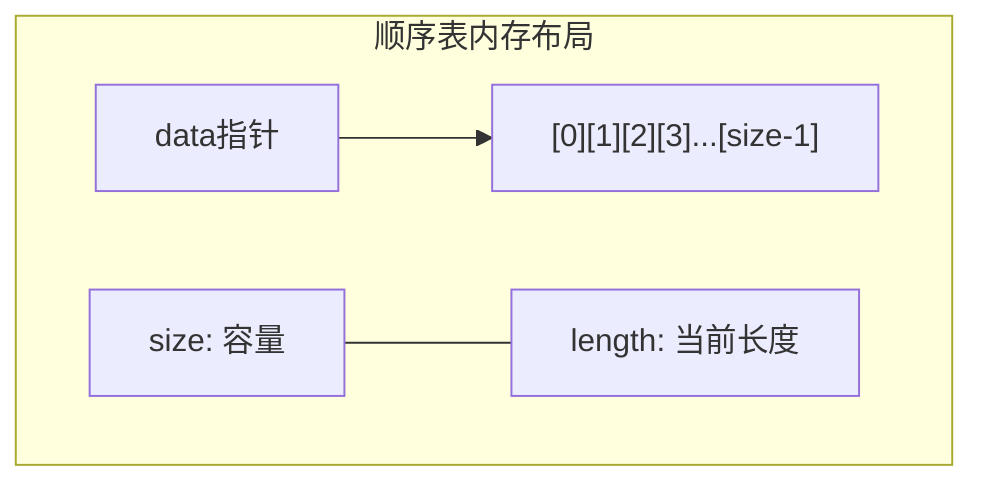

**插入操作流程**（对应 `InsList` 函数，sequential_list_v1.cpp#L332-351）：

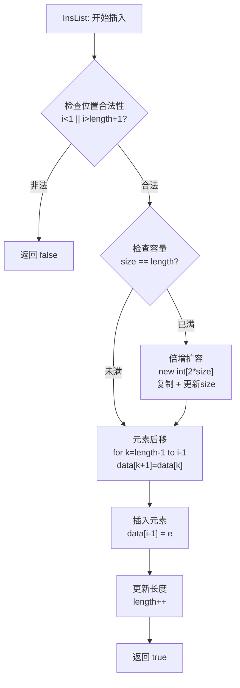

#### 核心代码片段

👉 [跳转到完整源码](../../src/linear_list/sequential_list/sequential_list_v1.cpp)

```cpp
typedef struct
{
    int *data;
    int  size;
    int length;
} SqList;
```

👉 [插入操作 — InsList](../../src/linear_list/sequential_list/sequential_list_v1.cpp)

```cpp
int InsList(SqList &L,int i,const int e)
{
    if(i<1||i>L.length+1) return false;
    if(L.size==L.length){
        int *temp=new int [2*L.size];
        if(temp==NULL)return false;
        for(int i=0;i<L.length;i++){
            temp[i]=L.data[i];
        }
        delete[] L.data;
        L.data=temp;
        L.size=L.size*2;
    }
    for(int k=L.length-1;k>=i-1;k--){
        L.data[k+1]=L.data[k];
    }
    L.data[i-1]=e;
    L.length++;
    return true;
}
```

#### 时间/空间复杂度分析

| 操作 | 时间复杂度 | 空间复杂度 |
|------|-----------|-----------|
| 按位查找 | O(1) | O(1) |
| 按值查找 | O(n) | O(1) |
| 插入 | O(n) | O(1) |
| 删除 | O(n) | O(1) |
| 扩容 | O(n) | O(n) |
| 尾插（均摊） | O(1) | O(1) |

#### 与 C++ STL 对比

| 对比项 | 本项目实现 | std::vector |
|--------|-----------|-------------|
| 底层结构 | 动态数组（`int* data` + `size` + `length`） | 动态数组（三指针架构：`_M_start`、`_M_finish`、`_M_end_of_storage`） |
| 扩容策略 | 2 倍扩容 | 通常 2 倍扩容（GCC libstdc++），具体由实现决定 |
| 元素类型 | 固定 `int` | 泛型模板 `<typename T>` |
| 迭代器 | 无 | 随机访问迭代器（`RandomAccessIterator`） |
| 内存分配 | `new[]`/`delete[]` | 支持 `Allocator` 自定义分配器 |
| 接口 | C 风格函数 | `push_back`、`emplace_back`、`reserve`、`shrink_to_fit` 等完整接口 |
| 异常安全 | 无 | 强异常安全保证 |

#### 版本/平台相关注意事项

- 动态版本（v1/v3）使用 C++ `new[]`/`delete[]`，需 C++ 编译器；静态版本（`static_sequential_list` 系列）使用固定数组，纯 C 兼容
- `realloc` 版本（v2.c）中，`realloc` 可能返回不同地址，调用后必须更新所有指向原内存的指针
- 倍增扩容在 32 位系统上存在整数溢出风险，大容量场景需改用更保守的增长策略

#### Python 实现

👉 [Python 实现](../../python/algorithms/data_structures/sequential_list.py)

```python
class SequentialList:
    def __init__(self, capacity: int = 10) -> None:
        self._data: list[Any] = [None] * capacity
        self._size: int = 0
        self._capacity: int = capacity

    def append(self, item: Any) -> None:
        if self._size == self._capacity:
            self._resize(self._capacity * 2)
        self._data[self._size] = item
        self._size += 1

    def insert(self, index: int, item: Any) -> None:
        if index < 0 or index > self._size:
            raise IndexError(f"Index {index} out of range")
        if self._size == self._capacity:
            self._resize(self._capacity * 2)
        for i in range(self._size, index, -1):
            self._data[i] = self._data[i - 1]
        self._data[index] = item
        self._size += 1
```

| 对比项 | C/C++ 实现 | Python 实现 |
|--------|-----------|------------|
| 内存管理 | 手动 `new[]`/`delete[]`，需显式释放 | 自动垃圾回收，无需手动释放 |
| 类型系统 | 固定 `int` 类型 | 动态类型 `Any`，支持任意类型 |
| 扩容策略 | 2 倍扩容，手动复制数据 | 2 倍扩容，Python 列表复制 |
| 缩容 | 无 | 元素不足 1/4 时自动缩容 |
| 接口风格 | C 风格函数 `InsList`/`DelList` | 面向对象方法 `append`/`insert`/`delete` |
| 错误处理 | 返回错误码 | 抛出 `IndexError` 异常 |

---

### 单链表 (Singly Linked List)

#### 概念说明

单链表是一种链式存储的线性表，每个结点包含数据域和指针域。指针域指向下一个结点，通过指针将各个结点串联起来。单链表不支持随机访问，但插入和删除操作无需移动元素。

> **源码导航**
>
> | 语言 | 文件 | 关键函数/类 |
> |------|------|------------|
> | C/C++ | [singly_linked_list_v1.c](../../src/linear_list/singly_linked_list/singly_linked_list_v1.c#L7) | `LinkList` (L7), `CreateListH` (L22), `CreateListL` (L37) |
> | Python | [singly_linked_list.py](../../python/algorithms/data_structures/singly_linked_list.py#L17) | `SinglyLinkedList` (L17) |

#### 权威参考来源

- 严蔚敏、吴伟民《数据结构（C语言版）》第2章 线性表 §2.3 线性表的链式表示和实现（p.31-44）
- C++ STL [`std::forward_list`](https://en.cppreference.com/w/cpp/container/forward_list) — 单向链表的工业级实现（C++11 引入）
- C++ STL 标准文档 ISO/IEC 14882:2017 §26.3.9

#### 学习前置知识

- 顺序表的基本概念
- C 指针操作（取地址 `&`、解引用 `*`、`->` 访问成员）
- 动态内存管理（`malloc`/`free`）

#### 实现原理

本项目采用带头结点的单链表实现。头结点不存储数据，其 `next` 指针指向第一个数据结点。提供了头插法（`CreateListH`）和尾插法（`CreateListL`）两种建表方式：头插法建表后元素顺序与输入顺序相反，尾插法则保持一致。

#### 结构与流程图

**单链表节点结构**（对应 `singly_linked_list_v1.c` 中 `LinkList` 结构体，L7-10）：

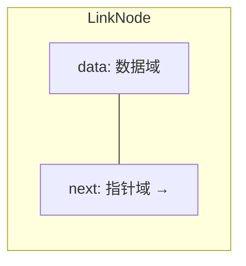

**头插法建表流程**（对应 `CreateListH` 函数，singly_linked_list_v1.c#L22-34）：

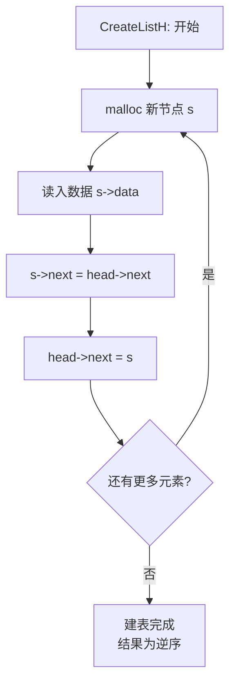

**单链表节点链接结构**（对应 `singly_linked_list_v1.c` 中 `LinkList` 结构体）：

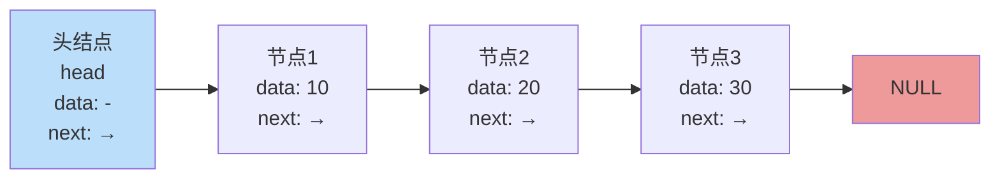

> 结构体定义（`singly_linked_list_v1.c`）：
> ```c
> typedef struct linknode {
>     DataType data;      // 数据域
>     struct linknode *next;  // 指针域
> } LinkList;
> ```

#### 核心代码片段

👉 [跳转到完整源码](../../src/linear_list/singly_linked_list/singly_linked_list_v1.c)

```c
typedef int DataType;

typedef struct linknode{
	DataType data;
	struct linknode *next;
}LinkList;
```

👉 [尾插法建表](../../src/linear_list/singly_linked_list/singly_linked_list_v1.c)

```c
void CreateListL(LinkList *head ,int n)
{
	LinkList *s,*last;
	int i;
	last=head;
	printf("请输入%d整数:",n);
	for(i=0;i<n;i++){
		s=(LinkList *)malloc(sizeof(LinkList)) ;
		scanf("%d",&s->data);
		s->next=NULL;
		last->next=s;
		last=s;
	}
    printf("创建链表head操作成功！");
}
```

#### 时间/空间复杂度分析

| 操作 | 时间复杂度 | 空间复杂度 |
|------|-----------|-----------|
| 按值查找 | O(n) | O(1) |
| 插入（已知前驱） | O(1) | O(1) |
| 删除（已知前驱） | O(1) | O(1) |
| 建表 | O(n) | O(n) |
| 按位插入/删除 | O(n) | O(1) |

#### 与 C++ STL 对比

| 对比项 | 本项目实现 | std::forward_list |
|--------|-----------|-------------------|
| 底层结构 | 带头结点的单链表 | 无头结点的单链表（C++11） |
| 结点结构 | `data` + `next` | `_Node` 含 `value` + `_M_next` |
| 元素类型 | 固定 `int`（`DataType`） | 泛型模板 `<typename T>` |
| 迭代器 | 无 | 前向迭代器（`ForwardIterator`） |
| 内存分配 | `malloc`/`free` | 支持 `Allocator` |
| 接口 | C 风格函数 | `push_front`、`insert_after`、`emplace_front` 等 |
| 特殊设计 | 带头结点简化边界处理 | 无头结点，但提供 `before_begin` 伪迭代器模拟头结点功能 |
| 大小查询 | O(1) 维护 `length` | 无 `size()` 方法（O(1) 空间换时间的权衡，需 `std::distance` 计算） |

#### 版本/平台相关注意事项

- v1.c/v2.c 为纯 C 实现，使用 `malloc`/`free`；v3.cpp/v4.c 为 C++ 或改进版本
- 头插法建表结果为逆序，需特别注意；若需保持输入顺序，应使用尾插法
- `malloc` 失败时返回 `NULL`，生产代码中必须检查返回值

#### Python 实现

👉 [Python 实现](../../python/algorithms/data_structures/singly_linked_list.py)

```python
class SinglyLinkedList:
    class Node:
        def __init__(self, data: Any, next: Node | None = None) -> None:
            self.data = data
            self.next = next

    def __init__(self) -> None:
        self._head: Node | None = None
        self._size: int = 0

    def append(self, item: Any) -> None:
        new_node = self.Node(item)
        if self._head is None:
            self._head = new_node
        else:
            current = self._head
            while current.next is not None:
                current = current.next
            current.next = new_node
        self._size += 1
```

| 对比项 | C/C++ 实现 | Python 实现 |
|--------|-----------|------------|
| 内存管理 | `malloc`/`free` 手动管理 | 自动垃圾回收 |
| 头结点 | 有头结点，简化边界处理 | 无头结点，直接用 `_head` 指向首元结点 |
| 类型系统 | 固定 `DataType`（`int`） | 动态类型 `Any` |
| 长度维护 | O(1) 维护 `length` 字段 | O(1) 维护 `_size` 字段 |
| 接口风格 | C 风格函数 `CreateListL`/`InsList` | 面向对象方法 `append`/`insert`/`delete` |
| 迭代支持 | 无 | 实现 `__iter__` 支持迭代 |

---

### 双向链表 (Doubly Linked List)

#### 概念说明

双向链表在每个结点中增加了指向前驱的 `prior` 指针，使得可以从任一结点方便地访问其前驱和后继。相比单链表，双向链表虽然空间开销略大，但某些操作（如删除当前结点、逆向遍历）更为高效。

> **源码导航**
>
> | 语言 | 文件 | 关键函数/类 |
> |------|------|------------|
> | C/C++ | [doubly_linked_list.h](../../src/linear_list/doubly_linked_list/doubly_linked_list.h#L9) / [.c](../../src/linear_list/doubly_linked_list/doubly_linked_list.c#L52) | `DuLNode` (L9), `ListInsert` (L52), `ListDelete` (L83) |
> | Python | [doubly_linked_list.py](../../python/algorithms/data_structures/doubly_linked_list.py#L17) | `DoublyLinkedList` (L17) |

#### 权威参考来源

- 严蔚敏、吴伟民《数据结构（C语言版）》第2章 线性表 §2.3.3 双向链表（p.39-44）
- C++ STL [`std::list`](https://en.cppreference.com/w/cpp/container/list) — 双向链表的工业级实现
- C++ STL 标准文档 ISO/IEC 14882:2017 §26.3.10

#### 学习前置知识

- 单链表的基本操作
- 指针的多重引用与修改顺序

#### 实现原理

本项目采用带头结点的双向链表实现。头结点的 `prior` 为 `NULL`，`next` 指向第一个数据结点。插入操作需修改四个指针：新结点的 `prior` 和 `next`，前驱结点的 `next`，后继结点的 `prior`。删除操作需修改两个指针：被删结点前驱的 `next` 和后继的 `prior`。

#### 结构与流程图

**双向链表节点结构**（对应 `doubly_linked_list.h` 中 `DuLNode` 结构体，L9-13）：

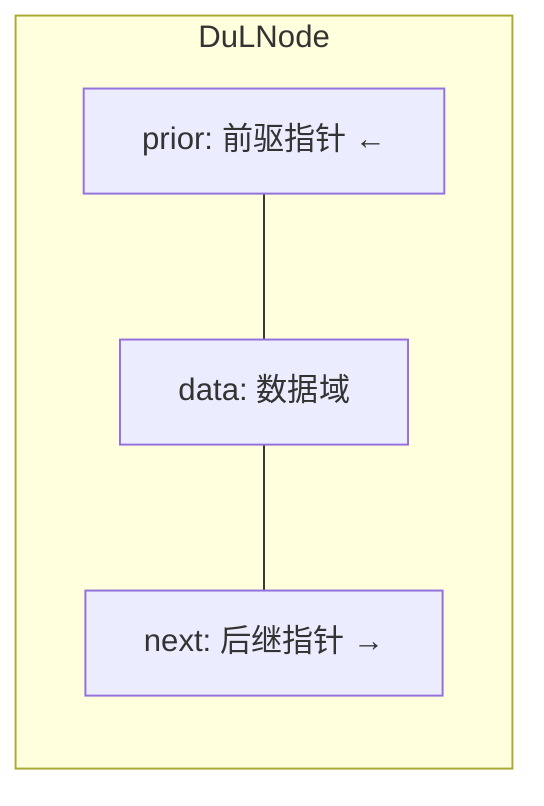

**插入操作流程**（对应 `ListInsert` 函数，doubly_linked_list.c#L52-81）：

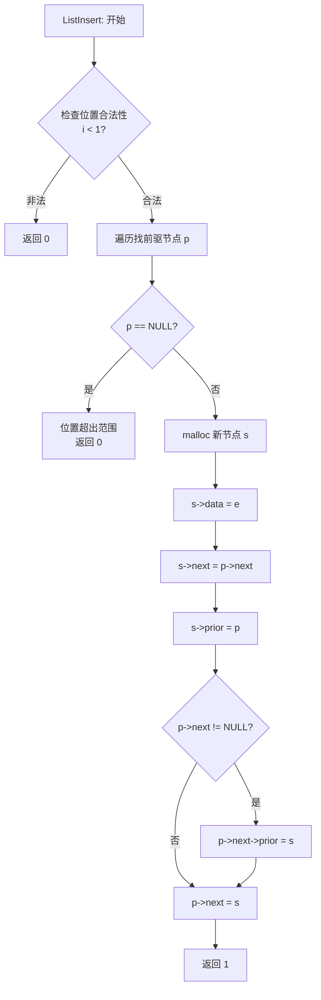

**双向链表节点链接结构**（对应 `doubly_linked_list.h` 中 `DuLNode` 结构体）：

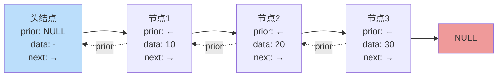

> 结构体定义（`doubly_linked_list.h`）：
> ```c
> typedef struct DuLNode {
>     ElemType data;           // 数据域
>     struct DuLNode *prior;   // 前驱指针
>     struct DuLNode *next;    // 后继指针
> } DuLNode, *DuLinkList;
> ```

#### 核心代码片段

👉 [跳转到完整源码](../../src/linear_list/doubly_linked_list/doubly_linked_list.h)

```c
typedef struct DuLNode {
    ElemType data;
    struct DuLNode *prior;
    struct DuLNode *next;
} DuLNode, *DuLinkList;
```

👉 [插入操作 — ListInsert](../../src/linear_list/doubly_linked_list/doubly_linked_list.c)

```c
int ListInsert(DuLinkList L, int i, ElemType e)
{
    if (i < 1) {
        printf("插入位置不合法!\n");
        return 0;
    }
    DuLNode *p = L;
    int j = 0;
    while (p != NULL && j < i - 1) {
        p = p->next;
        j++;
    }
    if (p == NULL) {
        printf("插入位置超出范围!\n");
        return 0;
    }
    DuLNode *s = (DuLNode *)malloc(sizeof(DuLNode));
    s->data = e;
    s->next = p->next;
    s->prior = p;
    if (p->next != NULL) {
        p->next->prior = s;
    }
    p->next = s;
    return 1;
}
```

#### 时间/空间复杂度分析

| 操作 | 时间复杂度 | 空间复杂度 |
|------|-----------|-----------|
| 按值查找 | O(n) | O(1) |
| 插入（已知位置） | O(n) | O(1) |
| 删除（已知位置） | O(n) | O(1) |
| 逆向遍历 | O(n) | O(1) |
| 插入（已知结点指针） | O(1) | O(1) |
| 删除（已知结点指针） | O(1) | O(1) |

#### 与 C++ STL 对比

| 对比项 | 本项目实现 | std::list |
|--------|-----------|-----------|
| 底层结构 | 带头结点的双向链表 | 双向链表（通常为带哨兵结点的环形双向链表） |
| 结点结构 | `data` + `prior` + `next` | `_Node` 含 `value` + `_M_prev` + `_M_next` |
| 元素类型 | 固定 `ElemType`（`int`） | 泛型模板 `<typename T>` |
| 迭代器 | 无 | 双向迭代器（`BidirectionalIterator`） |
| 内存分配 | `malloc`/`free` | 支持 `Allocator` |
| 接口 | C 风格函数 | `push_front`/`push_back`、`splice`、`sort`、`merge` 等 |
| 特殊设计 | 头结点 `prior` 为 `NULL` | 哨兵结点形成环，`end()` 迭代器指向哨兵 |
| 大小查询 | 遍历计数 O(n) | `size()` O(1)（C++11 起） |

#### 版本/平台相关注意事项

- 插入操作中修改指针的顺序至关重要：必须先设置新结点的 `prior` 和 `next`，再修改原链表结点的指针，否则会导致指针丢失
- 删除尾结点时需特殊处理 `p->next` 为 `NULL` 的情况，避免对 `NULL` 解引用

#### Python 实现

👉 [Python 实现](../../python/algorithms/data_structures/doubly_linked_list.py)

```python
class DoublyLinkedList:
    class Node:
        def __init__(self, data: Any, prev: Node | None = None, next: Node | None = None) -> None:
            self.data = data
            self.prev = prev
            self.next = next

    def __init__(self) -> None:
        self._head: Node | None = None
        self._tail: Node | None = None
        self._size: int = 0

    def append(self, item: Any) -> None:
        new_node = self.Node(item, self._tail, None)
        if self._head is None:
            self._head = new_node
            self._tail = new_node
        else:
            self._tail.next = new_node
            self._tail = new_node
        self._size += 1
```

| 对比项 | C/C++ 实现 | Python 实现 |
|--------|-----------|------------|
| 内存管理 | `malloc`/`free` 手动管理 | 自动垃圾回收 |
| 头结点 | 有头结点 | 无头结点，维护 `_head` 和 `_tail` |
| 尾指针 | 无，需遍历找尾 | 维护 `_tail` 指针，O(1) 尾插 |
| 类型系统 | 固定 `ElemType`（`int`） | 动态类型 `Any` |
| 接口风格 | C 风格函数 `ListInsert`/`ListDelete` | 面向对象方法 `append`/`insert`/`delete` |
| 遍历方向 | 仅正向 | `forward()` 和 `backward()` 双向遍历 |

---

### 循环链表 (Circular Linked List)

#### 概念说明

循环链表是将链表的最后一个结点的指针指向头结点，使整个链表形成一个环。从任一结点出发均可遍历整个链表。本项目实现的是带头结点的单循环链表。

> **源码导航**
>
> | 语言 | 文件 | 关键函数/类 |
> |------|------|------------|
> | C/C++ | [circular_linked_list.h](../../src/linear_list/circular_linked_list/circular_linked_list.h#L9) / [.c](../../src/linear_list/circular_linked_list/circular_linked_list.c#L14) | `CiLNode` (L9), `CreateCiListTail` (L14), `MergeCiList` (L114) |
> | Python | [circular_linked_list.py](../../python/algorithms/data_structures/circular_linked_list.py#L16) | `CircularLinkedList` (L16) |

#### 权威参考来源

- 严蔚敏、吴伟民《数据结构（C语言版）》第2章 线性表 §2.3.2 循环链表（p.37-39）
- 循环链表在 Josephus 问题、循环调度等场景中有经典应用

#### 学习前置知识

- 单链表的基本操作
- 循环终止条件的理解（`p != L` 替代 `p != NULL`）

#### 实现原理

初始化时，头结点的 `next` 指向自身（`L->next = L`），表示空表。判断链表结束的条件不再是 `p != NULL`，而是 `p != L`（即回到头结点）。尾插法建表时，每个新结点的 `next` 指向头结点 `L`，保证循环性。还实现了两个有序循环链表的归并合并操作 `MergeCiList`。

#### 结构与流程图

**循环链表环形结构**（对应 `circular_linked_list.h` 中 `CiLNode` 结构体，L9-12；初始化 `L->next = L`，circular_linked_list.c#L10）：

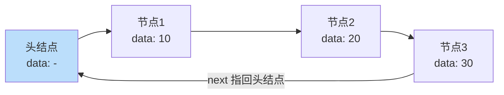

**归并合并流程**（对应 `MergeCiList` 函数，circular_linked_list.c#L114-147）：

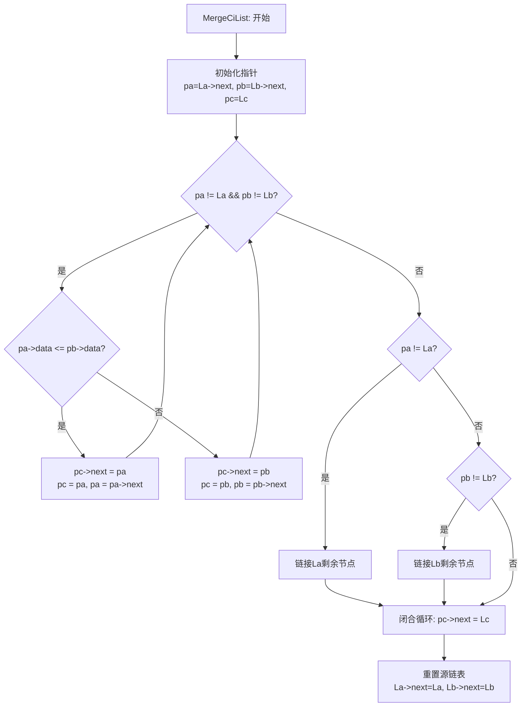

#### 核心代码片段

👉 [跳转到完整源码](../../src/linear_list/circular_linked_list/circular_linked_list.h)

```c
typedef struct CiLNode {
    ElemType data;
    struct CiLNode *next;
} CiLNode, *CiLinkList;
```

👉 [归并合并 — MergeCiList](../../src/linear_list/circular_linked_list/circular_linked_list.c)

```c
void MergeCiList(CiLinkList La, CiLinkList Lb, CiLinkList Lc)
{
    CiLNode *pa = La->next;
    CiLNode *pb = Lb->next;
    CiLNode *pc = Lc;

    while (pa != La && pb != Lb) {
        if (pa->data <= pb->data) {
            pc->next = pa;
            pc = pa;
            pa = pa->next;
        } else {
            pc->next = pb;
            pc = pb;
            pb = pb->next;
        }
    }

    while (pa != La) {
        pc->next = pa;
        pc = pa;
        pa = pa->next;
    }
    while (pb != Lb) {
        pc->next = pb;
        pc = pb;
        pb = pb->next;
    }

    pc->next = Lc;
    La->next = La;
    Lb->next = Lb;
}
```

#### 时间/空间复杂度分析

| 操作 | 时间复杂度 | 空间复杂度 |
|------|-----------|-----------|
| 查找 | O(n) | O(1) |
| 插入 | O(n) | O(1) |
| 删除 | O(n) | O(1) |
| 归并合并 | O(m+n) | O(1) |

#### 与 C++ STL 对比

| 对比项 | 本项目实现 | STL 对应 |
|--------|-----------|----------|
| 底层结构 | 带头结点的单循环链表 | STL 无直接对应容器；`std::list` 内部通常为环形双向链表，但对外接口不暴露循环特性 |
| 遍历终止 | `p != L` | `it != end()` |
| 归并合并 | `MergeCiList` 直接操作指针 | `std::list::merge()` |
| 从尾到头 | 需遍历整个链表 | `std::list` 可通过 `prior` 指针 O(1) 访问尾结点 |

#### 版本/平台相关注意事项

- 遍历时必须使用 `p != L` 而非 `p != NULL` 作为终止条件，否则将陷入无限循环
- 归并合并后源链表 `La`、`Lb` 被重置为空循环链表（`La->next = La`），不可再使用其原有数据
- 仅设置尾指针（不设头指针）的循环链表可 O(1) 访问首尾结点，但本项目采用头指针方案

#### Python 实现

👉 [Python 实现](../../python/algorithms/data_structures/circular_linked_list.py)

```python
class CircularLinkedList:
    class Node:
        def __init__(self, data: Any, next: Node | None = None) -> None:
            self.data = data
            self.next = next

    def __init__(self) -> None:
        self._head: Node | None = None
        self._size: int = 0

    def append(self, item: Any) -> None:
        new_node = self.Node(item)
        if self._head is None:
            self._head = new_node
            new_node.next = self._head
        else:
            current = self._head
            while current.next is not self._head:
                current = current.next
            current.next = new_node
            new_node.next = self._head
        self._size += 1
```

| 对比项 | C/C++ 实现 | Python 实现 |
|--------|-----------|------------|
| 内存管理 | `malloc`/`free` 手动管理 | 自动垃圾回收 |
| 头结点 | 有头结点 | 无头结点，`_head` 直接指向首元结点 |
| 循环终止 | `p != L`（头指针比较） | `current.next is not self._head` |
| 归并合并 | `MergeCiList` 直接操作指针 | 未实现归并合并 |
| 类型系统 | 固定 `ElemType`（`int`） | 动态类型 `Any` |
| 接口风格 | C 风格函数 | 面向对象方法 `append`/`insert`/`delete` |

---

### 跳表 (Skip List)

#### 概念说明

跳表是一种基于有序链表的概率数据结构，通过在链表上建立多级索引来实现快速查找。平均情况下查找、插入、删除的时间复杂度均为 O(log n)，是平衡树的一种高效替代方案。跳表不需要像 AVL 树那样进行复杂的旋转操作，实现更简单。

> **源码导航**
>
> | 语言 | 文件 | 关键函数/类 |
> |------|------|------------|
> | C/C++ | [skip_list.h](../../src/linear_list/skip_list/skip_list.h#L6) / [.cpp](../../src/linear_list/skip_list/skip_list.cpp#L6) | `SkipNode` (L6), `SkipList` (L12), `Insert` (L42), `Search` (L76) |
> | Python | [skip_list.py](../../python/algorithms/data_structures/skip_list.py#L16) | `SkipList` (L16) |

#### 权威参考来源

- William Pugh, "Skip Lists: A Probabilistic Alternative to Balanced Trees", *Communications of the ACM*, Vol. 33, No. 6, pp. 668-676, June 1990
- Java [`ConcurrentSkipListMap`](https://docs.oracle.com/javase/8/docs/api/java/util/concurrent/ConcurrentSkipListMap.html) — 跳表在工业界的经典应用（Java `java.util.concurrent` 包）
- Redis 有序集合（Sorted Set）底层使用跳表 + 哈希表实现

#### 学习前置知识

- 有序链表及其查找瓶颈
- 概率分析基础（期望值计算）
- 二分查找思想

#### 实现原理

本项目实现的跳表最大层数为 16（`SKIPLIST_MAX_LEVEL`）。每个结点包含 `key`、`value` 和 `forward` 指针数组。`forward[i]` 表示该结点在第 i 层的后继结点。插入时通过 `RandomLevel()` 随机决定新结点的层数（抛硬币方式），然后从最高层向下逐层更新前驱结点的 `forward` 指针。查找和删除同样从最高层开始，逐层向下定位目标位置。

#### 结构与流程图

**跳表多层索引结构**（对应 `skip_list.h` 中 `SkipNode` 结构体，L6-10 和 `SkipList` 类，L12-29）：

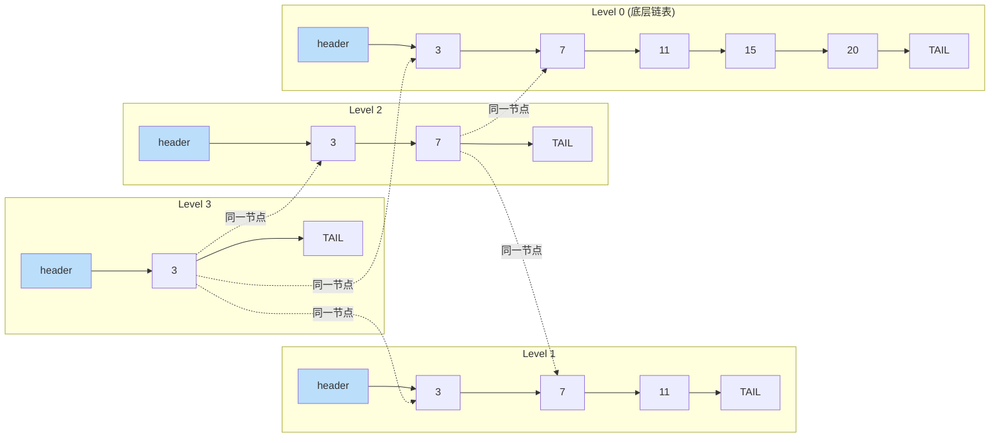

**查找操作流程**（对应 `Search` 函数，skip_list.cpp#L76-90）：

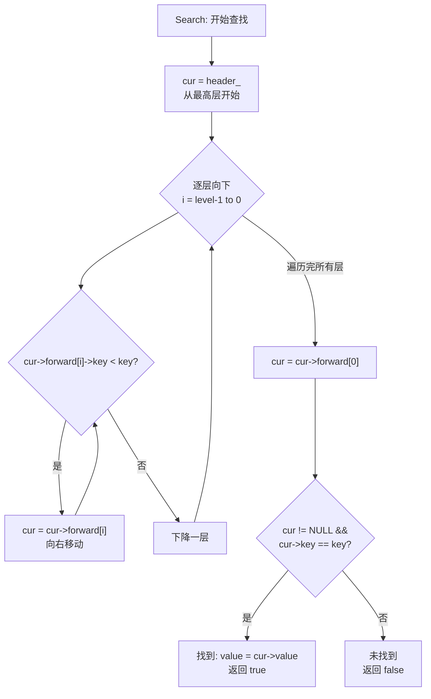

> 结构体定义（`skip_list.h`）：
> ```cpp
> struct SkipNode {
>     int key;              // 键值
>     int value;            // 值
>     SkipNode **forward;   // 各层前向指针数组
> };
>
> class SkipList {
>     SkipNode *header_;    // 头节点（拥有所有层）
>     int level_;           // 当前最大层数
>     static constexpr int SKIPLIST_MAX_LEVEL = 16;
> };
> ```

#### 核心代码片段

👉 [跳转到完整源码](../../src/linear_list/skip_list/skip_list.h)

```cpp
static constexpr int SKIPLIST_MAX_LEVEL = 16;

struct SkipNode {
    int key;
    int value;
    SkipNode **forward;
};

class SkipList {
public:
    SkipList();
    ~SkipList();

    void Insert(int key, int value);
    bool Search(int key, int &value);
    bool Delete(int key);
    void Display() const;
    void Destroy();

private:
    SkipNode *header_;
    int level_;

    int RandomLevel();
    SkipNode *CreateNode(int key, int value, int level);
};
```

👉 [插入操作 — Insert](../../src/linear_list/skip_list/skip_list.cpp)

```cpp
void SkipList::Insert(int key, int value)
{
    SkipNode *update[SKIPLIST_MAX_LEVEL];
    SkipNode *cur = header_;

    for (int i = level_ - 1; i >= 0; i--) {
        while (cur->forward[i] != nullptr && cur->forward[i]->key < key) {
            cur = cur->forward[i];
        }
        update[i] = cur;
    }

    cur = cur->forward[0];

    if (cur != nullptr && cur->key == key) {
        cur->value = value;
        return;
    }

    int newLevel = RandomLevel();
    if (newLevel > level_) {
        for (int i = level_; i < newLevel; i++) {
            update[i] = header_;
        }
        level_ = newLevel;
    }

    SkipNode *newNode = CreateNode(key, value, newLevel);
    for (int i = 0; i < newLevel; i++) {
        newNode->forward[i] = update[i]->forward[i];
        update[i]->forward[i] = newNode;
    }
}
```

#### 时间/空间复杂度分析

| 操作 | 时间复杂度（平均） | 时间复杂度（最坏） | 空间复杂度 |
|------|-------------------|-------------------|-----------|
| 查找 | O(log n) | O(n) | O(1) |
| 插入 | O(log n) | O(n) | O(log n) |
| 删除 | O(log n) | O(n) | O(1) |
| 整体空间 | — | — | O(n)（期望） |

#### 与 C++ STL 对比

| 对比项 | 本项目实现 | STL 对应 |
|--------|-----------|----------|
| 底层结构 | 多级索引链表 | STL 无跳表容器；`std::map`/`std::set` 使用红黑树实现同等功能 |
| 平衡方式 | 概率性平衡（随机层数） | 红黑树为确定性平衡（颜色规则 + 旋转） |
| 并发友好性 | 天然适合并发（锁粒度小） | `std::map` 非线程安全 |
| 范围查询 | 支持 | `std::map` 支持 |
| 实现复杂度 | 简单 | 红黑树实现复杂 |
| 工业应用 | Redis Sorted Set、Java ConcurrentSkipListMap | `std::map`/`std::set` |

#### 版本/平台相关注意事项

- `RandomLevel()` 使用 `rand()`，在 Windows MSVC 和 Linux glibc 下随机数质量不同；生产环境建议替换为 `<random>` 中的 `std::mt19937`
- 最大层数 16 适用于约 65536 个元素（2^16）；若数据量更大，需增大 `SKIPLIST_MAX_LEVEL`
- 本实现非线程安全，并发场景需外部加锁或参考 Java `ConcurrentSkipListMap` 的无锁设计

#### Python 实现

👉 [Python 实现](../../python/algorithms/data_structures/skip_list.py)

```python
class SkipList:
    MAX_LEVEL = 16
    PROBABILITY = 0.5

    class SkipNode:
        def __init__(self, key: int, value: Any, level: int) -> None:
            self.key = key
            self.value = value
            self.forward: list[SkipList.SkipNode | None] = [None] * level

    def __init__(self) -> None:
        self._header = self.SkipNode(0, None, self.MAX_LEVEL)
        self._level = 1
        self._size = 0

    def insert(self, key: int, value: Any) -> None:
        update = [None] * self.MAX_LEVEL
        current = self._header
        for i in range(self._level - 1, -1, -1):
            while current.forward[i] is not None and current.forward[i].key < key:
                current = current.forward[i]
            update[i] = current
```

| 对比项 | C/C++ 实现 | Python 实现 |
|--------|-----------|------------|
| 内存管理 | `new`/`delete` 手动管理 | 自动垃圾回收 |
| 随机层数 | `rand()` 生成 | `random.random()` 生成 |
| 前向指针 | `SkipNode **forward`（指针数组） | `list[SkipNode \| None]`（Python 列表） |
| 类型系统 | 固定 `int` 键值 | `int` 键 + `Any` 值 |
| 线程安全 | 非线程安全 | 非线程安全（GIL 提供有限保护） |
| 接口风格 | C++ 类方法 | Python 类方法 |

---

## 栈

### 顺序栈 (Sequential Stack)

#### 概念说明

栈是一种后进先出（LIFO）的线性数据结构，只允许在栈顶进行插入和删除操作。顺序栈使用连续的存储空间实现，通过 `base` 和 `top` 两个指针标识栈底和栈顶位置。

> **源码导航**
>
> | 语言 | 文件 | 关键函数/类 |
> |------|------|------------|
> | C/C++ | [sequential_stack_v1.cpp](../../src/stack/sequential_stack/sequential_stack_v1.cpp#L12) | `Sqstack` (L12), `Push` (L37), `Pop` (L50) |
> | Python | [stack.py](../../python/algorithms/data_structures/stack.py#L16) | `Stack` (L16) |

#### 权威参考来源

- 严蔚敏、吴伟民《数据结构（C语言版）》第3章 栈和队列 §3.1 栈（p.44-53）
- C++ STL [`std::stack`](https://en.cppreference.com/w/cpp/container/stack) — 栈适配器
- C++ STL 标准文档 ISO/IEC 14882:2017 §26.3.24

#### 学习前置知识

- 顺序表的基本概念
- 指针算术运算（`top - base` 计算元素个数）

#### 实现原理

本项目采用动态分配的顺序栈实现。`base` 指向栈底，`top` 指向栈顶元素的下一个位置。初始时 `top == base` 表示空栈。入栈时将元素存入 `top` 位置后 `top++`；出栈时 `top--` 后取出元素。当栈满时通过 `realloc` 扩容。这种"栈顶指针指向栈顶元素下一位置"的设计使得判空条件为 `top == base`，判满条件为 `top - base >= stacksize`。

#### 结构与流程图

**顺序栈内存布局**（对应 `sequential_stack_v1.cpp` 中 `Sqstack` 结构体，L12-16）：

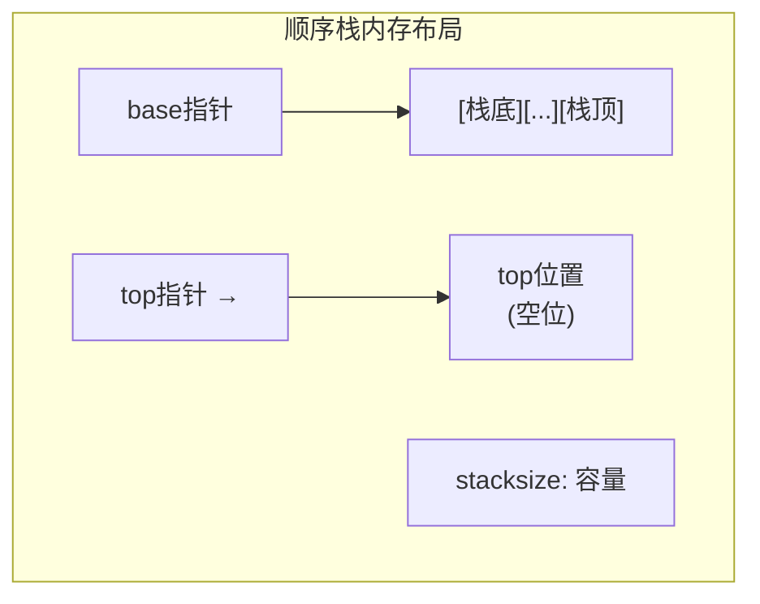

**入栈/出栈流程**（对应 `Push` 函数，sequential_stack_v1.cpp#L37-48；`Pop` 函数，sequential_stack_v1.cpp#L50-57）：

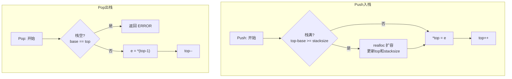

#### 核心代码片段

👉 [跳转到完整源码](../../src/stack/sequential_stack/sequential_stack_v1.cpp)

```cpp
typedef struct{
	int *base;
	int *top;
	int stacksize;
}Sqstack;
```

👉 [入栈与出栈操作](../../src/stack/sequential_stack/sequential_stack_v1.cpp)

```cpp
Status Push(Sqstack &st,int e )
{
	if(st.top-st.base>=st.stacksize){
		 st.base=(int*)realloc(st.base,(st.stacksize+STACKINCREATEMENT)*sizeof(int));
	if(!st.base)
		 exit(OVERFLOW);
	st.top=st.base+st.stacksize;
	st.stacksize+= STACKINCREATEMENT;}
	*st.top=e;
	st.top++;
	return OK;
 }

Status Pop(Sqstack &st,int &e)
{
	if(st.base==st.top)
		 return ERROR;
	e=*(st.top-1);
	st.top--;
	return OK;
}
```

#### 时间/空间复杂度分析

| 操作 | 时间复杂度 | 空间复杂度 |
|------|-----------|-----------|
| 入栈 (Push) | O(1) 均摊 | O(1) |
| 出栈 (Pop) | O(1) | O(1) |
| 取栈顶 | O(1) | O(1) |
| 判空 | O(1) | O(1) |

#### 与 C++ STL 对比

| 对比项 | 本项目实现 | std::stack |
|--------|-----------|------------|
| 底层结构 | 动态数组（`base`/`top` 指针） | 默认以 `std::deque` 为底层容器，可指定 `std::vector` 或 `std::list` |
| 元素类型 | 固定 `int` | 泛型模板 `<typename T>` |
| 扩容策略 | `realloc` 固定增量 | 取决于底层容器（`deque` 分段扩展，`vector` 倍增） |
| 接口 | C 风格函数 | `push`、`pop`、`top`、`emplace`（C++11） |
| 迭代器 | 无 | 无（栈适配器刻意不提供迭代器，保持 LIFO 语义） |
| 内存分配 | `realloc` | 通过底层容器的 `Allocator` |

#### 版本/平台相关注意事项

- `realloc` 扩容后必须重新计算 `top` 指针位置（`top = base + stacksize`），因为 `realloc` 可能移动内存块
- v1 使用 `realloc`，v2/v3 可能使用 `new[]`/`delete[]` 方式扩容，注意两者的内存管理方式不兼容
- 栈溢出时 `exit(OVERFLOW)` 直接终止程序，生产代码应改为返回错误码或抛出异常

#### Python 实现

👉 [Python 实现](../../python/algorithms/data_structures/stack.py)

```python
class Stack:
    def __init__(self) -> None:
        self._data: list[Any] = []

    def push(self, item: Any) -> None:
        self._data.append(item)

    def pop(self) -> Any:
        if self.is_empty():
            raise IndexError("Pop from empty stack")
        return self._data.pop()

    def peek(self) -> Any:
        if self.is_empty():
            raise IndexError("Peek from empty stack")
        return self._data[-1]

    def is_empty(self) -> bool:
        return len(self._data) == 0
```

| 对比项 | C/C++ 实现 | Python 实现 |
|--------|-----------|------------|
| 内存管理 | `realloc` 手动扩容 | Python `list` 自动扩容 |
| 底层结构 | `base`/`top` 指针 + 动态数组 | Python `list`（动态数组） |
| 扩容策略 | 固定增量 `STACKINCREATEMENT` | Python `list` 倍增策略 |
| 类型系统 | 固定 `int` | 动态类型 `Any` |
| 错误处理 | `exit(OVERFLOW)` 终止程序 | 抛出 `IndexError` 异常 |
| 接口风格 | C 风格函数 `Push`/`Pop` | 面向对象方法 `push`/`pop`/`peek` |

---

### 链栈 (Linked Stack)

#### 概念说明

链栈是采用链式存储结构实现的栈，使用单链表（不带头结点）实现，栈顶即为链表的首结点。链栈无需预先分配容量，不会发生栈满溢出（除非内存耗尽）。

> **源码导航**
>
> | 语言 | 文件 | 关键函数/类 |
> |------|------|------------|
> | C/C++ | [linked_stack_v1.cpp](../../src/stack/linked_stack/linked_stack_v1.cpp#L15) | `StackNode` (L15), `Push` (L39), `Pop` (L52) |
> | Python | [stack.py](../../python/algorithms/data_structures/stack.py#L16) | `Stack` (L16) |

#### 权威参考来源

- 严蔚敏、吴伟民《数据结构（C语言版）》第3章 栈和队列 §3.1.2 链栈（p.49-50）
- C++ STL `std::stack` 以 `std::list` 为底层容器时可视为链栈

#### 学习前置知识

- 单链表的基本操作
- 栈的 LIFO 原理

#### 实现原理

本项目链栈不设头结点，栈顶指针 `st` 直接指向栈顶元素结点。入栈操作将新结点插入链表头部（`p->next = st; st = p;`），出栈操作删除链表首结点（`st = st->next;`）。初始化时栈顶指针置空（`st = NULL`）。

#### 核心代码片段

👉 [跳转到完整源码](../../src/stack/linked_stack/linked_stack_v1.cpp)

```cpp
typedef struct StackNode{
	SElemType data;
	struct StackNode *next;
}StackNode,*LinkStack;
```

👉 [入栈与出栈操作](../../src/stack/linked_stack/linked_stack_v1.cpp)

```cpp
Status Push(LinkStack &st,int e )
{
	LinkStack p;
    p=new StackNode;

	p->data=e;
	p->next=st;
	st=p;
	return OK;
 }

Status Pop(LinkStack &st,int &e)
{
	LinkStack p;
	if(st==NULL)
		 return ERROR;
	e=st->data;
	p=st;
	st=st->next;
	delete p;
	return OK;
}
```

#### 时间/空间复杂度分析

| 操作 | 时间复杂度 | 空间复杂度 |
|------|-----------|-----------|
| 入栈 (Push) | O(1) | O(1) |
| 出栈 (Pop) | O(1) | O(1) |
| 取栈顶 | O(1) | O(1) |
| 判空 | O(1) | O(1) |

#### 与 C++ STL 对比

| 对比项 | 本项目实现 | std::stack（以 std::list 为底层） |
|--------|-----------|----------------------------------|
| 底层结构 | 不带头结点的单链表 | `std::list`（双向链表，带哨兵结点） |
| 元素类型 | 固定 `SElemType` | 泛型模板 `<typename T>` |
| 内存分配 | `new`/`delete` | `Allocator` |
| 额外空间 | 每结点 1 个指针 | 每结点 2 个指针（双向链表） |
| 接口 | C 风格函数 | `push`、`pop`、`top`、`emplace` |

#### 版本/平台相关注意事项

- 不带头结点的链栈在空栈时 `st == NULL`，出栈前必须检查，否则对 `NULL` 解引用将导致未定义行为
- 本实现使用 C++ `new`/`delete`，若需移植到纯 C 环境需替换为 `malloc`/`free`

#### Python 实现

👉 [Python 实现](../../python/algorithms/data_structures/stack.py)

> Python 实现中顺序栈与链栈共用同一个 `Stack` 类，底层基于 Python `list`（动态数组），兼具顺序栈和链栈的优点：自动扩容、无需预分配、操作均为 O(1)。

```python
class Stack:
    def __init__(self) -> None:
        self._data: list[Any] = []

    def push(self, item: Any) -> None:
        self._data.append(item)

    def pop(self) -> Any:
        if self.is_empty():
            raise IndexError("Pop from empty stack")
        return self._data.pop()
```

| 对比项 | C/C++ 链栈 | Python Stack |
|--------|-----------|------------|
| 内存管理 | `new`/`delete` 手动管理 | 自动垃圾回收 |
| 底层结构 | 不带头结点的单链表 | Python `list`（动态数组） |
| 栈满判断 | 无（仅受内存限制） | 无（自动扩容） |
| 类型系统 | 固定 `SElemType` | 动态类型 `Any` |
| 额外空间 | 每结点 1 个 `next` 指针 | 无额外指针开销 |
| 接口风格 | C 风格函数 `Push`/`Pop` | 面向对象方法 `push`/`pop` |

---

## 队列

### 循环队列 (Circular Queue)

#### 概念说明

循环队列是将顺序队列首尾相连形成的环形结构，解决了顺序队列的"假溢出"问题。通过取模运算实现首尾指针的循环移动，充分利用存储空间。

> **源码导航**
>
> | 语言 | 文件 | 关键函数/类 |
> |------|------|------------|
> | C/C++ | [circular_queue.h](../../src/queue/circular_queue/circular_queue.h#L10) / [.c](../../src/queue/circular_queue/circular_queue.c#L4) | `SqQueue` (L10), `EnQueue` (L25), `DeQueue` (L34) |
> | Python | [queue.py](../../python/algorithms/data_structures/queue.py#L17) | `Queue` (L17) |

#### 权威参考来源

- 严蔚敏、吴伟民《数据结构（C语言版）》第3章 栈和队列 §3.2 队列 §3.2.2 循环队列（p.58-64）
- C++ STL [`std::queue`](https://en.cppreference.com/w/cpp/container/queue) — 队列适配器
- C++ STL 标准文档 ISO/IEC 14882:2017 §26.3.25

#### 学习前置知识

- 顺序表的存储结构
- 取模运算实现循环的原理
- "假溢出"问题的理解

#### 实现原理

本项目采用"牺牲一个存储单元"的方式区分队空和队满：队空条件为 `front == rear`，队满条件为 `(rear + 1) % MAXSIZE == front`。入队时元素存入 `rear` 位置后 `rear` 循环后移；出队时取出 `front` 位置元素后 `front` 循环后移。队列长度计算公式为 `(rear - front + MAXSIZE) % MAXSIZE`。

#### 结构与流程图

**循环队列环形缓冲区**（对应 `circular_queue.h` 中 `SqQueue` 结构体，L10-14）：

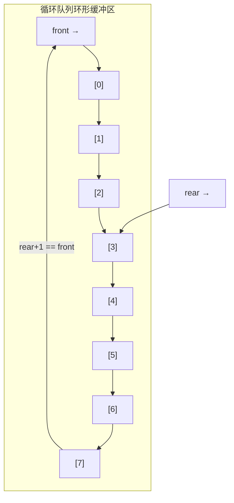

**入队/出队流程**（对应 `EnQueue` 函数，circular_queue.c#L25-32；`DeQueue` 函数，circular_queue.c#L34-41）：

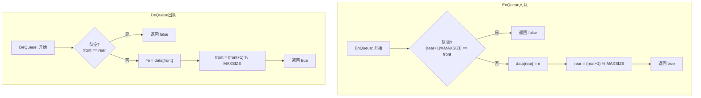

#### 核心代码片段

👉 [跳转到完整源码](../../src/queue/circular_queue/circular_queue.h)

```c
typedef struct {
    QElemType data[MAXSIZE];
    int front;
    int rear;
} SqQueue;
```

👉 [入队与出队操作](../../src/queue/circular_queue/circular_queue.c)

```c
bool EnQueue(SqQueue *Q, QElemType e)
{
    if (QueueFull(Q))
        return false;
    Q->data[Q->rear] = e;
    Q->rear = (Q->rear + 1) % MAXSIZE;
    return true;
}

bool DeQueue(SqQueue *Q, QElemType *e)
{
    if (QueueEmpty(Q))
        return false;
    *e = Q->data[Q->front];
    Q->front = (Q->front + 1) % MAXSIZE;
    return true;
}
```

#### 时间/空间复杂度分析

| 操作 | 时间复杂度 | 空间复杂度 |
|------|-----------|-----------|
| 入队 | O(1) | O(1) |
| 出队 | O(1) | O(1) |
| 取队头 | O(1) | O(1) |
| 判空/判满 | O(1) | O(1) |

#### 与 C++ STL 对比

| 对比项 | 本项目实现 | std::queue |
|--------|-----------|------------|
| 底层结构 | 静态循环数组 | 默认以 `std::deque` 为底层容器 |
| 容量 | 固定 `MAXSIZE`，牺牲 1 个单元 | `deque` 动态扩容，无固定上限 |
| 判满方式 | `(rear+1) % MAXSIZE == front` | 底层容器自动管理 |
| 元素类型 | 固定 `QElemType` | 泛型模板 `<typename T>` |
| 接口 | C 风格函数 | `push`、`pop`、`front`、`back`、`emplace` |
| 迭代器 | 无 | 无（队列适配器刻意不提供迭代器） |

#### 版本/平台相关注意事项

- "牺牲一个单元"方案导致实际可用容量为 `MAXSIZE - 1`；若需全部利用，可增加 `size` 计数器方案（参见双端队列实现）
- `MAXSIZE` 为编译期常量，运行时不可调整；若需动态容量，应改用链队列或 `std::deque`

#### Python 实现

👉 [Python 实现](../../python/algorithms/data_structures/queue.py)

```python
class Queue:
    def __init__(self) -> None:
        self._data: deque[Any] = deque()

    def enqueue(self, item: Any) -> None:
        self._data.append(item)

    def dequeue(self) -> Any:
        if self.is_empty():
            raise IndexError("Dequeue from empty queue")
        return self._data.popleft()

    def front(self) -> Any:
        if self.is_empty():
            raise IndexError("Front from empty queue")
        return self._data[0]
```

| 对比项 | C/C++ 实现 | Python 实现 |
|--------|-----------|------------|
| 内存管理 | 静态数组，固定容量 | `collections.deque` 自动扩容 |
| 底层结构 | 循环数组 + `front`/`rear` 指针 | `collections.deque`（双端队列） |
| 判满方式 | `(rear+1) % MAXSIZE == front` | 无需判满，自动扩容 |
| 类型系统 | 固定 `QElemType` | 动态类型 `Any` |
| 容量限制 | 固定 `MAXSIZE`，牺牲 1 个单元 | 无固定限制 |
| 接口风格 | C 风格函数 `EnQueue`/`DeQueue` | 面向对象方法 `enqueue`/`dequeue` |

---

### 链队列 (Linked Queue)

#### 概念说明

链队列是采用链式存储结构实现的队列，使用带头结点的单链表，分别设置队头指针和队尾指针。链队列不会出现队满情况（除非内存耗尽），适合队列长度变化较大的场景。

> **源码导航**
>
> | 语言 | 文件 | 关键函数/类 |
> |------|------|------------|
> | C/C++ | [linked_queue.h](../../src/queue/linked_queue/linked_queue.h#L8) / [.c](../../src/queue/linked_queue/linked_queue.c#L5) | `QNode` (L8), `LinkQueue` (L13), `EnQueue` (L29), `DeQueue` (L41) |
> | Python | [queue.py](../../python/algorithms/data_structures/queue.py#L17) | `Queue` (L17) |

#### 权威参考来源

- 严蔚敏、吴伟民《数据结构（C语言版）》第3章 栈和队列 §3.2.3 链队列（p.64-67）
- C++ STL `std::queue` 以 `std::list` 为底层容器时可视为链队列

#### 学习前置知识

- 单链表的基本操作
- 队列的 FIFO 原理

#### 实现原理

本项目链队列采用带头结点的单链表实现。`front` 指向头结点，`rear` 指向尾结点。队空条件为 `front == rear`。入队时在 `rear` 之后插入新结点并更新 `rear`；出队时删除 `front` 之后的第一个结点，若删除后队列为空则需将 `rear` 指回 `front`。

#### 核心代码片段

👉 [跳转到完整源码](../../src/queue/linked_queue/linked_queue.h)

```c
typedef struct QNode {
    QElemType data;
    struct QNode *next;
} QNode;

typedef struct {
    QNode *front;
    QNode *rear;
} LinkQueue;
```

👉 [入队与出队操作](../../src/queue/linked_queue/linked_queue.c)

```c
bool EnQueue(LinkQueue *Q, QElemType e)
{
    QNode *s = (QNode *)malloc(sizeof(QNode));
    if (!s)
        return false;
    s->data = e;
    s->next = NULL;
    Q->rear->next = s;
    Q->rear = s;
    return true;
}

bool DeQueue(LinkQueue *Q, QElemType *e)
{
    if (QueueEmpty(Q))
        return false;
    QNode *p = Q->front->next;
    *e = p->data;
    Q->front->next = p->next;
    if (Q->rear == p)
        Q->rear = Q->front;
    free(p);
    return true;
}
```

#### 时间/空间复杂度分析

| 操作 | 时间复杂度 | 空间复杂度 |
|------|-----------|-----------|
| 入队 | O(1) | O(1) |
| 出队 | O(1) | O(1) |
| 取队头 | O(1) | O(1) |
| 判空 | O(1) | O(1) |

#### 与 C++ STL 对比

| 对比项 | 本项目实现 | std::queue（以 std::list 为底层） |
|--------|-----------|----------------------------------|
| 底层结构 | 带头结点的单链表 + 首尾指针 | `std::list`（双向链表） |
| 容量限制 | 无（受内存限制） | 无（受内存限制） |
| 出队后空队列处理 | 需手动将 `rear` 指回 `front` | 底层容器自动管理 |
| 内存分配 | `malloc`/`free` | `Allocator` |

#### 版本/平台相关注意事项

- 出队操作中，删除最后一个元素时必须将 `rear` 重置为 `front`，否则 `rear` 将成为悬空指针
- 头结点在队列销毁时需单独释放

#### Python 实现

👉 [Python 实现](../../python/algorithms/data_structures/queue.py)

> Python 实现中循环队列与链队列共用同一个 `Queue` 类，底层基于 `collections.deque`，兼具两者优点：两端操作均为 O(1)、自动扩容、无需手动管理指针。

```python
class Queue:
    def __init__(self) -> None:
        self._data: deque[Any] = deque()

    def enqueue(self, item: Any) -> None:
        self._data.append(item)

    def dequeue(self) -> Any:
        if self.is_empty():
            raise IndexError("Dequeue from empty queue")
        return self._data.popleft()
```

| 对比项 | C/C++ 链队列 | Python Queue |
|--------|-----------|------------|
| 内存管理 | `malloc`/`free` 手动管理 | 自动垃圾回收 |
| 底层结构 | 带头结点单链表 + 首尾指针 | `collections.deque`（双向链表） |
| 空队列处理 | 需手动将 `rear` 指回 `front` | `deque` 自动管理 |
| 类型系统 | 固定 `QElemType` | 动态类型 `Any` |
| 容量限制 | 无（受内存限制） | 无（自动扩容） |
| 接口风格 | C 风格函数 `EnQueue`/`DeQueue` | 面向对象方法 `enqueue`/`dequeue` |

---

### 双端队列 (Deque)

#### 概念说明

双端队列是一种两端都可以进行入队和出队操作的数据结构，是栈和队列的推广。本项目采用循环数组实现双端队列，通过额外的 `size` 字段记录元素个数，避免牺牲存储单元来区分队空和队满。

> **源码导航**
>
> | 语言 | 文件 | 关键函数/类 |
> |------|------|------------|
> | C/C++ | [deque.h](../../src/queue/deque/deque.h#L8) / [.cpp](../../src/queue/deque/deque.cpp#L11) | `Deque` (L8), `PushFront` (L11), `PushBack` (L21) |
> | Python | [queue.py](../../python/algorithms/data_structures/queue.py#L17) | `Queue` (L17) |

#### 权威参考来源

- 严蔚敏、吴伟民《数据结构（C语言版）》第3章 栈和队列 §3.2.4 双端队列（p.67-68）
- C++ STL [`std::deque`](https://en.cppreference.com/w/cpp/container/deque) — 双端队列的工业级实现
- C++ STL 标准文档 ISO/IEC 14882:2017 §26.3.8

#### 学习前置知识

- 循环队列的原理
- 取模运算实现循环索引

#### 实现原理

本项目使用 `front`、`rear` 和 `size` 三个字段管理循环数组。`front` 指向队首元素，`rear` 指向下一个可插入位置。前端入队时 `front` 向前循环移动一位；后端入队时元素存入 `rear` 位置后 `rear` 向后循环移动。判满条件为 `size >= DEQUE_MAXSIZE`，判空条件为 `size == 0`。

#### 核心代码片段

👉 [跳转到完整源码](../../src/queue/deque/deque.h)

```c
typedef struct {
    DElemType data[DEQUE_MAXSIZE];
    int front;
    int rear;
    int size;
} Deque;
```

👉 [前端入队与后端入队](../../src/queue/deque/deque.cpp)

```cpp
bool PushFront(Deque *D, DElemType e)
{
    if (D->size >= DEQUE_MAXSIZE)
        return false;
    D->front = (D->front - 1 + DEQUE_MAXSIZE) % DEQUE_MAXSIZE;
    D->data[D->front] = e;
    D->size++;
    return true;
}

bool PushBack(Deque *D, DElemType e)
{
    if (D->size >= DEQUE_MAXSIZE)
        return false;
    D->data[D->rear] = e;
    D->rear = (D->rear + 1) % DEQUE_MAXSIZE;
    D->size++;
    return true;
}
```

#### 时间/空间复杂度分析

| 操作 | 时间复杂度 | 空间复杂度 |
|------|-----------|-----------|
| 前端入队 | O(1) | O(1) |
| 后端入队 | O(1) | O(1) |
| 前端出队 | O(1) | O(1) |
| 后端出队 | O(1) | O(1) |
| 取队首/队尾 | O(1) | O(1) |

#### 与 C++ STL 对比

| 对比项 | 本项目实现 | std::deque |
|--------|-----------|------------|
| 底层结构 | 静态循环数组 | 分段连续空间（map + 多个固定大小缓冲区），如 GCC libstdc++ 使用 512 字节块 |
| 容量 | 固定 `DEQUE_MAXSIZE` | 动态扩容 |
| 随机访问 | 不支持 | O(1) 随机访问（通过块索引计算） |
| 迭代器 | 无 | 随机访问迭代器 |
| 元素类型 | 固定 `DElemType` | 泛型模板 `<typename T>` |
| 内存局部性 | 连续数组，缓存友好 | 分段存储，跨块访问缓存不友好 |
| 接口 | C 风格函数 | `push_front`/`push_back`、`operator[]`、`emplace_front` 等 |

#### 版本/平台相关注意事项

- 使用 `size` 计数器方案而非"牺牲一个单元"方案，因此全部 `DEQUE_MAXSIZE` 个槽位均可使用
- `front` 向前移动时使用 `(front - 1 + MAXSIZE) % MAXSIZE` 避免负数取模问题（C 语言中负数取模结果可能为负）

#### Python 实现

👉 [Python 实现](../../python/algorithms/data_structures/queue.py)

> Python 实现中双端队列直接使用 `collections.deque`，原生支持两端 O(1) 的入队和出队操作，无需手动管理循环索引。

```python
from collections import deque

class Queue:
    def __init__(self) -> None:
        self._data: deque[Any] = deque()

    def enqueue(self, item: Any) -> None:
        self._data.append(item)

    def dequeue(self) -> Any:
        if self.is_empty():
            raise IndexError("Dequeue from empty queue")
        return self._data.popleft()
```

| 对比项 | C/C++ 实现 | Python 实现 |
|--------|-----------|------------|
| 内存管理 | 静态循环数组，固定容量 | `collections.deque` 自动扩容 |
| 底层结构 | `front`/`rear`/`size` 循环数组 | `collections.deque`（双向链表块） |
| 判满方式 | `size >= DEQUE_MAXSIZE` | 无需判满，自动扩容 |
| 类型系统 | 固定 `DElemType` | 动态类型 `Any` |
| 取模运算 | 需处理负数取模 | 无需取模，`deque` 自动管理 |
| 双端操作 | `PushFront`/`PushBack`/`PopFront`/`PopBack` | `appendleft`/`append`/`popleft`/`pop` |

---

### 优先队列 (Priority Queue)

#### 概念说明

优先队列是一种特殊的队列，其中每个元素都有一个优先级，出队时总是优先级最高的元素先出。本项目实现的是最大优先队列，基于二叉堆实现，堆顶元素即为优先级最高的元素。

> **源码导航**
>
> | 语言 | 文件 | 关键函数/类 |
> |------|------|------------|
> | C/C++ | [priority_queue.h](../../src/queue/priority_queue/priority_queue.h#L8) / [.c](../../src/queue/priority_queue/priority_queue.c#L12) | `PriorityQueue` (L8), `sift_up` (L12), `sift_down` (L25) |
> | Python | [max_heap.py](../../python/algorithms/data_structures/max_heap.py#L16) | `MaxHeap` (L16) |

#### 权威参考来源

- 严蔚敏、吴伟民《数据结构（C语言版）》第3章 栈和队列 §3.2 优先队列概念
- C++ STL [`std::priority_queue`](https://en.cppreference.com/w/cpp/container/priority_queue) — 优先队列适配器
- C++ STL 标准文档 ISO/IEC 14882:2017 §26.3.26

#### 学习前置知识

- 完全二叉树的性质
- 堆的基本概念（最大堆/最小堆）
- 上浮（sift up）和下沉（sift down）操作

#### 实现原理

本项目基于数组实现的二叉堆构建优先队列。插入时将新元素添加到数组末尾，然后执行上浮操作（`sift_up`）恢复堆性质；提取最大值时将堆顶元素与末尾元素交换，缩小堆大小后对堆顶执行下沉操作（`sift_down`）恢复堆性质。堆中节点 `i` 的父节点为 `(i-1)/2`，左子节点为 `2*i+1`，右子节点为 `2*i+2`。

#### 核心代码片段

👉 [跳转到完整源码](../../src/queue/priority_queue/priority_queue.h)

```c
typedef struct {
    PQElemType *data;
    int size;
    int capacity;
} PriorityQueue;
```

👉 [上浮与下沉操作](../../src/queue/priority_queue/priority_queue.c)

```c
static void sift_up(PriorityQueue *pq, int i)
{
    while (i > 0) {
        int parent = (i - 1) / 2;
        if (pq->data[parent] < pq->data[i]) {
            swap(&pq->data[parent], &pq->data[i]);
            i = parent;
        } else {
            break;
        }
    }
}

static void sift_down(PriorityQueue *pq, int i)
{
    int n = pq->size;
    while (2 * i + 1 < n) {
        int left = 2 * i + 1;
        int right = 2 * i + 2;
        int largest = i;
        if (left < n && pq->data[left] > pq->data[largest])
            largest = left;
        if (right < n && pq->data[right] > pq->data[largest])
            largest = right;
        if (largest != i) {
            swap(&pq->data[i], &pq->data[largest]);
            i = largest;
        } else {
            break;
        }
    }
}
```

#### 时间/空间复杂度分析

| 操作 | 时间复杂度 | 空间复杂度 |
|------|-----------|-----------|
| 插入 | O(log n) | O(1) |
| 提取最大值 | O(log n) | O(1) |
| 查看最大值 | O(1) | O(1) |
| 建堆 | O(n) | O(n) |

#### 与 C++ STL 对比

| 对比项 | 本项目实现 | std::priority_queue |
|--------|-----------|---------------------|
| 底层结构 | 动态数组 + 堆算法 | 默认以 `std::vector` 为底层容器 + `std::make_heap` 系列算法 |
| 堆类型 | 最大堆 | 默认最大堆，可通过自定义比较器改为最小堆 |
| 元素类型 | 固定 `PQElemType` | 泛型模板 `<typename T, typename Container, typename Compare>` |
| 下标起点 | 0（`parent = (i-1)/2`） | 0（与本项目一致） |
| 接口 | C 风格函数 | `push`、`pop`、`top`、`emplace` |
| 迭代器 | 无 | 无（优先队列适配器刻意不提供迭代器） |
| 扩容 | 手动 `realloc` | 底层 `vector` 自动扩容 |

#### 版本/平台相关注意事项

- 本实现下标从 0 开始，与堆模块（下标从 1 开始）不同，注意父/子节点计算公式的差异
- `sift_down` 中必须先比较左右子节点选出较大者，再与父节点比较，不能直接与左子节点交换

#### Python 实现

👉 [Python 实现](../../python/algorithms/data_structures/max_heap.py)

> Python 实现中优先队列基于 `MaxHeap` 类实现，下标从 0 开始，使用 Python `list` 动态数组。

```python
class MaxHeap:
    def __init__(self) -> None:
        self._data: list[Any] = []

    def insert(self, item: Any) -> None:
        self._data.append(item)
        self._sift_up(len(self._data) - 1)

    def extract_max(self) -> Any:
        if not self._data:
            raise IndexError("Extract from empty heap")
        max_val = self._data[0]
        last = self._data.pop()
        if self._data:
            self._data[0] = last
            self._sift_down(0)
        return max_val
```

| 对比项 | C/C++ 实现 | Python 实现 |
|--------|-----------|------------|
| 内存管理 | `realloc` 手动扩容 | Python `list` 自动扩容 |
| 底层结构 | 静态数组，下标从 1 开始 | Python `list`，下标从 0 开始 |
| 下标公式 | 父: `i/2`，左: `2*i`，右: `2*i+1` | 父: `(i-1)//2`，左: `2*i+1`，右: `2*i+2` |
| 类型系统 | 固定 `PQElemType` | 动态类型 `Any` |
| 容量限制 | 固定 `MAXSIZE` | 无限制，自动扩容 |
| 接口风格 | C 风格函数 | 面向对象方法 `insert`/`extract_max`/`peek` |

---

## 树

### 二叉树 (Binary Tree)

#### 概念说明

二叉树是每个结点最多有两个子树的树结构，分别称为左子树和右子树。二叉树是许多高级数据结构（BST、AVL、堆等）的基础，其遍历方式包括先序、中序、后序和层序四种。

> **源码导航**
>
> | 语言 | 文件 | 关键函数/类 |
> |------|------|------------|
> | C/C++ | [binary_tree_v1.cpp](../../src/tree/binary_tree/binary_tree_v1.cpp#L3) / [bint.h](../../src/tree/binary_tree/bint.h#L171) | `BiTNode` (L3), `PreOrde` (L171), `InOrder` (L185) |
> | Python | [binary_tree.py](../../python/algorithms/data_structures/binary_tree.py#L19) | `BinaryTree` (L19) |

#### 权威参考来源

- 严蔚敏、吴伟民《数据结构（C语言版）》第6章 树和二叉树 §6.2-6.3 二叉树的概念与遍历（p.119-137）
- 二叉树的递归定义是理解所有树形结构的基石

#### 学习前置知识

- 递归思想
- 树的基本术语（根、叶子、深度、高度）
- 队列（层序遍历需要）

#### 实现原理

本项目采用二叉链表存储二叉树。每个结点包含数据域 `data`、左孩子指针 `lchild` 和右孩子指针 `rchild`。遍历操作采用递归实现：先序遍历（根-左-右）、中序遍历（左-根-右）、后序遍历（左-右-根）。层序遍历借助队列实现，按层从上到下、从左到右依次访问结点。

#### 结构与流程图

**二叉树节点结构**（对应 `bint.h` 中 `BiTNode` 结构体）：

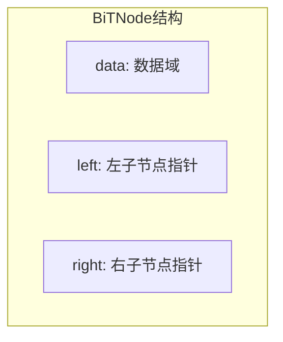

**遍历流程对比**（对应 `PreOrde`，bint.h#L171-183；`InOrder`，bint.h#L185-195；`PostOrde`，bint.h#L197-207）：

```mermaid
flowchart TD
    subgraph 先序遍历PreOrder
        PRE1["访问根节点<br/>printf data<br/><!-- src: bint.h#L180 -->"] --> PRE2["递归左子树<br/>PreOrde(T->left)<br/><!-- src: bint.h#L181 -->"]
        PRE2 --> PRE3["递归右子树<br/>PreOrde(T->right)<br/><!-- src: bint.h#L182 -->"]
    end

    subgraph 中序遍历InOrder
        IN1["递归左子树<br/>InOrder(T->left)<br/><!-- src: bint.h#L192 -->"] --> IN2["访问根节点<br/>printf data<br/><!-- src: bint.h#L193 -->"]
        IN2 --> IN3["递归右子树<br/>InOrder(T->right)<br/><!-- src: bint.h#L194 -->"]
    end

    subgraph 后序遍历PostOrder
        POST1["递归左子树<br/>PostOrde(T->left)<br/><!-- src: bint.h#L204 -->"] --> POST2["递归右子树<br/>PostOrde(T->right)<br/><!-- src: bint.h#L205 -->"]
        POST2 --> POST3["访问根节点<br/>printf data<br/><!-- src: bint.h#L206 -->"]
    end
```

**二叉树节点结构**（对应 `bint.h` 中 `BiTNode` 结构体）：

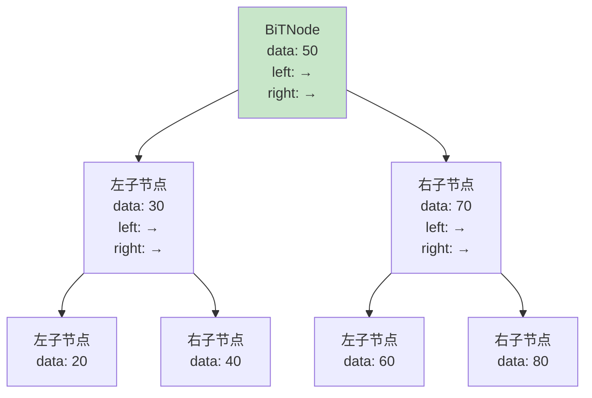

> 结构体定义（`bint.h`）：
> ```cpp
> typedef struct BiTNode {
>     int data;              // 数据域
>     struct BiTNode *left;  // 左子节点指针
>     struct BiTNode *right; // 右子节点指针
> } BiTNode, *BSTree;
> ```

#### 核心代码片段

👉 [跳转到完整源码](../../src/tree/binary_tree/binary_tree_v1.cpp)

```cpp
typedef struct BitNode
{
	int data;
	struct BitNode *lchild,*rchild;
}BiTNode,*BiNode;
```

👉 [遍历操作](../../src/tree/binary_tree/bint.h)

```cpp
void PreOrde(BiTNode *T)
{
	if (T==NULL)
	{
		return;
	}
	printf("%d ", T->data);
	PreOrde(T->left);
	PreOrde(T->right);
}

void InOrder(BiTNode *T)
{
	if (!T)
	{
		return;
	}
	InOrder(T->left);
	printf("%d ", T->data);
	InOrder(T->right);
}

void PostOrde(BiTNode *T)
{
	if (!T)
	{
		return;
	}
	PostOrde(T->left);
	PostOrde(T->right);
	printf("%d ", T->data);
}
```

#### 时间/空间复杂度分析

| 操作 | 时间复杂度 | 空间复杂度 |
|------|-----------|-----------|
| 先序/中序/后序遍历 | O(n) | O(h) 递归栈 |
| 层序遍历 | O(n) | O(n) |
| 求高度 | O(n) | O(h) |
| 求叶子数 | O(n) | O(h) |

> 其中 h 为树高，n 为结点数。最坏情况下 h = n（退化为链表），最好情况下 h = ⌊log₂n⌋。

#### 与 C++ STL 对比

| 对比项 | 本项目实现 | STL 对应 |
|--------|-----------|----------|
| 底层结构 | 二叉链表 | STL 无通用二叉树容器；`std::map`/`std::set` 内部使用红黑树 |
| 遍历方式 | 四种经典遍历 | 红黑树提供中序迭代器（有序遍历） |
| 结点结构 | `data` + `lchild` + `rchild` | 红黑树结点额外含 `parent` 和 `color` 字段 |
| 应用 | 教学、基础操作 | 关联容器的底层支撑 |

#### 版本/平台相关注意事项

- 递归遍历在深度极大时可能导致栈溢出，生产环境应改用迭代版本（使用显式栈）
- v1~v6 为不同阶段的实现版本，`bint.h`/`bint_v2.h` 为头文件版本，包含更完整的操作集
- `count_leaves.cpp` 和 `swap_subtree.cpp` 为专题练习，分别实现叶子计数和左右子树交换

#### Python 实现

👉 [Python 实现](../../python/algorithms/data_structures/binary_tree.py)

```python
class BinaryTree:
    class TreeNode:
        def __init__(self, data: Any, left: TreeNode | None = None, right: TreeNode | None = None) -> None:
            self.data = data
            self.left = left
            self.right = right

    def __init__(self, root: TreeNode | None = None) -> None:
        self._root = root

    def preorder(self) -> list[Any]:
        result: list[Any] = []
        self._preorder(self._root, result)
        return result

    def inorder(self) -> list[Any]:
        result: list[Any] = []
        self._inorder(self._root, result)
        return result
```

| 对比项 | C/C++ 实现 | Python 实现 |
|--------|-----------|------------|
| 内存管理 | `malloc`/`new` 手动管理 | 自动垃圾回收 |
| 节点结构 | `data` + `lchild` + `rchild` 指针 | `data` + `left` + `right` 引用 |
| 遍历输出 | `printf` 直接打印 | 返回 `list[Any]`，更灵活 |
| 层序遍历 | 需自行实现队列 | 使用 `collections.deque` |
| 类型系统 | 固定 `int` | 动态类型 `Any` |
| 接口风格 | C 风格函数 `PreOrde`/`InOrder` | 面向对象方法 `preorder`/`inorder` |

---

### 二叉排序树 (Binary Search Tree)

#### 概念说明

二叉排序树（BST）是一种特殊的二叉树，满足：左子树上所有结点的值均小于根结点的值，右子树上所有结点的值均大于等于根结点的值，且左右子树也分别是二叉排序树。中序遍历 BST 可得到有序序列。

> **源码导航**
>
> | 语言 | 文件 | 关键函数/类 |
> |------|------|------------|
> | C/C++ | [bst_crud.cpp](../../src/tree/binary_search_tree/bst_crud.cpp#L8) / [bint.h](../../src/tree/binary_tree/bint.h#L392) | `BstNode` (L8), `SearchBstNode` (L188), `InsertBST` (L392) |
> | Python | [binary_search_tree.py](../../python/algorithms/data_structures/binary_search_tree.py#L16) | `BST` (L16) |

#### 权威参考来源

- 严蔚敏、吴伟民《数据结构（C语言版）》第9章 查找 §9.1 静态查找表、§9.2 动态查找表 — 二叉排序树（p.219-228）
- C++ STL [`std::map`](https://en.cppreference.com/w/cpp/container/map) / [`std::set`](https://en.cppreference.com/w/cpp/container/set) — 基于红黑树的有序关联容器
- C++ STL 标准文档 ISO/IEC 14882:2017 §26.4

#### 学习前置知识

- 二叉树的基本操作
- 二分查找思想
- 有序性的概念

#### 实现原理

本项目提供了两种 BST 实现方式。`bst_crud.cpp` 采用迭代方式插入结点：从根结点出发，比当前结点小则走左子树，大则走右子树，直到找到空位插入。查找操作同样从根开始逐层比较。`bint.h` 中则提供了递归方式的插入和查找实现，以及完整的删除操作（处理叶子结点、单子树和双子树三种情况）。

#### 结构与流程图

**BST 查找流程**（对应 `SearchBstNode` 函数，bst_crud.cpp#L188-208）：

```mermaid
flowchart TD
    A["SearchBstNode: 开始查找"] --> B{"T == NULL?<br/><!-- src: bst_crud.cpp#L191 -->"}
    B -->|是| C["返回 NULL"]
    B -->|否| D{"T->data == key?<br/><!-- src: bst_crud.cpp#L195 -->"}
    D -->|是| E["返回 T"]
    D -->|否| F{"key &lt; T->data?<br/><!-- src: bst_crud.cpp#L199 -->"}
    F -->|是| G["递归查找左子树<br/>SearchBstNode(T->Left, key)<br/><!-- src: bst_crud.cpp#L201 -->"]
    F -->|否| H["递归查找右子树<br/>SearchBstNode(T->Right, key)<br/><!-- src: bst_crud.cpp#L205 -->"]
```

**BST 插入流程**（对应 `InsertBST` 递归函数，bint.h#L392-405）：

```mermaid
flowchart TD
    A["InsertBST: 开始插入"] --> B{"*bst == NULL?<br/><!-- src: bint.h#L394 -->"}
    B -->|是| C["malloc 新节点<br/>设置 data/left/right<br/>*bst = s<br/><!-- src: bint.h#L395-399 -->"]
    B -->|否| D{"data &lt; (*bst)->data?<br/><!-- src: bint.h#L401 -->"}
    D -->|是| E["递归插入左子树<br/>InsertBST(&((*bst)->left), data)<br/><!-- src: bint.h#L402 -->"]
    D -->|否| F["递归插入右子树<br/>InsertBST(&((*bst)->right), data)<br/><!-- src: bint.h#L404 -->"]
```

**BST 删除流程**（对应 `DeleteBstNode` 函数，bst_crud.cpp#L90-166）：

```mermaid
flowchart TD
    A["DeleteBstNode: 开始删除"] --> B["查找父节点<br/>FindFather<br/><!-- src: bst_crud.cpp#L98 -->"]
    B --> C{"找到待删节点?"}
    C -->|否| D["返回原树"]
    C -->|是| E{"无左子树?<br/><!-- src: bst_crud.cpp#L125 -->"}
    E -->|是| F["用右子节点替换<br/><!-- src: bst_crud.cpp#L128 -->"]
    E -->|否| G{"无右子树?<br/><!-- src: bst_crud.cpp#L135 -->"}
    G -->|是| H["用左子节点替换<br/><!-- src: bst_crud.cpp#L138 -->"]
    G -->|否| I["找左子树最右节点<br/>(中序前驱)替换数据<br/><!-- src: bst_crud.cpp#L145-152 -->"]
```

#### 核心代码片段

👉 [跳转到完整源码](../../src/tree/binary_search_tree/bst_crud.cpp)

```cpp
typedef struct BstNode
{
    TElemType data;
    BstNode *Left;
    BstNode *Right;
}BstNode;
```

👉 [递归插入操作](../../src/tree/binary_tree/bint.h)

```cpp
void InsertBST(BSTree* bst, int data) {
	BSTree s;
	if (*bst == NULL) {
		s = (BSTree)malloc(sizeof(BiTNode));
		s->data = data;
		s->left = NULL;
		s->right = NULL;
		*bst = s;
	}
	else if (data < (*bst)->data)
		InsertBST(&((*bst)->left), data);
	else if (data >= (*bst)->data)
		InsertBST(&((*bst)->right), data);
}
```

#### 时间/空间复杂度分析

| 操作 | 时间复杂度（平均） | 时间复杂度（最坏） | 空间复杂度 |
|------|-------------------|-------------------|-----------|
| 查找 | O(log n) | O(n) | O(h) |
| 插入 | O(log n) | O(n) | O(h) |
| 删除 | O(log n) | O(n) | O(h) |

> 最坏情况发生在 BST 退化为链表时（如按有序序列插入）。这也是 AVL 树和红黑树存在的意义。

#### 与 C++ STL 对比

| 对比项 | 本项目实现 | std::map / std::set |
|--------|-----------|---------------------|
| 底层结构 | 纯 BST（无平衡） | 红黑树（自平衡 BST） |
| 最坏查找 | O(n) | O(log n)（红黑树保证） |
| 元素类型 | 固定 `TElemType` | 泛型模板 `<typename Key, typename T, typename Compare>` |
| 迭代器 | 无 | 双向迭代器，中序遍历有序 |
| 重复键 | 允许（`>=` 走右子树） | `map` 不允许重复键，`multimap` 允许 |
| 接口 | C 风格函数 | `insert`、`find`、`erase`、`lower_bound`、`upper_bound` 等 |
| 内存分配 | `malloc`/`new` | `Allocator` |

#### 版本/平台相关注意事项

- BST 的性能高度依赖插入顺序：随机插入接近 O(log n)，有序插入退化为 O(n)
- 删除双子树结点时，本项目采用"用中序前驱替换"策略；也可使用"用中序后继替换"，两者均正确
- 生产环境应使用 `std::map`/`std::set`（红黑树），而非裸 BST

#### Python 实现

👉 [Python 实现](../../python/algorithms/data_structures/binary_search_tree.py)

```python
class BST:
    class TreeNode:
        def __init__(self, key: int) -> None:
            self.key = key
            self.left: BST.TreeNode | None = None
            self.right: BST.TreeNode | None = None

    def __init__(self) -> None:
        self._root: TreeNode | None = None

    def insert(self, key: int) -> None:
        self._root = self._insert(self._root, key)

    def _insert(self, node: TreeNode | None, key: int) -> TreeNode:
        if node is None:
            return self.TreeNode(key)
        if key < node.key:
            node.left = self._insert(node.left, key)
        elif key > node.key:
            node.right = self._insert(node.right, key)
        return node
```

| 对比项 | C/C++ 实现 | Python 实现 |
|--------|-----------|------------|
| 内存管理 | `malloc`/`new` 手动管理 | 自动垃圾回收 |
| 删除策略 | 中序前驱替换 | 中序后继替换 |
| 重复键 | 允许（`>=` 走右子树） | 不允许（`>` 走右子树，`==` 忽略） |
| 类型系统 | 固定 `TElemType` | `int` 键 |
| 接口风格 | C 风格函数 `InsertBST` | 面向对象方法 `insert`/`search`/`delete` |
| 遍历输出 | `printf` 打印 | 返回 `list[int]` |

---

### AVL 树

#### 概念说明

AVL 树是一种自平衡二叉排序树，任一结点的左右子树高度差（平衡因子）的绝对值不超过 1。当插入或删除操作导致平衡因子超出范围时，通过旋转操作恢复平衡，保证所有操作的时间复杂度为 O(log n)。

> **源码导航**
>
> | 语言 | 文件 | 关键函数/类 |
> |------|------|------------|
> | C/C++ | [avl_tree.h](../../src/tree/avl_tree/avl_tree.h#L4) / [.cpp](../../src/tree/avl_tree/avl_tree.cpp#L37) | `AVLNode` (L4), `AVLTree` (L11), `RotateLL` (L37), `Insert` (L69) |
> | Python | [avl_tree.py](../../python/algorithms/data_structures/avl_tree.py#L16) | `AVLTree` (L16) |

#### 权威参考来源

- G. M. Adelson-Velsky, E. M. Landis, "An algorithm for the organization of information", *Proceedings of the USSR Academy of Sciences*, Vol. 146, pp. 263-266, 1962
- 严蔚敏、吴伟民《数据结构（C语言版）》第9章 查找 §9.2.2 平衡二叉树（p.228-237）

#### 学习前置知识

- BST 的插入和删除
- 树的高度与平衡因子概念
- 旋转操作的理解

#### 实现原理

本项目实现了四种旋转操作：LL 旋转（右旋）、RR 旋转（左旋）、LR 旋转（先左旋后右旋）、RL 旋转（先右旋后左旋）。插入时从叶子向上更新高度并检查平衡因子，根据失衡类型选择对应旋转。删除时同样自底向上检查并调整。每个结点维护 `height` 字段，平衡因子计算为 `左子树高度 - 右子树高度`。

#### 结构与流程图

**AVL 旋转调整**（对应 `avl_tree.h` 中 `RotateLL/RotateRR/RotateLR/RotateRL` 方法）：

**LL 型旋转（右旋）**（对应 `RotateLL`，avl_tree.cpp#L37-45）：
```mermaid
graph TD
    subgraph 旋转前
        A1["A (bf=2)"] --> B1["B (bf=1)"]
        A1 --> AR1["AR"]
        B1 --> BL1["BL"]
        B1 --> BR1["BR"]
    end
    subgraph 旋转后
        B2["B (bf=0)"] --> BL2["BL"]
        B2 --> A2["A (bf=0)"]
        A2 --> BR2["BR"]
        A2 --> AR2["AR"]
    end
```

**RR 型旋转（左旋）**（对应 `RotateRR`，avl_tree.cpp#L47-55）：
```mermaid
graph TD
    subgraph 旋转前
        A1["A (bf=-2)"] --> AL1["AL"]
        A1 --> B1["B (bf=-1)"]
        B1 --> BL1["BL"]
        B1 --> BR1["BR"]
    end
    subgraph 旋转后
        B2["B (bf=0)"] --> A2["A (bf=0)"]
        B2 --> BR2["BR"]
        A2 --> AL2["AL"]
        A2 --> BL2["BL"]
    end
```

**LR 型旋转（先左旋后右旋）**（对应 `RotateLR`，avl_tree.cpp#L57-61）：
```mermaid
graph TD
    subgraph 旋转前
        A1["A (bf=2)"] --> B1["B (bf=-1)"]
        A1 --> AR1["AR"]
        B1 --> BL1["BL"]
        B1 --> C1["C"]
        C1 --> CL1["CL"]
        C1 --> CR1["CR"]
    end
    subgraph 旋转后
        C2["C (bf=0)"] --> B2["B"]
        C2 --> A2["A"]
        B2 --> BL2["BL"]
        B2 --> CL2["CL"]
        A2 --> CR2["CR"]
        A2 --> AR2["AR"]
    end
```

**RL 型旋转（先右旋后左旋）**（对应 `RotateRL`，avl_tree.cpp#L63-67）：
```mermaid
graph TD
    subgraph 旋转前
        A1["A (bf=-2)"] --> AL1["AL"]
        A1 --> B1["B (bf=1)"]
        B1 --> C1["C"]
        B1 --> BR1["BR"]
        C1 --> CL1["CL"]
        C1 --> CR1["CR"]
    end
    subgraph 旋转后
        C2["C (bf=0)"] --> A2["A"]
        C2 --> B2["B"]
        A2 --> AL2["AL"]
        A2 --> CL2["CL"]
        B2 --> CR2["CR"]
        B2 --> BR2["BR"]
    end
```

**插入与平衡检查流程**（对应 `Insert` 函数，avl_tree.cpp#L69-95）：

```mermaid
flowchart TD
    A["Insert: 开始插入"] --> B{"node == NULL?<br/><!-- src: avl_tree.cpp#L71 -->"}
    B -->|是| C["创建新节点<br/><!-- src: avl_tree.cpp#L72 -->"]
    B -->|否| D{"key &lt; node->key?<br/><!-- src: avl_tree.cpp#L75 -->"}
    D -->|是| E["递归插入左子树<br/><!-- src: avl_tree.cpp#L76 -->"]
    D -->|否| F{"key &gt; node->key?<br/><!-- src: avl_tree.cpp#L77 -->"}
    F -->|是| G["递归插入右子树<br/><!-- src: avl_tree.cpp#L78 -->"]
    F -->|否| H["key已存在,返回<br/><!-- src: avl_tree.cpp#L80 -->"]
    E --> I["UpdateHeight(node)<br/><!-- src: avl_tree.cpp#L82 -->"]
    G --> I
    I --> J["计算平衡因子 bf<br/><!-- src: avl_tree.cpp#L84 -->"]
    J --> K{"bf &gt; 1 && key &lt; left->key?<br/>LL型<br/><!-- src: avl_tree.cpp#L85 -->"}
    K -->|是| L["RotateLL<br/><!-- src: avl_tree.cpp#L86 -->"]
    K -->|否| M{"bf &lt; -1 && key &gt; right->key?<br/>RR型<br/><!-- src: avl_tree.cpp#L87 -->"}
    M -->|是| N["RotateRR<br/><!-- src: avl_tree.cpp#L88 -->"]
    M -->|否| O{"bf &gt; 1 && key &gt; left->key?<br/>LR型<br/><!-- src: avl_tree.cpp#L89 -->"}
    O -->|是| P["RotateLR<br/><!-- src: avl_tree.cpp#L90 -->"]
    O -->|否| Q{"bf &lt; -1 && key &lt; right->key?<br/>RL型<br/><!-- src: avl_tree.cpp#L91 -->"}
    Q -->|是| R["RotateRL<br/><!-- src: avl_tree.cpp#L92 -->"]
    Q -->|否| S["返回 node<br/><!-- src: avl_tree.cpp#L94 -->"]
```

> 结构体定义（`avl_tree.h`）：
> ```cpp
> struct AVLNode {
>     int key;              // 键值
>     int height;           // 节点高度（用于计算平衡因子）
>     AVLNode *left;        // 左子节点
>     AVLNode *right;       // 右子节点
> };
> // 平衡因子 = GetHeight(left) - GetHeight(right)
> // |bf| > 1 时需要旋转调整
> ```

#### 核心代码片段

👉 [跳转到完整源码](../../src/tree/avl_tree/avl_tree.h)

```cpp
struct AVLNode {
    int key;
    int height;
    AVLNode *left;
    AVLNode *right;
};
```

👉 [旋转与插入操作](../../src/tree/avl_tree/avl_tree.cpp)

```cpp
AVLNode *AVLTree::RotateLL(AVLNode *node)
{
    AVLNode *left_child = node->left;
    node->left = left_child->right;
    left_child->right = node;
    UpdateHeight(node);
    UpdateHeight(left_child);
    return left_child;
}

AVLNode *AVLTree::RotateRR(AVLNode *node)
{
    AVLNode *right_child = node->right;
    node->right = right_child->left;
    right_child->left = node;
    UpdateHeight(node);
    UpdateHeight(right_child);
    return right_child;
}

AVLNode *AVLTree::Insert(AVLNode *node, int key)
{
    if (!node) {
        node = new AVLNode{key, 1, nullptr, nullptr};
        return node;
    }
    if (key < node->key)
        node->left = Insert(node->left, key);
    else if (key > node->key)
        node->right = Insert(node->right, key);
    else
        return node;

    UpdateHeight(node);

    int bf = GetBalanceFactor(node);
    if (bf > 1 && key < node->left->key)
        return RotateLL(node);
    if (bf < -1 && key > node->right->key)
        return RotateRR(node);
    if (bf > 1 && key > node->left->key)
        return RotateLR(node);
    if (bf < -1 && key < node->right->key)
        return RotateRL(node);

    return node;
}
```

#### 时间/空间复杂度分析

| 操作 | 时间复杂度 | 空间复杂度 |
|------|-----------|-----------|
| 查找 | O(log n) | O(log n) |
| 插入 | O(log n) | O(log n) |
| 删除 | O(log n) | O(log n) |
| 旋转 | O(1) | O(1) |

> AVL 树的高度 h ≤ 1.44 × log₂(n+2) - 0.328，严格保证 O(log n)。

#### 与 C++ STL 对比

| 对比项 | 本项目实现 | STL 对应 |
|--------|-----------|----------|
| 底层结构 | AVL 树 | `std::map`/`std::set` 使用红黑树 |
| 平衡严格度 | 严格平衡（|BF| ≤ 1） | 近似平衡（最长路径 ≤ 2 倍最短路径） |
| 查找性能 | 略优（更矮） | 略逊 |
| 插入/删除性能 | 旋转次数多（删除最多 O(log n) 次旋转） | 旋转次数少（删除最多 3 次旋转） |
| 实际应用 | 数据库索引、内存敏感场景 | STL 默认选择，插入/删除更频繁的场景 |
| 结点额外空间 | `height`（4 字节） | `color`（1 字节，通常对齐到 4 字节）+ `parent` 指针 |

#### 版本/平台相关注意事项

- 本实现未维护 `parent` 指针，删除操作需递归回溯更新高度，无法实现 O(1) 迭代器
- 插入时判断失衡类型使用 `key` 与 `node->left->key`/`node->right->key` 比较，删除时需改用子树高度判断
- AVL 树与红黑树的选择：查找密集选 AVL，修改密集选红黑树

#### Python 实现

👉 [Python 实现](../../python/algorithms/data_structures/avl_tree.py)

```python
class AVLTree:
    class TreeNode:
        def __init__(self, key: int) -> None:
            self.key = key
            self.left: AVLTree.TreeNode | None = None
            self.right: AVLTree.TreeNode | None = None
            self.height: int = 1

    def __init__(self) -> None:
        self._root: TreeNode | None = None

    def _rotate_right(self, y: TreeNode) -> TreeNode:
        x = y.left
        t2 = x.right
        x.right = y
        y.left = t2
        self._update_height(y)
        self._update_height(x)
        return x

    def insert(self, key: int) -> None:
        self._root = self._insert(self._root, key)
```

| 对比项 | C/C++ 实现 | Python 实现 |
|--------|-----------|------------|
| 内存管理 | `new`/`delete` 手动管理 | 自动垃圾回收 |
| 旋转实现 | 独立函数 `RotateLL`/`RotateRR`/`RotateLR`/`RotateRL` | `_rotate_right`/`_rotate_left` 组合实现 |
| 高度维护 | `UpdateHeight` 函数 | `_update_height` 方法 |
| 类型系统 | 固定 `int` | `int` 键 |
| 接口风格 | C++ 类方法 | Python 类方法 |
| 删除操作 | 已实现 | 未实现（仅插入和查找） |

---

### 哈夫曼树 (Huffman Tree)

#### 概念说明

哈夫曼树是最优二叉树，其带权路径长度（WPL）最小。常用于数据压缩中的哈夫曼编码，频率高的字符编码短，频率低的字符编码长，从而实现压缩效果。

> **源码导航**
>
> | 语言 | 文件 | 关键函数/类 |
> |------|------|------------|
> | C/C++ | [huffman_tree.h](../../src/tree/huffman_tree/huffman_tree.h#L6) / [.cpp](../../src/tree/huffman_tree/huffman_tree.cpp#L31) | `HuffmanNode` (L6), `HuffmanTree` (L14), `BuildHuffmanTree` (L31) |
> | Python | 暂未实现 | — |

#### 权威参考来源

- D. A. Huffman, "A Method for the Construction of Minimum-Redundancy Codes", *Proceedings of the IRE*, Vol. 40, No. 9, pp. 1098-1101, September 1952
- 严蔚敏、吴伟民《数据结构（C语言版）》第6章 树和二叉树 §6.6 哈夫曼树及其应用（p.144-149）

#### 学习前置知识

- 二叉树的基本概念
- 优先队列/最小堆
- 贪心算法思想

#### 实现原理

本项目使用优先队列（最小堆）构建哈夫曼树：每次从队列中取出频率最小的两个结点，合并为一个新结点（频率为两者之和），新结点的左右子树分别为这两个结点，然后将新结点重新入队，重复直到队列中只剩一个结点即为根结点。编码时从根出发，走左子树编码 0，走右子树编码 1，到达叶子结点即得到该字符的编码。WPL 计算采用递归方式：叶子结点的 WPL = freq × depth，非叶子结点的 WPL = 左子树 WPL + 右子树 WPL。

#### 核心代码片段

👉 [跳转到完整源码](../../src/tree/huffman_tree/huffman_tree.h)

```cpp
struct HuffmanNode {
    char ch;
    int freq;
    HuffmanNode *left;
    HuffmanNode *right;
    HuffmanNode(char c, int f) : ch(c), freq(f), left(nullptr), right(nullptr) {}
};
```

👉 [构建哈夫曼树与生成编码](../../src/tree/huffman_tree/huffman_tree.cpp)

```cpp
void HuffmanTree::BuildHuffmanTree(const char chars[], const int freqs[], int n)
{
    Destroy(root_);
    root_ = nullptr;
    for (int i = 0; i < 256; i++)
        codes_[i].clear();

    std::priority_queue<HuffmanNode *, std::vector<HuffmanNode *>, CompareNode> pq;
    for (int i = 0; i < n; i++)
        pq.push(new HuffmanNode(chars[i], freqs[i]));

    while (pq.size() > 1) {
        HuffmanNode *left = pq.top();
        pq.pop();
        HuffmanNode *right = pq.top();
        pq.pop();
        HuffmanNode *parent = new HuffmanNode('\0', left->freq + right->freq);
        parent->left = left;
        parent->right = right;
        pq.push(parent);
    }

    if (!pq.empty())
        root_ = pq.top();

    GenerateCodes(root_, "");
}

void HuffmanTree::GenerateCodes(HuffmanNode *node, const std::string &code)
{
    if (!node)
        return;
    if (!node->left && !node->right) {
        codes_[(unsigned char)node->ch] = code;
        return;
    }
    GenerateCodes(node->left, code + "0");
    GenerateCodes(node->right, code + "1");
}
```

#### 时间/空间复杂度分析

| 操作 | 时间复杂度 | 空间复杂度 |
|------|-----------|-----------|
| 构建哈夫曼树 | O(n log n) | O(n) |
| 生成编码 | O(n) | O(n) |
| 编码字符串 | O(m) | O(1) |
| 解码字符串 | O(m) | O(1) |
| 计算 WPL | O(n) | O(h) |

> 其中 n 为不同字符数，m 为编码/解码字符串长度，h 为树高。

#### 与 C++ STL 对比

| 对比项 | 本项目实现 | STL 对应 |
|--------|-----------|----------|
| 优先队列 | `std::priority_queue` | 本项目直接使用 STL 的 `priority_queue` |
| 编码存储 | `std::string codes_[256]` | 可用 `std::unordered_map<char, std::string>` |
| 解码方式 | 逐字符遍历树 | 工业实现通常构建解码表加速 |
| 压缩格式 | 仅生成编码表 | 实际压缩需处理位打包、文件头、对齐等 |

#### 版本/平台相关注意事项

- 本实现使用 `std::priority_queue`（最大堆）+ 自定义比较器实现最小堆效果，注意 `CompareNode` 的比较方向
- 哈夫曼编码不是唯一的：交换左右子树或等频率字符的选择顺序都会产生不同的合法编码
- 实际压缩应用中需处理编码的位级打包（本项目仅生成字符串形式的编码）

#### Python 实现

> Python 实现暂未提供，可参考 C++ 实现理解算法原理

---

### 字典树 (Trie)

#### 概念说明

字典树（Trie / 前缀树）是一种树形数据结构，主要用于高效存储和检索字符串集合。每个结点代表一个字符前缀，从根到某结点的路径对应一个字符串前缀。特别适合前缀匹配和自动补全场景。

> **源码导航**
>
> | 语言 | 文件 | 关键函数/类 |
> |------|------|------------|
> | C/C++ | [trie.h](../../src/tree/trie/trie.h#L6) / [.cpp](../../src/tree/trie/trie.cpp#L28) | `TrieNode` (L6), `Trie` (L14), `Insert` (L28), `Search` (L43) |
> | Python | [trie.py](../../python/algorithms/data_structures/trie.py#L14) | `Trie` (L14) |

#### 权威参考来源

- Thomas H. Cormen 等著《算法导论》（Introduction to Algorithms, 3rd Edition）第12章 基数树与 Trie 概念
- E. Fredkin, "Trie Memory", *Communications of the ACM*, Vol. 3, No. 8, pp. 490-499, 1960

#### 学习前置知识

- 二叉树的基本概念
- 字符串的基本操作
- 哈希表的概念（对比理解）

#### 实现原理

本项目实现的是 26 叉字典树（仅支持小写字母）。每个 `TrieNode` 包含 26 个子结点指针数组 `children[26]`、结束标志 `is_end` 和单词计数 `word_count`。插入时沿字符路径逐层创建结点，末尾字符结点标记 `is_end = true` 并递增 `word_count`。查找时沿路径遍历，最终检查 `is_end` 标志。删除操作采用递归方式，自底向上删除不再需要的结点。

#### 结构与流程图

**Trie 结构**（对应 `trie.h` 中 `TrieNode` 结构体，L6-12）：

```mermaid
graph TD
    Root["root"] --> A["children['a']"]
    Root --> B["children['b']"]
    Root --> D["children[...]"]
    A --> AA["children['a']<br/>is_end: ✓<br/>'aa'"]
    A --> AP["children['p']"]
    AP --> APP["children['p']<br/>is_end: ✓<br/>'app'"]
    AP --> APL["children['l']"]
    APL --> APL2["children['e']<br/>is_end: ✓<br/>'apple'"]

    style Root fill:#bbdefb
    style AA fill:#c8e6c9
    style APP fill:#c8e6c9
    style APL2 fill:#c8e6c9
```

**插入操作流程**（对应 `Insert` 函数，trie.cpp#L28-41）：

```mermaid
flowchart TD
    A["Insert: 开始插入"] --> B["cur = root_<br/><!-- src: trie.cpp#L30 -->"]
    B --> C{"遍历word每个字符<br/><!-- src: trie.cpp#L31 -->"}
    C --> D["idx = c - 'a'<br/><!-- src: trie.cpp#L32 -->"]
    D --> E{"children[idx] == NULL?<br/><!-- src: trie.cpp#L35 -->"}
    E -->|是| F["创建新节点<br/>children[idx] = new TrieNode()<br/><!-- src: trie.cpp#L36 -->"]
    E -->|否| G["cur = cur->children[idx]<br/><!-- src: trie.cpp#L37 -->"]
    F --> G
    G --> C
    C -->|遍历完成| H["cur->is_end = true<br/><!-- src: trie.cpp#L39 -->"]
    H --> I["cur->word_count++<br/><!-- src: trie.cpp#L40 -->"]
```

**查找操作流程**（对应 `Search` 函数，trie.cpp#L43-55）：

```mermaid
flowchart TD
    A["Search: 开始查找"] --> B["cur = root_<br/><!-- src: trie.cpp#L45 -->"]
    B --> C{"遍历word每个字符<br/><!-- src: trie.cpp#L46 -->"}
    C --> D["idx = c - 'a'<br/><!-- src: trie.cpp#L47 -->"]
    D --> E{"children[idx] == NULL?<br/><!-- src: trie.cpp#L50 -->"}
    E -->|是| F["返回 false<br/>字符路径不存在"]
    E -->|否| G["cur = cur->children[idx]<br/><!-- src: trie.cpp#L52 -->"]
    G --> C
    C -->|遍历完成| H{"cur->is_end == true?<br/><!-- src: trie.cpp#L54 -->"}
    H -->|是| I["返回 true"]
    H -->|否| J["返回 false<br/>仅为前缀,非完整单词"]
```

#### 核心代码片段

👉 [跳转到完整源码](../../src/tree/trie/trie.h)

```cpp
struct TrieNode {
    TrieNode *children[26];
    bool is_end;
    int word_count;

    TrieNode();
};
```

👉 [插入与查找操作](../../src/tree/trie/trie.cpp)

```cpp
void Trie::Insert(const std::string &word)
{
    TrieNode *cur = root_;
    for (char c : word) {
        int idx = c - 'a';
        if (idx < 0 || idx >= 26)
            return;
        if (!cur->children[idx])
            cur->children[idx] = new TrieNode();
        cur = cur->children[idx];
    }
    cur->is_end = true;
    cur->word_count++;
}

bool Trie::Search(const std::string &word) const
{
    TrieNode *cur = root_;
    for (char c : word) {
        int idx = c - 'a';
        if (idx < 0 || idx >= 26)
            return false;
        if (!cur->children[idx])
            return false;
        cur = cur->children[idx];
    }
    return cur->is_end;
}
```

#### 时间/空间复杂度分析

| 操作 | 时间复杂度 | 空间复杂度 |
|------|-----------|-----------|
| 插入 | O(m) | O(m) |
| 查找 | O(m) | O(1) |
| 前缀查找 | O(m) | O(1) |
| 删除 | O(m) | O(1) |

> 其中 m 为字符串长度。空间复杂度为 O(N × L × Σ)，N 为单词数，L 为平均长度，Σ 为字符集大小（本项目为 26）。

#### 与 C++ STL 对比

| 对比项 | 本项目实现 | STL 对应 |
|--------|-----------|----------|
| 底层结构 | 26 叉树（固定数组） | STL 无 Trie 容器；可用 `std::unordered_map` 替代部分功能 |
| 字符集 | 仅小写字母（26） | 工业实现支持 Unicode/UTF-8 |
| 子结点存储 | 固定大小数组 `children[26]` | 可用 `std::unordered_map<char, TrieNode*>` 节省稀疏空间 |
| 查找 vs 哈希 | O(m) 无哈希冲突 | `std::unordered_map` 平均 O(1) 但有冲突风险 |
| 前缀匹配 | 天然支持 | 哈希表不支持前缀匹配 |
| 应用场景 | 自动补全、拼写检查、IP 路由 | 关联容器用于精确查找 |

#### 版本/平台相关注意事项

- 固定 26 叉数组在稀疏场景下浪费大量内存（每个结点 26 个指针，大部分为 `nullptr`）；若字符集大（如 Unicode），必须改用哈希表或有序映射存储子结点
- `word_count` 字段支持重复插入计数，`is_end` 仅标记是否为完整单词
- 删除操作需谨慎：只有当某结点的所有子结点均为空且不是其他单词的中间结点时，才可安全删除

#### Python 实现

👉 [Python 实现](../../python/algorithms/data_structures/trie.py)

```python
class Trie:
    class TrieNode:
        def __init__(self) -> None:
            self.children: dict[str, Trie.TrieNode] = {}
            self.is_end: bool = False

    def __init__(self) -> None:
        self._root = self.TrieNode()

    def insert(self, word: str) -> None:
        node = self._root
        for ch in word:
            if ch not in node.children:
                node.children[ch] = self.TrieNode()
            node = node.children[ch]
        node.is_end = True

    def search(self, word: str) -> bool:
        node = self._find(word)
        return node is not None and node.is_end
```

| 对比项 | C/C++ 实现 | Python 实现 |
|--------|-----------|------------|
| 内存管理 | `new`/`delete` 手动管理 | 自动垃圾回收 |
| 子结点存储 | 固定数组 `children[26]` | `dict[str, TrieNode]` 哈希表 |
| 字符集 | 仅小写字母（26） | 任意字符（Unicode 友好） |
| 空间效率 | 稀疏时浪费（26 指针/节点） | 按需分配，稀疏友好 |
| 类型系统 | 固定 `char` 键 | `str` 键 |
| 接口风格 | C++ 类方法 | Python 类方法 `insert`/`search`/`starts_with` |

---

### 线段树

#### 概念说明

线段树（Segment Tree）是一种用于高效处理区间查询与区间更新的数据结构。它将区间递归地划分为子区间，每个节点维护一个区间的聚合信息（如区间和、区间最大值、区间最小值）。支持单点更新和区间查询，时间复杂度均为 O(log n)。广泛应用于区间求和、区间最值、懒标记区间更新等场景。

> **源码导航**
>
> | 语言 | 文件 | 关键函数/类 |
> |------|------|------------|
> | C/C++ | [segment_tree.h](../../src/tree/segment_tree/segment_tree.h#L6) / [.cpp](../../src/tree/segment_tree/segment_tree.cpp#L3) | `SegmentTree` (L6), `Update` (L10), `Query` (L11), `Build` (L17) |
> | Python | [segment_tree.py](../../python/algorithms/data_structures/segment_tree.py#L15) | `SegmentTree` (L15) |

#### 权威参考来源

- 《算法导论》第 14 章（扩张数据结构）— 区间树与线段树的理论基础
- 竞赛编程经典参考 — 线段树是 ACM/ICPC 和 LeetCode 中的高频数据结构
- LeetCode 307（区域和检索 - 数组可修改）— 线段树经典应用

#### 学习前置知识

- 完全二叉树的数组表示
- 递归与分治思想
- 区间问题的暴力解法（对比理解优化）

#### 实现原理

本项目使用数组存储线段树（完全二叉树表示），数组大小为 4n。`SegmentTree` 类包含 `tree_` 数组和数据长度 `n_`。建树操作 `Build` 递归地将区间 [left, right] 划分为两半，叶子节点存储原始数据，内部节点存储子节点之和。单点更新 `Update` 从根节点递归到目标叶子节点，回溯时更新路径上所有节点。区间查询 `Query` 递归地将查询区间与节点区间求交集，完全包含时直接返回节点值，否则递归查询子节点。

#### 结构与流程图

**线段树：完全二叉树数组表示**（对应 `segment_tree.h` 中 `SegmentTree` 类，L6-20）：

```mermaid
graph TD
    subgraph 原始数据data
        D0["[0]:1"] --- D1["[1]:3"] --- D2["[2]:5"] --- D3["[3]:7"]
    end

    subgraph 线段树tree
        T1["tree[1]: 16<br/>[0,3]"] --> T2["tree[2]: 4<br/>[0,1]"]
        T1 --> T3["tree[3]: 12<br/>[2,3]"]
        T2 --> T4["tree[4]: 1<br/>[0,0]"]
        T2 --> T5["tree[5]: 3<br/>[1,1]"]
        T3 --> T6["tree[6]: 5<br/>[2,2]"]
        T3 --> T7["tree[7]: 7<br/>[3,3]"]
    end

    style T1 fill:#e1f5fe
    style T2 fill:#bbdefb
    style T3 fill:#bbdefb
    style T4 fill:#c8e6c9
    style T5 fill:#c8e6c9
    style T6 fill:#c8e6c9
    style T7 fill:#c8e6c9
```

**Build 建树流程**（对应 `Build` 函数，segment_tree.cpp#L11-21）：

```mermaid
flowchart TD
    A["Build: 开始建树"] --> B{"left == right?"}
    B -->|是| C["tree[node] = data[left]<br/>叶子节点<br/><!-- src: segment_tree.cpp#L13-14 -->"]
    B -->|否| D["mid = (left+right)/2<br/><!-- src: segment_tree.cpp#L17 -->"]
    D --> E["Build(2*node, left, mid)<br/><!-- src: segment_tree.cpp#L18 -->"]
    E --> F["Build(2*node+1, mid+1, right)<br/><!-- src: segment_tree.cpp#L19 -->"]
    F --> G["tree[node] = tree[2*node] + tree[2*node+1]<br/><!-- src: segment_tree.cpp#L20 -->"]
```

**Query 区间查询流程**（对应 `QueryHelper` 函数，segment_tree.cpp#L51-60）：

```mermaid
flowchart TD
    A["Query: 查询[ql,qr]"] --> B{"ql > right 或 qr < left?"}
    B -->|是| C["返回 0<br/>无交集"]
    B -->|否| D{"ql <= left 且 right <= qr?"}
    D -->|是| E["返回 tree[node]<br/>完全包含"]
    D -->|否| F["mid = (left+right)/2"]
    F --> G["返回 QueryHelper(左子) + QueryHelper(右子)"]
```

#### 核心代码片段

👉 [跳转到完整源码](../../src/tree/segment_tree/segment_tree.h)

```cpp
class SegmentTree {
public:
    explicit SegmentTree(const std::vector<int> &data);

    void Update(int index, int value);
    int Query(int left, int right) const;

private:
    std::vector<int> tree_;
    int n_;

    void Build(const std::vector<int> &data, int node, int left, int right);
    void UpdateHelper(int node, int left, int right, int index, int value);
    int QueryHelper(int node, int left, int right, int ql, int qr) const;
};
```

👉 [Build 与 Query 操作](../../src/tree/segment_tree/segment_tree.cpp)

```cpp
void SegmentTree::Build(const std::vector<int> &data, int node, int left, int right)
{
    if (left == right) {
        tree_[node] = data[left];
        return;
    }
    int mid = left + (right - left) / 2;
    Build(data, 2 * node, left, mid);
    Build(data, 2 * node + 1, mid + 1, right);
    tree_[node] = tree_[2 * node] + tree_[2 * node + 1];
}

int SegmentTree::QueryHelper(int node, int left, int right, int ql, int qr) const
{
    if (ql > right || qr < left)
        return 0;
    if (ql <= left && right <= qr)
        return tree_[node];
    int mid = left + (right - left) / 2;
    return QueryHelper(2 * node, left, mid, ql, qr) +
           QueryHelper(2 * node + 1, mid + 1, right, ql, qr);
}
```

#### 时间/空间复杂度分析

| 操作 | 时间复杂度 | 空间复杂度 |
|------|-----------|-----------|
| Build | O(n) | O(n) |
| Update | O(log n) | O(log n) |
| Query | O(log n) | O(log n) |

> 空间复杂度为 O(4n) ≈ O(n)，因为完全二叉树数组表示需要 4n 空间。

#### 与 C++ STL 对比

| 对比项 | 本项目实现 | 暴力法 | 树状数组 |
|--------|-----------|--------|---------|
| 区间查询 | O(log n) | O(n) | O(log n) |
| 单点更新 | O(log n) | O(1) | O(log n) |
| 区间更新 | O(log n)（需懒标记） | O(n) | O(log n)（需差分） |
| 空间 | O(4n) | O(n) | O(n) |
| 功能 | 最灵活 | 最简单 | 前缀和专用 |

#### 版本/平台相关注意事项

- 线段树数组大小需 4n 而非 2n，因为最坏情况下最后一层节点可能超出 2n
- 本项目当前实现为区间求和线段树，可通过修改合并操作（取 max/min）实现区间最值线段树
- 懒标记（Lazy Propagation）是线段树的重要扩展，支持 O(log n) 的区间更新，当前未实现

#### Python 实现

👉 [Python 实现](../../python/algorithms/data_structures/segment_tree.py)

```python
class SegmentTree:
    def __init__(self, data: List[int]) -> None:
        self._data: List[int] = data[:]
        self._n: int = len(data)
        self._tree: List[int] = [0] * (4 * self._n)
        if self._n > 0:
            self._build(1, 0, self._n - 1)

    def _build(self, node: int, left: int, right: int) -> None:
        if left == right:
            self._tree[node] = self._data[left]
            return
        mid = left + (right - left) // 2
        self._build(2 * node, left, mid)
        self._build(2 * node + 1, mid + 1, right)
        self._tree[node] = self._tree[2 * node] + self._tree[2 * node + 1]

    def update(self, index: int, value: int) -> None:
        self._data[index] = value
        self._update(1, 0, self._n - 1, index, value)

    def query(self, left: int, right: int) -> int:
        return self._query(1, 0, self._n - 1, left, right)
```

| 对比项 | C/C++ 实现 | Python 实现 |
|--------|-----------|------------|
| 内存管理 | `std::vector` 动态数组 | Python `list` 自动管理 |
| 数组大小 | `resize(4*n)` | `[0] * (4*n)` |
| 递归实现 | 成员函数 | 私有方法 `_build`/`_update`/`_query` |
| 类型系统 | `int` | `int`（Python 无溢出） |

---

### 树状数组

#### 概念说明

树状数组（Binary Indexed Tree / Fenwick Tree）是一种用于高效计算前缀和的数据结构，支持单点更新和前缀查询，时间复杂度均为 O(log n)。核心思想是利用 lowbit（最低位 1）将前缀和分解为若干段区间和。广泛应用于前缀和查询、逆序对计数、区间更新（差分）等场景。

> **源码导航**
>
> | 语言 | 文件 | 关键函数/类 |
> |------|------|------------|
> | C/C++ | [fenwick_tree.h](../../src/tree/fenwick_tree/fenwick_tree.h#L6) / [.cpp](../../src/tree/fenwick_tree/fenwick_tree.cpp#L3) | `FenwickTree` (L6), `Update` (L11), `Query` (L12), `Lowbit` (L19) |
> | Python | [fenwick_tree.py](../../python/algorithms/data_structures/fenwick_tree.py#L15) | `FenwickTree` (L15) |

#### 权威参考来源

- Peter M. Fenwick, "A New Data Structure for Cumulative Frequency Tables", *Software: Practice and Experience*, Vol. 24, No. 3, 1994 — 树状数组原始论文
- 竞赛编程经典参考 — 树状数组是逆序对、前缀和等问题的标准解法
- LeetCode 307（区域和检索 - 数组可修改）— 树状数组与线段树对比

#### 学习前置知识

- 前缀和的概念
- 位运算（lowbit）
- 二叉树的数组表示

#### 实现原理

本项目使用 `FenwickTree` 类，包含数组 `tree_` 和大小 `n_`。核心操作基于 lowbit：`lowbit(x) = x & (-x)`，提取 x 的最低位 1。`Update(index, delta)` 从 index 开始，每次向右上方跳 `lowbit(i)` 步，更新所有覆盖 index 的节点。`Query(index)` 从 index 开始，每次向左上方跳 `lowbit(i)` 步，累加覆盖 [1, index] 的所有节点值。`RangeQuery(left, right) = Query(right) - Query(left - 1)`。

#### 结构与流程图

**树状数组：lowbit 分解与区间覆盖**（对应 `fenwick_tree.h` 中 `FenwickTree` 类，L6-20）：

```mermaid
graph TD
    subgraph 原始数据
        A1["[1]:1"] --- A2["[2]:3"] --- A3["[3]:5"] --- A4["[4]:7"] --- A5["[5]:2"] --- A6["[6]:4"] --- A7["[7]:6"] --- A8["[8]:8"]
    end

    subgraph 树状数组tree
        T1["tree[1]: 1<br/>覆盖[1,1]"] --- T2["tree[2]: 4<br/>覆盖[1,2]"] --- T3["tree[3]: 5<br/>覆盖[3,3]"] --- T4["tree[4]: 16<br/>覆盖[1,4]"] --- T5["tree[5]: 2<br/>覆盖[5,5]"] --- T6["tree[6]: 11<br/>覆盖[5,6]"] --- T7["tree[7]: 6<br/>覆盖[7,7]"] --- T8["tree[8]: 36<br/>覆盖[1,8]"]
    end

    style T1 fill:#c8e6c9
    style T2 fill:#bbdefb
    style T3 fill:#c8e6c9
    style T4 fill:#e1f5fe
    style T5 fill:#c8e6c9
    style T6 fill:#bbdefb
    style T7 fill:#c8e6c9
    style T8 fill:#e1f5fe
```

**Update 操作流程**（对应 `Update` 函数，fenwick_tree.cpp#L16-22）：

```mermaid
flowchart TD
    A["Update: 开始更新"] --> B["index = index<br/><!-- src: fenwick_tree.cpp#L18 -->"]
    B --> C{"index <= n_?"}
    C -->|是| D["tree_[index] += delta<br/><!-- src: fenwick_tree.cpp#L19 -->"]
    D --> E["index += Lowbit(index)<br/><!-- src: fenwick_tree.cpp#L20 -->"]
    E --> C
    C -->|否| F["更新完成"]
```

**Query 操作流程**（对应 `Query` 函数，fenwick_tree.cpp#L24-32）：

```mermaid
flowchart TD
    A["Query: 查询前缀和[1,index]"] --> B["sum = 0<br/><!-- src: fenwick_tree.cpp#L26 -->"]
    B --> C{"index > 0?"}
    C -->|是| D["sum += tree_[index]<br/><!-- src: fenwick_tree.cpp#L28 -->"]
    D --> E["index -= Lowbit(index)<br/><!-- src: fenwick_tree.cpp#L29 -->"]
    E --> C
    C -->|否| F["返回 sum"]
```

#### 核心代码片段

👉 [跳转到完整源码](../../src/tree/fenwick_tree/fenwick_tree.h)

```cpp
class FenwickTree {
public:
    explicit FenwickTree(int n);
    explicit FenwickTree(const std::vector<int> &data);

    void Update(int index, int delta);
    int Query(int index) const;
    int RangeQuery(int left, int right) const;

private:
    int n_;
    std::vector<int> tree_;

    int Lowbit(int x) const;
};
```

👉 [Update 与 Query 操作](../../src/tree/fenwick_tree/fenwick_tree.cpp)

```cpp
int FenwickTree::Lowbit(int x) const
{
    return x & (-x);
}

void FenwickTree::Update(int index, int delta)
{
    while (index <= n_) {
        tree_[index] += delta;
        index += Lowbit(index);
    }
}

int FenwickTree::Query(int index) const
{
    int sum = 0;
    while (index > 0) {
        sum += tree_[index];
        index -= Lowbit(index);
    }
    return sum;
}
```

#### 时间/空间复杂度分析

| 操作 | 时间复杂度 | 空间复杂度 |
|------|-----------|-----------|
| Update | O(log n) | O(1) |
| Query | O(log n) | O(1) |
| RangeQuery | O(log n) | O(1) |
| 建表 | O(n log n) | O(n) |

> lowbit 操作将 index 的二进制表示每次消去最低位 1，最多消去 log n 次。

#### 与 C++ STL 对比

| 对比项 | 本项目实现 | 暴力前缀和 | 线段树 |
|--------|-----------|-----------|--------|
| 前缀查询 | O(log n) | O(1)（预计算） | O(log n) |
| 单点更新 | O(log n) | O(n)（需重建） | O(log n) |
| 区间查询 | O(log n) | O(1) | O(log n) |
| 区间更新 | O(log n)（差分） | O(n) | O(log n)（懒标记） |
| 空间 | O(n) | O(n) | O(4n) |
| 代码复杂度 | 低 | 最低 | 高 |

#### 版本/平台相关注意事项

- 树状数组下标从 1 开始，原始数据下标需 +1
- `lowbit(x) = x & (-x)` 利用了补码表示：`-x` 是 `x` 按位取反加 1，与 `x` 按位与后仅保留最低位 1
- 树状数组不支持区间最值查询，仅支持可逆运算（加法、异或等）

#### Python 实现

👉 [Python 实现](../../python/algorithms/data_structures/fenwick_tree.py)

```python
class FenwickTree:
    def __init__(self, n: int) -> None:
        self._n: int = n
        self._tree: List[int] = [0] * (n + 1)

    def update(self, index: int, delta: int) -> None:
        while index <= self._n:
            self._tree[index] += delta
            index += index & -index

    def query(self, index: int) -> int:
        s = 0
        while index > 0:
            s += self._tree[index]
            index -= index & -index
        return s

    def range_query(self, left: int, right: int) -> int:
        if left > right:
            return 0
        return self.query(right) - self.query(left - 1)
```

| 对比项 | C/C++ 实现 | Python 实现 |
|--------|-----------|------------|
| 内存管理 | `std::vector` 动态数组 | Python `list` 自动管理 |
| lowbit | `x & (-x)` 成员函数 | `index & -index` 内联 |
| 下标 | 从 1 开始 | 从 1 开始 |
| 类型系统 | `int`（可能溢出） | `int`（Python 无溢出） |

---

## 堆

### 最大堆 (Max Heap)

#### 概念说明

最大堆是一种完全二叉树，满足每个结点的值都大于或等于其子结点的值。堆顶元素即为最大值。最大堆常用于优先队列、堆排序和 Top-K 问题。

> **源码导航**
>
> | 语言 | 文件 | 关键函数/类 |
> |------|------|------------|
> | C/C++ | [max_heap.h](../../src/heap/max_heap/max_heap.h#L10) / [.c](../../src/heap/max_heap/max_heap.c#L11) | `MaxHeap` (L10), `SiftUp` (L11), `SiftDown` (L19), `BuildMaxHeap` (L37) |
> | Python | [max_heap.py](../../python/algorithms/data_structures/max_heap.py#L16) | `MaxHeap` (L16) |

#### 权威参考来源

- 严蔚敏、吴伟民《数据结构（C语言版）》第10章 排序 §10.4 选择排序 — 堆排序（p.271-278）
- C++ STL [`std::priority_queue`](https://en.cppreference.com/w/cpp/container/priority_queue) — 默认最大堆
- C++ STL [`std::make_heap`](https://en.cppreference.com/w/cpp/algorithm/make_heap) / `push_heap` / `pop_heap` / `sort_heap` — 堆算法族

#### 学习前置知识

- 完全二叉树的性质
- 数组表示完全二叉树的方法
- 上浮和下沉操作

#### 实现原理

本项目采用数组实现最大堆，下标从 1 开始。结点 `i` 的父节点为 `i/2`，左子节点为 `2*i`，右子节点为 `2*i+1`。核心操作包括上浮（`SiftUp`）和下沉（`SiftDown`）：插入时将新元素放在数组末尾然后上浮；提取最大值时将堆顶与末尾交换后对堆顶下沉。建堆操作从最后一个非叶子结点开始，自底向上执行下沉操作，时间复杂度为 O(n)。还实现了堆排序：反复提取堆顶并调整堆。

#### 结构与流程图

**最大堆：完全二叉树与数组对应关系**（对应 `max_heap.h` 中 `MaxHeap` 结构体，L10-13）：

```mermaid
graph TD
    subgraph 完全二叉树表示
        R["data[1]: 90"] --> L["data[2]: 70"]
        R --> RR2["data[3]: 80"]
        L --> LL["data[4]: 40"]
        L --> LR["data[5]: 50"]
        RR2 --> RL["data[6]: 60"]
        RR2 --> RRR["data[7]: 30"]
    end

    subgraph 数组表示
        direction LR
        A0["[0]<br/>未用"] --- A1["[1]<br/>90"] --- A2["[2]<br/>70"] --- A3["[3]<br/>80"] --- A4["[4]<br/>40"] --- A5["[5]<br/>50"] --- A6["[6]<br/>60"] --- A7["[7]<br/>30"]
    end

    style R fill:#ffcdd2
    style A1 fill:#ffcdd2
```

**建堆流程**（对应 `BuildMaxHeap` 函数，max_heap.c#L37-46）：

```mermaid
flowchart TD
    A["BuildMaxHeap: 开始"] --> B["复制数据到data[1..n]<br/><!-- src: max_heap.c#L42-43 -->"]
    B --> C["从最后一个非叶子节点开始<br/>i = n/2<br/><!-- src: max_heap.c#L44 -->"]
    C --> D["SiftDown(H, i)<br/><!-- src: max_heap.c#L45 -->"]
    D --> E{"i >= 1?"}
    E -->|是| F["i--"]
    F --> D
    E -->|否| G["建堆完成<br/>时间复杂度 O(n)"]
```

**插入与提取流程**（对应 `MaxHeapInsert` 函数，max_heap.c#L48-56；`ExtractMax` 函数，max_heap.c#L58-67）：

```mermaid
flowchart TD
    subgraph 插入MaxHeapInsert
        I1["开始插入"] --> I2{"size >= MAXSIZE?<br/><!-- src: max_heap.c#L50 -->"}
        I2 -->|是| I3["返回 false"]
        I2 -->|否| I4["size++<br/>data[size] = e<br/><!-- src: max_heap.c#L52-53 -->"]
        I4 --> I5["SiftUp(H, size)<br/><!-- src: max_heap.c#L54 -->"]
    end

    subgraph 提取ExtractMax
        X1["开始提取"] --> X2{"size == 0?<br/><!-- src: max_heap.c#L60 -->"}
        X2 -->|是| X3["返回 false"]
        X2 -->|否| X4["e = data[1]<br/>data[1] = data[size]<br/>size--<br/><!-- src: max_heap.c#L62-64 -->"]
        X4 --> X5["SiftDown(H, 1)<br/><!-- src: max_heap.c#L65 -->"]
    end
```

> 结构体定义（`max_heap.h`）：
> ```c
> typedef struct {
>     HeapElemType data[MAXSIZE + 1];  // data[0] 未用，data[1] 为堆顶
>     int size;                         // 当前元素个数
> } MaxHeap;
> // 父节点: i/2, 左子: 2*i, 右子: 2*i+1
> ```

#### 核心代码片段

👉 [跳转到完整源码](../../src/heap/max_heap/max_heap.h)

```c
typedef struct {
    HeapElemType data[MAXSIZE + 1];
    int size;
} MaxHeap;
```

👉 [上浮与下沉操作](../../src/heap/max_heap/max_heap.c)

```c
static void SiftUp(MaxHeap *H, int i)
{
    while (i > 1 && H->data[i] > H->data[i / 2]) {
        Swap(&H->data[i], &H->data[i / 2]);
        i /= 2;
    }
}

static void SiftDown(MaxHeap *H, int i)
{
    while (2 * i <= H->size) {
        int child = 2 * i;
        if (child + 1 <= H->size && H->data[child + 1] > H->data[child])
            child++;
        if (H->data[i] >= H->data[child])
            break;
        Swap(&H->data[i], &H->data[child]);
        i = child;
    }
}
```

#### 时间/空间复杂度分析

| 操作 | 时间复杂度 | 空间复杂度 |
|------|-----------|-----------|
| 插入 | O(log n) | O(1) |
| 提取最大值 | O(log n) | O(1) |
| 查看最大值 | O(1) | O(1) |
| 建堆 | O(n) | O(n) |
| 堆排序 | O(n log n) | O(1) |

> 建堆的 O(n) 复杂度并非显然：直观感觉为 O(n log n)，但通过自底向上分析可证明为 O(n)。参见《算法导论》第6章 CLRS 6.3。

#### 与 C++ STL 对比

| 对比项 | 本项目实现 | std::priority_queue | std::make_heap 算法族 |
|--------|-----------|---------------------|----------------------|
| 底层结构 | 静态数组（下标从 1 开始） | `std::vector`（下标从 0 开始） | 作用于任意随机访问迭代器范围 |
| 下标起点 | 1 | 0 | 0 |
| 容量 | 固定 `MAXSIZE` | 动态扩容 | 取决于底层容器 |
| 元素类型 | 固定 `HeapElemType` | 泛型模板 | 泛型模板 |
| 建堆方式 | 自底向上 `SiftDown` | 线性时间建堆 | `std::make_heap` O(n) |
| 堆排序 | 内置实现 | 无（需手动 `sort_heap`） | `std::sort_heap` |
| 接口 | C 风格函数 | `push`、`pop`、`top` | `make_heap`、`push_heap`、`pop_heap`、`sort_heap` |

#### 版本/平台相关注意事项

- 下标从 1 开始意味着 `data[0]` 未使用，`data` 数组需声明为 `MAXSIZE + 1` 大小
- 优先队列模块（`priority_queue`）下标从 0 开始，与堆模块不同，注意公式差异
- 堆排序不稳定：相同关键字的元素可能改变相对顺序

#### Python 实现

👉 [Python 实现](../../python/algorithms/data_structures/max_heap.py)

```python
class MaxHeap:
    def __init__(self) -> None:
        self._data: list[Any] = []

    def _sift_up(self, i: int) -> None:
        while i > 0 and self._data[self._parent(i)] < self._data[i]:
            self._data[self._parent(i)], self._data[i] = self._data[i], self._data[self._parent(i)]
            i = self._parent(i)

    def insert(self, item: Any) -> None:
        self._data.append(item)
        self._sift_up(len(self._data) - 1)

    def extract_max(self) -> Any:
        if not self._data:
            raise IndexError("Extract from empty heap")
        max_val = self._data[0]
        last = self._data.pop()
        if self._data:
            self._data[0] = last
            self._sift_down(0)
        return max_val
```

| 对比项 | C/C++ 实现 | Python 实现 |
|--------|-----------|------------|
| 内存管理 | 静态数组，固定 `MAXSIZE` | Python `list` 自动扩容 |
| 下标起点 | 1（`data[0]` 未用） | 0（标准 Python 索引） |
| 下标公式 | 父: `i/2`，左: `2*i`，右: `2*i+1` | 父: `(i-1)//2`，左: `2*i+1`，右: `2*i+2` |
| 类型系统 | 固定 `HeapElemType` | 动态类型 `Any` |
| 容量限制 | 固定 `MAXSIZE` | 无限制，自动扩容 |
| 接口风格 | C 风格函数 `InsertMaxHeap`/`ExtractMax` | 面向对象方法 `insert`/`extract_max`/`peek` |

---

### 最小堆 (Min Heap)

#### 概念说明

最小堆是一种完全二叉树，满足每个结点的值都小于或等于其子结点的值。堆顶元素即为最小值。最小堆常用于优先队列（最小优先）、Dijkstra 算法和哈夫曼树构建。

> **源码导航**
>
> | 语言 | 文件 | 关键函数/类 |
> |------|------|------------|
> | C/C++ | [min_heap.h](../../src/heap/min_heap/min_heap.h#L10) / [.c](../../src/heap/min_heap/min_heap.c#L11) | `MinHeap` (L10), `SiftUp` (L11), `SiftDown` (L19), `BuildMinHeap` (L37) |
> | Python | [min_heap.py](../../python/algorithms/data_structures/min_heap.py#L16) | `MinHeap` (L16) |

#### 权威参考来源

- 严蔚敏、吴伟民《数据结构（C语言版）》第10章 排序 §10.4 堆排序（p.271-278）
- C++ STL `std::priority_queue` 配合 `std::greater<T>` 实现最小堆
- Dijkstra 算法中最小堆作为优先队列的经典应用

#### 学习前置知识

- 最大堆的实现原理
- 比较方向的理解（最小堆与最大堆仅比较方向不同）

#### 实现原理

本项目最小堆的实现与最大堆结构完全一致，仅比较方向相反。上浮时子结点比父结点小则交换；下沉时选择较小的子结点进行比较。同样采用数组存储，下标从 1 开始，支持建堆、插入、提取最小值和堆排序操作。

#### 核心代码片段

👉 [跳转到完整源码](../../src/heap/min_heap/min_heap.h)

```c
typedef struct {
    HeapElemType data[MAXSIZE + 1];
    int size;
} MinHeap;
```

👉 [上浮与下沉操作](../../src/heap/min_heap/min_heap.c)

```c
static void SiftUp(MinHeap *H, int i)
{
    while (i > 1 && H->data[i] < H->data[i / 2]) {
        Swap(&H->data[i], &H->data[i / 2]);
        i /= 2;
    }
}

static void SiftDown(MinHeap *H, int i)
{
    while (2 * i <= H->size) {
        int child = 2 * i;
        if (child + 1 <= H->size && H->data[child + 1] < H->data[child])
            child++;
        if (H->data[i] <= H->data[child])
            break;
        Swap(&H->data[i], &H->data[child]);
        i = child;
    }
}
```

#### 时间/空间复杂度分析

| 操作 | 时间复杂度 | 空间复杂度 |
|------|-----------|-----------|
| 插入 | O(log n) | O(1) |
| 提取最小值 | O(log n) | O(1) |
| 查看最小值 | O(1) | O(1) |
| 建堆 | O(n) | O(n) |
| 堆排序 | O(n log n) | O(1) |

#### 与 C++ STL 对比

| 对比项 | 本项目实现 | std::priority_queue（最小堆配置） |
|--------|-----------|----------------------------------|
| 底层结构 | 静态数组（下标从 1） | `std::priority_queue<int, std::vector<int>, std::greater<int>>` |
| 比较器 | 硬编码 `<` 比较 | `std::greater<int>` 函数对象 |
| 容量 | 固定 `MAXSIZE` | `vector` 动态扩容 |
| Dijkstra 适用性 | 直接可用 | 直接可用 |

#### 版本/平台相关注意事项

- 最小堆与最大堆代码高度相似，实际工程中通常用模板或比较函数参数统一实现，避免代码重复
- 堆排序使用最小堆得到的序列为降序；若需升序应使用最大堆
- Dijkstra 算法中需支持"降低键值"（decrease-key）操作，本实现未提供此接口，需通过先删除再插入模拟

#### Python 实现

👉 [Python 实现](../../python/algorithms/data_structures/min_heap.py)

```python
class MinHeap:
    def __init__(self) -> None:
        self._data: list[Any] = []

    def _sift_up(self, i: int) -> None:
        while i > 0 and self._data[self._parent(i)] > self._data[i]:
            self._data[self._parent(i)], self._data[i] = self._data[i], self._data[self._parent(i)]
            i = self._parent(i)

    def insert(self, item: Any) -> None:
        self._data.append(item)
        self._sift_up(len(self._data) - 1)

    def extract_min(self) -> Any:
        if not self._data:
            raise IndexError("Extract from empty heap")
        min_val = self._data[0]
        last = self._data.pop()
        if self._data:
            self._data[0] = last
            self._sift_down(0)
        return min_val
```

| 对比项 | C/C++ 实现 | Python 实现 |
|--------|-----------|------------|
| 内存管理 | 静态数组，固定 `MAXSIZE` | Python `list` 自动扩容 |
| 下标起点 | 1（`data[0]` 未用） | 0（标准 Python 索引） |
| 下标公式 | 父: `i/2`，左: `2*i`，右: `2*i+1` | 父: `(i-1)//2`，左: `2*i+1`，右: `2*i+2` |
| 类型系统 | 固定 `HeapElemType` | 动态类型 `Any` |
| 容量限制 | 固定 `MAXSIZE` | 无限制，自动扩容 |
| 接口风格 | C 风格函数 | 面向对象方法 `insert`/`extract_min`/`peek`/`heapify` |

---

## 哈希表

### 链地址法 (Chaining)

#### 概念说明

链地址法是解决哈希冲突的一种方法：将所有哈希到同一位置的元素存储在一个链表中。每个哈希桶维护一个链表，查找时先定位桶再遍历链表。优点是删除操作简单，且对装载因子不敏感。

> **源码导航**
>
> | 语言 | 文件 | 关键函数/类 |
> |------|------|------------|
> | C/C++ | [hash_table_chaining.h](../../src/hash_table/hash_table_chaining.h#L9) | `HashNode` (L9), `HashTableChaining` (L14), `htc_insert` (L21), `htc_search` (L22) |
> | Python | [hash_table_chaining.py](../../python/algorithms/data_structures/hash_table_chaining.py#L15) | `HashTableChaining` (L15) |

#### 权威参考来源

- 严蔚敏、吴伟民《数据结构（C语言版）》第9章 查找 §9.3 哈希表（p.247-256）
- C++ STL [`std::unordered_map`](https://en.cppreference.com/w/cpp/container/unordered_map) — 基于链地址法的哈希表
- C++ STL 标准文档 ISO/IEC 14882:2017 §26.2.7

#### 学习前置知识

- 哈希函数的设计（除留余数法等）
- 链表的基本操作
- 装载因子与性能的关系

#### 实现原理

本项目使用 `HashTableChaining` 结构，包含桶数组 `buckets`（二级指针）、桶数量 `size` 和元素总数 `count`。每个桶是一个 `HashNode` 链表。插入时计算哈希值定位桶，在桶链表头部插入新结点。查找时定位桶后遍历链表。删除时定位桶后从链表中移除目标结点。装载因子 = count / size。

#### 结构与流程图

**哈希表链地址法桶结构**（对应 `hash_table_chaining.h` 中 `HashTableChaining` 和 `HashNode` 结构体，L9-18）：

```mermaid
graph TD
    HT["HashTableChaining<br/>buckets: →<br/>size: 7<br/>count: 5"]

    HT --> B0["bucket[0]"]
    HT --> B1["bucket[1]"]
    HT --> B2["bucket[2]"]
    HT --> B3["bucket[3]"]
    HT --> B4["bucket[4]"]
    HT --> B5["bucket[5]"]
    HT --> B6["bucket[6]"]

    B1 --> N1["HashNode<br/>key: 8<br/>next: →"]
    N1 --> N2["HashNode<br/>key: 15<br/>next: →"]
    N2 --> Null1["NULL"]

    B3 --> N3["HashNode<br/>key: 3<br/>next: →"]
    N3 --> Null2["NULL"]

    B5 --> N4["HashNode<br/>key: 19<br/>next: →"]
    N4 --> N5["HashNode<br/>key: 5<br/>next: →"]
    N5 --> Null3["NULL"]

    B0 --> Null0["NULL"]
    B2 --> Null4["NULL"]
    B4 --> Null5["NULL"]
    B6 --> Null6["NULL"]

    style HT fill:#e1f5fe
    style Null0 fill:#ef9a9a
    style Null1 fill:#ef9a9a
    style Null2 fill:#ef9a9a
    style Null3 fill:#ef9a9a
    style Null4 fill:#ef9a9a
    style Null5 fill:#ef9a9a
    style Null6 fill:#ef9a9a
```

**链地址法插入流程**（对应 `htc_insert` 函数，hash_table_chaining.c#L20-35）：

```mermaid
flowchart TD
    A["htc_insert: 开始插入"] --> B["计算哈希值<br/>idx = key % size<br/><!-- src: hash_table_chaining.c#L22 -->"]
    B --> C["遍历桶链表查重<br/><!-- src: hash_table_chaining.c#L23-27 -->"]
    C --> D{"key已存在?"}
    D -->|是| E["返回 0<br/><!-- src: hash_table_chaining.c#L25 -->"]
    D -->|否| F["malloc 新节点<br/><!-- src: hash_table_chaining.c#L28 -->"]
    F --> G["node->key = key<br/>node->next = buckets[idx]<br/><!-- src: hash_table_chaining.c#L30-31 -->"]
    G --> H["buckets[idx] = node<br/>头插法插入<br/><!-- src: hash_table_chaining.c#L32 -->"]
    H --> I["count++<br/><!-- src: hash_table_chaining.c#L33 -->"]
```

> 结构体定义（`hash_table_chaining.h`）：
> ```c
> typedef struct HashNode {
>     KeyType key;            // 键值
>     struct HashNode *next;  // 链表下一个节点
> } HashNode;
>
> typedef struct {
>     HashNode **buckets;     // 桶数组（指针数组）
>     int size;               // 桶数量
>     int count;              // 已插入元素数
> } HashTableChaining;
> ```

#### 核心代码片段

👉 [跳转到完整源码](../../src/hash_table/hash_table_chaining.h)

```c
typedef struct HashNode {
    KeyType key;
    struct HashNode *next;
} HashNode;

typedef struct {
    HashNode **buckets;
    int size;
    int count;
} HashTableChaining;
```

#### 时间/空间复杂度分析

| 操作 | 时间复杂度（平均） | 时间复杂度（最坏） | 空间复杂度 |
|------|-------------------|-------------------|-----------|
| 插入 | O(1) | O(n) | O(1) |
| 查找 | O(1) | O(n) | O(1) |
| 删除 | O(1) | O(n) | O(1) |

> 最坏情况发生在所有元素哈希到同一桶时。平均情况下装载因子合适时接近 O(1)。

#### 与 C++ STL 对比

| 对比项 | 本项目实现 | std::unordered_map |
|--------|-----------|---------------------|
| 底层结构 | 链表数组（桶 + 单链表） | 桶 + 单链表（GCC libstdc++ 实现） |
| 哈希函数 | 简单取模 | `std::hash<Key>`，针对各类型优化 |
| 冲突解决 | 链地址法 | 链地址法（C++11 起）；部分实现支持开放地址法 |
| 装载因子控制 | 无自动 rehash | 超过 `max_load_factor()` 时自动 rehash |
| 迭代器 | 无 | 前向迭代器 |
| 元素类型 | 固定 `KeyType` | 泛型模板 `<typename Key, typename T, typename Hash, typename KeyEqual, typename Alloc>` |
| 桶数量 | 固定 | 动态调整（`bucket_count()`、`rehash()`） |

#### 版本/平台相关注意事项

- 本实现桶数量固定，不支持自动 rehash；当装载因子过大时性能将严重退化
- 生产环境应监控装载因子，超过阈值（通常 0.75）时执行 rehash（扩容 + 重新分配）
- 哈希函数的选择至关重要：简单取模对整数键效果尚可，字符串键应使用更复杂的哈希函数（如 FNV、MurmurHash）

#### Python 实现

👉 [Python 实现](../../python/algorithms/data_structures/hash_table_chaining.py)

```python
class HashTableChaining:
    def __init__(self, capacity: int = 16) -> None:
        self._capacity = capacity
        self._size = 0
        self._buckets: list[list[tuple[Any, Any]]] = [[] for _ in range(capacity)]

    def insert(self, key: Any, value: Any) -> None:
        index = self._hash(key)
        for i, (k, _) in enumerate(self._buckets[index]):
            if k == key:
                self._buckets[index][i] = (key, value)
                return
        self._buckets[index].append((key, value))
        self._size += 1

    def search(self, key: Any) -> Any | None:
        index = self._hash(key)
        for k, v in self._buckets[index]:
            if k == key:
                return v
        return None
```

| 对比项 | C/C++ 实现 | Python 实现 |
|--------|-----------|------------|
| 内存管理 | `malloc`/`free` 手动管理链表节点 | Python `list` 自动管理 |
| 桶结构 | `HashNode*` 单链表 | `list[tuple[Any, Any]]` Python 列表 |
| 哈希函数 | 简单取模 | Python 内置 `hash()` + 取模 |
| 键值支持 | 固定 `KeyType`（`int`） | `Any` 类型，支持任意可哈希对象 |
| 更新语义 | 未定义 | 已存在则更新值 |
| 接口风格 | C 风格函数 | 面向对象方法 `insert`/`search`/`delete` |

---

### 开放地址法 (Open Addressing)

#### 概念说明

开放地址法是解决哈希冲突的另一种方法：当哈希位置已被占用时，按照某种探测策略寻找下一个空闲位置。本项目使用线性探测法，即依次检查 (hash+1)、(hash+2)、... 位置。每个槽位有三种状态：`EMPTY`（空）、`OCCUPIED`（已占用）、`DELETED`（已删除）。

> **源码导航**
>
> | 语言 | 文件 | 关键函数/类 |
> |------|------|------------|
> | C/C++ | [hash_table_open_addressing.h](../../src/hash_table/hash_table_open_addressing.h#L9) | `SlotStatus` (L9), `HashSlot` (L11), `HashTableOA` (L16), `htoa_insert` (L23) |
> | Python | [hash_table_open_addressing.py](../../python/algorithms/data_structures/hash_table_open_addressing.py#L15) | `HashTableOpenAddressing` (L15) |

#### 权威参考来源

- 严蔚敏、吴伟民《数据结构（C语言版）》第9章 查找 §9.3 哈希表 — 开放地址法（p.251-256）
- C++ STL `std::unordered_map` 在部分实现（如 Google Abseil `flat_hash_map`）中使用开放地址法
- D. Knuth, *The Art of Computer Programming, Vol. 3*, §6.4 哈希与线性探测分析

#### 学习前置知识

- 哈希函数设计
- 链地址法（对比理解两种冲突解决策略）
- 装载因子对性能的影响

#### 实现原理

本项目使用 `HashTableOA` 结构，包含槽位数组 `slots`、表大小 `size` 和元素数 `count`。每个 `HashSlot` 包含 `key` 和 `status`。插入时计算哈希值后线性探测，跳过 `OCCUPIED` 槽位，在 `EMPTY` 或 `DELETED` 槽位插入。查找时线性探测，遇到 `EMPTY` 停止。删除时采用懒删除（标记为 `DELETED`），避免中断探测链。

#### 结构与流程图

**哈希表开放地址法线性探测序列**（对应 `hash_table_open_addressing.h` 中 `HashSlot` 结构体，L11-14 和 `SlotStatus` 枚举，L9）：

```mermaid
graph LR
    subgraph 哈希表数组
        S0["[0]<br/>key: 7<br/>OCCUPIED"]
        S1["[1]<br/>key: 8<br/>OCCUPIED"]
        S2["[2]<br/>key: 15<br/>OCCUPIED"]
        S3["[3]<br/>EMPTY"]
        S4["[4]<br/>key: 11<br/>OCCUPIED"]
        S5["[5]<br/>DELETED"]
        S6["[6]<br/>EMPTY"]
    end

    Probe1["h(8)=1<br/>直接命中"] --> S1
    Probe2["h(15)=1<br/>冲突→探测[2]"] --> S2
    Probe3["h(11)=4<br/>直接命中"] --> S4

    style S3 fill:#e8f5e9
    style S5 fill:#fff9c4
    style S6 fill:#e8f5e9
```

**开放地址法插入流程**（对应 `htoa_insert` 函数，hash_table_open_addressing.c#L23-48）：

```mermaid
flowchart TD
    A["htoa_insert: 开始插入"] --> B["计算哈希值 h = key % size<br/><!-- src: hash_table_open_addressing.c#L25 -->"]
    B --> C{"线性探测<br/>idx = (h+i) % size<br/><!-- src: hash_table_open_addressing.c#L27-28 -->"}
    C --> D{"slots[idx] == OCCUPIED?<br/><!-- src: hash_table_open_addressing.c#L29 -->"}
    D -->|是| E{"key相同?<br/><!-- src: hash_table_open_addressing.c#L30 -->"}
    E -->|是| F["返回 0<br/>key已存在"]
    E -->|否| C
    D -->|DELETED| G["记录首个DELETED位置<br/><!-- src: hash_table_open_addressing.c#L32 -->"]
    G --> C
    D -->|EMPTY| H["在EMPTY或首个DELETED处插入<br/>slots[idx].key = key<br/>slots[idx].status = OCCUPIED<br/><!-- src: hash_table_open_addressing.c#L34-37 -->"]
    H --> I["count++<br/><!-- src: hash_table_open_addressing.c#L38 -->"]
```

#### 核心代码片段

👉 [跳转到完整源码](../../src/hash_table/hash_table_open_addressing.h)

```c
typedef enum { EMPTY, OCCUPIED, DELETED } SlotStatus;

typedef struct {
    KeyTypeOA key;
    SlotStatus status;
} HashSlot;

typedef struct {
    HashSlot *slots;
    int size;
    int count;
} HashTableOA;
```

#### 时间/空间复杂度分析

| 操作 | 时间复杂度（平均） | 时间复杂度（最坏） | 空间复杂度 |
|------|-------------------|-------------------|-----------|
| 插入 | O(1) | O(n) | O(1) |
| 查找 | O(1) | O(n) | O(1) |
| 删除 | O(1) | O(n) | O(1) |

> 最坏情况发生在大量冲突导致长探测链时。装载因子应控制在 0.7 以下以保持性能。

#### 与 C++ STL 对比

| 对比项 | 本项目实现 | std::unordered_map | Google flat_hash_map |
|--------|-----------|---------------------|----------------------|
| 冲突解决 | 线性探测 | 链地址法 | 开放地址法（二次探测） |
| 删除策略 | 懒删除（`DELETED` 标记） | 直接从链表移除 | 位图标记 + 墓碑 |
| 装载因子上限 | 无自动控制 | 默认 1.0 | 默认 0.875 |
| 缓存友好性 | 高（连续内存） | 低（链表指针跳转） | 高 |
| 内存开销 | 每槽位 `key` + `status` | 每结点 `key` + `value` + `next` 指针 + 哈希值 | 每槽位 `key` + 控制字节 |

#### 版本/平台相关注意事项

- 线性探测容易产生"一次聚集"（primary clustering）问题：连续占用区域越来越长，探测代价递增。二次探测或双重哈希可缓解此问题
- 懒删除的 `DELETED` 槽位不会自动回收，频繁删除后需重建哈希表以恢复性能
- 开放地址法对装载因子更敏感：超过 0.7 后性能急剧下降，远比链地址法敏感

#### Python 实现

👉 [Python 实现](../../python/algorithms/data_structures/hash_table_open_addressing.py)

```python
class HashTableOpenAddressing:
    _DELETED = object()

    def __init__(self, capacity: int = 16) -> None:
        self._capacity = capacity
        self._size = 0
        self._keys: list[Any] = [None] * capacity
        self._values: list[Any] = [None] * capacity

    def insert(self, key: Any, value: Any) -> None:
        if self._size >= self._capacity - 1:
            raise RuntimeError("Hash table is full")
        index = self._probe(key)
        if index is None:
            raise RuntimeError("Hash table is full")
        if self._keys[index] == key:
            self._values[index] = value
            return
        self._keys[index] = key
        self._values[index] = value
        self._size += 1

    def search(self, key: Any) -> Any | None:
        index = self._hash(key)
        for _ in range(self._capacity):
            if self._keys[index] is None:
                return None
            if self._keys[index] == key:
                return self._values[index]
            index = (index + 1) % self._capacity
        return None
```

| 对比项 | C/C++ 实现 | Python 实现 |
|--------|-----------|------------|
| 内存管理 | `malloc`/`free` 动态数组 | Python `list` 自动管理 |
| 槽位结构 | `HashSlot`（`key` + `status` 枚举） | 分离的 `_keys` 和 `_values` 列表 |
| 删除标记 | `SlotStatus` 枚举（`EMPTY`/`OCCUPIED`/`DELETED`） | 哨兵对象 `_DELETED = object()` |
| 键值存储 | 单结构体 `key` + `status` | 键值分离存储 |
| 类型系统 | 固定 `KeyTypeOA`（`int`） | `Any` 类型，支持任意可哈希对象 |
| 接口风格 | C 风格函数 | 面向对象方法 `insert`/`search`/`delete` |

---

### 布隆过滤器

#### 概念说明

布隆过滤器（Bloom Filter）是一种概率型数据结构，用于快速判断元素是否"可能存在"或"一定不存在"。它可能产生假阳性（判断存在但实际不存在），但不会产生假阴性（判断不存在则一定不存在）。广泛应用于垃圾邮件过滤、URL 去重、数据库布隆过滤器索引（如 RocksDB、Cassandra）等场景。

> **源码导航**
>
> | 语言 | 文件 | 关键函数/类 |
> |------|------|------------|
> | C/C++ | [bloom_filter.h](../../src/hash_table/bloom_filter/bloom_filter.h#L7) / [.cpp](../../src/hash_table/bloom_filter/bloom_filter.cpp#L4) | `BloomFilter` (L7), `Add` (L15), `Contains` (L22) |
> | Python | [bloom_filter.py](../../python/algorithms/data_structures/bloom_filter.py#L16) | `BloomFilter` (L16) |

#### 权威参考来源

- Burton H. Bloom, "Space/Time Trade-offs in Hash Coding with Allowable Errors", *Communications of the ACM*, Vol. 13, No. 7, 1970 — 布隆过滤器原始论文
- 《算法导论》习题 11.2-5 — 布隆过滤器的理论分析
- C++ STL [`std::vector<bool>`](https://en.cppreference.com/w/cpp/container/vector_bool) — 位数组实现

#### 学习前置知识

- 哈希函数的设计
- 位数组与位操作
- 概率论基础（误判率分析）

#### 实现原理

本项目使用 `BloomFilter` 类，包含位数组 `bits_`（`std::vector<bool>`）和哈希函数个数 `num_hashes_`。添加元素时，使用 `num_hashes_` 个不同种子的哈希函数计算位置，将对应位置 1。查询元素时，检查所有哈希位置是否都为 1：若全为 1 则"可能存在"，若任一为 0 则"一定不存在"。哈希函数通过 `std::hash<std::string>` 加种子前缀实现多哈希。参数优化公式：`m = -n * ln(p) / (ln2)²`，`k = (m/n) * ln2`。

#### 结构与流程图

**布隆过滤器：位数组 + 多哈希函数结构**（对应 `bloom_filter.h` 中 `BloomFilter` 类，L7-18）：

```mermaid
graph TD
    BF["BloomFilter<br/>num_hashes_: 3<br/>bits_: 位数组"]

    subgraph 位数组bits_
        direction LR
        B0["[0]:0"] --- B1["[1]:1"] --- B2["[2]:0"] --- B3["[3]:1"] --- B4["[4]:1"] --- B5["[5]:0"] --- B6["[6]:1"] --- B7["[7]:0"]
    end

    subgraph 添加hello
        H1["hash(seed=0, 'hello') = 1"]
        H2["hash(seed=1, 'hello') = 4"]
        H3["hash(seed=2, 'hello') = 6"]
    end

    H1 --> B1
    H2 --> B4
    H3 --> B6

    style B1 fill:#c8e6c9
    style B4 fill:#c8e6c9
    style B6 fill:#c8e6c9
    style B0 fill:#ef9a9a
    style B2 fill:#ef9a9a
    style B5 fill:#ef9a9a
    style B7 fill:#ef9a9a
```

**Add 操作流程**（对应 `Add` 函数，bloom_filter.cpp#L15-20）：

```mermaid
flowchart TD
    A["Add: 开始添加"] --> B["i = 0<br/><!-- src: bloom_filter.cpp#L17 -->"]
    B --> C{"i < num_hashes_?"}
    C -->|是| D["idx = HashWithSeed(item, i)<br/><!-- src: bloom_filter.cpp#L18 -->"]
    D --> E["bits_[idx] = true<br/><!-- src: bloom_filter.cpp#L18 -->"]
    E --> F["i++"]
    F --> C
    C -->|否| G["添加完成"]
```

**Contains 操作流程**（对应 `Contains` 函数，bloom_filter.cpp#L22-29）：

```mermaid
flowchart TD
    A["Contains: 开始查询"] --> B["i = 0<br/><!-- src: bloom_filter.cpp#L24 -->"]
    B --> C{"i < num_hashes_?"}
    C -->|是| D["idx = HashWithSeed(item, i)<br/><!-- src: bloom_filter.cpp#L25 -->"]
    D --> E{"bits_[idx] == false?"}
    E -->|是| F["返回 false<br/>一定不存在"]
    E -->|否| G["i++"]
    G --> C
    C -->|否| H["返回 true<br/>可能存在"]
```

#### 核心代码片段

👉 [跳转到完整源码](../../src/hash_table/bloom_filter/bloom_filter.h)

```cpp
class BloomFilter {
public:
    BloomFilter(int size, int num_hashes);
    void Add(const std::string &item);
    bool Contains(const std::string &item) const;

private:
    int num_hashes_;
    std::vector<bool> bits_;

    size_t HashWithSeed(const std::string &item, int seed) const;
};
```

👉 [Add 与 Contains 操作](../../src/hash_table/bloom_filter/bloom_filter.cpp)

```cpp
void BloomFilter::Add(const std::string &item)
{
    for (int i = 0; i < num_hashes_; i++) {
        bits_[HashWithSeed(item, i)] = true;
    }
}

bool BloomFilter::Contains(const std::string &item) const
{
    for (int i = 0; i < num_hashes_; i++) {
        if (!bits_[HashWithSeed(item, i)])
            return false;
    }
    return true;
}
```

#### 时间/空间复杂度分析

| 操作 | 时间复杂度 | 空间复杂度 |
|------|-----------|-----------|
| Add | O(k) | O(1) |
| Contains | O(k) | O(1) |
| 建表 | O(m) | O(m) |

> 其中 k 为哈希函数个数，m 为位数组长度。空间效率远高于哈希表：1% 误判率下每个元素仅需约 9.6 bit。

#### 与 C++ STL 对比

| 对比项 | 本项目实现 | std::unordered_set |
|--------|-----------|-------------------|
| 数据结构 | 位数组 + 多哈希 | 哈希表 + 链表 |
| 空间效率 | 极高（每个元素 ~10 bit） | 较低（每个元素 ~100+ byte） |
| 假阳性 | 有（可控） | 无 |
| 假阴性 | 无 | 无 |
| 删除支持 | 不支持 | 支持 |

#### 版本/平台相关注意事项

- `std::vector<bool>` 是特化版本，每个元素仅占 1 bit，但不支持取地址
- 布隆过滤器不支持删除操作：将位置 0 可能影响其他元素的判断。Counting Bloom Filter 使用计数器替代位，支持删除
- 误判率公式：`p ≈ (1 - e^(-kn/m))^k`，其中 n 为元素数，m 为位数组长度，k 为哈希函数个数

#### Python 实现

👉 [Python 实现](../../python/algorithms/data_structures/bloom_filter.py)

```python
class BloomFilter:
    def __init__(self, capacity: int, error_rate: float = 0.01) -> None:
        self._size = self._optimal_size(capacity, error_rate)
        self._num_hashes = self._optimal_hashes(self._size, capacity)
        self._bits: List[bool] = [False] * self._size

    @staticmethod
    def _optimal_size(n: int, p: float) -> int:
        return max(1, int(-n * math.log(p) / (math.log(2) ** 2)))

    @staticmethod
    def _optimal_hashes(m: int, n: int) -> int:
        return max(1, int((m / n) * math.log(2)))

    def add(self, item: str) -> None:
        for idx in self._hashes(item):
            self._bits[idx] = True

    def contains(self, item: str) -> bool:
        return all(self._bits[idx] for idx in self._hashes(item))
```

| 对比项 | C/C++ 实现 | Python 实现 |
|--------|-----------|------------|
| 位数组 | `std::vector<bool>` | `List[bool]` |
| 哈希函数 | `std::hash` + 种子前缀 | `hashlib` + 种子 |
| 参数优化 | 需手动计算 | 自动计算最优 m 和 k |
| 内存效率 | 极高（1 bit/位） | 较低（1 byte/位） |

---

## 缓存

### LRU 缓存

#### 概念说明

LRU（Least Recently Used，最近最少使用）缓存是一种常见的缓存淘汰策略：当缓存满时，优先淘汰最久未被访问的数据。LRU 缓存在操作系统页面置换、浏览器缓存、Redis 键淘汰策略等场景中广泛应用。

> **源码导航**
>
> | 语言 | 文件 | 关键函数/类 |
> |------|------|------------|
> | C/C++ | [lru_cache.h](../../src/cache/lru_cache/lru_cache.h#L7) / [.cpp](../../src/cache/lru_cache/lru_cache.cpp#L5) | `LRUCache` (L7), `Get` (L5), `Put` (L14) |
> | Python | [lru_cache.py](../../python/algorithms/data_structures/lru_cache.py#L15) | `LRUCache` (L15) |

#### 权威参考来源

- LeetCode 146 — LRU Cache，面试高频题
- C++ STL [`std::list`](https://en.cppreference.com/w/cpp/container/list) — 双向链表，`splice` 操作 O(1)
- C++ STL [`std::unordered_map`](https://en.cppreference.com/w/cpp/container/unordered_map) — 哈希表

#### 学习前置知识

- 哈希表的基本操作
- 双向链表的基本操作
- O(1) 时间复杂度的设计思路

#### 实现原理

本项目使用哈希表 + 双向链表的经典组合实现 LRU 缓存。`LRUCache` 类包含 `std::list<std::pair<int, int>>`（双向链表）和 `std::unordered_map<int, iterator>`（哈希表）。双向链表按访问时间排序，头部为最近访问，尾部为最久未访问。哈希表存储 key 到链表迭代器的映射，实现 O(1) 定位。`Get` 操作通过哈希表定位节点，再用 `splice` 移到链表头部。`Put` 操作在缓存满时淘汰链表尾部节点，新节点插入链表头部。

#### 结构与流程图

**LRU 缓存：哈希表 + 双向链表结构**（对应 `lru_cache.h` 中 `LRUCache` 类，L7-17）：

```mermaid
graph TD
    subgraph 哈希表unordered_map
        M1["key:1 → iter→Node(1,10)"]
        M2["key:2 → iter→Node(2,20)"]
        M3["key:3 → iter→Node(3,30)"]
    end

    subgraph 双向链表list
        direction LR
        H["head<br/>哨兵"] --> N1["Node(1,10)<br/>最近使用"] --> N2["Node(2,20)"] --> N3["Node(3,30)<br/>最久未使用"] --> T["tail<br/>哨兵"]
    end

    M1 -.-> N1
    M2 -.-> N2
    M3 -.-> N3

    style H fill:#e0e0e0
    style T fill:#e0e0e0
    style N1 fill:#c8e6c9
    style N3 fill:#ffcdd2
```

**Get 操作流程**（对应 `Get` 函数，lru_cache.cpp#L5-12）：

```mermaid
flowchart TD
    A["Get: 开始查询"] --> B["map_.find(key)<br/><!-- src: lru_cache.cpp#L7 -->"]
    B --> C{"key存在?"}
    C -->|否| D["返回 -1<br/><!-- src: lru_cache.cpp#L9 -->"]
    C -->|是| E["list_.splice(begin, it)<br/>移到链表头部<br/><!-- src: lru_cache.cpp#L10 -->"]
    E --> F["返回 it->second->second<br/><!-- src: lru_cache.cpp#L11 -->"]
```

**Put 操作流程**（对应 `Put` 函数，lru_cache.cpp#L14-29）：

```mermaid
flowchart TD
    A["Put: 开始插入"] --> B["map_.find(key)<br/><!-- src: lru_cache.cpp#L16 -->"]
    B --> C{"key已存在?"}
    C -->|是| D["更新value<br/>splice移到头部<br/><!-- src: lru_cache.cpp#L18-19 -->"]
    C -->|否| E{"size >= capacity?"}
    E -->|是| F["淘汰尾部节点<br/>map_.erase(last.first)<br/>list_.pop_back()<br/><!-- src: lru_cache.cpp#L22-25 -->"]
    E -->|否| G["list_.emplace_front(key,value)<br/>map_[key] = list_.begin()<br/><!-- src: lru_cache.cpp#L27-28 -->"]
    F --> G
```

#### 核心代码片段

👉 [跳转到完整源码](../../src/cache/lru_cache/lru_cache.h)

```cpp
class LRUCache {
public:
    LRUCache(int capacity);
    int Get(int key);
    void Put(int key, int value);

private:
    int capacity_;
    std::list<std::pair<int, int>> list_;
    std::unordered_map<int, std::list<std::pair<int, int>>::iterator> map_;
};
```

👉 [Get 与 Put 操作](../../src/cache/lru_cache/lru_cache.cpp)

```cpp
int LRUCache::Get(int key)
{
    auto it = map_.find(key);
    if (it == map_.end())
        return -1;
    list_.splice(list_.begin(), list_, it->second);
    return it->second->second;
}

void LRUCache::Put(int key, int value)
{
    auto it = map_.find(key);
    if (it != map_.end()) {
        it->second->second = value;
        list_.splice(list_.begin(), list_, it->second);
        return;
    }
    if (static_cast<int>(list_.size()) >= capacity_) {
        auto last = list_.back();
        map_.erase(last.first);
        list_.pop_back();
    }
    list_.emplace_front(key, value);
    map_[key] = list_.begin();
}
```

#### 时间/空间复杂度分析

| 操作 | 时间复杂度 | 空间复杂度 |
|------|-----------|-----------|
| Get | O(1) | O(1) |
| Put | O(1) | O(1) |
| 建表 | O(capacity) | O(capacity) |

> 哈希表查找 O(1)，`splice` 操作 O(1)，因此 Get/Put 均为 O(1)。

#### 与 C++ STL 对比

| 对比项 | 本项目实现 | std::unordered_map + std::list |
|--------|-----------|-------------------------------|
| 底层结构 | 哈希表 + 双向链表 | 同左 |
| Get 复杂度 | O(1) | O(1) |
| Put 复杂度 | O(1) | O(1) |
| 淘汰策略 | LRU（链表尾部） | 需自行实现 |

#### 版本/平台相关注意事项

- `std::list::splice` 在 C++11 起保证 O(1) 时间复杂度
- 哈希表迭代器在插入/删除其他元素时不会失效，保证 map 中存储的迭代器始终有效
- Python 版本使用 `OrderedDict`，其 `move_to_end` 方法等价于 splice 操作

#### Python 实现

👉 [Python 实现](../../python/algorithms/data_structures/lru_cache.py)

```python
class LRUCache:
    def __init__(self, capacity: int) -> None:
        self._capacity = capacity
        self._cache: OrderedDict[Any, Any] = OrderedDict()

    def get(self, key: Any) -> Any | None:
        if key not in self._cache:
            return None
        self._cache.move_to_end(key)
        return self._cache[key]

    def put(self, key: Any, value: Any) -> None:
        if key in self._cache:
            self._cache.move_to_end(key)
            self._cache[key] = value
            return
        if len(self._cache) >= self._capacity:
            self._cache.popitem(last=False)
        self._cache[key] = value
```

| 对比项 | C/C++ 实现 | Python 实现 |
|--------|-----------|------------|
| 底层结构 | `std::list` + `std::unordered_map` | `OrderedDict` |
| 内存管理 | 手动管理 | 自动垃圾回收 |
| 移到头部 | `list_.splice(begin, it)` | `OrderedDict.move_to_end(key)` |
| 淘汰尾部 | `list_.pop_back()` + `map_.erase()` | `OrderedDict.popitem(last=False)` |
| 类型系统 | 固定 `int` 键值 | `Any` 类型 |


---

## 图

### 邻接矩阵 (Adjacency Matrix)

#### 概念说明

邻接矩阵使用二维数组 `edges[i][j]` 表示图中顶点 i 到顶点 j 的边关系。无向图的邻接矩阵是对称的。适合稠密图，可 O(1) 判断两顶点是否相邻，但空间开销为 O(V²)。

> **源码导航**
>
> | 语言 | 文件 | 关键函数/类 |
> |------|------|------------|
> | C/C++ | [adjacency_matrix.h](../../src/graph/adjacency_matrix/adjacency_matrix.h#L13) / [.c](../../src/graph/adjacency_matrix/adjacency_matrix.c#L5) | `MGraph` (L13), `DFS` (L5), `Prim` (L83), `Dijkstra` (L123) |
> | Python | [adjacency_matrix.py](../../python/algorithms/data_structures/adjacency_matrix.py#L16) | `AdjacencyMatrix` (L16) |

#### 权威参考来源

- 严蔚敏、吴伟民《数据结构（C语言版）》第7章 图 §7.2 图的存储结构 §7.2.1 邻接矩阵（p.157-161）
- Thomas H. Cormen 等著《算法导论》第22章 基本图算法 §22.1 图的表示（p.527-531）

#### 学习前置知识

- 二维数组的使用
- 图的基本概念（顶点、边、有向/无向、权重）
- DFS/BFS 遍历思想

#### 实现原理

本项目使用 `MGraph` 结构存储图，包含顶点数组 `vexs`、邻接矩阵 `edges`、顶点数 `vexnum` 和边数 `arcnum`。无边的位置用 `INF`（99999）填充，自身到自身用 0 表示。实现了 DFS、BFS 遍历，以及 Prim 最小生成树、Dijkstra 单源最短路径、Floyd 全源最短路径和拓扑排序算法。

#### 结构与流程图

**邻接矩阵 vs 邻接表存储结构对比**（对应 `adjacency_matrix.h` 中 `MGraph`，L13-17；`adjacency_list.h` 中 `ALGraph`，L23-26）：

```mermaid
graph TD
    subgraph 邻接矩阵
        direction LR
        MV["vexs: [A,B,C,D]"]
        ME["edges[V][V]:<br/>  A B C D<br/>A 0 1 1 INF<br/>B 1 0 INF 1<br/>C 1 INF 0 1<br/>D INF 1 1 0"]
    end

    subgraph 邻接表
        direction LR
        AL0["A"] --> AL01["→B(1)"] --> AL02["→C(1)"]
        AL1["B"] --> AL11["→A(1)"] --> AL12["→D(1)"]
        AL2["C"] --> AL21["→A(1)"] --> AL22["→D(1)"]
        AL3["D"] --> AL31["→B(1)"] --> AL32["→C(1)"]
    end

    style MV fill:#e1f5fe
    style AL0 fill:#e1f5fe
    style AL1 fill:#e1f5fe
    style AL2 fill:#e1f5fe
    style AL3 fill:#e1f5fe
```

| 对比项 | 邻接矩阵 | 邻接表 |
|--------|----------|--------|
| 空间复杂度 | O(V²) | O(V+E) |
| 判断两顶点是否相邻 | O(1) | O(度) |
| 求顶点的度 | O(V) | O(度) |
| 适合场景 | 稠密图 | 稀疏图 |
| 源文件 | adjacency_matrix.h#L13-17 | adjacency_list.h#L12-26 |

#### 核心代码片段

👉 [跳转到完整源码](../../src/graph/adjacency_matrix/adjacency_matrix.h)

```c
typedef struct {
    VertexType vexs[MAXV];
    EdgeType edges[MAXV][MAXV];
    int vexnum, arcnum;
} MGraph;
```

👉 [DFS 遍历](../../src/graph/adjacency_matrix/adjacency_matrix.c)

```c
static void DFS(MGraph *G, int i) {
    visited[i] = 1;
    printf("%c ", G->vexs[i]);
    for (int j = 0; j < G->vexnum; j++) {
        if (G->edges[i][j] != 0 && G->edges[i][j] != INF && !visited[j]) {
            DFS(G, j);
        }
    }
}
```

#### 时间/空间复杂度分析

| 操作 | 时间复杂度 | 空间复杂度 |
|------|-----------|-----------|
| 建图 | O(V²) | O(V²) |
| DFS/BFS 遍历 | O(V²) | O(V) |
| Prim | O(V²) | O(V) |
| Dijkstra | O(V²) | O(V) |
| Floyd | O(V³) | O(V²) |
| 拓扑排序 | O(V²) | O(V) |

#### 与 C++ STL 对比

| 对比项 | 本项目实现 | STL 对应 |
|--------|-----------|----------|
| 底层结构 | 二维静态数组 | STL 无图容器；可用 `std::vector<std::vector<int>>` 实现动态邻接矩阵 |
| 容量 | 编译期固定 `MAXV` | `vector` 可动态调整 |
| 稀疏图效率 | 低（O(V²) 空间浪费） | 应改用邻接表 |
| Dijkstra 优化 | 无（朴素 O(V²)） | 可用 `std::priority_queue` 优化至 O(E log V) |

#### 版本/平台相关注意事项

- `INF` 设为 99999，若边权超过此值需修改；更安全的做法是使用 `INT_MAX / 2`（避免 Floyd 中溢出）
- `MAXV` 为编译期常量，大图场景下 `edges[MAXV][MAXV]` 可能超出栈空间，应改为动态分配
- Dijkstra 算法不支持负权边；Floyd 可检测负权环

#### Python 实现

👉 [Python 实现](../../python/algorithms/data_structures/adjacency_matrix.py)

```python
class AdjacencyMatrix:
    def __init__(self, vertex_count: int, directed: bool = False) -> None:
        self._vertex_count = vertex_count
        self._directed = directed
        self._matrix: list[list[float]] = [[0.0] * vertex_count for _ in range(vertex_count)]

    def add_edge(self, v1: int, v2: int, weight: float = 1.0) -> None:
        if v1 < 0 or v1 >= self._vertex_count or v2 < 0 or v2 >= self._vertex_count:
            raise IndexError("Vertex index out of range")
        self._matrix[v1][v2] = weight
        if not self._directed:
            self._matrix[v2][v1] = weight

    def bfs(self, start: int) -> list[int]:
        visited = [False] * self._vertex_count
        result = []
        q: deque[int] = deque([start])
        visited[start] = True
        while q:
            v = q.popleft()
            result.append(v)
            for neighbor in range(self._vertex_count):
                if self._matrix[v][neighbor] != 0.0 and not visited[neighbor]:
                    visited[neighbor] = True
                    q.append(neighbor)
        return result
```

| 对比项 | C/C++ 实现 | Python 实现 |
|--------|-----------|------------|
| 内存管理 | 静态二维数组 `edges[MAXV][MAXV]` | 嵌套 `list` 动态创建 |
| 容量 | 编译期固定 `MAXV` | 运行时指定 `vertex_count` |
| 权重类型 | `EdgeType`（`int`） | `float`，支持浮点权重 |
| 有向/无向 | 编译时确定 | 构造参数 `directed` 运行时指定 |
| 类型系统 | 固定 `VertexType`/`EdgeType` | `int` 顶点 + `float` 权重 |
| 接口风格 | C 风格函数 | 面向对象方法 `add_edge`/`bfs`/`dfs` |

---

### 邻接表 (Adjacency List)

#### 概念说明

邻接表使用链表数组存储图，每个顶点维护一个邻接链表，存储与该顶点相邻的所有边。适合稀疏图，空间开销为 O(V + E)，遍历某顶点的所有邻接边效率高。

> **源码导航**
>
> | 语言 | 文件 | 关键函数/类 |
> |------|------|------------|
> | C/C++ | [adjacency_list.h](../../src/graph/adjacency_list/adjacency_list.h#L12) / [.c](../../src/graph/adjacency_list/adjacency_list.c#L5) | `ArcNode` (L12), `ALGraph` (L23), `Kruskal` (L116) |
> | Python | [adjacency_list.py](../../python/algorithms/data_structures/adjacency_list.py#L16) | `AdjacencyList` (L16) |

#### 权威参考来源

- 严蔚敏、吴伟民《数据结构（C语言版）》第7章 图 §7.2.2 邻接表（p.161-166）
- Thomas H. Cormen 等著《算法导论》第22章 基本图算法 §22.1 图的表示（p.527-531）

#### 学习前置知识

- 链表的基本操作
- 图的基本概念
- 并查集（Kruskal 算法需要）

#### 实现原理

本项目使用 `ALGraph` 结构存储图。每个顶点用 `VNode` 表示，包含数据 `data` 和指向第一条邻接边的指针 `firstarc`。每条边用 `ArcNode` 表示，包含邻接顶点下标 `adjvex`、权重 `weight` 和指向下一条边的指针 `nextarc`。建图时采用头插法将边结点插入邻接链表。实现了 DFS、BFS 遍历和 Kruskal 最小生成树算法。

#### 核心代码片段

👉 [跳转到完整源码](../../src/graph/adjacency_list/adjacency_list.h)

```c
typedef struct ArcNode {
    int adjvex;
    EdgeType weight;
    struct ArcNode *nextarc;
} ArcNode;

typedef struct VNode {
    VertexType data;
    ArcNode *firstarc;
} VNode, AdjList[MAXV];

typedef struct {
    AdjList vertices;
    int vexnum, arcnum;
} ALGraph;
```

👉 [Kruskal 最小生成树](../../src/graph/adjacency_list/adjacency_list.c)

```c
void Kruskal(ALGraph *G) {
    Edge edges[MAXV * MAXV];
    int ecnt = 0;

    for (int i = 0; i < G->vexnum; i++) {
        ArcNode *p = G->vertices[i].firstarc;
        while (p != NULL) {
            if (p->adjvex > i) {
                edges[ecnt].u = i;
                edges[ecnt].v = p->adjvex;
                edges[ecnt].weight = p->weight;
                ecnt++;
            }
            p = p->nextarc;
        }
    }

    qsort(edges, ecnt, sizeof(Edge), cmpEdge);

    int parent[MAXV], rank[MAXV];
    for (int i = 0; i < G->vexnum; i++) {
        parent[i] = i;
        rank[i] = 0;
    }

    printf("Kruskal最小生成树:\n");
    int mstEdges = 0;
    int totalWeight = 0;
    for (int i = 0; i < ecnt && mstEdges < G->vexnum - 1; i++) {
        int u = edges[i].u;
        int v = edges[i].v;
        int setU = find(parent, u);
        int setV = find(parent, v);
        if (setU != setV) {
            printf("边: %c - %c, 权重: %d\n", G->vertices[u].data, G->vertices[v].data, edges[i].weight);
            totalWeight += edges[i].weight;
            unionSet(parent, rank, setU, setV);
            mstEdges++;
        }
    }

    if (mstEdges < G->vexnum - 1)
        printf("图不连通,无法生成最小生成树!\n");
    else
        printf("最小生成树总权重: %d\n", totalWeight);
}
```

#### 时间/空间复杂度分析

| 操作 | 时间复杂度 | 空间复杂度 |
|------|-----------|-----------|
| 建图 | O(V + E) | O(V + E) |
| DFS/BFS 遍历 | O(V + E) | O(V) |
| Kruskal | O(E log E) | O(V + E) |

#### 与 C++ STL 对比

| 对比项 | 本项目实现 | STL 对应 |
|--------|-----------|----------|
| 底层结构 | 链表数组 | 可用 `std::vector<std::vector<std::pair<int,int>>>` 实现 |
| 边存储 | 头插法链表 | `vector` 尾插更高效且缓存友好 |
| 排序 | `qsort` | `std::sort`（通常更快，内联优化） |
| 并查集 | 内嵌实现 | 可独立为通用组件 |

#### 版本/平台相关注意事项

- 头插法建图导致邻接链表中边的顺序与输入顺序相反，遍历结果可能不同
- Kruskal 中 `p->adjvex > i` 的判断用于无向图去重（仅存一条边），有向图需去掉此条件
- `Edge edges[MAXV * MAXV]` 在大图场景下可能溢出栈，应改为动态分配

#### Python 实现

👉 [Python 实现](../../python/algorithms/data_structures/adjacency_list.py)

```python
class AdjacencyList:
    def __init__(self, vertex_count: int, directed: bool = False) -> None:
        self._vertex_count = vertex_count
        self._directed = directed
        self._adj: list[list[tuple[int, float]]] = [[] for _ in range(vertex_count)]

    def add_edge(self, v1: int, v2: int, weight: float = 1.0) -> None:
        if v1 < 0 or v1 >= self._vertex_count or v2 < 0 or v2 >= self._vertex_count:
            raise IndexError("Vertex index out of range")
        self._adj[v1].append((v2, weight))
        if not self._directed:
            self._adj[v2].append((v1, weight))

    def bfs(self, start: int) -> list[int]:
        visited = [False] * self._vertex_count
        result = []
        q: deque[int] = deque([start])
        visited[start] = True
        while q:
            v = q.popleft()
            result.append(v)
            for neighbor, _ in self._adj[v]:
                if not visited[neighbor]:
                    visited[neighbor] = True
                    q.append(neighbor)
        return result
```

| 对比项 | C/C++ 实现 | Python 实现 |
|--------|-----------|------------|
| 内存管理 | `malloc`/`free` 链表节点 | Python `list` 自动管理 |
| 边存储 | 头插法链表 `ArcNode` | `list[tuple[int, float]]` 尾插 |
| 容量 | 编译期固定 `MAXV` | 运行时指定 `vertex_count` |
| 有向/无向 | 编译时确定 | 构造参数 `directed` 运行时指定 |
| 类型系统 | 固定 `VertexType`/`EdgeType` | `int` 顶点 + `float` 权重 |
| 接口风格 | C 风格函数 | 面向对象方法 `add_edge`/`bfs`/`dfs` |

---

### 并查集 (Union-Find)

#### 概念说明

并查集是一种用于处理不相交集合合并与查询的数据结构，主要支持两种操作：查找（Find）某元素所属集合的代表元素，合并（Union）两个元素所在的集合。广泛应用于 Kruskal 最小生成树、连通性判断等场景。

> **源码导航**
>
> | 语言 | 文件 | 关键函数/类 |
> |------|------|------------|
> | C/C++ | [union_find.h](../../src/graph/union_find/union_find.h#L6) / [.c](../../src/graph/union_find/union_find.c#L30) | `UnionFind` (L6), `UFFind` (L30), `UFUnion` (L42) |
> | Python | [union_find.py](../../python/algorithms/data_structures/union_find.py#L16) | `UnionFind` (L16) |

#### 权威参考来源

- Thomas H. Cormen 等著《算法导论》第21章 用于不相交集合的数据结构（p.563-577）
- R. E. Tarjan, "Efficiency of a Good But Not Linear Set Union Algorithm", *Journal of the ACM*, Vol. 22, No. 2, pp. 215-225, 1975 — 路径压缩与按秩合并的 O(α(n)) 分析
- Tarjan & van Leeuwen, "Worst-case Analysis of Set Union Algorithms", *Journal of the ACM*, 1984

#### 学习前置知识

- 树的表示方法
- 图的连通性概念
- Kruskal 算法（应用场景）

#### 实现原理

本项目实现了带路径压缩和按秩合并的并查集。路径压缩在 `UFFind` 中实现：查找时递归地将沿途所有结点直接连到根结点，使后续查找接近 O(1)。按秩合并在 `UFUnion` 中实现：将较矮的树合并到较高的树下，避免树退化。`count` 字段记录当前集合个数。

#### 结构与流程图

**并查集：路径压缩前后对比**（对应 `union_find.h` 中 `UnionFind` 结构体，L6-11）：

```mermaid
graph TD
    subgraph 路径压缩前
        A1["0<br/>parent: -1"] --> B1["1<br/>parent: 0"]
        A1 --> C1["2<br/>parent: 0"]
        B1 --> D1["3<br/>parent: 1"]
        B1 --> E1["4<br/>parent: 1"]
        D1 --> F1["5<br/>parent: 3"]
    end

    subgraph 路径压缩后-Find5后
        A2["0<br/>parent: -1"] --> B2["1<br/>parent: 0"]
        A2 --> C2["2<br/>parent: 0"]
        A2 --> D2["3<br/>parent: 0"]
        A2 --> E2["4<br/>parent: 0"]
        A2 --> F2["5<br/>parent: 0"]
    end
```

**Find 查找 + 路径压缩流程**（对应 `UFFind` 函数，union_find.c#L30-40）：

```mermaid
flowchart TD
    A["UFFind: 开始查找"] --> B{"x 超出范围?<br/><!-- src: union_find.c#L32 -->"}
    B -->|是| C["返回 -1"]
    B -->|否| D{"parent[x] != x?<br/><!-- src: union_find.c#L36 -->"}
    D -->|否| E["返回 x<br/>x 即为根节点"]
    D -->|是| F["递归查找根<br/>parent[x] = UFFind(uf, parent[x])<br/><!-- src: union_find.c#L37 -->"]
    F --> G["路径压缩: 直接连到根<br/>返回 parent[x]"]
```

**Union 合并流程**（对应 `UFUnion` 函数，union_find.c#L42-59）：

```mermaid
flowchart TD
    A["UFUnion: 开始合并"] --> B["查找两根<br/>rootX = UFFind(x)<br/>rootY = UFFind(y)<br/><!-- src: union_find.c#L44-45 -->"]
    B --> C{"rootX == rootY?<br/><!-- src: union_find.c#L48 -->"}
    C -->|是| D["已在同一集合,返回"]
    C -->|否| E{"rank[rootX] &lt; rank[rootY]?<br/><!-- src: union_find.c#L50 -->"}
    E -->|是| F["parent[rootX] = rootY<br/><!-- src: union_find.c#L51 -->"]
    E -->|否| G{"rank[rootX] &gt; rank[rootY]?<br/><!-- src: union_find.c#L52 -->"}
    G -->|是| H["parent[rootY] = rootX<br/><!-- src: union_find.c#L53 -->"]
    G -->|否| I["parent[rootY] = rootX<br/>rank[rootX]++<br/><!-- src: union_find.c#L55-56 -->"]
    F --> J["count--<br/><!-- src: union_find.c#L58 -->"]
    H --> J
    I --> J
```

> 结构体定义（`union_find.h`）：
> ```c
> typedef struct {
>     int *parent;    // parent[i] 为 i 的父节点，根节点 parent = -1 或自身
>     int *rank;      // 按秩合并用的秩数组
>     int count;      // 连通分量数
>     int capacity;   // 容量
> } UnionFind;
> // UFFind: 查找根节点 + 路径压缩
> // UFUnion: 按秩合并
> ```

#### 核心代码片段

👉 [跳转到完整源码](../../src/graph/union_find/union_find.h)

```c
typedef struct {
    int *parent;
    int *rank;
    int count;
    int capacity;
} UnionFind;
```

👉 [查找与合并操作](../../src/graph/union_find/union_find.c)

```c
int UFFind(UnionFind *uf, int x)
{
    if (x < 0 || x >= uf->capacity) {
        printf("元素 %d 超出范围!\n", x);
        return -1;
    }
    if (uf->parent[x] != x) {
        uf->parent[x] = UFFind(uf, uf->parent[x]);
    }
    return uf->parent[x];
}

void UFUnion(UnionFind *uf, int x, int y)
{
    int rootX = UFFind(uf, x);
    int rootY = UFFind(uf, y);
    if (rootX == -1 || rootY == -1)
        return;
    if (rootX == rootY)
        return;
    if (uf->rank[rootX] < uf->rank[rootY]) {
        uf->parent[rootX] = rootY;
    } else if (uf->rank[rootX] > uf->rank[rootY]) {
        uf->parent[rootY] = rootX;
    } else {
        uf->parent[rootY] = rootX;
        uf->rank[rootX]++;
    }
    uf->count--;
}
```

#### 时间/空间复杂度分析

| 操作 | 时间复杂度 | 空间复杂度 |
|------|-----------|-----------|
| 查找 (Find) | O(α(n)) ≈ O(1) | O(1) |
| 合并 (Union) | O(α(n)) ≈ O(1) | O(1) |
| 判断连通 | O(α(n)) ≈ O(1) | O(1) |
| 初始化 | O(n) | O(n) |

> α(n) 是反阿克曼函数，增长极慢，实际可视为常数。对于 n ≤ 2^65536，α(n) ≤ 4。

#### 与 C++ STL 对比

| 对比项 | 本项目实现 | STL 对应 |
|--------|-----------|----------|
| 底层结构 | 数组（`parent[]` + `rank[]`） | STL 无并查集容器；Boost.DisjointSets 提供类似功能 |
| 路径压缩 | 递归式（路径分裂） | 可改为迭代式（两趟：先找根，再压缩） |
| 按秩合并 | `rank[]` 数组 | 可用 `size[]` 替代（按大小合并） |
| 集合计数 | `count` 字段 O(1) | 需额外维护 |
| 动态扩展 | 固定 `capacity` | 可用 `std::vector` 实现动态扩展 |

#### 版本/平台相关注意事项

- 递归式路径压缩在极端深度下可能导致栈溢出，可改为迭代实现
- `rank` 字段名与 C++ `std::rank`（C++20）冲突，C++ 项目中建议改名为 `rank_` 或 `height`
- 并查集仅支持合并，不支持分裂；若需动态分裂，应考虑 Link-Cut Tree

#### Python 实现

👉 [Python 实现](../../python/algorithms/data_structures/union_find.py)

```python
class UnionFind:
    def __init__(self, n: int) -> None:
        self._parent: list[int] = list(range(n))
        self._rank: list[int] = [0] * n
        self._count: int = n

    def find(self, x: int) -> int:
        if self._parent[x] != x:
            self._parent[x] = self.find(self._parent[x])
        return self._parent[x]

    def union(self, x: int, y: int) -> None:
        root_x = self.find(x)
        root_y = self.find(y)
        if root_x == root_y:
            return
        if self._rank[root_x] < self._rank[root_y]:
            self._parent[root_x] = root_y
        elif self._rank[root_x] > self._rank[root_y]:
            self._parent[root_y] = root_x
        else:
            self._parent[root_y] = root_x
            self._rank[root_x] += 1
        self._count -= 1
```

| 对比项 | C/C++ 实现 | Python 实现 |
|--------|-----------|------------|
| 内存管理 | `malloc`/`free` 动态数组 | Python `list` 自动管理 |
| 底层结构 | `parent[]` + `rank[]` 指针数组 | `_parent` + `_rank` 列表 |
| 路径压缩 | 递归式 | 递归式（同 C 实现） |
| 集合计数 | `count` 字段 | `_count` 字段 |
| 类型系统 | `int` 数组 | `list[int]` |
| 接口风格 | C 风格函数 `UFFind`/`UFUnion` | 面向对象方法 `find`/`union`/`connected` |

---
