# 算法模块详解

> 本文档深入讲解项目中每个算法的实现细节、理论来源、复杂度分析及与 C++ STL 的对比。所有代码片段均可点击跳转到对应源码。
>
> **时效性标注**：本文档基于 C++17 标准编写，STL 行为参照 GCC libstdc++ 与 MSVC STL 实现。最后更新：2026-05。

---

## 推荐学习顺序

```
第一阶段：排序算法
  插入排序 → 冒泡排序 → 选择排序 → 希尔排序 → 快速排序 → 堆排序 → 归并排序 → 计数排序 → 基数排序 → 桶排序

第二阶段：搜索算法
  线性搜索 → 二分搜索 → 插值搜索 → 斐波那契搜索

第三阶段：图算法
  拓扑排序 → Dijkstra → Bellman-Ford → Floyd-Warshall → Kruskal → Prim

第四阶段：字符串算法
  暴力匹配 → KMP → Rabin-Karp → Boyer-Moore → 滚动哈希 → Z算法 → Manacher → LCS

第五阶段：动态规划
  斐波那契数列 → 爬楼梯 → 硬币找零 → 编辑距离 → 打家劫舍 → 0-1背包 → 完全背包 → LIS → 最大子数组和 → LCS(DP) → 矩阵连乘

第六阶段：贪心算法
  活动选择 → 分数背包 → 区间调度

第七阶段：分治算法
  最大子数组(分治) → 最近点对

第八阶段：回溯算法
  全排列 → 组合 → 子集和 → N皇后
```

### 算法分类层次图

下图展示了项目中所有算法的分类层次结构，可帮助快速定位各算法所属类别及对应源码路径。


```mermaid
graph TD
    Algo["算法"] --> SortAlgo["排序算法<br/>src/sort/"]
    Algo --> SearchAlgo["搜索算法<br/>src/search/"]
    Algo --> StrAlgo["字符串算法<br/>src/string/"]
    Algo --> DP["动态规划<br/>src/dynamic_programming/"]
    Algo --> Greedy["贪心算法<br/>src/greedy/"]
    Algo --> Backtrack["回溯法<br/>src/backtracking/"]
    Algo --> Divide["分治法<br/>src/divide_conquer/"]
    Algo --> GraphAlgo["图算法<br/>src/graph/"]

    SortAlgo --> Insertion["插入排序<br/>02_insertion_sort.cpp"]
    SortAlgo --> Shell["希尔排序<br/>02_shell_sort.cpp"]
    SortAlgo --> Bubble["冒泡排序<br/>02_bubble_sort.cpp"]
    SortAlgo --> Quick["快速排序<br/>02_quick_sort.cpp"]
    SortAlgo --> Selection["选择排序<br/>02_selection_sort.cpp"]
    SortAlgo --> HeapSort["堆排序<br/>02_heap_sort.cpp"]
    SortAlgo --> Merge["归并排序<br/>02_merge_sort.cpp"]
    SortAlgo --> Counting["计数排序<br/>02_counting_sort.cpp"]
    SortAlgo --> Radix["基数排序<br/>02_radix_sort.cpp"]
    SortAlgo --> Bucket["桶排序<br/>02_bucket_sort.cpp"]

    SearchAlgo --> Linear["线性搜索<br/>03_linear_search.cpp"]
    SearchAlgo --> Binary["二分搜索<br/>03_binary_search.cpp"]
    SearchAlgo --> Interpolation["插值搜索<br/>03_interpolation_search.cpp"]
    SearchAlgo --> Fibonacci["斐波那契搜索<br/>03_fibonacci_search.cpp"]

    StrAlgo --> BF["暴力匹配<br/>30_brute_force_match.cpp"]
    StrAlgo --> KMP["KMP<br/>30_kmp.cpp"]
    StrAlgo --> RK["Rabin-Karp<br/>30_rabin_karp.cpp"]
    StrAlgo --> BM["Boyer-Moore<br/>30_boyer_moore.cpp"]
    StrAlgo --> RH["滚动哈希<br/>30_rolling_hash.cpp"]
    StrAlgo --> ZA["Z算法<br/>30_z_algorithm.cpp"]
    StrAlgo --> ManacherA["Manacher<br/>30_manacher.cpp"]
    StrAlgo --> LCSA["LCS<br/>30_lcs.cpp"]

    DP --> FibDP["斐波那契<br/>31_fibonacci.cpp"]
    DP --> ClimbDP["爬楼梯<br/>31_climbing_stairs.cpp"]
    DP --> CoinDP["零钱兑换<br/>31_coin_change.cpp"]
    DP --> EditDP["编辑距离<br/>31_edit_distance.cpp"]
    DP --> HouseDP["打家劫舍<br/>31_house_robber.cpp"]
    DP --> Knap01["0-1背包<br/>31_knapsack_01.cpp"]
    DP --> KnapComp["完全背包<br/>31_knapsack_complete.cpp"]
    DP --> LISDP["最长递增子序列<br/>31_lis.cpp"]
    DP --> MaxSub["最大子数组<br/>31_max_subarray.cpp"]
    DP --> LCSDP["最长公共子序列<br/>31_lcs_dp.cpp"]
    DP --> MatChain["矩阵连乘<br/>31_matrix_chain.cpp"]

    GraphAlgo --> TopoSort["拓扑排序<br/>24_topological_sort.cpp"]
    GraphAlgo --> Dijkstra["Dijkstra<br/>25_dijkstra.cpp"]
    GraphAlgo --> BellmanFord["Bellman-Ford<br/>26_bellman_ford.cpp"]
    GraphAlgo --> FloydWarshall["Floyd-Warshall<br/>27_floyd_warshall.cpp"]
    GraphAlgo --> Kruskal["Kruskal<br/>28_kruskal.cpp"]
    GraphAlgo --> Prim["Prim<br/>29_prim.cpp"]

    style SortAlgo fill:#e1f5fe
    style SearchAlgo fill:#e8f5e9
    style StrAlgo fill:#fff3e0
    style DP fill:#fce4ec
    style GraphAlgo fill:#f3e5f5
```

---

## 排序算法

### 总览

| 算法 | 平均时间 | 最坏时间 | 最好时间 | 空间 | 稳定性 | 比较类 |
|------|----------|----------|----------|------|--------|--------|
| 直接插入排序 | O(n²) | O(n²) | O(n) | O(1) | 稳定 | 是 |
| 折半插入排序 | O(n²) | O(n²) | O(n) | O(1) | 稳定 | 是 |
| 希尔排序 | O(n^1.3) | O(n²) | O(n) | O(1) | 不稳定 | 是 |
| 冒泡排序 | O(n²) | O(n²) | O(n) | O(1) | 稳定 | 是 |
| 快速排序 | O(n log n) | O(n²) | O(n log n) | O(log n) | 不稳定 | 是 |
| 选择排序 | O(n²) | O(n²) | O(n²) | O(1) | 不稳定 | 是 |
| 堆排序 | O(n log n) | O(n log n) | O(n log n) | O(1) | 不稳定 | 是 |
| 归并排序 | O(n log n) | O(n log n) | O(n log n) | O(n) | 稳定 | 是 |
| 计数排序 | O(n+k) | O(n+k) | O(n+k) | O(n+k) | 稳定 | 否 |
| 基数排序 | O(d(n+k)) | O(d(n+k)) | O(d(n+k)) | O(n+k) | 稳定 | 否 |
| 桶排序 | O(n) | O(n²) | O(n) | O(n+k) | 稳定 | 否 |

### 排序算法复杂度对比

下图按时间复杂度类别将排序算法分组，直观展示各算法的平均/最坏时间复杂度、空间复杂度及稳定性。

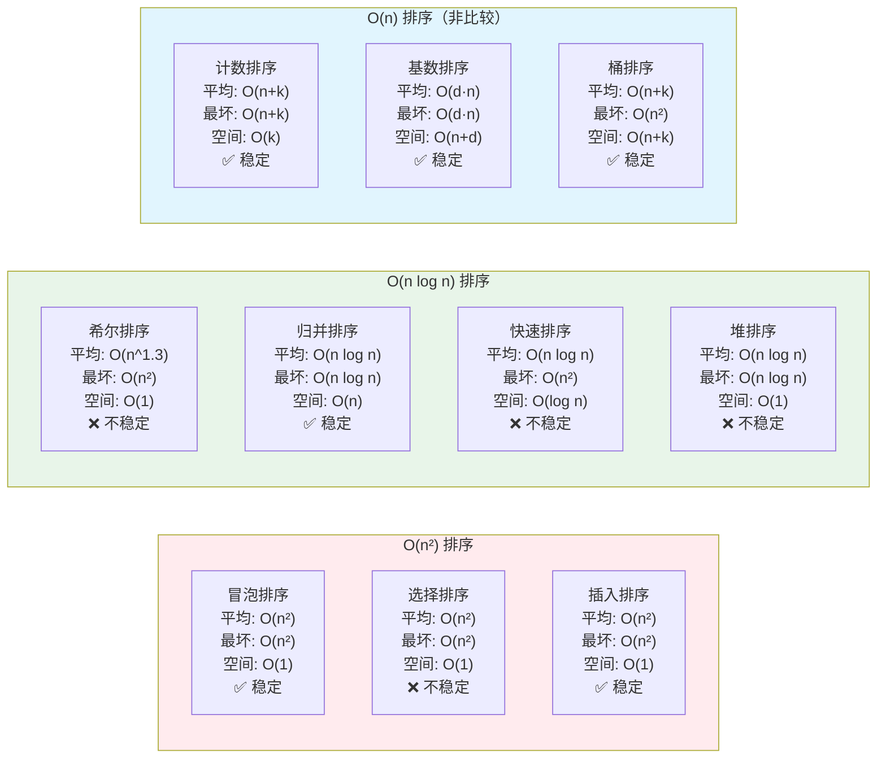
```mermaid
graph LR
    subgraph O_n2["O(n²) 排序"]
        Bubble["冒泡排序<br/>平均: O(n²)<br/>最坏: O(n²)<br/>空间: O(1)<br/>✅ 稳定"]
        Select["选择排序<br/>平均: O(n²)<br/>最坏: O(n²)<br/>空间: O(1)<br/>❌ 不稳定"]
        Insert["插入排序<br/>平均: O(n²)<br/>最坏: O(n²)<br/>空间: O(1)<br/>✅ 稳定"]
    end

    subgraph O_nlogn["O(n log n) 排序"]
        Shell2["希尔排序<br/>平均: O(n^1.3)<br/>最坏: O(n²)<br/>空间: O(1)<br/>❌ 不稳定"]
        Merge2["归并排序<br/>平均: O(n log n)<br/>最坏: O(n log n)<br/>空间: O(n)<br/>✅ 稳定"]
        Quick2["快速排序<br/>平均: O(n log n)<br/>最坏: O(n²)<br/>空间: O(log n)<br/>❌ 不稳定"]
        Heap2["堆排序<br/>平均: O(n log n)<br/>最坏: O(n log n)<br/>空间: O(1)<br/>❌ 不稳定"]
    end

    subgraph O_n["O(n) 排序（非比较）"]
        Counting["计数排序<br/>平均: O(n+k)<br/>最坏: O(n+k)<br/>空间: O(k)<br/>✅ 稳定"]
        Radix2["基数排序<br/>平均: O(d·n)<br/>最坏: O(d·n)<br/>空间: O(n+d)<br/>✅ 稳定"]
        Bucket2["桶排序<br/>平均: O(n+k)<br/>最坏: O(n²)<br/>空间: O(n+k)<br/>✅ 稳定"]
    end

    style O_n2 fill:#ffebee
    style O_nlogn fill:#e8f5e9
    style O_n fill:#e1f5fe
```

---

### 插入排序

#### 概念说明

插入排序的基本思想是将待排序序列分为已排序和未排序两部分，每次从未排序部分取出一个元素，在已排序部分中找到合适的位置插入。项目实现了两种变体：直接插入排序和折半插入排序。

> **源码导航**
>
> | 语言 | 文件 | 关键函数/类 |
> |------|------|------------|
> | C/C++ | [02_sequential_list_sorting.cpp](../../src/sorting/02_sequential_list_sorting.cpp#L19) | `InsertSort` (L19), `ShellSort` (L81) |
> | Python | [L02_insertion_sort.py](../../python/algorithms/sorting/L02_insertion_sort.py#L10) | `insertion_sort` (L10) |

#### 权威参考来源

- 《算法导论》（Introduction to Algorithms, CLRS）第 2 章 "Getting Started"，插入排序作为分治思想的入门示例
- Donald E. Knuth, *The Art of Computer Programming*, Vol.3: Sorting and Searching, 第 5.2.1 节，详细分析了插入排序的比较与移动次数

#### 学习前置知识

- 数组的基本操作
- 顺序查找与折半查找
- 时间复杂度 O 符号表示法

#### 实现原理

- **直接插入排序**：从第 2 个元素开始，依次将每个元素插入到前面已排序序列的正确位置。使用顺序查找确定插入位置，同时后移大于待插入元素的记录。
- **折半插入排序**：在直接插入排序的基础上，利用折半查找确定插入位置，减少比较次数，但移动次数不变。

#### 算法流程图

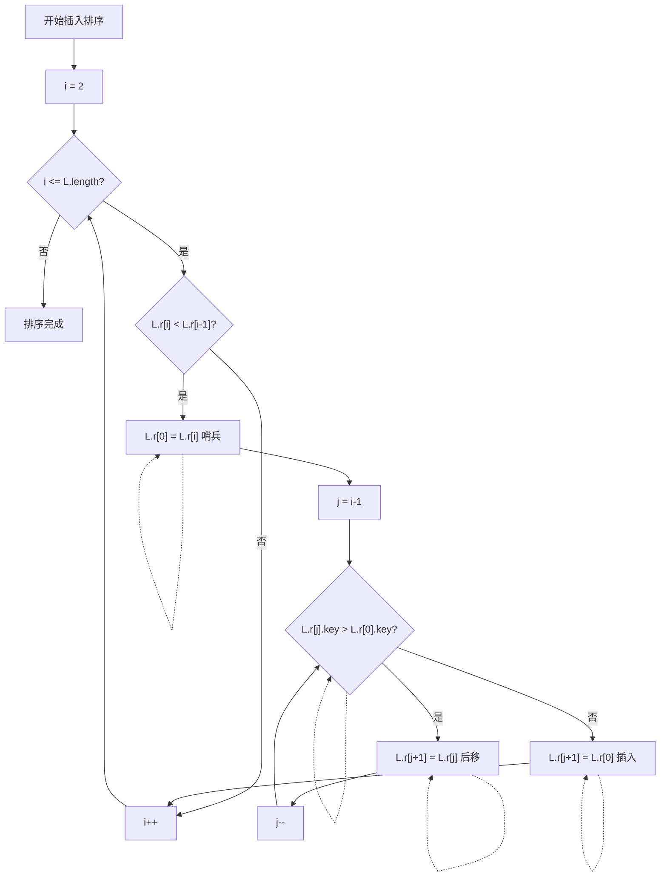
```mermaid
flowchart TD
    A["开始插入排序"] --> B["i = 2"]
    B --> C{"i <= L.length?"}
    C -->|否| D["排序完成"]
    C -->|是| E{"L.r[i] < L.r[i-1]?"}
    E -->|否| F["i++"]
    F --> C
    E -->|是| G["L.r[0] = L.r[i] 哨兵"]
    G --> H["j = i-1"]
    H --> I{"L.r[j].key > L.r[0].key?"}
    I -->|是| J["L.r[j+1] = L.r[j] 后移"]
    J --> K["j--"]
    K --> I
    I -->|否| L["L.r[j+1] = L.r[0] 插入"]
    L --> F

    G -.->|"<!-- src: 02_sequential_list_sorting.cpp#L26 -->"| G
    I -.->|"<!-- src: 02_sequential_list_sorting.cpp#L27 -->"| I
    J -.->|"<!-- src: 02_sequential_list_sorting.cpp#L29 -->"| J
    L -.->|"<!-- src: 02_sequential_list_sorting.cpp#L31 -->"| L
```

#### 核心代码片段

👉 [直接插入排序完整源码](../../src/sorting/02_sequential_list_sorting.cpp)

```cpp
void InsertSort(SqList &L)
{
	int i,j;
	for(i=2;i<=L.length ;i++)
	{
		if(L.r[i].key <L.r[i-1].key )
		{
			L.r[0]=L.r[i];
			for(j=i-1;L.r[j].key >L.r[0].key ;j--)
			{
				L.r[j+1]=L.r[j];
			}
			L.r[j+1]=L.r [0];
		}
	}
}
```

👉 [折半插入排序完整源码](../../src/sorting/02_sequential_list_sorting.cpp)

```cpp
void BInsertSort(SqList &L)
{
	int i,j,low,mid,high;
	for(i=2;i<=L.length ;i++)
	{
		if(L.r[i].key <L.r[i-1].key )
		{
			L.r[0]=L.r[i];
			low=1;
			high=i-1;
			while(low<=high)
			{
				mid=(low+high)/2;
				if(L.r[0].key <L.r[mid].key ) high=mid-1;
				else low=mid+1;
			}
			for(j=i-1 ;j>=high+1;j--)
			{
				L.r [j+1]=L.r[j];
			}
			L.r[high+1]=L.r[0];
		}
	}
}
```

#### 时间/空间复杂度分析

| 指标 | 直接插入排序 | 折半插入排序 |
|------|-------------|-------------|
| 平均时间复杂度 | O(n²) | O(n²) |
| 最坏时间复杂度 | O(n²) | O(n²) |
| 最好时间复杂度 | O(n) | O(n) |
| 空间复杂度 | O(1) | O(1) |
| 稳定性 | 稳定 | 稳定 |

折半插入排序的比较次数为 O(n log n)，但移动次数仍为 O(n²)，因此总体时间复杂度仍为 O(n²)。

#### 与 C++ STL 标准库实现的对比

| 维度 | 本项目实现 | C++ STL |
|------|-----------|---------|
| 算法 | 纯插入排序 | `std::sort` 使用 IntroSort（快排+堆排+插入排序混合），当子数组长度 ≤ 16 时切换到插入排序 |
| 数据结构 | 顺序表（1-indexed，带哨兵 `r[0]`） | 随机访问迭代器（0-indexed） |
| 哨兵机制 | 使用 `r[0]` 作为哨兵，避免内循环越界判断 | 无哨兵，依赖迭代器比较 |
| 适用场景 | 教学演示 | 工程生产：`std::sort` 在小规模子数组上使用插入排序作为优化 |

#### 已知变体和演进

- **二路插入排序**：利用循环缓冲区减少移动次数
- **表插入排序**：使用链表结构，移动次数降为 0，但比较次数不变
- **希尔排序**：插入排序的分组改进版（见下文）
- **库排序（Library Sort）**：GAP 插入排序，在数组中预留空位，时间复杂度 O(n log n)

#### 版本/平台相关注意事项

- 本项目使用 1-indexed 顺序表（`SqList`），`r[0]` 作为哨兵单元，不存储有效数据
- C++ 标准未规定 `std::sort` 的具体算法，但主流实现（GCC libstdc++、LLVM libc++、MSVC STL）均采用 IntroSort
- 插入排序在近乎有序的数据上接近 O(n)，常被用作高级排序的子过程

#### Python 实现

👉 [Python 实现](../../python/algorithms/sorting/L02_insertion_sort.py)

```python
def insertion_sort(arr: list[int]) -> list[int]:
    a = arr[:]
    n = len(a)
    for i in range(1, n):
        if a[i] < a[i - 1]:
            temp = a[i]
            j = i - 1
            while j >= 0 and a[j] > temp:
                a[j + 1] = a[j]
                j -= 1
            a[j + 1] = temp
    return a
```

**与 C/C++ 实现差异**：Python 版本使用 0-indexed 列表和切片复制，无需哨兵单元，函数返回新列表而非原地修改。

---

### 希尔排序

#### 概念说明

希尔排序又称"缩小增量排序"，是直接插入排序的改进版。通过设置增量序列，将序列分成若干子序列分别进行插入排序，随着增量逐步缩小，序列趋于有序，最终增量为 1 时做一次直接插入排序即可。

> **源码导航**
>
> | 语言 | 文件 | 关键函数/类 |
> |------|------|------------|
> | C/C++ | [02_sequential_list_sorting.cpp](../../src/sorting/02_sequential_list_sorting.cpp#L81) | `ShellSort` (L81) |
> | Python | [L02_shell_sort.py](../../python/algorithms/sorting/L02_shell_sort.py#L10) | `shell_sort` (L10) |

#### 权威参考来源

- Donald L. Shell, "A High-Speed Sorting Procedure", *Communications of the ACM*, Vol.2, No.7, 1959
- Knuth, *TAOCP* Vol.3, 第 5.2.1 节，分析了不同增量序列的性能
- Sedgewick, R., "Analysis of Shellsort and Related Algorithms", *ESA*, 1996 — 提出了目前实践中最优的 Sedgewick 增量序列

#### 学习前置知识

- 直接插入排序
- 增量/步长的概念
- 序列渐进有序性

#### 实现原理

1. 选择一个增量序列（本项目使用 {5, 3, 1}）
2. 对每个增量 dk，将序列按 dk 间隔分组，每组内进行插入排序
3. 增量逐步缩小至 1，最终完成排序

#### 算法流程图

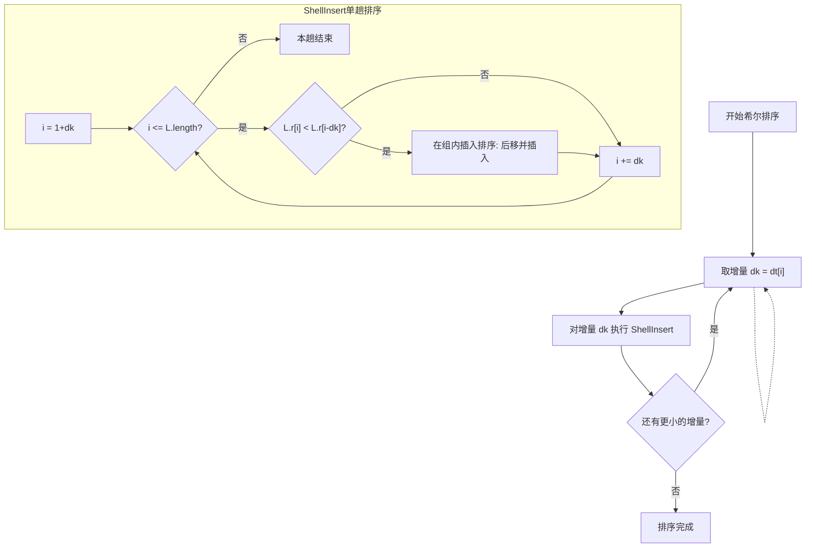
```mermaid
flowchart TD
    A["开始希尔排序"] --> B["取增量 dk = dt[i]"]
    B --> C["对增量 dk 执行 ShellInsert"]
    C --> D{"还有更小的增量?"}
    D -->|是| B
    D -->|否| E["排序完成"]

    B -.->|"<!-- src: 02_sequential_list_sorting.cpp#L84-86 -->"| B

    subgraph ShellInsert单趟排序
        S1["i = 1+dk"]
        S1 --> S2{"i <= L.length?"}
        S2 -->|否| S6["本趟结束"]
        S2 -->|是| S3{"L.r[i] < L.r[i-dk]?"}
        S3 -->|否| S5["i += dk"]
        S3 -->|是| S4["在组内插入排序: 后移并插入"]
        S4 --> S5
        S5 --> S2
    end
```

#### 核心代码片段

👉 [完整源码](../../src/sorting/02_sequential_list_sorting.cpp)

```cpp
void ShellInsert(SqList &L,int dk)
{
	int i,j;
	for(i=1+dk;i<=L.length ;i++)
	{
		if(L.r[i].key <L.r[i-dk].key )
		{
			L.r[0]=L.r[i];
			for(j=i-dk;j>0 && L.r[j].key >L.r [0].key ;j=j-dk)
			{
				L.r[j+dk]=L.r[j];
			}
			L.r[j+dk]=L.r[0];
		}
	}
}

void ShellSort(SqList &L,int dt[],int t)
{
	int i;
	for(i=0;i<t;i++)
	{
		ShellInsert(L,dt[i]);
	}
}
```

#### 时间/空间复杂度分析

| 指标 | 值 |
|------|-----|
| 平均时间复杂度 | O(n^1.3)（依赖增量序列） |
| 最坏时间复杂度 | O(n²)（Shell 原始增量序列） |
| 最好时间复杂度 | O(n) |
| 空间复杂度 | O(1) |
| 稳定性 | 不稳定 |

增量序列对性能影响极大：
- Shell 原始序列 {1,2,4,8,...}：最坏 O(n²)
- Hibbard 序列 {1,3,7,15,...}：最坏 O(n^1.5)
- Sedgewick 序列 {1,5,19,41,109,...}：最坏 O(n^1.33)

#### 与 C++ STL 标准库实现的对比

| 维度 | 本项目实现 | C++ STL |
|------|-----------|---------|
| 算法 | 希尔排序 | `std::sort` 不使用希尔排序，采用 IntroSort |
| 增量序列 | 硬编码 {5,3,1} | 不适用 |
| 实际地位 | 教学演示 | 希尔排序在现代 C++ 标准库中未被采用，因 IntroSort 在最坏情况下更优 |

#### 已知变体和演进

- **Hibbard 增量**：2^k - 1，最坏 O(n^1.5)
- **Sedgewick 增量**：4^k + 3·2^(k-1) + 1，最坏 O(n^1.33)，实践中最优
- **Pratt 增量**：3-smooth 数列，最坏 O(n log²n) 但常数较大
- **Ciura 增量**：经验最优序列 {1,4,10,23,57,132,301,701}，无严格理论证明

#### 版本/平台相关注意事项

- 本项目增量序列为硬编码，实际应用中应根据数据规模动态选择
- 希尔排序不稳定：相同关键字的记录可能因分组不同而改变相对顺序
- C++ 标准库未提供希尔排序接口

#### Python 实现

👉 [Python 实现](../../python/algorithms/sorting/L02_shell_sort.py)

```python
def shell_sort(arr: list[int], gaps: list[int] | None = None) -> list[int]:
    a = arr[:]
    n = len(a)
    if gaps is None:
        gaps = []
        g = n // 2
        while g > 0:
            gaps.append(g)
            g //= 2
    for dk in gaps:
        for i in range(dk, n):
            if a[i] < a[i - dk]:
                temp = a[i]
                j = i - dk
                while j >= 0 and a[j] > temp:
                    a[j + dk] = a[j]
                    j -= dk
                a[j + dk] = temp
    return a
```

**与 C/C++ 实现差异**：Python 版本默认使用 Shell 增量序列（n//2 递减），支持自定义增量序列参数，无需硬编码增量数组。

---

### 冒泡排序

#### 概念说明

冒泡排序通过相邻元素的比较和交换，使较大元素逐渐"冒泡"到序列末端。每趟排序将当前未排序部分的最大元素放到正确位置。

> **源码导航**
>
> | 语言 | 文件 | 关键函数/类 |
> |------|------|------------|
> | C/C++ | [02_sequential_list_sorting.cpp](../../src/sorting/02_sequential_list_sorting.cpp#L91) | `BubbleSort` (L91) |
> | Python | [L02_bubble_sort.py](../../python/algorithms/sorting/L02_bubble_sort.py#L10) | `bubble_sort` (L10) |

#### 权威参考来源

- 《算法导论》第 2 章，练习题 2-2 详细分析了冒泡排序的正确性证明
- Knuth, *TAOCP* Vol.3, 第 5.2.2 节，分析了相邻交换排序

#### 学习前置知识

- 数组的基本操作
- 交换操作
- 不变量与循环不变式的概念

#### 实现原理

1. 从前往后依次比较相邻元素，若逆序则交换
2. 每趟排序后，最大元素到达末端
3. 设置 flag 标志，若某趟无交换则提前结束

#### 算法流程图

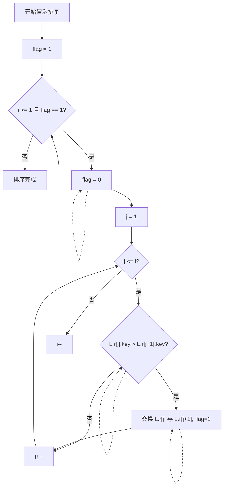
```mermaid
flowchart TD
    A["开始冒泡排序"] --> B["flag = 1"]
    B --> C{"i >= 1 且 flag == 1?"}
    C -->|否| D["排序完成"]
    C -->|是| E["flag = 0"]
    E --> F["j = 1"]
    F --> G{"j <= i?"}
    G -->|是| H{"L.r[j].key > L.r[j+1].key?"}
    H -->|是| I["交换 L.r[j] 与 L.r[j+1], flag=1"]
    H -->|否| J["j++"]
    I --> J
    J --> G
    G -->|否| K["i--"]
    K --> C

    E -.->|"<!-- src: 02_sequential_list_sorting.cpp#L97 -->"| E
    H -.->|"<!-- src: 02_sequential_list_sorting.cpp#L100 -->"| H
    I -.->|"<!-- src: 02_sequential_list_sorting.cpp#L102-105 -->"| I
```

#### 核心代码片段

👉 [完整源码](../../src/sorting/02_sequential_list_sorting.cpp)

```cpp
void BubbleSort(SqList &L)
{
	int i,j,flag=1;
	RedType t;
	for(i=L.length -1;i>=1&&flag;i--)
	{
		flag=0;
		for(j=1;j<=i;j++)
		{
			if(L.r [j].key >L.r[j+1].key )
			{
				flag=1;
				t=L.r [j];
				L.r[j]=L.r[j+1];
				L.r[j+1]=t;
			}
		}
	}
}
```

#### 时间/空间复杂度分析

| 指标 | 值 |
|------|-----|
| 平均时间复杂度 | O(n²) |
| 最坏时间复杂度 | O(n²) |
| 最好时间复杂度 | O(n)（已有序时，flag 优化生效） |
| 空间复杂度 | O(1) |
| 稳定性 | 稳定 |

#### 与 C++ STL 标准库实现的对比

| 维度 | 本项目实现 | C++ STL |
|------|-----------|---------|
| 算法 | 冒泡排序 | `std::sort` 不使用冒泡排序 |
| 交换次数 | O(n²) | IntroSort 交换次数远少于冒泡排序 |
| 实际地位 | 教学演示 | 冒泡排序在实际工程中几乎不被使用，性能远逊于 `std::sort` |

#### 已知变体和演进

- **鸡尾酒排序（Cocktail Sort）**：双向冒泡，交替从左到右和从右到左扫描
- **梳排序（Comb Sort）**：用大于 1 的间距替代相邻比较，类似希尔排序对冒泡的改进
- **奇偶排序（Odd-Even Sort）**：交替比较奇数索引对和偶数索引对，适合并行化

#### 版本/平台相关注意事项

- flag 优化使得对已有序序列只需一趟扫描即可终止
- 冒泡排序的常数因子较大，实际性能在 O(n²) 排序中最差
- C++ 标准库未提供冒泡排序接口

#### Python 实现

👉 [Python 实现](../../python/algorithms/sorting/L02_bubble_sort.py)

```python
def bubble_sort(arr: list[int]) -> list[int]:
    a = arr[:]
    n = len(a)
    for i in range(n - 1):
        swapped = False
        for j in range(n - 1 - i):
            if a[j] > a[j + 1]:
                a[j], a[j + 1] = a[j + 1], a[j]
                swapped = True
        if not swapped:
            break
    return a
```

**与 C/C++ 实现差异**：Python 版本使用元组交换替代三变量交换，0-indexed 列表替代 1-indexed 顺序表。

---

### 快速排序

#### 概念说明

快速排序采用分治策略，选取一个枢轴（pivot）元素，通过一趟划分将序列分为两部分：左边元素均小于枢轴，右边元素均大于等于枢轴，然后递归排序左右子序列。

> **源码导航**
>
> | 语言 | 文件 | 关键函数/类 |
> |------|------|------------|
> | C/C++ | [02_sequential_list_sorting.cpp](../../src/sorting/02_sequential_list_sorting.cpp#L139) | `QuickSort` (L139), `Partition` (L654) |
> | Python | [L02_quick_sort.py](../../python/algorithms/sorting/L02_quick_sort.py#L10) | `_partition` (L10), `quick_sort` (L30) |

#### 权威参考来源

- C.A.R. Hoare, "Quicksort", *The Computer Journal*, Vol.5, No.1, 1962 — 快速排序的原始论文
- 《算法导论》第 7 章 "Quicksort"，详细分析了划分策略与随机化
- David R. Musser, "Introspective Sorting and Selection Algorithms", *Software: Practice and Experience*, 1997 — IntroSort 的提出
- GCC libstdc++ 源码：`std::sort` 使用 IntroSort，递归深度超过 2·log₂n 时切换为堆排序

#### 学习前置知识

- 分治策略
- 递归
- 数组划分（Partition）操作
- 栈空间与递归深度的关系

#### 实现原理

1. 选取第一个元素作为枢轴，保存到 `L.r[0]`
2. 从两端向中间扫描，将比枢轴小的移到低端，比枢轴大的移到高端
3. 枢轴归位，递归处理左右子序列

#### 算法流程图

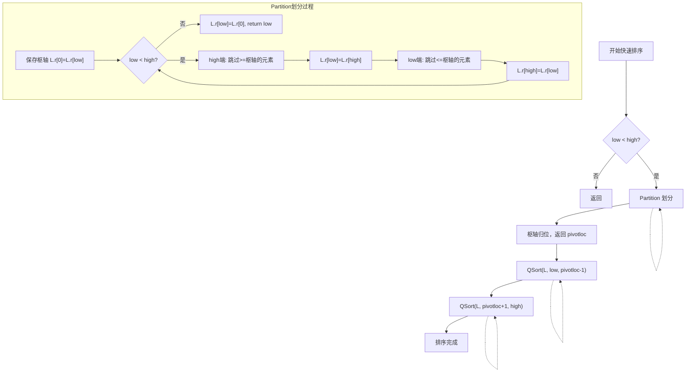
```mermaid
flowchart TD
    A["开始快速排序"] --> B{"low < high?"}
    B -->|否| C["返回"]
    B -->|是| D["Partition 划分"]
    D --> E["枢轴归位，返回 pivotloc"]
    E --> F["QSort(L, low, pivotloc-1)"]
    F --> G["QSort(L, pivotloc+1, high)"]
    G --> H["排序完成"]

    D -.->|"<!-- src: 02_sequential_list_sorting.cpp#L112-125 -->"| D
    F -.->|"<!-- src: 02_sequential_list_sorting.cpp#L133 -->"| F
    G -.->|"<!-- src: 02_sequential_list_sorting.cpp#L134 -->"| G

    subgraph Partition划分过程
        P1["保存枢轴 L.r[0]=L.r[low]"]
        P1 --> P2{"low < high?"}
        P2 -->|否| P6["L.r[low]=L.r[0], return low"]
        P2 -->|是| P3["high端: 跳过>=枢轴的元素"]
        P3 --> P4["L.r[low]=L.r[high]"]
        P4 --> P5["low端: 跳过<=枢轴的元素"]
        P5 --> P7["L.r[high]=L.r[low]"]
        P7 --> P2
    end
```

#### 核心代码片段

👉 [完整源码](../../src/sorting/02_sequential_list_sorting.cpp)

```cpp
int Partition(SqList &L,int low,int high)
{
	L.r[0]=L.r[low];
	int pivotkey=L.r[low].key;
	while(low<high)
	{
		while(low<high&&L.r[high].key>=pivotkey) --high;
		L.r[low]=L.r[high];
		while(low<high&&L.r[low].key<=pivotkey) ++low;
		L.r[high]=L.r[low];
	}
	L.r[low]=L.r[0];
	return low;
}

void QSort(SqList &L,int low,int high)
{
	if(low<high)
	{
		int pivotloc=Partition(L,low,high);
		QSort(L,low,pivotloc-1);
		QSort(L,pivotloc+1,high);
	}
}

void QuickSort(SqList &L)
{
	QSort(L,1,L.length);
}
```

#### 时间/空间复杂度分析

| 指标 | 值 |
|------|-----|
| 平均时间复杂度 | O(n log n) |
| 最坏时间复杂度 | O(n²)（已有序且选首元素为枢轴时） |
| 最好时间复杂度 | O(n log n) |
| 空间复杂度 | O(log n)（递归栈），最坏 O(n) |
| 稳定性 | 不稳定 |

#### 与 C++ STL 标准库实现的对比

| 维度 | 本项目实现 | C++ STL `std::sort` |
|------|-----------|---------------------|
| 算法 | 经典快排（Hoare 划分） | IntroSort（快排+堆排+插入排序混合） |
| 枢轴选择 | 固定选首元素 | 三数取中（median-of-three）或九数取中 |
| 最坏情况保护 | 无，可退化为 O(n²) | 递归深度超过阈值时切换为堆排序，保证 O(n log n) |
| 小数组优化 | 无 | 子数组 ≤ 16 元素时切换为插入排序 |
| 尾递归优化 | 无 | 对较短子序列优先递归，较长子序列尾递归消除 |
| 稳定性 | 不稳定 | 不稳定（`std::stable_sort` 才保证稳定） |

#### 已知变体和演进

- **随机化快速排序**：随机选择枢轴，期望 O(n log n)
- **三数取中快排**：选首、中、尾三元素的中位数作为枢轴
- **IntroSort**（Musser 1997）：快排+堆排+插入排序混合，C++ STL `std::sort` 的实现基础
- **双轴快速排序（Dual-Pivot Quicksort）**：Vladimir Yaroslavskiy 2009 年提出，Java 7+ 的 `Arrays.sort()` 对基本类型使用此算法
- **三路划分快排**：Dijkstra 提出的荷兰国旗问题解法，将序列分为 <、=、> 枢轴三部分，对大量重复元素场景更优

#### 版本/平台相关注意事项

- 本项目实现为经典 Hoare 划分，对已有序序列会退化为 O(n²)
- C++17 引入了 `std::execution` 并行执行策略，`std::sort(std::execution::par, ...)` 可并行排序
- `std::sort` 要求随机访问迭代器，链表排序应使用 `std::list::sort()`（通常为归并排序）
- GCC 与 MSVC 的 `std::sort` 实现细节略有差异，但均保证 O(n log n) 最坏复杂度

#### Python 实现

👉 [Python 实现](../../python/algorithms/sorting/L02_quick_sort.py)

```python
def _partition(arr: list[int], low: int, high: int) -> int:
    mid = (low + high) // 2
    arr[low], arr[mid] = arr[mid], arr[low]
    pivot = arr[low]
    i = low
    for j in range(low + 1, high + 1):
        if arr[j] < pivot:
            i += 1
            arr[i], arr[j] = arr[j], arr[i]
    arr[low], arr[i] = arr[i], arr[low]
    return i

def quick_sort(arr: list[int]) -> list[int]:
    a = arr[:]
    if len(a) <= 1:
        return a
    quick_sort_inplace(a, 0, len(a) - 1)
    return a
```

**与 C/C++ 实现差异**：Python 版本使用三数取中法选择枢轴，采用 Lomuto 分区方案而非 Hoare 双向扫描。

---

### 选择排序

#### 概念说明

选择排序每趟从未排序部分选出最小元素，与未排序部分的第一个元素交换，逐步扩大已排序区间。

> **源码导航**
>
> | 语言 | 文件 | 关键函数/类 |
> |------|------|------------|
> | C/C++ | [02_sequential_list_sorting.cpp](../../src/sorting/02_sequential_list_sorting.cpp#L145) | `SelectSort` (L145) |
> | Python | [L02_selection_sort.py](../../python/algorithms/sorting/L02_selection_sort.py#L10) | `selection_sort` (L10) |

#### 权威参考来源

- 《算法导论》第 2 章，练习题 2.2-2 要求证明选择排序的循环不变式
- Knuth, *TAOCP* Vol.3, 第 5.2.3 节

#### 学习前置知识

- 数组的基本操作
- 最小值查找
- 交换操作

#### 实现原理

1. 第 i 趟排序从 `L.r[i]` 到 `L.r[n]` 中选出关键字最小的记录
2. 将最小记录与第 i 个记录交换
3. 重复 n-1 趟

#### 算法流程图

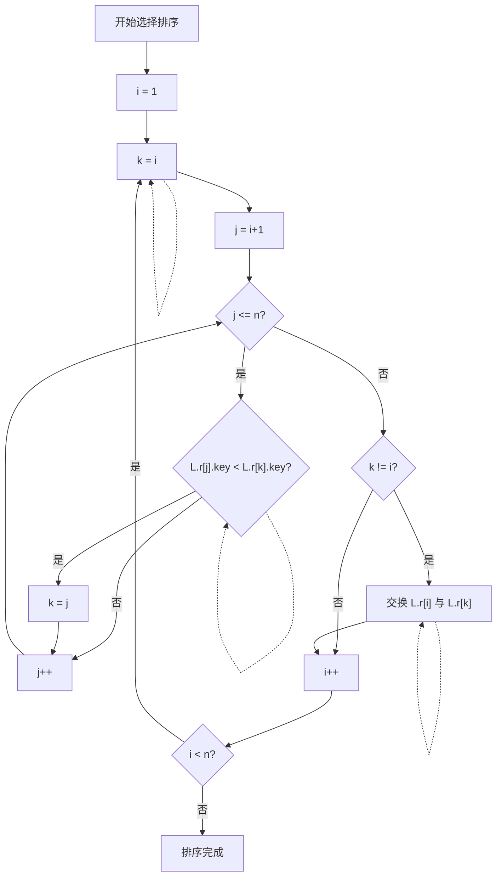
```mermaid
flowchart TD
    A["开始选择排序"] --> B["i = 1"]
    B --> C["k = i"]
    C --> D["j = i+1"]
    D --> E{"j <= n?"}
    E -->|是| F{"L.r[j].key < L.r[k].key?"}
    F -->|是| G["k = j"]
    F -->|否| H["j++"]
    G --> H
    H --> E
    E -->|否| I{"k != i?"}
    I -->|是| J["交换 L.r[i] 与 L.r[k]"]
    I -->|否| K["i++"]
    J --> K
    K --> L{"i < n?"}
    L -->|是| C
    L -->|否| M["排序完成"]

    C -.->|"<!-- src: 02_sequential_list_sorting.cpp#L149 -->"| C
    F -.->|"<!-- src: 02_sequential_list_sorting.cpp#L151 -->"| F
    J -.->|"<!-- src: 02_sequential_list_sorting.cpp#L153 -->"| J
```

#### 核心代码片段

👉 [完整源码](../../src/sorting/02_sequential_list_sorting.cpp)

```cpp
void SelectSort(SqList &L)
{
	for(int i=1;i<L.length;++i)
	{
		int k=i;
		for(int j=i+1;j<=L.length;++j)
			if(L.r[j].key<L.r[k].key) k=j;
		if(k!=i)
			{RedType t=L.r[i];L.r[i]=L.r[k];L.r[k]=t;}
	}
}
```

#### 时间/空间复杂度分析

| 指标 | 值 |
|------|-----|
| 平均时间复杂度 | O(n²) |
| 最坏时间复杂度 | O(n²) |
| 最好时间复杂度 | O(n²)（即使已有序也需完整比较） |
| 空间复杂度 | O(1) |
| 稳定性 | 不稳定 |

选择排序的比较次数恒为 n(n-1)/2，但交换次数最多 n-1 次，在交换代价大的场景中有优势。

#### 与 C++ STL 标准库实现的对比

| 维度 | 本项目实现 | C++ STL |
|------|-----------|---------|
| 算法 | 简单选择排序 | `std::sort` 使用 IntroSort |
| 选择第 k 小 | 需完整排序 | `std::nth_element` 使用 IntroSelect（BFPRT 选择算法的变体），平均 O(n) |
| 部分排序 | 不支持 | `std::partial_sort` 使用堆排序，O(n log k) |

#### 已知变体和演进

- **锦标赛排序（Tournament Sort）**：利用树形结构减少比较次数，O(n log n)
- **堆排序**：选择排序的改进版，使用堆数据结构高效选取最大/最小值
- **BFPRT 选择算法**（Blum-Floyd-Pratt-Rivest-Tarjan, 1973）：最坏 O(n) 的选择算法，`std::nth_element` 的理论基础

#### 版本/平台相关注意事项

- 选择排序不稳定：交换可能改变相同关键字记录的相对顺序（如序列 5,5,2，第一趟交换后两个 5 的顺序改变）
- `std::nth_element` 在 C++17 后支持并行执行策略

#### Python 实现

👉 [Python 实现](../../python/algorithms/sorting/L02_selection_sort.py)

```python
def selection_sort(arr: list[int]) -> list[int]:
    a = arr[:]
    n = len(a)
    for i in range(n - 1):
        k = i
        for j in range(i + 1, n):
            if a[j] < a[k]:
                k = j
        if k != i:
            a[i], a[k] = a[k], a[i]
    return a
```

**与 C/C++ 实现差异**：Python 版本使用 0-indexed 列表和元组交换，无需自定义 RedType 结构体。

---

### 堆排序

#### 概念说明

堆排序利用堆这种数据结构进行排序。将序列建成大根堆后，堆顶元素为最大值，将其与末尾元素交换并缩小堆的范围，再调整堆，重复此过程即可完成排序。

> **源码导航**
>
> | 语言 | 文件 | 关键函数/类 |
> |------|------|------------|
> | C/C++ | [02_sequential_list_sorting.cpp](../../src/sorting/02_sequential_list_sorting.cpp#L179) | `HeapSort` (L179) |
> | Python | [L02_heap_sort.py](../../python/algorithms/sorting/L02_heap_sort.py#L10) | `_sift_down` (L10), `heap_sort` (L24) |

#### 权威参考来源

- J.W.J. Williams, "Algorithm 232: Heapsort", *Communications of the ACM*, 1964 — 堆排序的原始提出
- R.W. Floyd, "Algorithm 245: Treesort 3", *Communications of the ACM*, 1964 — 提出了自底向上的树堆化（heapify）方法，将建堆时间从 O(n log n) 优化到 O(n)
- 《算法导论》第 6 章 "Heapsort"

#### 学习前置知识

- 完全二叉树的性质
- 数组表示完全二叉树（下标关系：父节点 i，左子 2i，右子 2i+1）
- 堆的性质（大根堆/小根堆）

#### 实现原理

1. **建堆**：从最后一个非叶子节点开始，自底向上调用 `HeapAdjust` 将序列建成大根堆
2. **排序**：每次将堆顶（最大值）与堆末元素交换，堆范围减 1，再对堆顶执行下沉调整
3. **调整**：`HeapAdjust` 将以 s 为根的子树调整为大根堆（假设其子树已是大根堆）

#### 算法流程图

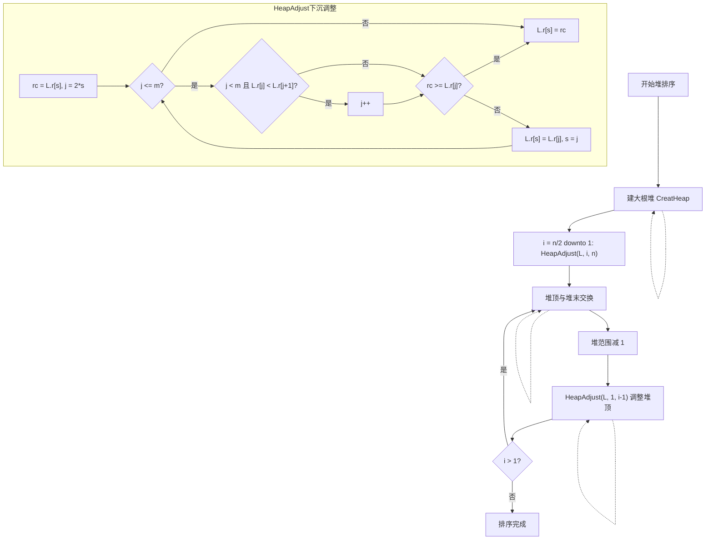
```mermaid
flowchart TD
    A["开始堆排序"] --> B["建大根堆 CreatHeap"]
    B --> C["i = n/2 downto 1: HeapAdjust(L, i, n)"]
    C --> D["堆顶与堆末交换"]
    D --> E["堆范围减 1"]
    E --> F["HeapAdjust(L, 1, i-1) 调整堆顶"]
    F --> G{"i > 1?"}
    G -->|是| D
    G -->|否| H["排序完成"]

    B -.->|"<!-- src: 02_sequential_list_sorting.cpp#L171-176 -->"| B
    D -.->|"<!-- src: 02_sequential_list_sorting.cpp#L184-186 -->"| D
    F -.->|"<!-- src: 02_sequential_list_sorting.cpp#L187 -->"| F

    subgraph HeapAdjust下沉调整
        HA1["rc = L.r[s], j = 2*s"]
        HA1 --> HA2{"j <= m?"}
        HA2 -->|否| HA5["L.r[s] = rc"]
        HA2 -->|是| HA3{"j < m 且 L.r[j] < L.r[j+1]?"}
        HA3 -->|是| HA4["j++"]
        HA3 -->|否| HA6{"rc >= L.r[j]?"}
        HA4 --> HA6
        HA6 -->|是| HA5
        HA6 -->|否| HA7["L.r[s] = L.r[j], s = j"]
        HA7 --> HA2
    end
```

#### 核心代码片段

👉 [完整源码](../../src/sorting/02_sequential_list_sorting.cpp)

```cpp
void HeapAdjust(SqList &L,int s,int m)
{
	RedType rc=L.r[s];
	for(int j=2*s;j<=m;j*=2)
	{
		if(j<m&&L.r[j].key<L.r[j+1].key) ++j;
		if(rc.key>=L.r[j].key) break;
		L.r[s]=L.r[j];s=j;
	}
	L.r[s]=rc;
}

void CreatHeap(SqList &L)
{
	int n=L.length;
	for(int i=n/2;i>0;--i)
		HeapAdjust(L,i,n);
}

void HeapSort(SqList &L)
{
	CreatHeap(L);
	for(int i=L.length;i>1;--i)
	{
		RedType x=L.r[1];
		L.r[1]=L.r[i];
		L.r[i]=x;
		HeapAdjust(L,1,i-1);
	}
}
```

#### 时间/空间复杂度分析

| 指标 | 值 |
|------|-----|
| 建堆时间 | O(n)（Floyd 方法） |
| 平均时间复杂度 | O(n log n) |
| 最坏时间复杂度 | O(n log n) |
| 最好时间复杂度 | O(n log n) |
| 空间复杂度 | O(1) |
| 稳定性 | 不稳定 |

#### 与 C++ STL 标准库实现的对比

| 维度 | 本项目实现 | C++ STL |
|------|-----------|---------|
| 算法 | 堆排序 | `std::sort` 使用 IntroSort（包含堆排序作为退化策略） |
| 堆操作 | 手动实现 | `std::make_heap`、`std::push_heap`、`std::pop_heap`、`std::sort_heap` |
| 部分排序 | 不支持 | `std::partial_sort` 内部使用堆排序，O(n log k) |
| 优先队列 | 不适用 | `std::priority_queue` 底层使用 `std::make_heap` 系列函数 |

#### 已知变体和演进

- **Floyd 建堆法**：自底向上，O(n) 建堆，本项目即采用此法
- **Williams 建堆法**：逐个插入，O(n log n) 建堆
- **Smoothsort**：Edsger Dijkstra 1981 年提出，在已有序数据上接近 O(n)，最坏仍 O(n log n)
- **内省排序（IntroSort）**：快排退化时切换为堆排序，保证 O(n log n) 最坏复杂度

#### 版本/平台相关注意事项

- 本项目使用 1-indexed 数组表示堆，父节点 i 的子节点为 2i 和 2i+1
- C++ STL 的堆操作使用 0-indexed，父节点 i 的子节点为 2i+1 和 2i+2
- `std::priority_queue` 默认为大根堆，小根堆需声明 `std::priority_queue<int, std::vector<int>, std::greater<int>>`
- C++20 新增 `std::make_heap` 等的 constexpr 版本

#### Python 实现

👉 [Python 实现](../../python/algorithms/sorting/L02_heap_sort.py)

```python
def _sift_down(arr: list[int], start: int, end: int) -> None:
    root = start
    while True:
        child = 2 * root + 1
        if child > end:
            break
        if child + 1 <= end and arr[child] < arr[child + 1]:
            child += 1
        if arr[root] >= arr[child]:
            break
        arr[root], arr[child] = arr[child], arr[root]
        root = child

def heap_sort(arr: list[int]) -> list[int]:
    a = arr[:]
    n = len(a)
    if n <= 1:
        return a
    for i in range(n // 2 - 1, -1, -1):
        _sift_down(a, i, n - 1)
    for i in range(n - 1, 0, -1):
        a[0], a[i] = a[i], a[0]
        _sift_down(a, 0, i - 1)
    return a
```

**与 C/C++ 实现差异**：Python 版本使用 0-indexed 数组（子节点为 2i+1 和 2i+2），C++ 版本使用 1-indexed（子节点为 2i 和 2i+1）。

---

### 归并排序

#### 概念说明

归并排序采用分治策略，将序列递归地分成两半分别排序，然后将两个有序子序列归并为一个有序序列。

> **源码导航**
>
> | 语言 | 文件 | 关键函数/类 |
> |------|------|------------|
> | C/C++ | [02_sequential_list_sorting.cpp](../../src/sorting/02_sequential_list_sorting.cpp#L220) | `MergeSort` (L220) |
> | Python | [L02_merge_sort.py](../../python/algorithms/sorting/L02_merge_sort.py#L10) | `_merge` (L10), `merge_sort` (L25) |

#### 权威参考来源

- John von Neumann, 1945 年提出归并排序（据 Knuth 记载）
- 《算法导论》第 2 章 "Getting Started" 与第 4 章 "Divide and Conquer"，归并排序作为分治范例
- Knuth, *TAOCP* Vol.3, 第 5.2.4 节，详细分析了归并排序的各种变体

#### 学习前置知识

- 分治策略
- 递归
- 双指针合并两个有序序列

#### 实现原理

1. **分解**：将序列递归地分为左右两半
2. **求解**：递归排序左右子序列
3. **合并**：将两个有序子序列归并，使用双指针依次比较取较小者

#### 算法流程图

```mermaid
flowchart TD
    A["开始归并排序"] --> B{"序列长度 <= 1?"}
    B -->|是| C["直接返回"]
    B -->|否| D["mid = (low + high) / 2"]
    D --> E["递归排序左半 MSort(R, TR2, low, mid)"]
    E --> F["递归排序右半 MSort(R, TR2, mid+1, high)"]
    F --> G["归并左右子序列 Merge(TR2, T, low, mid, high)"]
    G --> H["排序完成"]

    G -.->|"<!-- src: 02_sequential_list_sorting.cpp#L192-202 -->"| G
    E -.->|"<!-- src: 02_sequential_list_sorting.cpp#L212 -->"| E
    F -.->|"<!-- src: 02_sequential_list_sorting.cpp#L213 -->"| F

    subgraph 归并过程
        G1["i=low, j=mid+1, k=low"]
        G1 --> G2{"i<=mid 且 j<=high?"}
        G2 -->|R[i]<=R[j]| G3["T[k++]=R[i++]"]
        G2 -->|R[i]>R[j]| G4["T[k++]=R[j++]"]
        G3 --> G2
        G4 --> G2
        G2 -->|否| G5["复制剩余元素"]
    end
```

#### 核心代码片段

👉 [完整源码](../../src/sorting/02_sequential_list_sorting.cpp)

```cpp
void Merge(RedType R[],RedType T[],int low,int mid,int high)
{
	int i=low,j=mid+1,k=low;
	while(i<=mid&&j<=high)
	{
		if(R[i].key<=R[j].key) T[k++]=R[i++];
		else T[k++]=R[j++];
	}
	while(i<=mid) T[k++]=R[i++];
	while(j<=high) T[k++]=R[j++];
}

void MSort(RedType R[],RedType T[],int low,int high)
{
	int mid;
	RedType *TR2=new RedType[high-low+1];
	if(low==high) T[low]=R[low];
	else{
		mid=(low+high)/2;
		MSort(R,TR2,low,mid);
		MSort(R,TR2,mid+1,high);
		Merge(TR2,T,low,mid,high);
	}
	delete[] TR2;
}

void MergeSort(SqList &L)
{
	MSort(L.r,L.r,1,L.length);
}
```

#### 时间/空间复杂度分析

| 指标 | 值 |
|------|-----|
| 平均时间复杂度 | O(n log n) |
| 最坏时间复杂度 | O(n log n) |
| 最好时间复杂度 | O(n log n) |
| 空间复杂度 | O(n) |
| 稳定性 | 稳定 |

#### 与 C++ STL 标准库实现的对比

| 维度 | 本项目实现 | C++ STL |
|------|-----------|---------|
| 算法 | 自顶向下递归归并 | `std::stable_sort` 使用归并排序（通常为自底向上迭代版本） |
| 空间保证 | 每层递归分配临时数组 | `std::stable_sort` 保证 O(n) 额外空间 |
| 稳定性 | 稳定 | `std::stable_sort` 保证稳定，`std::sort` 不保证 |
| 链表排序 | 不适用 | `std::list::sort()` 通常实现为归并排序，O(n log n) 且 O(1) 额外空间 |

#### 已知变体和演进

- **自底向上归并排序**：迭代实现，避免递归栈开销
- **自然归并排序**：利用输入中已有的有序子序列，减少归并趟数
- **原地归并排序**：试图将空间复杂度降为 O(1)，但实际实现复杂且常数大
- **多路归并**：K 路归并用于外部排序，使用败者树优化

#### 版本/平台相关注意事项

- 本项目每层递归分配临时数组，实际应用中应预分配一个全局辅助数组
- `std::stable_sort` 在 C++ 标准中要求至少 O(n log n) 时间复杂度，允许 O(n) 额外空间
- C++17 后 `std::stable_sort` 支持并行执行策略

#### Python 实现

👉 [Python 实现](../../python/algorithms/sorting/L02_merge_sort.py)

```python
def _merge(left: list[int], right: list[int]) -> list[int]:
    result = []
    i = j = 0
    while i < len(left) and j < len(right):
        if left[i] <= right[j]:
            result.append(left[i])
            i += 1
        else:
            result.append(right[j])
            j += 1
    result.extend(left[i:])
    result.extend(right[j:])
    return result

def merge_sort(arr: list[int]) -> list[int]:
    if len(arr) <= 1:
        return arr[:]
    mid = len(arr) // 2
    left = merge_sort(arr[:mid])
    right = merge_sort(arr[mid:])
    return _merge(left, right)
```

**与 C/C++ 实现差异**：Python 版本使用列表切片和拼接实现归并，无需手动分配/释放临时数组。

---

### 计数排序

#### 概念说明

计数排序是一种非比较排序算法，通过统计每个元素出现的次数来实现排序。项目实现了两种版本：基本计数排序和稳定计数排序。

> **源码导航**
>
> | 语言 | 文件 | 关键函数/类 |
> |------|------|------------|
> | C/C++ | [02_counting_sort.cpp](../../src/sorting/02_counting_sort.cpp#L6) | `countingSortBasic` (L6) |
> | Python | [L02_counting_sort.py](../../python/algorithms/sorting/L02_counting_sort.py#L10) | `counting_sort` (L10) |

#### 权威参考来源

- 《算法导论》第 8 章 "Sorting in Linear Time"，8.2 节 "Counting Sort"
- 计数排序是基数排序的核心子过程

#### 学习前置知识

- 整数排序的概念
- 前缀和
- 稳定排序的定义

#### 实现原理

- **基本版**：统计每个值的出现次数，然后按次数输出
- **稳定版**：在计数数组上做前缀和，然后从后往前遍历原数组，利用前缀和确定每个元素的最终位置，保证稳定性

#### 算法流程图

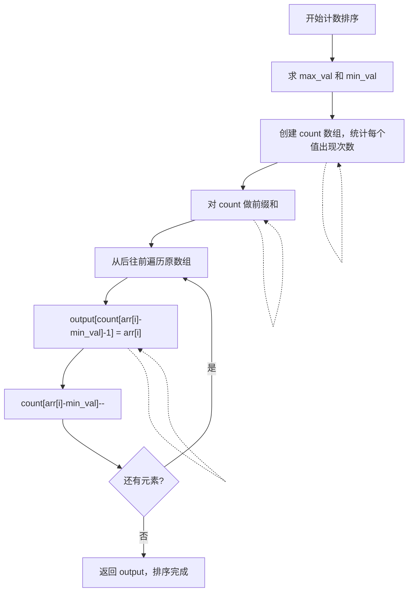
```mermaid
flowchart TD
    A["开始计数排序"] --> B["求 max_val 和 min_val"]
    B --> C["创建 count 数组，统计每个值出现次数"]
    C --> D["对 count 做前缀和"]
    D --> E["从后往前遍历原数组"]
    E --> F["output[count[arr[i]-min_val]-1] = arr[i]"]
    F --> G["count[arr[i]-min_val]--"]
    G --> H{"还有元素?"}
    H -->|是| E
    H -->|否| I["返回 output，排序完成"]

    C -.->|"<!-- src: 02_counting_sort.cpp#L14-16 -->"| C
    D -.->|"<!-- src: 02_counting_sort.cpp#L40-42 -->"| D
    F -.->|"<!-- src: 02_counting_sort.cpp#L45-48 -->"| F
```

#### 核心代码片段

👉 [完整源码](../../src/sorting/02_counting_sort.cpp)

```cpp
vector<int> countingSortStable(const vector<int>& arr) {
    if (arr.empty()) return {};

    int maxVal = *max_element(arr.begin(), arr.end());
    int minVal = *min_element(arr.begin(), arr.end());
    int range = maxVal - minVal + 1;

    vector<int> count(range, 0);
    for (int x : arr) {
        count[x - minVal]++;
    }

    for (int i = 1; i < range; i++) {
        count[i] += count[i - 1];
    }

    vector<int> output(arr.size());
    for (int i = static_cast<int>(arr.size()) - 1; i >= 0; i--) {
        output[count[arr[i] - minVal] - 1] = arr[i];
        count[arr[i] - minVal]--;
    }
    return output;
}
```

#### 时间/空间复杂度分析

| 指标 | 值 |
|------|-----|
| 平均时间复杂度 | O(n+k) |
| 最坏时间复杂度 | O(n+k) |
| 空间复杂度 | O(n+k) |
| 稳定性 | 稳定（稳定版） |

其中 k 为数据范围（maxVal - minVal + 1）。

#### 与 C++ STL 标准库实现的对比

| 维度 | 本项目实现 | C++ STL |
|------|-----------|---------|
| 算法 | 计数排序 | C++ STL 未提供计数排序接口 |
| 适用类型 | 整数 | `std::sort` 适用于任意可比较类型 |
| 数据范围 | 需已知且有限 | `std::sort` 无此限制 |

#### 已知变体和演进

- **带前缀和的稳定计数排序**：本项目稳定版即采用此法
- **作为基数排序的子过程**：按位计数排序
- **分布式计数排序**：适用于多核/分布式环境

#### 版本/平台相关注意事项

- 当 k 远大于 n 时（如排序 {1, 1000000}），计数排序空间浪费严重
- 本项目支持负整数（通过偏移 minVal），部分实现仅支持非负整数
- C++ STL 未提供计数排序，需自行实现或使用第三方库

#### Python 实现

👉 [Python 实现](../../python/algorithms/sorting/L02_counting_sort.py)

```python
def counting_sort(arr: list[int]) -> list[int]:
    if not arr:
        return []
    max_val = max(arr)
    min_val = min(arr)
    range_size = max_val - min_val + 1
    count = [0] * range_size
    for x in arr:
        count[x - min_val] += 1
    for i in range(1, range_size):
        count[i] += count[i - 1]
    output = [0] * len(arr)
    for i in range(len(arr) - 1, -1, -1):
        output[count[arr[i] - min_val] - 1] = arr[i]
        count[arr[i] - min_val] -= 1
    return output
```

**与 C/C++ 实现差异**：Python 版本使用内置 max/min 函数和列表乘法初始化，无需 STL 算法。

---

### 基数排序

#### 概念说明

基数排序按关键字的各位（从低位到高位，LSD 方式）进行排序，每一轮使用稳定的计数排序对某一位进行排序，最终得到有序序列。

> **源码导航**
>
> | 语言 | 文件 | 关键函数/类 |
> |------|------|------------|
> | C/C++ | [02_radix_sort.cpp](../../src/sorting/02_radix_sort.cpp#L6) | `countingSortByDigit` (L6), `radixSort` (L28) |
> | Python | [L02_radix_sort.py](../../python/algorithms/sorting/L02_radix_sort.py#L10) | `_counting_sort_by_digit` (L10), `radix_sort` (L30) |

#### 权威参考来源

- 《算法导论》第 8 章，8.3 节 "Radix Sort"
- H.S. Bright, "Sorting with Large Storage", 1964 — LSD 基数排序的系统化描述

#### 学习前置知识

- 计数排序（作为基数排序的稳定子过程）
- 数字的位表示
- 稳定排序的必要性

#### 实现原理

1. 找出最大值，确定位数 d
2. 从最低位到最高位，对每一位执行计数排序
3. 每轮排序保持前一轮的相对顺序（稳定性保证正确性）

#### 算法流程图

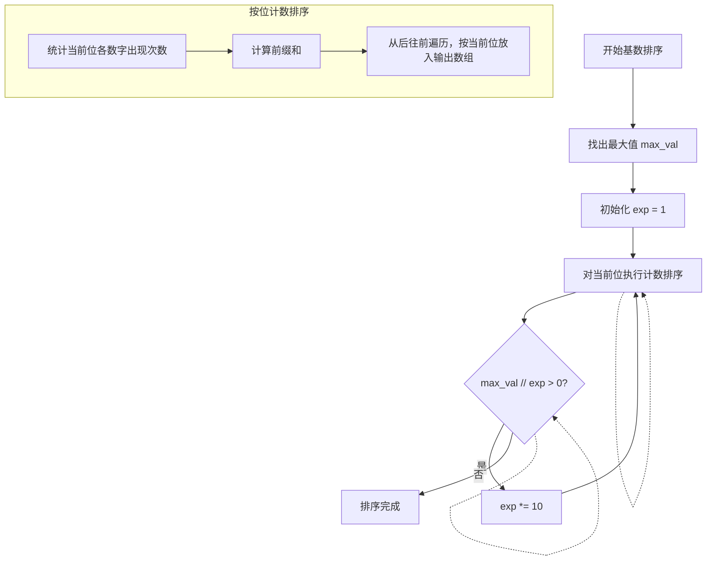
```mermaid
flowchart TD
    A["开始基数排序"] --> B["找出最大值 max_val"]
    B --> C["初始化 exp = 1"]
    C --> D["对当前位执行计数排序"]
    D --> E{"max_val // exp > 0?"}
    E -->|是| F["exp *= 10"]
    F --> D
    E -->|否| G["排序完成"]

    D -.->|"<!-- src: 02_radix_sort.cpp#L6-26 计数排序按位 -->"| D
    E -.->|"<!-- src: 02_radix_sort.cpp#L33-35 -->"| E

    subgraph 按位计数排序
        D1["统计当前位各数字出现次数"]
        D1 --> D2["计算前缀和"]
        D2 --> D3["从后往前遍历，按当前位放入输出数组"]
    end
```

#### 核心代码片段

👉 [完整源码](../../src/sorting/02_radix_sort.cpp)

```cpp
void countingSortByDigit(vector<int>& arr, int exp) {
    int n = static_cast<int>(arr.size());
    vector<int> output(n);
    vector<int> count(10, 0);

    for (int i = 0; i < n; i++) {
        count[(arr[i] / exp) % 10]++;
    }

    for (int i = 1; i < 10; i++) {
        count[i] += count[i - 1];
    }

    for (int i = n - 1; i >= 0; i--) {
        int digit = (arr[i] / exp) % 10;
        output[count[digit] - 1] = arr[i];
        count[digit]--;
    }

    arr = output;
}

void radixSort(vector<int>& arr) {
    if (arr.empty()) return;

    int maxVal = *max_element(arr.begin(), arr.end());

    for (int exp = 1; maxVal / exp > 0; exp *= 10) {
        countingSortByDigit(arr, exp);
    }
}
```

#### 时间/空间复杂度分析

| 指标 | 值 |
|------|-----|
| 平均时间复杂度 | O(d(n+k)) |
| 最坏时间复杂度 | O(d(n+k)) |
| 空间复杂度 | O(n+k) |
| 稳定性 | 稳定 |

其中 d 为最大位数，k 为基数（本项目为 10）。

#### 与 C++ STL 标准库实现的对比

| 维度 | 本项目实现 | C++ STL |
|------|-----------|---------|
| 算法 | LSD 基数排序 | C++ STL 未提供基数排序接口 |
| 基数 | 10（十进制） | 不适用 |
| 适用类型 | 非负整数 | `std::sort` 适用于任意可比较类型 |

#### 已知变体和演进

- **LSD（Least Significant Digit）**：本项目采用，从低位到高位
- **MSD（Most Significant Digit）**：从高位到低位，递归实现，可提前终止
- **基数选择优化**：使用 256 为基数（按字节排序），减少排序趟数
- **原地基数排序**：试图减少空间开销

#### 版本/平台相关注意事项

- 本项目仅支持非负整数，负数需额外处理（如偏移或分离正负）
- 基数选择影响性能：基数越大，趟数越少但每趟空间越大
- C++ STL 未提供基数排序，但部分第三方库（如 Boost）有实现

#### Python 实现

👉 [Python 实现](../../python/algorithms/sorting/L02_radix_sort.py)

```python
def radix_sort(arr: list[int]) -> list[int]:
    if not arr:
        return []
    a = arr[:]
    max_val = max(a)
    exp = 1
    while max_val // exp > 0:
        a = _counting_sort_by_digit(a, exp)
        exp *= 10
    return a
```

**与 C/C++ 实现差异**：Python 版本每轮返回新列表替代原地修改，整体逻辑与 C++ 版本一致。

---

### 桶排序

#### 概念说明

桶排序将数据按范围分到若干个桶中，每个桶内部使用插入排序，最后按桶顺序合并结果。适用于数据均匀分布的场景。

> **源码导航**
>
> | 语言 | 文件 | 关键函数/类 |
> |------|------|------------|
> | C/C++ | [02_bucket_sort.cpp](../../src/sorting/02_bucket_sort.cpp#L18) | `bucketSort` (L18) |
> | Python | [L02_bucket_sort.py](../../python/algorithms/sorting/L02_bucket_sort.py#L10) | `_insertion_sort` (L10), `bucket_sort` (L22) |

#### 权威参考来源

- 《算法导论》第 8 章，8.4 节 "Bucket Sort"
- 桶排序的平均 O(n) 分析基于输入均匀分布的假设

#### 学习前置知识

- 插入排序（桶内排序）
- 哈希映射（元素到桶的映射）
- 概率分析基础

#### 实现原理

1. 创建 n 个桶，每个桶对应一个值域区间
2. 将每个元素按值映射到对应桶中
3. 对每个桶内部使用插入排序
4. 按桶顺序依次输出所有元素

#### 算法流程图

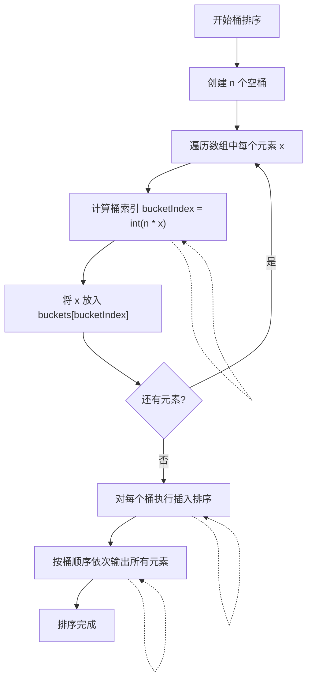
```mermaid
flowchart TD
    A["开始桶排序"] --> B["创建 n 个空桶"]
    B --> C["遍历数组中每个元素 x"]
    C --> D["计算桶索引 bucketIndex = int(n * x)"]
    D --> E["将 x 放入 buckets[bucketIndex]"]
    E --> F{"还有元素?"}
    F -->|是| C
    F -->|否| G["对每个桶执行插入排序"]
    G --> H["按桶顺序依次输出所有元素"]
    H --> I["排序完成"]

    D -.->|"<!-- src: 02_bucket_sort.cpp#L24-27 -->"| D
    G -.->|"<!-- src: 02_bucket_sort.cpp#L30-32 -->"| G
    H -.->|"<!-- src: 02_bucket_sort.cpp#L34-39 -->"| H
```

#### 核心代码片段

👉 [完整源码](../../src/sorting/02_bucket_sort.cpp)

```cpp
void bucketSort(vector<double>& arr) {
    int n = static_cast<int>(arr.size());
    if (n <= 1) return;

    vector<vector<double>> buckets(n);

    for (int i = 0; i < n; i++) {
        int bucketIndex = static_cast<int>(n * arr[i]);
        if (bucketIndex >= n) bucketIndex = n - 1;
        buckets[bucketIndex].push_back(arr[i]);
    }

    for (int i = 0; i < n; i++) {
        insertionSort(buckets[i]);
    }

    int index = 0;
    for (int i = 0; i < n; i++) {
        for (double val : buckets[i]) {
            arr[index++] = val;
        }
    }
}
```

#### 时间/空间复杂度分析

| 指标 | 值 |
|------|-----|
| 平均时间复杂度 | O(n)（数据均匀分布时） |
| 最坏时间复杂度 | O(n²)（所有元素落入同一桶） |
| 空间复杂度 | O(n+k) |
| 稳定性 | 稳定（桶内排序稳定时） |

#### 与 C++ STL 标准库实现的对比

| 维度 | 本项目实现 | C++ STL |
|------|-----------|---------|
| 算法 | 桶排序 | C++ STL 未提供桶排序接口 |
| 数据范围 | [0, 1) 浮点数 | `std::sort` 适用于任意可比较类型 |
| 桶内排序 | 插入排序 | 不适用 |

#### 已知变体和演进

- **桶内排序选择**：桶内元素多时可改用快排或归并排序
- **动态桶数量**：根据数据分布自适应调整桶数量和范围
- **并行桶排序**：各桶独立排序，天然适合并行化

#### 版本/平台相关注意事项

- 本项目假设输入为 [0, 1) 区间的浮点数，其他范围需调整映射函数
- 桶排序的性能高度依赖数据分布，非均匀分布时可能退化为 O(n²)
- C++ STL 未提供桶排序接口

#### Python 实现

👉 [Python 实现](../../python/algorithms/sorting/L02_bucket_sort.py)

```python
def bucket_sort(arr: list[float]) -> list[float]:
    n = len(arr)
    if n <= 1:
        return arr[:]
    buckets: list[list[float]] = [[] for _ in range(n)]
    for x in arr:
        bucket_index = int(n * x)
        if bucket_index >= n:
            bucket_index = n - 1
        buckets[bucket_index].append(x)
    for i in range(n):
        buckets[i] = _insertion_sort(buckets[i])
    result: list[float] = []
    for bucket in buckets:
        result.extend(bucket)
    return result
```

**与 C/C++ 实现差异**：Python 版本使用列表推导创建桶和 extend 合并结果，无需 vector 嵌套。

---

## 搜索算法

### 线性查找

#### 概念说明

线性查找从头到尾逐个比较目标值，是最简单的查找算法。项目实现了普通线性查找和带哨兵的线性查找两种方式。

> **源码导航**
>
> | 语言 | 文件 | 关键函数/类 |
> |------|------|------------|
> | C/C++ | [03_linear_search.cpp](../../src/searching/03_linear_search.cpp#L2) | `linearSearch` (L2), `sentinelLinearSearch` (L16) |
> | Python | [L03_linear_search.py](../../python/algorithms/searching/L03_linear_search.py#L9) | `linear_search` (L9), `sentinel_linear_search` (L16) |

#### 权威参考来源

- 《算法导论》第 2 章，顺序查找作为最基本的查找方法
- 哨兵技术参见《数据结构（C语言版）》（严蔚敏）

#### 学习前置知识

- 数组遍历
- 比较操作

#### 实现原理

- **普通线性查找**：遍历数组，逐个比较
- **哨兵线性查找**：将目标值放在数组末尾作为哨兵，省去每次循环的越界判断

#### 核心代码片段

👉 [完整源码](../../src/searching/03_linear_search.cpp)

```cpp
SearchResult linearSearch(const vector<int>& arr, int target) {
    SearchResult result;
    for (int i = 0; i < static_cast<int>(arr.size()); i++) {
        result.comparisons++;
        if (arr[i] == target) {
            result.found = true;
            result.index = i;
            return result;
        }
    }
    return result;
}
```

#### 时间/空间复杂度分析

| 指标 | 值 |
|------|-----|
| 平均时间复杂度 | O(n) |
| 最坏时间复杂度 | O(n) |
| 最好时间复杂度 | O(1) |
| 空间复杂度 | O(1) |

#### 与 C++ STL 标准库实现的对比

| 维度 | 本项目实现 | C++ STL |
|------|-----------|---------|
| 算法 | 线性查找 | `std::find` 线性查找，`std::find_if` 条件查找 |
| 返回值 | 自定义 SearchResult | `std::find` 返回迭代器 |
| 哨兵优化 | 支持 | STL 不使用哨兵优化 |
| 适用容器 | 随机访问容器 | 所有迭代器类型 |

#### 已知变体和演进

- **哨兵线性查找**：减少循环内条件判断
- **块查找（分块查找）**：将数据分块，块间索引+块内线性查找
- **并行线性查找**：多线程分段查找

#### 版本/平台相关注意事项

- 哨兵查找会修改原数组（临时），不适用于 const 数据
- C++20 引入 `std::ranges::find`，支持范围操作

#### Python 实现

👉 [Python 实现](../../python/algorithms/searching/L03_linear_search.py)

```python
def linear_search(arr: list[int], target: int) -> int:
    for i in range(len(arr)):
        if arr[i] == target:
            return i
    return -1

def sentinel_linear_search(arr: list[int], target: int) -> int:
    n = len(arr)
    if n == 0:
        return -1
    a = arr[:]
    last = a[n - 1]
    a[n - 1] = target
    i = 0
    while a[i] != target:
        i += 1
    a[n - 1] = last
    if i < n - 1 or last == target:
        return i
    return -1
```

**与 C/C++ 实现差异**：Python 版本返回索引（-1 表示未找到），无需自定义 SearchResult 结构体。

---

### 二分查找

#### 概念说明

二分查找在有序数组中通过不断将查找区间减半来定位目标值。项目还实现了 lowerBound、upperBound 以及旋转数组查找等变体。

> **源码导航**
>
> | 语言 | 文件 | 关键函数/类 |
> |------|------|------------|
> | C/C++ | [03_binary_search.cpp](../../src/searching/03_binary_search.cpp#L3) | `binarySearch` (L3), `lowerBound` (L23) |
> | Python | [L03_binary_search.py](../../python/algorithms/searching/L03_binary_search.py#L9) | `binary_search` (L9), `binary_search_left` (L22) |

#### 权威参考来源

- 《算法导论》第 2 章，二分查找作为分治的典型应用
- Jon Bentley, *Programming Pearls*, 第 2 章与第 4 章，详细讨论了二分查找的正确实现与常见错误
- Joshua Bloch, "Extra, Extra - Read All About It: Nearly All Binary Searches and Mergesorts are Broken", 2006 — 指出 `mid = (low + high) / 2` 的整数溢出问题

#### 学习前置知识

- 有序数组
- 区间表示法（闭区间 vs 半开区间）
- 整数溢出

#### 实现原理

1. 设定查找区间 [low, high]
2. 取中间位置 mid = low + (high - low) / 2，避免溢出
3. 比较 arr[mid] 与 target，根据比较结果缩小查找区间
4. 重复直到找到目标或区间为空

#### 算法流程图

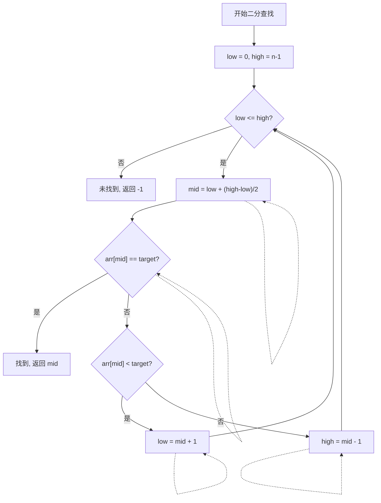
```mermaid
flowchart TD
    A["开始二分查找"] --> B["low = 0, high = n-1"]
    B --> C{"low <= high?"}
    C -->|否| D["未找到, 返回 -1"]
    C -->|是| E["mid = low + (high-low)/2"]
    E --> F{"arr[mid] == target?"}
    F -->|是| G["找到, 返回 mid"]
    F -->|否| H{"arr[mid] < target?"}
    H -->|是| I["low = mid + 1"]
    H -->|否| J["high = mid - 1"]
    I --> C
    J --> C

    E -.->|"<!-- src: 03_binary_search.cpp#L8 -->"| E
    F -.->|"<!-- src: 03_binary_search.cpp#L10 -->"| F
    I -.->|"<!-- src: 03_binary_search.cpp#L15 -->"| I
    J -.->|"<!-- src: 03_binary_search.cpp#L17 -->"| J
```

#### 核心代码片段

👉 [完整源码](../../src/searching/03_binary_search.cpp)

```cpp
SearchResult binarySearch(const vector<int>& arr, int target) {
    SearchResult result;
    int low = 0, high = static_cast<int>(arr.size()) - 1;

    while (low <= high) {
        int mid = low + (high - low) / 2;
        result.comparisons++;
        if (arr[mid] == target) {
            result.found = true;
            result.index = mid;
            return result;
        } else if (arr[mid] < target) {
            low = mid + 1;
        } else {
            high = mid - 1;
        }
    }
    return result;
}
```

#### 时间/空间复杂度分析

| 指标 | 值 |
|------|-----|
| 平均时间复杂度 | O(log n) |
| 最坏时间复杂度 | O(log n) |
| 最好时间复杂度 | O(1) |
| 空间复杂度 | O(1) |

#### 与 C++ STL 标准库实现的对比

| 维度 | 本项目实现 | C++ STL |
|------|-----------|---------|
| 精确查找 | `binarySearch` 返回任意匹配位置 | `std::binary_search` 返回 bool，不返回位置 |
| 下界查找 | 不支持 | `std::lower_bound` 返回第一个 ≥ target 的位置 |
| 上界查找 | 不支持 | `std::upper_bound` 返回第一个 > target 的位置 |
| 区间查找 | 不支持 | `std::equal_range` 返回 [lower_bound, upper_bound) |
| 旋转数组 | 支持 | STL 不提供旋转数组查找 |

#### 已知变体和演进

- **lower_bound / upper_bound**：STL 的核心二分查找接口
- **旋转数组查找**：本项目实现，先判断有序半边再决定搜索方向
- **指数搜索（Exponential Search）**：先指数级扩大范围再二分，适用于无界数组
- **三分查找**：用于单峰函数求极值

#### 版本/平台相关注意事项

- `mid = (low + high) / 2` 在大数组时可能整数溢出，应使用 `mid = low + (high - low) / 2`
- 本项目使用闭区间 [low, high]，STL 使用半开区间 [first, last)
- C++20 引入 `std::ranges::binary_search` 等范围版本

#### Python 实现

👉 [Python 实现](../../python/algorithms/searching/L03_binary_search.py)

```python
def binary_search(arr: list[int], target: int) -> int:
    low, high = 0, len(arr) - 1
    while low <= high:
        mid = low + (high - low) // 2
        if arr[mid] == target:
            return mid
        elif arr[mid] < target:
            low = mid + 1
        else:
            high = mid - 1
    return -1
```

**与 C/C++ 实现差异**：Python 版本返回索引而非 SearchResult 结构体，同时提供了左边界和右边界查找变体。

---

### 插值查找

#### 概念说明

插值查找是二分查找的改进，根据目标值在当前区间的相对位置来估计其索引，而非简单取中点。适用于数据分布均匀的有序数组。

> **源码导航**
>
> | 语言 | 文件 | 关键函数/类 |
> |------|------|------------|
> | C/C++ | [03_interpolation_search.cpp](../../src/searching/03_interpolation_search.cpp#L3) | `interpolationSearch` (L3) |
> | Python | [L03_interpolation_search.py](../../python/algorithms/searching/L03_interpolation_search.py#L9) | `interpolation_search` (L9) |

#### 权威参考来源

- 《算法导论》习题 11.2-6 讨论了插值查找
- Weiss, *Data Structures and Algorithm Analysis in C++*, 第 2.6 节
- Perl, Itai, Avni, "Interpolation Search—A Log Log N Search", *Communications of the ACM*, 1978

#### 学习前置知识

- 二分查找
- 线性插值
- 数据分布的概念

#### 实现原理

插值公式：`pos = low + (target - arr[low]) / (arr[high] - arr[low]) * (high - low)`

当数据均匀分布时，该公式能更精确地估计目标位置，减少比较次数。

#### 核心代码片段

👉 [完整源码](../../src/searching/03_interpolation_search.cpp)

```cpp
SearchResult interpolationSearch(const vector<int>& arr, int target) {
    SearchResult result;
    int low = 0, high = static_cast<int>(arr.size()) - 1;

    while (low <= high && target >= arr[low] && target <= arr[high]) {
        result.comparisons++;
        if (arr[high] == arr[low]) {
            if (arr[low] == target) {
                result.found = true;
                result.index = low;
            }
            return result;
        }

        int pos = low + static_cast<int>(
            (static_cast<double>(target - arr[low]) / (arr[high] - arr[low])) * (high - low)
        );

        if (pos < low) pos = low;
        if (pos > high) pos = high;

        result.comparisons++;
        if (arr[pos] == target) {
            result.found = true;
            result.index = pos;
            return result;
        } else if (arr[pos] < target) {
            low = pos + 1;
        } else {
            high = pos - 1;
        }
    }
    return result;
}
```

#### 时间/空间复杂度分析

| 指标 | 值 |
|------|-----|
| 平均时间复杂度 | O(log log n)（均匀分布时） |
| 最坏时间复杂度 | O(n) |
| 空间复杂度 | O(1) |

#### 与 C++ STL 标准库实现的对比

| 维度 | 本项目实现 | C++ STL |
|------|-----------|---------|
| 算法 | 插值查找 | STL 未提供插值查找 |
| 假设 | 数据均匀分布 | `std::lower_bound` 不假设分布 |
| 实际地位 | 特定场景优化 | STL 二分查找通用性更强 |

#### 已知变体和演进

- **插值-二分混合查找**：先用插值估计，不收敛时切换为二分
- **自适应插值查找**：Andersson 与 Petersson 1995 年提出，O(log log n) 最坏保证

#### 版本/平台相关注意事项

- 插值公式中除法需注意 arr[high] == arr[low] 的边界
- 本项目使用浮点运算计算插值位置，整数运算版本需注意精度
- 对非均匀分布数据（如指数分布），性能可能不如二分查找

#### Python 实现

👉 [Python 实现](../../python/algorithms/searching/L03_interpolation_search.py)

```python
def interpolation_search(arr: list[int], target: int) -> int:
    low, high = 0, len(arr) - 1
    while low <= high and target >= arr[low] and target <= arr[high]:
        if arr[high] == arr[low]:
            if arr[low] == target:
                return low
            return -1
        pos = low + int((target - arr[low]) / (arr[high] - arr[low]) * (high - low))
        if pos < low:
            pos = low
        if pos > high:
            pos = high
        if arr[pos] == target:
            return pos
        elif arr[pos] < target:
            low = pos + 1
        else:
            high = pos - 1
    return -1
```

**与 C/C++ 实现差异**：Python 版本使用浮点除法计算插值位置，无需 static_cast 类型转换。

---

### 斐波那契查找

#### 概念说明

斐波那契查找利用斐波那契数列来分割查找区间，是二分查找的另一种变体。它只使用加减法运算，避免了除法开销。

> **源码导航**
>
> | 语言 | 文件 | 关键函数/类 |
> |------|------|------------|
> | C/C++ | [03_fibonacci_search.cpp](../../src/searching/03_fibonacci_search.cpp#L3) | `fibonacciSearch` (L3) |
> | Python | [L03_fibonacci_search.py](../../python/algorithms/searching/L03_fibonacci_search.py#L9) | `fibonacci_search` (L9) |

#### 权威参考来源

- 《数据结构（C语言版）》（严蔚敏）详细介绍了斐波那契查找
- Fibonacci 查找的分割比例接近黄金分割比 0.618

#### 学习前置知识

- 二分查找
- 斐波那契数列
- 黄金分割比

#### 实现原理

1. 找到大于等于 n 的最小斐波那契数 fibM
2. 用 fibM 的前两个斐波那契数 fib1、fib2 来确定分割点
3. 比较分割点与目标值，根据结果调整斐波那契数和偏移量
4. 重复直到找到目标或区间为空

#### 核心代码片段

👉 [完整源码](../../src/searching/03_fibonacci_search.cpp)

```cpp
SearchResult fibonacciSearch(const vector<int>& arr, int target) {
    SearchResult result;
    int n = static_cast<int>(arr.size());
    if (n == 0) return result;

    int fib2 = 0;
    int fib1 = 1;
    int fibM = fib2 + fib1;

    while (fibM < n) {
        fib2 = fib1;
        fib1 = fibM;
        fibM = fib2 + fib1;
    }

    int offset = -1;

    while (fibM > 1) {
        int i = min(offset + fib2, n - 1);

        result.comparisons++;
        if (arr[i] < target) {
            fibM = fib1;
            fib1 = fib2;
            fib2 = fibM - fib1;
            offset = i;
        } else if (arr[i] > target) {
            result.comparisons++;
            fibM = fib2;
            fib1 = fib1 - fib2;
            fib2 = fibM - fib1;
        } else {
            result.comparisons++;
            result.found = true;
            result.index = i;
            return result;
        }
    }

    if (fib1 == 1 && offset + 1 < n) {
        result.comparisons++;
        if (arr[offset + 1] == target) {
            result.found = true;
            result.index = offset + 1;
        }
    }
    return result;
}
```

#### 时间/空间复杂度分析

| 指标 | 值 |
|------|-----|
| 平均时间复杂度 | O(log n) |
| 最坏时间复杂度 | O(log n) |
| 空间复杂度 | O(1) |

#### 与 C++ STL 标准库实现的对比

| 维度 | 本项目实现 | C++ STL |
|------|-----------|---------|
| 算法 | 斐波那契查找 | STL 未提供斐波那契查找 |
| 运算 | 仅加减法 | `std::lower_bound` 使用除法计算 mid |
| 实际地位 | 教学演示 | 现代处理器上除法开销可忽略，斐波那契查找的实际优势不大 |

#### 已知变体和演进

- **黄金分割搜索**：一维连续函数求极值的类似方法
- **与插值查找结合**：利用斐波那契分割的非对称性适应特定分布

#### 版本/平台相关注意事项

- 斐波那契查找的分割比例约为 0.618:0.382，偏向左侧
- 在现代 CPU 上，加减法与除法的性能差距已很小，斐波那契查找的实际优势有限
- 主要用于教学目的和对除法运算有严格限制的嵌入式环境

#### Python 实现

👉 [Python 实现](../../python/algorithms/searching/L03_fibonacci_search.py)

```python
def fibonacci_search(arr: list[int], target: int) -> int:
    n = len(arr)
    if n == 0:
        return -1
    fib2, fib1 = 0, 1
    fib_m = fib2 + fib1
    while fib_m < n:
        fib2, fib1 = fib1, fib_m
        fib_m = fib2 + fib1
    offset = -1
    while fib_m > 1:
        i = min(offset + fib2, n - 1)
        if arr[i] < target:
            fib_m, fib1, fib2 = fib1, fib2, fib_m - fib1
            offset = i
        elif arr[i] > target:
            fib_m, fib1, fib2 = fib2, fib1 - fib2, fib_m - fib1
        else:
            return i
    if fib1 == 1 and offset + 1 < n and arr[offset + 1] == target:
        return offset + 1
    return -1
```

**与 C/C++ 实现差异**：Python 版本返回索引而非 SearchResult 结构体，使用元组赋值简化斐波那契数更新。

---

## 图算法

### 总览

| 算法 | 时间复杂度 | 空间复杂度 | 适用场景 |
|------|-----------|-----------|---------|
| 拓扑排序（Kahn） | O(V+E) | O(V+E) | DAG 排序、环检测 |
| Dijkstra | O((V+E)logV) | O(V+E) | 单源最短路径（非负权） |
| Bellman-Ford | O(VE) | O(V) | 单源最短路径（含负权边） |
| Floyd-Warshall | O(V³) | O(V²) | 全源最短路径 |
| Kruskal | O(ElogE) | O(V+E) | 最小生成树（稀疏图） |
| Prim | O((V+E)logV) | O(V+E) | 最小生成树（稠密图） |

### 图算法复杂度对比

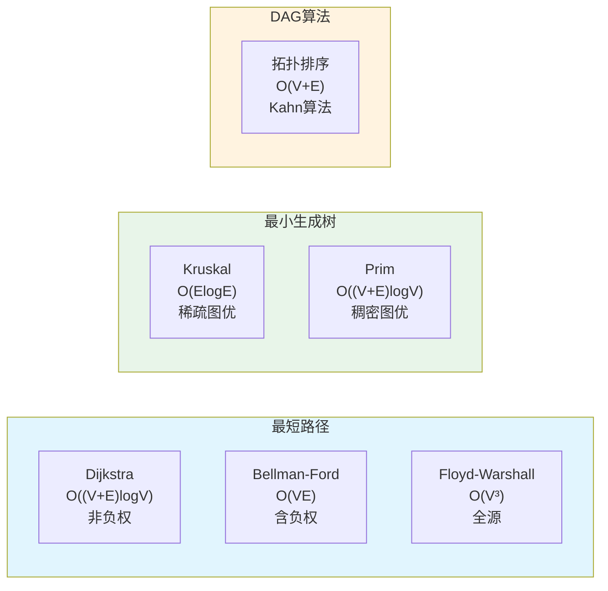
```mermaid
graph LR
    subgraph 最短路径
        Dijk["Dijkstra<br/>O((V+E)logV)<br/>非负权"]
        BF["Bellman-Ford<br/>O(VE)<br/>含负权"]
        FW["Floyd-Warshall<br/>O(V³)<br/>全源"]
    end

    subgraph 最小生成树
        Krus["Kruskal<br/>O(ElogE)<br/>稀疏图优"]
        PrimA["Prim<br/>O((V+E)logV)<br/>稠密图优"]
    end

    subgraph DAG算法
        Topo["拓扑排序<br/>O(V+E)<br/>Kahn算法"]
    end

    style 最短路径 fill:#e1f5fe
    style 最小生成树 fill:#e8f5e9
    style DAG算法 fill:#fff3e0
```

---

### 拓扑排序

#### 概念说明

拓扑排序是对有向无环图（DAG）的顶点进行线性排序，使得对于每条有向边 (u, v)，u 在排序中出现在 v 之前。本项目使用 Kahn 算法（基于入度的 BFS 方法）实现拓扑排序，同时可检测图中是否存在环。

> **源码导航**
>
> | 语言 | 文件 | 关键函数/类 |
> |------|------|------------|
> | C/C++ | [24_topological_sort.cpp](../../src/graph/topological_sort/24_topological_sort.cpp#L4) | `topologicalSort` (L4) |
> | Python | [L24_topological_sort.py](../../python/algorithms/graph/L24_topological_sort.py#L12) | `topological_sort` (L12) |

#### 权威参考来源

- 《算法导论》第 22.4 节 "Topological sort" — 基于DFS的拓扑排序
- Kahn, A. B., "Topological Sorting of Large Networks", *Communications of the ACM*, 1962 — Kahn 算法原始论文

#### 学习前置知识

- 图的基本概念（有向图、入度、出度）
- 广度优先搜索（BFS）
- 队列数据结构

#### 实现原理

Kahn 算法的核心思想是反复选择入度为 0 的顶点输出，并将其从图中删除（即将其所有邻接顶点的入度减 1）。具体步骤：1) 计算所有顶点的入度；2) 将入度为 0 的顶点入队；3) 循环取出队首顶点，加入排序结果，将其所有邻接顶点的入度减 1，若入度变为 0 则入队；4) 若排序结果包含所有顶点则成功，否则图中存在环。

#### 算法流程图

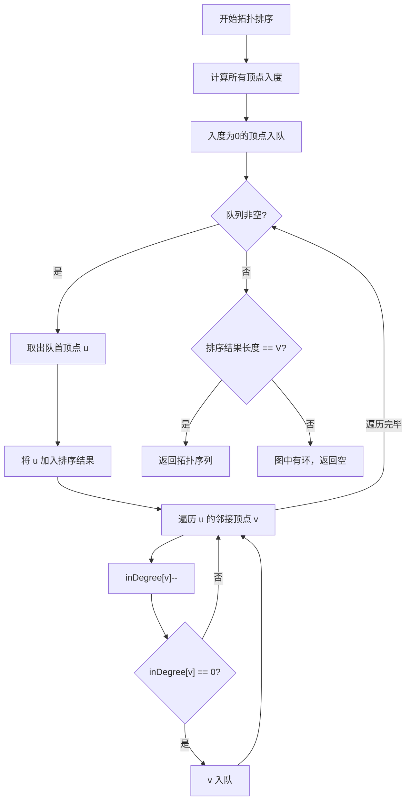
```mermaid
flowchart TD
    A["开始拓扑排序"] --> B["计算所有顶点入度"]
    B --> C["入度为0的顶点入队"]
    C --> D{"队列非空?"}
    D -->|是| E["取出队首顶点 u"]
    E --> F["将 u 加入排序结果"]
    F --> G["遍历 u 的邻接顶点 v"]
    G --> H["inDegree[v]--"]
    H --> I{"inDegree[v] == 0?"}
    I -->|是| J["v 入队"]
    I -->|否| G
    J --> G
    G -->|遍历完毕| D
    D -->|否| K{"排序结果长度 == V?"}
    K -->|是| L["返回拓扑序列"]
    K -->|否| M["图中有环，返回空"]
```

#### 核心代码片段

👉 [完整源码](../../src/graph/topological_sort/24_topological_sort.cpp)

```cpp
std::vector<int> topologicalSort(int n, const std::vector<std::vector<int>>& adj) {
    std::vector<int> inDegree(n, 0);
    for (int u = 0; u < n; ++u) {
        for (int v : adj[u]) {
            ++inDegree[v];
        }
    }

    std::queue<int> q;
    for (int i = 0; i < n; ++i) {
        if (inDegree[i] == 0) {
            q.push(i);
        }
    }

    std::vector<int> order;
    order.reserve(n);
    while (!q.empty()) {
        int u = q.front();
        q.pop();
        order.push_back(u);
        for (int v : adj[u]) {
            if (--inDegree[v] == 0) {
                q.push(v);
            }
        }
    }

    if (static_cast<int>(order.size()) != n) {
        return {};
    }
    return order;
}
```

#### 时间/空间复杂度分析

| 指标 | 值 |
|------|-----|
| 时间复杂度 | O(V+E) |
| 空间复杂度 | O(V+E) |

> 每个顶点和每条边仅被访问一次，因此时间复杂度为 O(V+E)。空间用于存储入度数组和队列。

#### 与 C++ STL 标准库实现的对比

| 维度 | 本项目实现 | C++ STL |
|------|-----------|---------|
| 算法 | Kahn 算法（BFS） | STL 未提供拓扑排序接口 |
| 环检测 | 排序结果不足 V 个则存在环 | 需自行实现 |
| 适用场景 | 教学演示、任务调度 | 工程中需自行实现或使用第三方库 |

#### 已知变体和演进

- **DFS 后序逆序法**：利用 DFS 完成时间的逆序得到拓扑序列
- **字典序最小的拓扑排序**：使用优先队列替代普通队列
- **并行拓扑排序**：多入度为0的顶点可并行处理

#### 版本/平台相关注意事项

- 本项目使用邻接表表示图，`adj[u]` 存储顶点 u 的所有邻接顶点
- 当图存在环时，返回空向量 `{}`
- C++17 结构化绑定 `auto [d, u]` 需要 C++17 标准

#### Python 实现

👉 [Python 实现](../../python/algorithms/graph/L24_topological_sort.py)

```python
def topological_sort(n: int, adj: List[List[int]]) -> List[int]:
    in_degree: List[int] = [0] * n
    for u in range(n):
        for v in adj[u]:
            in_degree[v] += 1

    q: deque[int] = deque()
    for i in range(n):
        if in_degree[i] == 0:
            q.append(i)

    order: List[int] = []
    while q:
        u = q.popleft()
        order.append(u)
        for v in adj[u]:
            in_degree[v] -= 1
            if in_degree[v] == 0:
                q.append(v)

    if len(order) != n:
        return []
    return order
```

**与 C/C++ 实现差异**：Python 版本使用 `collections.deque` 替代 `std::queue`，使用 `float("inf")` 替代 `INT_MAX`，返回空列表 `[]` 表示存在环。

---

### Dijkstra 最短路径

#### 概念说明

Dijkstra 算法求解单源最短路径问题，要求图中所有边权非负。算法采用贪心策略，每次从未确定最短路径的顶点中选择距离最小的顶点，通过该顶点松弛其邻接边。本项目使用最小堆（`std::priority_queue`）优化，时间复杂度为 O((V+E)logV)。

> **源码导航**
>
> | 语言 | 文件 | 关键函数/类 |
> |------|------|------------|
> | C/C++ | [25_dijkstra.cpp](../../src/graph/dijkstra/25_dijkstra.cpp#L6) | `dijkstra` (L6) |
> | Python | [L25_dijkstra.py](../../python/algorithms/graph/L25_dijkstra.py#L12) | `dijkstra` (L12) |

#### 权威参考来源

- Edsger W. Dijkstra, "A Note on Two Problems in Connexion with Graphs", *Numerische Mathematik*, 1959 — Dijkstra 算法原始论文
- 《算法导论》第 24.3 节 "Dijkstra's algorithm"

#### 学习前置知识

- 图的邻接表表示
- 优先队列（最小堆）
- 贪心算法思想
- 松弛操作概念

#### 实现原理

Dijkstra 算法维护一个距离数组 `dist[]`，初始时 `dist[source] = 0`，其余为无穷大。使用最小堆存储 `(距离, 顶点)` 对，每次取出距离最小的顶点 u，若该距离大于 `dist[u]` 则跳过（延迟删除）。否则遍历 u 的所有邻接边 (u, v, w)，若 `dist[u] + w < dist[v]` 则更新 `dist[v]` 并将新距离入堆。算法结束时 `dist[v]` 即为源点到 v 的最短距离。

#### 算法流程图

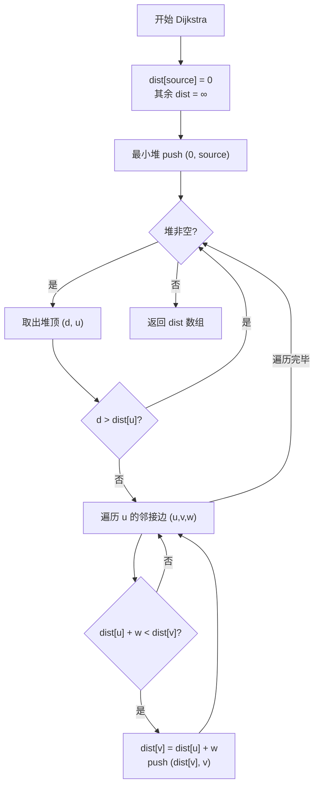
```mermaid
flowchart TD
    A["开始 Dijkstra"] --> B["dist[source] = 0<br/>其余 dist = ∞"]
    B --> C["最小堆 push (0, source)"]
    C --> D{"堆非空?"}
    D -->|是| E["取出堆顶 (d, u)"]
    E --> F{"d > dist[u]?"}
    F -->|是| D
    F -->|否| G["遍历 u 的邻接边 (u,v,w)"]
    G --> H{"dist[u] + w < dist[v]?"}
    H -->|是| I["dist[v] = dist[u] + w<br/>push (dist[v], v)"]
    H -->|否| G
    I --> G
    G -->|遍历完毕| D
    D -->|否| J["返回 dist 数组"]
```

#### 核心代码片段

👉 [完整源码](../../src/graph/dijkstra/25_dijkstra.cpp)

```cpp
std::vector<int> dijkstra(int n, const std::vector<std::vector<std::pair<int,int>>>& adj, int source) {
    std::vector<int> dist(n, INT_MAX);
    dist[source] = 0;

    std::priority_queue<std::pair<int,int>, std::vector<std::pair<int,int>>, std::greater<>> pq;
    pq.push({0, source});

    while (!pq.empty()) {
        auto [d, u] = pq.top();
        pq.pop();

        if (d > dist[u]) {
            continue;
        }

        for (auto [v, w] : adj[u]) {
            if (dist[u] != INT_MAX && dist[u] + w < dist[v]) {
                dist[v] = dist[u] + w;
                pq.push({dist[v], v});
            }
        }
    }

    return dist;
}
```

#### 时间/空间复杂度分析

| 指标 | 值 |
|------|-----|
| 时间复杂度 | O((V+E)logV) |
| 空间复杂度 | O(V+E) |

> 每个顶点最多入堆一次，每次堆操作 O(logV)，共 O(VlogV)；每条边最多触发一次松弛 O(ElogV)，总计 O((V+E)logV)。

#### 与 C++ STL 标准库实现的对比

| 维度 | 本项目实现 | C++ STL |
|------|-----------|---------|
| 算法 | Dijkstra + 最小堆 | STL 未提供图算法接口 |
| 优先队列 | `std::priority_queue` + 延迟删除 | 可用 `std::priority_queue` 或 `std::multiset` |
| 适用场景 | 教学演示、非负权图 | 工程中需自行实现或使用 Boost.Graph |

#### 已知变体和演进

- **朴素 Dijkstra**：O(V²)，不使用优先队列，适合稠密图
- **A* 算法**：Dijkstra + 启发式函数，用于路径规划
- **Dial's Algorithm**：使用桶队列优化，当边权为小整数时可达 O(V+E+W)

#### 版本/平台相关注意事项

- 本项目使用延迟删除（lazy deletion）策略处理优先队列中的过期条目
- `std::greater<>` 使 `priority_queue` 成为最小堆
- 不适用于含负权边的图，需使用 Bellman-Ford 算法
- C++17 结构化绑定需要 C++17 标准

#### Python 实现

👉 [Python 实现](../../python/algorithms/graph/L25_dijkstra.py)

```python
def dijkstra(n: int, adj: List[List[Tuple[int, int]]], source: int = 0) -> List[int]:
    dist: List[int] = [float("inf")] * n
    dist[source] = 0
    pq: List[Tuple[int, int]] = [(0, source)]

    while pq:
        d, u = heapq.heappop(pq)
        if d > dist[u]:
            continue
        for v, w in adj[u]:
            if dist[u] + w < dist[v]:
                dist[v] = dist[u] + w
                heapq.heappush(pq, (dist[v], v))

    return dist
```

**与 C/C++ 实现差异**：Python 版本使用 `heapq` 模块替代 `std::priority_queue`，`float("inf")` 替代 `INT_MAX`，不存在溢出问题。

---

### Bellman-Ford

#### 概念说明

Bellman-Ford 算法求解单源最短路径问题，支持负权边，并可检测负权环。算法通过对所有边进行 V-1 轮松弛操作，确保找到最短路径。若第 V 轮仍有更新，则说明存在负权环。时间复杂度 O(VE)。

> **源码导航**
>
> | 语言 | 文件 | 关键函数/类 |
> |------|------|------------|
> | C/C++ | [26_bellman_ford.cpp](../../src/graph/bellman_ford/26_bellman_ford.cpp#L4) | `bellmanFord` (L4) |
> | Python | [L26_bellman_ford.py](../../python/algorithms/graph/L26_bellman_ford.py#L11) | `bellman_ford` (L11) |

#### 权威参考来源

- 《算法导论》第 24.1 节 "The Bellman-Ford algorithm"
- Bellman, R., "On a Routing Problem", *Quarterly of Applied Mathematics*, 1958
- Ford, L. R., Jr., *Network Flow Theory*, RAND Corporation, 1956

#### 学习前置知识

- 图的边集表示
- 松弛操作
- 负权边与负权环的概念

#### 实现原理

Bellman-Ford 算法对所有边进行 V-1 轮松弛。每轮松弛遍历所有边 (u, v, w)，若 `dist[u] + w < dist[v]` 则更新 `dist[v]`。V-1 轮后，若再遍历所有边仍存在可松弛的边，则图中存在负权环，返回空数组。优化：若某轮无更新则提前终止。

#### 算法流程图

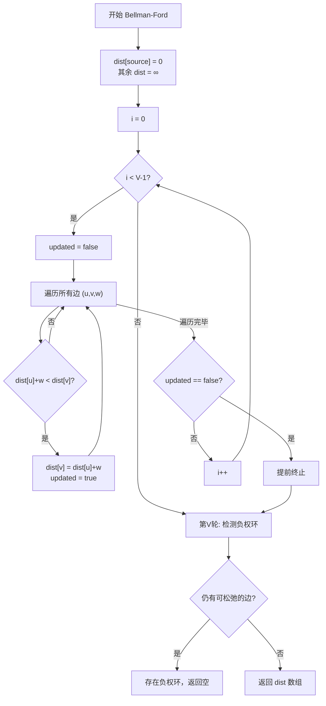
```mermaid
flowchart TD
    A["开始 Bellman-Ford"] --> B["dist[source] = 0<br/>其余 dist = ∞"]
    B --> C["i = 0"]
    C --> D{"i < V-1?"}
    D -->|是| E["updated = false"]
    E --> F["遍历所有边 (u,v,w)"]
    F --> G{"dist[u]+w < dist[v]?"}
    G -->|是| H["dist[v] = dist[u]+w<br/>updated = true"]
    G -->|否| F
    H --> F
    F -->|遍历完毕| I{"updated == false?"}
    I -->|是| J["提前终止"]
    I -->|否| K["i++"]
    K --> D
    D -->|否| L["第V轮: 检测负权环"]
    J --> L
    L --> M{"仍有可松弛的边?"}
    M -->|是| N["存在负权环，返回空"]
    M -->|否| O["返回 dist 数组"]
```

#### 核心代码片段

👉 [完整源码](../../src/graph/bellman_ford/26_bellman_ford.cpp)

```cpp
std::vector<int> bellmanFord(int n, const std::vector<std::tuple<int,int,int>>& edges, int source) {
    std::vector<int> dist(n, INT_MAX);
    dist[source] = 0;

    for (int i = 0; i < n - 1; ++i) {
        bool updated = false;
        for (auto [u, v, w] : edges) {
            if (dist[u] != INT_MAX && dist[u] + w < dist[v]) {
                dist[v] = dist[u] + w;
                updated = true;
            }
        }
        if (!updated) {
            break;
        }
    }

    for (auto [u, v, w] : edges) {
        if (dist[u] != INT_MAX && dist[u] + w < dist[v]) {
            return {};
        }
    }

    return dist;
}
```

#### 时间/空间复杂度分析

| 指标 | 值 |
|------|-----|
| 时间复杂度 | O(VE) |
| 空间复杂度 | O(V) |

> V-1 轮松弛，每轮遍历 E 条边，总计 O(VE)。提前终止优化在无负权边时通常远少于 V-1 轮。

#### 与 C++ STL 标准库实现的对比

| 维度 | 本项目实现 | C++ STL |
|------|-----------|---------|
| 算法 | Bellman-Ford | STL 未提供图算法接口 |
| 负权边 | 支持 | 需自行实现 |
| 负权环检测 | 第V轮检测 | 需自行实现 |

#### 已知变体和演进

- **SPFA（Shortest Path Faster Algorithm）**：使用队列优化，仅松弛可能更新的顶点，平均 O(E)，最坏 O(VE)
- **差分约束系统**：Bellman-Ford 可用于求解差分约束系统
- **Johnson 算法**：利用 Bellman-Ford 重赋权 + Dijkstra 求全源最短路径，O(V²logV + VE)

#### 版本/平台相关注意事项

- 本项目使用边集数组（`vector<tuple>`）表示图，而非邻接表
- 存在负权环时返回空向量 `{}`
- `INT_MAX` 加法可能溢出，代码中通过 `dist[u] != INT_MAX` 前置判断避免
- C++17 结构化绑定需要 C++17 标准

#### Python 实现

👉 [Python 实现](../../python/algorithms/graph/L26_bellman_ford.py)

```python
def bellman_ford(n: int, edges: List[Tuple[int, int, int]], source: int = 0) -> Optional[List[int]]:
    dist: List[int] = [float("inf")] * n
    dist[source] = 0

    for _ in range(n - 1):
        updated = False
        for u, v, w in edges:
            if dist[u] != float("inf") and dist[u] + w < dist[v]:
                dist[v] = dist[u] + w
                updated = True
        if not updated:
            break

    for u, v, w in edges:
        if dist[u] != float("inf") and dist[u] + w < dist[v]:
            return None

    return dist
```

**与 C/C++ 实现差异**：Python 版本使用 `float("inf")` 替代 `INT_MAX`，不存在溢出问题；返回 `None` 表示存在负权环，而非空列表。

---

### Floyd-Warshall

#### 概念说明

Floyd-Warshall 算法求解所有顶点对之间的最短路径问题，支持负权边（但不可有负权环）。算法通过三重循环，逐步考虑每个顶点作为中转点，更新任意两点间的最短距离。时间复杂度 O(V³)，空间复杂度 O(V²)。

> **源码导航**
>
> | 语言 | 文件 | 关键函数/类 |
> |------|------|------------|
> | C/C++ | [27_floyd_warshall.cpp](../../src/graph/floyd_warshall/27_floyd_warshall.cpp#L4) | `floydWarshall` (L4) |
> | Python | [L27_floyd_warshall.py](../../python/algorithms/graph/L27_floyd_warshall.py#L11) | `floyd_warshall` (L11) |

#### 权威参考来源

- 《算法导论》第 25.2 节 "The Floyd-Warshall algorithm"
- Floyd, R. W., "Algorithm 97: Shortest Path", *Communications of the ACM*, 1962
- Warshall, S., "A Theorem on Boolean Matrices", *Journal of the ACM*, 1962

#### 学习前置知识

- 图的邻接矩阵表示
- 动态规划思想
- 矩阵运算

#### 实现原理

Floyd-Warshall 本质是动态规划：`dp[k][i][j]` 表示仅经过顶点 0~k 作为中转时，i 到 j 的最短距离。状态转移：`dp[k][i][j] = min(dp[k-1][i][j], dp[k-1][i][k] + dp[k-1][k][j])`。空间优化后使用二维数组，外层循环枚举中转点 k，内层双重循环枚举顶点对 (i, j)。若对角线出现负值则存在负权环。

#### 算法流程图

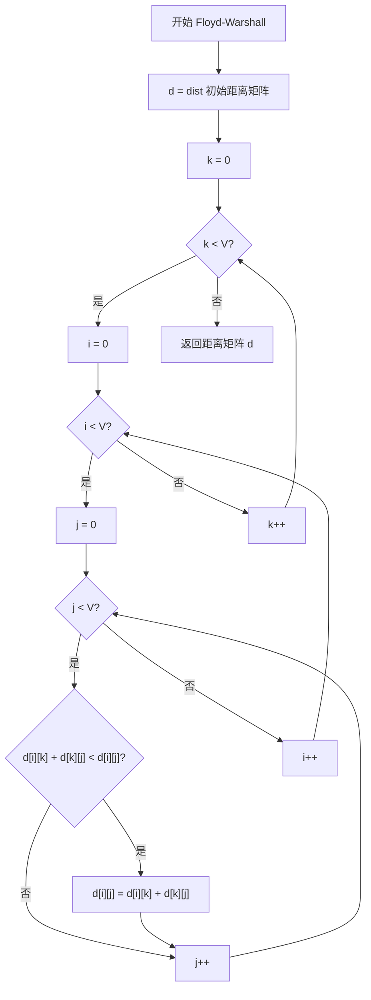
```mermaid
flowchart TD
    A["开始 Floyd-Warshall"] --> B["d = dist 初始距离矩阵"]
    B --> C["k = 0"]
    C --> D{"k < V?"}
    D -->|是| E["i = 0"]
    E --> F{"i < V?"}
    F -->|是| G["j = 0"]
    G --> H{"j < V?"}
    H -->|是| I{"d[i][k] + d[k][j] < d[i][j]?"}
    I -->|是| J["d[i][j] = d[i][k] + d[k][j]"]
    I -->|否| K["j++"]
    J --> K
    K --> H
    H -->|否| L["i++"]
    L --> F
    F -->|否| M["k++"]
    M --> D
    D -->|否| N["返回距离矩阵 d"]
```

#### 核心代码片段

👉 [完整源码](../../src/graph/floyd_warshall/27_floyd_warshall.cpp)

```cpp
std::vector<std::vector<int>> floydWarshall(int n, const std::vector<std::vector<int>>& dist) {
    std::vector<std::vector<int>> d = dist;

    for (int k = 0; k < n; ++k) {
        for (int i = 0; i < n; ++i) {
            for (int j = 0; j < n; ++j) {
                if (d[i][k] < INT_MAX && d[k][j] < INT_MAX) {
                    d[i][j] = std::min(d[i][j], d[i][k] + d[k][j]);
                }
            }
        }
    }

    return d;
}
```

#### 时间/空间复杂度分析

| 指标 | 值 |
|------|-----|
| 时间复杂度 | O(V³) |
| 空间复杂度 | O(V²) |

> 三重循环各 O(V)，总计 O(V³)。空间用于存储 V×V 的距离矩阵。

#### 与 C++ STL 标准库实现的对比

| 维度 | 本项目实现 | C++ STL |
|------|-----------|---------|
| 算法 | Floyd-Warshall | STL 未提供图算法接口 |
| 数据结构 | 二维 vector | 可使用 `std::array` 或原生数组 |
| 适用场景 | 小规模图的全源最短路径 | 工程中需自行实现或使用 Boost.Graph |

#### 已知变体和演进

- **路径重建**：额外维护 `next[i][j]` 数组记录中转点，可输出具体路径
- **负权环检测**：算法结束后检查对角线 `d[i][i] < 0`
- **传递闭包**：将 `min` 和 `+` 替换为 `or` 和 `and`，可求传递闭包（Warshall 算法）
- **并行化**：外层循环 k 不可并行，但内层 (i, j) 可并行处理

#### 版本/平台相关注意事项

- 本项目使用邻接矩阵（二维 `vector`）表示图
- `INT_MAX` 加法溢出：代码中通过 `d[i][k] < INT_MAX && d[k][j] < INT_MAX` 前置判断避免
- V 较大时 O(V³) 时间和 O(V²) 空间可能成为瓶颈，建议 V < 500

#### Python 实现

👉 [Python 实现](../../python/algorithms/graph/L27_floyd_warshall.py)

```python
def floyd_warshall(n: int, dist: List[List[int]]) -> List[List[int]]:
    d = [row[:] for row in dist]

    for k in range(n):
        for i in range(n):
            for j in range(n):
                if d[i][k] + d[k][j] < d[i][j]:
                    d[i][j] = d[i][k] + d[k][j]

    return d
```

**与 C/C++ 实现差异**：Python 版本使用 `float("inf")` 替代 `INT_MAX`，加法不会溢出；使用列表推导 `[row[:] for row in dist]` 深拷贝距离矩阵。

---

### Kruskal 最小生成树

#### 概念说明

Kruskal 算法求解最小生成树问题，从边出发，按权值从小到大排序，逐步加入不构成环的边，直到生成树包含 V-1 条边。使用并查集（Union-Find）检测环，时间复杂度 O(ElogE)，适合稀疏图。

> **源码导航**
>
> | 语言 | 文件 | 关键函数/类 |
> |------|------|------------|
> | C/C++ | [28_kruskal.cpp](../../src/graph/kruskal/28_kruskal.cpp#L41) | `kruskal` (L41), `UnionFind` (L4) |
> | Python | [L28_kruskal.py](../../python/algorithms/graph/L28_kruskal.py#L36) | `kruskal` (L36), `_UnionFind` (L11) |

#### 权威参考来源

- 《算法导论》第 23.2 节 "Kruskal's algorithm"
- Kruskal, J. B., "On the Shortest Spanning Subtree of a Graph and the Traveling Salesman Problem", *Proceedings of the AMS*, 1956

#### 学习前置知识

- 最小生成树概念
- 并查集（路径压缩 + 按秩合并）
- 边排序

#### 实现原理

Kruskal 算法的核心是贪心 + 并查集。1) 将所有边按权值从小到大排序；2) 依次取出每条边 (u, v, w)，若 u 和 v 不在同一连通分量（`find(u) != find(v)`），则将该边加入生成树，并合并 u 和 v 所在的连通分量（`unite(u, v)`）；3) 当已选边数达到 V-1 时算法结束。并查集使用路径压缩和按秩合并，均摊复杂度 O(α(V))。

#### 算法流程图

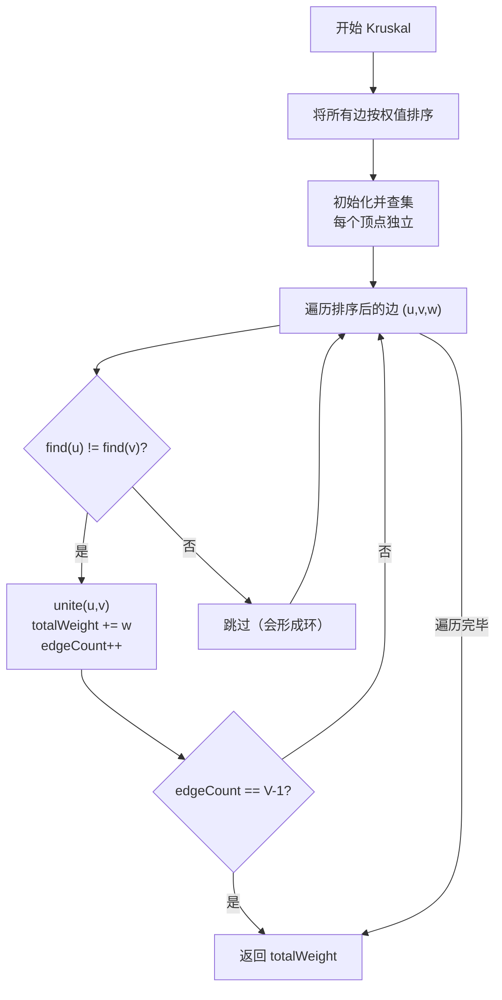
```mermaid
flowchart TD
    A["开始 Kruskal"] --> B["将所有边按权值排序"]
    B --> C["初始化并查集<br/>每个顶点独立"]
    C --> D["遍历排序后的边 (u,v,w)"]
    D --> E{"find(u) != find(v)?"}
    E -->|是| F["unite(u,v)<br/>totalWeight += w<br/>edgeCount++"]
    E -->|否| G["跳过（会形成环）"]
    F --> H{"edgeCount == V-1?"}
    G --> D
    H -->|是| I["返回 totalWeight"]
    H -->|否| D
    D -->|遍历完毕| I
```

#### 核心代码片段

👉 [完整源码](../../src/graph/kruskal/28_kruskal.cpp)

```cpp
int kruskal(int n, const std::vector<std::tuple<int,int,int>>& edges) {
    auto sortedEdges = edges;
    std::sort(sortedEdges.begin(), sortedEdges.end(),
              [](const auto& a, const auto& b) { return std::get<2>(a) < std::get<2>(b); });

    UnionFind uf(n);
    int totalWeight = 0;
    int edgeCount = 0;

    for (auto [u, v, w] : sortedEdges) {
        if (uf.unite(u, v)) {
            totalWeight += w;
            ++edgeCount;
            if (edgeCount == n - 1) {
                break;
            }
        }
    }

    return totalWeight;
}
```

#### 时间/空间复杂度分析

| 指标 | 值 |
|------|-----|
| 时间复杂度 | O(ElogE) |
| 空间复杂度 | O(V+E) |

> 排序 O(ElogE) 是瓶颈，并查集操作均摊 O(α(V)) ≈ O(1)，遍历 O(E)，总计 O(ElogE)。

#### 与 C++ STL 标准库实现的对比

| 维度 | 本项目实现 | C++ STL |
|------|-----------|---------|
| 排序 | `std::sort` | 同 |
| 并查集 | 自定义 `UnionFind` 类 | STL 未提供并查集 |
| 适用场景 | 教学演示、稀疏图 | 工程中需自行实现或使用 Boost.Graph |

#### 已知变体和演进

- **Prim 算法**：从顶点出发扩展，适合稠密图
- **Borůvka 算法**：并行选择每个连通分量的最小边，可并行化
- **次小生成树**：在最小生成树基础上替换一条边得到次小生成树

#### 版本/平台相关注意事项

- 本项目使用边集数组（`vector<tuple>`）表示图
- 并查集使用路径压缩 + 按秩合并，均摊 O(α(V))
- 当图不连通时，返回的是最小生成森林的总权值
- C++17 结构化绑定需要 C++17 标准

#### Python 实现

👉 [Python 实现](../../python/algorithms/graph/L28_kruskal.py)

```python
def kruskal(n: int, edges: List[Tuple[int, int, int]]) -> int:
    sorted_edges = sorted(edges, key=lambda e: e[2])
    uf = _UnionFind(n)
    total_weight = 0
    edge_count = 0

    for u, v, w in sorted_edges:
        if uf.unite(u, v):
            total_weight += w
            edge_count += 1
            if edge_count == n - 1:
                break

    return total_weight
```

**与 C/C++ 实现差异**：Python 版本使用 `sorted()` 替代 `std::sort`，`_UnionFind` 类替代 C++ 的 `UnionFind` 类，逻辑完全一致。

---

### Prim 最小生成树

#### 概念说明

Prim 算法求解最小生成树问题，从顶点出发，逐步将与当前生成树相连的最小权边加入生成树。使用最小堆（`std::priority_queue`）优化，时间复杂度 O((V+E)logV)，适合稠密图。

> **源码导航**
>
> | 语言 | 文件 | 关键函数/类 |
> |------|------|------------|
> | C/C++ | [29_prim.cpp](../../src/graph/prim/29_prim.cpp#L5) | `prim` (L5) |
> | Python | [L29_prim.py](../../python/algorithms/graph/L29_prim.py#L12) | `prim` (L12) |

#### 权威参考来源

- 《算法导论》第 23.2 节 "The algorithms of Kruskal and Prim"
- Prim, R. C., "Shortest Connection Networks and Some Generalizations", *Bell System Technical Journal*, 1957
- Dijkstra 也独立发现了该算法（1959 年）

#### 学习前置知识

- 最小生成树概念
- 优先队列（最小堆）
- 贪心算法思想

#### 实现原理

Prim 算法从起始顶点出发，维护一个 `visited[]` 数组标记已加入生成树的顶点，以及一个最小堆存储与当前生成树相连的边 `(权值, 顶点)`。每次从堆中取出权值最小的边，若对应顶点未访问则将其加入生成树，并将其所有邻接边入堆。重复直到生成树包含 V-1 条边。

#### 算法流程图

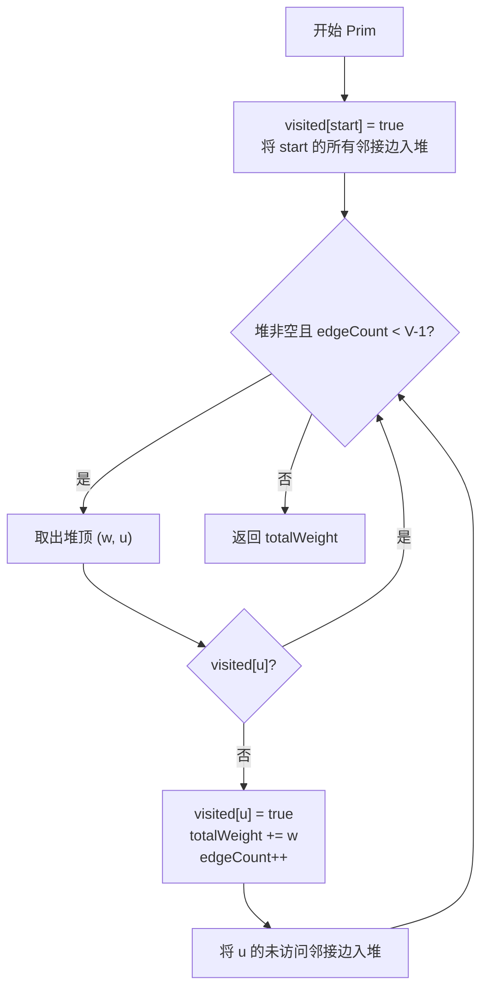
```mermaid
flowchart TD
    A["开始 Prim"] --> B["visited[start] = true<br/>将 start 的所有邻接边入堆"]
    B --> C{"堆非空且 edgeCount < V-1?"}
    C -->|是| D["取出堆顶 (w, u)"]
    D --> E{"visited[u]?"}
    E -->|是| C
    E -->|否| F["visited[u] = true<br/>totalWeight += w<br/>edgeCount++"]
    F --> G["将 u 的未访问邻接边入堆"]
    G --> C
    C -->|否| H["返回 totalWeight"]
```

#### 核心代码片段

👉 [完整源码](../../src/graph/prim/29_prim.cpp)

```cpp
int prim(int n, const std::vector<std::vector<std::pair<int,int>>>& adj, int start) {
    std::vector<bool> visited(n, false);
    std::priority_queue<std::pair<int,int>, std::vector<std::pair<int,int>>, std::greater<>> pq;

    visited[start] = true;
    for (auto [v, w] : adj[start]) {
        pq.push({w, v});
    }

    int totalWeight = 0;
    int edgeCount = 0;

    while (!pq.empty() && edgeCount < n - 1) {
        auto [w, u] = pq.top();
        pq.pop();

        if (visited[u]) {
            continue;
        }

        visited[u] = true;
        totalWeight += w;
        ++edgeCount;

        for (auto [v, weight] : adj[u]) {
            if (!visited[v]) {
                pq.push({weight, v});
            }
        }
    }

    return totalWeight;
}
```

#### 时间/空间复杂度分析

| 指标 | 值 |
|------|-----|
| 时间复杂度 | O((V+E)logV) |
| 空间复杂度 | O(V+E) |

> 每个顶点最多入堆一次 O(VlogV)，每条边最多入堆一次 O(ElogV)，总计 O((V+E)logV)。

#### 与 C++ STL 标准库实现的对比

| 维度 | 本项目实现 | C++ STL |
|------|-----------|---------|
| 算法 | Prim + 最小堆 | STL 未提供图算法接口 |
| 优先队列 | `std::priority_queue` + 延迟删除 | 同 |
| 适用场景 | 教学演示、稠密图 | 工程中需自行实现或使用 Boost.Graph |

#### 已知变体和演进

- **朴素 Prim**：O(V²)，不使用优先队列，适合稠密图（邻接矩阵）
- **Kruskal 算法**：从边出发，适合稀疏图
- **Borůvka 算法**：可并行化的最小生成树算法

#### 版本/平台相关注意事项

- 本项目使用邻接表表示图，`adj[u]` 存储 `(顶点, 权值)` 对
- 使用延迟删除策略处理优先队列中的过期条目
- 当图不连通时，返回的是起始顶点所在连通分量的最小生成树权值
- C++17 结构化绑定需要 C++17 标准

#### Python 实现

👉 [Python 实现](../../python/algorithms/graph/L29_prim.py)

```python
def prim(n: int, adj: List[List[Tuple[int, int]]], start: int = 0) -> int:
    visited: List[bool] = [False] * n
    pq: List[Tuple[int, int]] = []

    visited[start] = True
    for v, w in adj[start]:
        heapq.heappush(pq, (w, v))

    total_weight = 0
    edge_count = 0

    while pq and edge_count < n - 1:
        w, u = heapq.heappop(pq)
        if visited[u]:
            continue
        visited[u] = True
        total_weight += w
        edge_count += 1
        for v, weight in adj[u]:
            if not visited[v]:
                heapq.heappush(pq, (weight, v))

    return total_weight
```

**与 C/C++ 实现差异**：Python 版本使用 `heapq` 模块替代 `std::priority_queue`，逻辑完全一致。

---

## 字符串算法

### 暴力匹配

#### 概念说明

暴力匹配（Brute Force）是最朴素的字符串匹配算法，从主串的每个位置开始，逐个字符与模式串比较。

> **源码导航**
>
> | 语言 | 文件 | 关键函数/类 |
> |------|------|------------|
> | C/C++ | [30_brute_force_match.cpp](../../src/string_algorithm/30_brute_force_match.cpp#L10) | `bruteForceMatch` (L10) |
> | Python | [L30_brute_force.py](../../python/algorithms/string_algorithm/L30_brute_force.py#L12) | `brute_force_search` (L12) |

#### 权威参考来源

- 《算法导论》第 32 章 "String Matching"，暴力匹配作为基准算法
- 所有高级字符串匹配算法均以暴力匹配为起点进行优化

#### 学习前置知识

- 字符串的基本操作
- 双重循环

#### 实现原理

1. 对主串的每个起始位置 i（0 到 n-m），逐个比较模式串字符
2. 若全部匹配则记录位置；若某字符不匹配则 i 后移一位重新开始

#### 核心代码片段

👉 [完整源码](../../src/string_algorithm/30_brute_force_match.cpp)

```cpp
std::vector<MatchResult> bruteForceMatch(const std::string& text, const std::string& pattern) {
    std::vector<MatchResult> results;
    int n = text.length();
    int m = pattern.length();
    int comparisons = 0;

    for (int i = 0; i <= n - m; i++) {
        int j = 0;
        while (j < m) {
            comparisons++;
            if (text[i + j] != pattern[j]) {
                break;
            }
            j++;
        }
        if (j == m) {
            results.push_back({i, comparisons});
        }
    }

    if (results.empty()) {
        results.push_back({-1, comparisons});
    }
    return results;
}
```

#### 时间/空间复杂度分析

| 指标 | 值 |
|------|-----|
| 平均时间复杂度 | O(n+m) |
| 最坏时间复杂度 | O(nm) |
| 空间复杂度 | O(1) |

#### 与 C++ STL 标准库实现的对比

| 维度 | 本项目实现 | C++ STL |
|------|-----------|---------|
| 算法 | 暴力匹配 | `std::string::find` 实现未规定，主流实现使用优化算法 |
| 返回值 | 所有匹配位置 | 第一个匹配位置 |
| 性能 | 最坏 O(nm) | 主流实现通常优于暴力匹配 |

#### 已知变体和演进

- 暴力匹配是所有字符串匹配算法的基准
- KMP、Rabin-Karp、Boyer-Moore 均为暴力匹配的改进

#### 版本/平台相关注意事项

- `std::string::find` 的具体算法由实现决定，C++ 标准未规定
- 暴力匹配在模式串较短时性能尚可，实际差距不大

#### Python 实现

👉 [Python 实现](../../python/algorithms/string_algorithm/L30_brute_force.py)

```python
def brute_force_search(text: str, pattern: str) -> List[int]:
    n = len(text)
    m = len(pattern)
    if m == 0 or m > n:
        return []
    positions: List[int] = []
    for i in range(n - m + 1):
        j = 0
        while j < m and text[i + j] == pattern[j]:
            j += 1
        if j == m:
            positions.append(i)
    return positions
```

**与 C/C++ 实现差异**：Python 版本使用 str 类型替代 std::string，返回所有匹配位置列表。

---

### KMP 算法

#### 概念说明

KMP（Knuth-Morris-Pratt）算法通过预处理模式串构建 next/nextval 数组，在匹配失败时利用已匹配信息跳过不必要的比较，避免主串指针回退。

> **源码导航**
>
> | 语言 | 文件 | 关键函数/类 |
> |------|------|------------|
> | C/C++ | [30_kmp.cpp](../../src/string_algorithm/30_kmp.cpp#L5) | `computeNext` (L5), `computeNextval` (L23), `kmpSearch` (L45) |
> | Python | [L30_kmp.py](../../python/algorithms/string_algorithm/L30_kmp.py#L12) | `compute_next` (L12), `kmp_search` (L28) |

#### 权威参考来源

- Donald E. Knuth, James H. Morris, Jr., Vaughan R. Pratt, "Fast Pattern Matching in Strings", *SIAM Journal on Computing*, Vol.6, No.2, 1977 — KMP 算法的原始论文
- 《算法导论》第 32 章，32.4 节 "The Knuth-Morris-Pratt algorithm"

#### 学习前置知识

- 暴力字符串匹配
- 前缀函数/部分匹配表
- 自动机的概念

#### 实现原理

1. **构建 next 数组**：next[i] 表示模式串前 i 个字符中，前缀与后缀的最长公共长度
2. **构建 nextval 数组**：对 next 数组的优化，当 `pattern[i] == pattern[next[i]]` 时直接跳到 `nextval[next[i]]`
3. **匹配过程**：主串指针不回退，失配时根据 next/nextval 数组调整模式串指针

#### 算法流程图

```mermaid
flowchart TD
    A["开始 KMP"] --> B["构建 next 数组"]
    B --> C["执行 KMP 匹配"]
    C --> D["返回匹配位置"]

    subgraph 构建next数组
        B1["i=0, j=-1, next[0]=-1"]
        B1 --> B2{"i < m-1?"}
        B2 -->|否| B5["返回 next"]
        B2 -->|是| B3{"j==-1 或 pattern[i]==pattern[j]?"}
        B3 -->|是| B4["i++, j++, next[i]=j"]
        B3 -->|否| B6["j = next[j]"]
        B4 --> B2
        B6 --> B3
    end

    subgraph KMP匹配过程
        C1["i=0, j=0"]
        C1 --> C2{"i < n 且 j < m?"}
        C2 -->|否| C5{"j == m?"}
        C2 -->|是| C3{"j==-1 或 text[i]==pattern[j]?"}
        C3 -->|是| C4["i++, j++"]
        C3 -->|否| C6["j = next[j]"]
        C4 --> C2
        C6 --> C2
        C5 -->|是| C7["匹配成功: i-m"]
        C5 -->|否| C8["匹配失败: -1"]
    end

    B -.->|"<!-- src: 30_kmp.cpp#L5-21 -->"| B
    C -.->|"<!-- src: 30_kmp.cpp#L45-63 -->"| C
```

#### 核心代码片段

👉 [完整源码](../../src/string_algorithm/30_kmp.cpp)

```cpp
std::vector<int> computeNext(const std::string& pattern) {
    int m = pattern.length();
    std::vector<int> next(m, 0);
    next[0] = -1;
    int i = 0, j = -1;

    while (i < m - 1) {
        if (j == -1 || pattern[i] == pattern[j]) {
            i++;
            j++;
            next[i] = j;
        } else {
            j = next[j];
        }
    }
    return next;
}

std::vector<int> computeNextval(const std::string& pattern) {
    int m = pattern.length();
    std::vector<int> nextval(m, 0);
    nextval[0] = -1;
    int i = 0, j = -1;

    while (i < m - 1) {
        if (j == -1 || pattern[i] == pattern[j]) {
            i++;
            j++;
            if (pattern[i] != pattern[j]) {
                nextval[i] = j;
            } else {
                nextval[i] = nextval[j];
            }
        } else {
            j = nextval[j];
        }
    }
    return nextval;
}
```

#### 时间/空间复杂度分析

| 指标 | 值 |
|------|-----|
| 预处理时间复杂度 | O(m) |
| 匹配时间复杂度 | O(n) |
| 总时间复杂度 | O(n+m) |
| 空间复杂度 | O(m) |

#### 与 C++ STL 标准库实现的对比

| 维度 | 本项目实现 | C++ STL |
|------|-----------|---------|
| 算法 | KMP | `std::string::find` 不保证使用 KMP |
| 预处理 | next/nextval 数组 | STL 实现可能使用其他算法 |
| 多模式匹配 | 不支持 | 需使用 Aho-Corasick 自动机 |

#### 已知变体和演进

- **nextval 优化**：本项目实现，避免 `pattern[i] == pattern[next[i]]` 时的冗余比较
- **KMP 自动机**：将 next 数组扩展为完整的有限状态自动机
- **Aho-Corasick 算法**（1975）：KMP 的多模式扩展，构建 Trie + 失败指针
- **Z 算法（Z-function）**：另一种 O(n+m) 字符串匹配方法，某些场景下比 KMP 更直观

#### 版本/平台相关注意事项

- next 数组的不同定义方式（0-indexed vs 1-indexed，-1 开头 vs 0 开头）容易导致混淆
- 本项目 next[0] = -1，部分教材使用 next[1] = 0（1-indexed）
- C++ STL 未规定 `std::string::find` 的具体算法

#### Python 实现

👉 [Python 实现](../../python/algorithms/string_algorithm/L30_kmp.py)

```python
def compute_next(pattern: str) -> List[int]:
    m = len(pattern)
    next_arr: List[int] = [-1] * (m + 1)
    i, j = 0, -1
    while i < m:
        if j == -1 or pattern[i] == pattern[j]:
            i += 1
            j += 1
            next_arr[i] = j
        else:
            j = next_arr[j]
    return next_arr

def kmp_search(text: str, pattern: str) -> List[int]:
    next_arr = compute_next(pattern)
    positions: List[int] = []
    i, j = 0, 0
    while i < n:
        if j == -1 or text[i] == pattern[j]:
            i += 1
            j += 1
        else:
            j = next_arr[j]
        if j == m:
            positions.append(i - m)
            j = next_arr[m]
    return positions
```

**与 C/C++ 实现差异**：Python 版本使用 next_arr 替代 next（避免与内置函数冲突），返回所有匹配位置。

---

### Rabin-Karp 算法

#### 概念说明

Rabin-Karp 算法使用哈希函数对模式串和主串的子串进行快速比较，仅当哈希值匹配时才进行逐字符验证。

> **源码导航**
>
> | 语言 | 文件 | 关键函数/类 |
> |------|------|------------|
> | C/C++ | [30_rabin_karp.cpp](../../src/string_algorithm/30_rabin_karp.cpp#L8) | `rabinKarpSearch` (L8) |
> | Python | [L30_rabin_karp.py](../../python/algorithms/string_algorithm/L30_rabin_karp.py#L15) | `rabin_karp_search` (L15) |

#### 权威参考来源

- Richard M. Karp, Michael O. Rabin, "Efficient Randomized Pattern-Matching Algorithms", *IBM Journal of Research and Development*, 1987
- 《算法导论》第 32 章，32.2 节 "The Rabin-Karp algorithm"

#### 学习前置知识

- 哈希函数
- 模运算
- 滚动哈希

#### 实现原理

1. 计算模式串的哈希值和主串第一个窗口的哈希值
2. 滑动窗口时，利用滚动哈希公式 O(1) 更新哈希值
3. 哈希值匹配时进行逐字符验证，避免哈希碰撞导致的误判

#### 核心代码片段

👉 [完整源码](../../src/string_algorithm/30_rabin_karp.cpp)

```cpp
std::vector<int> rabinKarpSearch(const std::string& text, const std::string& pattern) {
    std::vector<int> positions;
    int n = text.length();
    int m = pattern.length();

    if (m > n || m == 0) return positions;

    long long h = 1;
    for (int i = 0; i < m - 1; i++) {
        h = (h * BASE) % MOD;
    }

    long long patternHash = 0;
    long long textHash = 0;
    for (int i = 0; i < m; i++) {
        patternHash = (patternHash * BASE + pattern[i]) % MOD;
        textHash = (textHash * BASE + text[i]) % MOD;
    }

    for (int i = 0; i <= n - m; i++) {
        if (patternHash == textHash) {
            bool match = true;
            for (int j = 0; j < m; j++) {
                if (text[i + j] != pattern[j]) {
                    match = false;
                    break;
                }
            }
            if (match) {
                positions.push_back(i);
            }
        }

        if (i < n - m) {
            textHash = (textHash - text[i] * h % MOD + MOD) % MOD;
            textHash = (textHash * BASE + text[i + m]) % MOD;
        }
    }

    return positions;
}
```

#### 时间/空间复杂度分析

| 指标 | 值 |
|------|-----|
| 平均时间复杂度 | O(n+m) |
| 最坏时间复杂度 | O(nm)（大量哈希碰撞时） |
| 空间复杂度 | O(1) |

#### 与 C++ STL 标准库实现的对比

| 维度 | 本项目实现 | C++ STL |
|------|-----------|---------|
| 算法 | Rabin-Karp | STL 未提供 Rabin-Karp |
| 多模式匹配 | 支持（每个模式串独立计算哈希） | 不支持 |
| 哈希碰撞 | 需二次验证 | 不适用 |

#### 已知变体和演进

- **双哈希/多哈希**：使用多个不同的 BASE 和 MOD 减少碰撞概率
- **滚动哈希类**：本项目 [30_rolling_hash.cpp](../../src/string_algorithm/30_rolling_hash.cpp) 封装了独立的滚动哈希数据结构
- **二维 Rabin-Karp**：用于二维模式匹配
- **Karp-Rabin 指纹**：用于文档相似度检测和去重

#### 版本/平台相关注意事项

- BASE 和 MOD 的选择影响碰撞概率：常用 BASE=256/131，MOD=10^9+7/10^9+9
- 单哈希存在碰撞风险，生产环境建议使用双哈希
- 本项目使用 `long long` 存储哈希值，避免 32 位溢出

#### Python 实现

👉 [Python 实现](../../python/algorithms/string_algorithm/L30_rabin_karp.py)

```python
def rabin_karp_search(text: str, pattern: str) -> List[int]:
    n, m = len(text), len(pattern)
    if m == 0 or m > n:
        return []
    positions: List[int] = []
    h = 1
    for _ in range(m - 1):
        h = (h * BASE) % MOD
    pattern_hash, text_hash = 0, 0
    for i in range(m):
        pattern_hash = (pattern_hash * BASE + ord(pattern[i])) % MOD
        text_hash = (text_hash * BASE + ord(text[i])) % MOD
    for i in range(n - m + 1):
        if pattern_hash == text_hash:
            if text[i:i + m] == pattern:
                positions.append(i)
        if i < n - m:
            text_hash = (text_hash - ord(text[i]) * h % MOD + MOD) % MOD
            text_hash = (text_hash * BASE + ord(text[i + m])) % MOD
    return positions
```

**与 C/C++ 实现差异**：Python 版本使用 ord() 获取字符编码，整数自动处理大数无需 long long。

---

### Boyer-Moore 算法

#### 概念说明

Boyer-Moore 算法从模式串末尾向前匹配，利用坏字符规则跳过不必要的比较。本项目实现了简化版（仅坏字符规则）。

> **源码导航**
>
> | 语言 | 文件 | 关键函数/类 |
> |------|------|------------|
> | C/C++ | [30_boyer_moore.cpp](../../src/string_algorithm/30_boyer_moore.cpp#L8) | `buildBadCharTable` (L8), `boyerMooreSearch` (L19) |
> | Python | [L30_boyer_moore.py](../../python/algorithms/string_algorithm/L30_boyer_moore.py#L14) | `_build_bad_char_table` (L14), `boyer_moore_search` (L21) |

#### 权威参考来源

- Robert S. Boyer, J Strother Moore, "A Fast String Searching Algorithm", *Communications of the ACM*, Vol.20, No.10, 1977 — Boyer-Moore 算法的原始论文
- 《算法导论》第 32 章，练习题中讨论了坏字符规则

#### 学习前置知识

- 暴力字符串匹配
- 从右向左匹配的思想
- 坏字符规则与好后缀规则

#### 实现原理

1. **构建坏字符表**：记录每个字符在模式串中最后出现的位置
2. **从右向左匹配**：模式串与主串对齐后，从模式串末尾开始比较
3. **坏字符规则**：失配时，根据主串中失配字符在模式串中的位置决定滑动距离

#### 核心代码片段

👉 [完整源码](../../src/string_algorithm/30_boyer_moore.cpp)

```cpp
std::vector<int> buildBadCharTable(const std::string& pattern) {
    int m = pattern.length();
    std::vector<int> badChar(ALPHABET_SIZE, -1);

    for (int i = 0; i < m; i++) {
        badChar[(unsigned char)pattern[i]] = i;
    }

    return badChar;
}

std::vector<int> boyerMooreSearch(const std::string& text, const std::string& pattern) {
    std::vector<int> positions;
    int n = text.length();
    int m = pattern.length();

    if (m == 0 || m > n) return positions;

    std::vector<int> badChar = buildBadCharTable(pattern);

    int s = 0;
    while (s <= n - m) {
        int j = m - 1;

        while (j >= 0 && pattern[j] == text[s + j]) {
            j--;
        }

        if (j < 0) {
            positions.push_back(s);
            int shift = (s + m < n) ? m - badChar[(unsigned char)text[s + m]] : 1;
            s += (shift > 0) ? shift : 1;
        } else {
            int shift = j - badChar[(unsigned char)text[s + j]];
            s += (shift > 0) ? shift : 1;
        }
    }

    return positions;
}
```

#### 时间/空间复杂度分析

| 指标 | 值 |
|------|-----|
| 平均时间复杂度 | O(n/m) ~ O(n) |
| 最坏时间复杂度 | O(nm)（仅坏字符规则时） |
| 预处理时间 | O(m + k) |
| 空间复杂度 | O(k) |

其中 k 为字符集大小。完整 Boyer-Moore（含好后缀规则）最坏 O(n)。

#### 与 C++ STL 标准库实现的对比

| 维度 | 本项目实现 | C++ STL |
|------|-----------|---------|
| 算法 | 简化 Boyer-Moore（仅坏字符） | `std::string::find` 实现未规定 |
| 完整性 | 仅坏字符规则 | 不适用 |
| 实际地位 | 教学演示 | 完整 BM 算法是实际工程中应用最广泛的字符串匹配算法之一 |

#### 已知变体和演进

- **Boyer-Moore-Horspool**（1980）：简化版 BM，仅使用坏字符规则中最后一个字符，实现更简单
- **Boyer-Moore-Horspool-Sunday**（1990）：Sunday 算法，利用匹配窗口后一个字符的信息
- **完整 Boyer-Moore**：加入好后缀规则，最坏 O(n)
- **Aho-Corasick**：多模式匹配场景的替代方案

#### 版本/平台相关注意事项

- 本项目仅实现坏字符规则，最坏情况为 O(nm)
- 坏字符表大小为字符集大小（本项目 ALPHABET_SIZE），ASCII 场景为 256
- 完整 BM 算法的好后缀规则实现复杂，实际中 Horspool 简化版更常用
- `std::string::find` 在 GCC libstdc++ 中通常使用简化版 BM 或 KMP

#### Python 实现

👉 [Python 实现](../../python/algorithms/string_algorithm/L30_boyer_moore.py)

```python
def boyer_moore_search(text: str, pattern: str) -> List[int]:
    n, m = len(text), len(pattern)
    if m == 0 or m > n:
        return []
    bad_char = _build_bad_char_table(pattern)
    positions: List[int] = []
    s = 0
    while s <= n - m:
        j = m - 1
        while j >= 0 and pattern[j] == text[s + j]:
            j -= 1
        if j < 0:
            positions.append(s)
            shift = m - bad_char[ord(text[s + m])] if s + m < n else 1
            s += shift if shift > 0 else 1
        else:
            shift = j - bad_char[ord(text[s + j])]
            s += shift if shift > 0 else 1
    return positions
```

**与 C/C++ 实现差异**：Python 版本使用 ord() 索引坏字符表，无需 unsigned char 强制转换。

---

### 滚动哈希

#### 概念说明

滚动哈希（Rolling Hash）允许在 O(1) 时间内计算滑动窗口的哈希值，是 Rabin-Karp 算法的核心数据结构。

> **源码导航**
>
> | 语言 | 文件 | 关键函数/类 |
> |------|------|------------|
> | C/C++ | [30_rolling_hash.cpp](../../src/string_algorithm/30_rolling_hash.cpp#L9) | `RollingHash` (L9), `computeHash` (L18) |
> | Python | 暂未实现 | — |

#### 权威参考来源

- Karp, Rabin (1987)，滚动哈希作为 Rabin-Karp 算法的核心组件
- 多项式滚动哈希是应用最广泛的滚动哈希方案

#### 学习前置知识

- 哈希函数
- 模运算
- 多项式求值

#### 实现原理

1. 使用多项式哈希：`H = s[0]*BASE^(m-1) + s[1]*BASE^(m-2) + ... + s[m-1]`
2. 滑动窗口时：`H' = (H - s[out]*BASE^(m-1)) * BASE + s[in]`
3. 所有运算对 MOD 取模，防止溢出

#### 核心代码片段

👉 [完整源码](../../src/string_algorithm/30_rolling_hash.cpp)

```cpp
class RollingHash {
private:
    long long hash;
    long long power;
    int windowSize;

public:
    RollingHash() : hash(0), power(1), windowSize(0) {}

    long long computeHash(const std::string& s) {
        int n = s.length();
        hash = 0;
        power = 1;
        windowSize = n;

        for (int i = 0; i < n; i++) {
            hash = (hash * BASE + s[i]) % MOD;
            if (i < n - 1) {
                power = (power * BASE) % MOD;
            }
        }
        return hash;
    }

    long long roll(char outChar, char inChar) {
        hash = (hash - outChar * power % MOD + MOD) % MOD;
        hash = (hash * BASE + inChar) % MOD;
        return hash;
    }

    long long getHash() const { return hash; }
    int getWindowSize() const { return windowSize; }
};
```

#### 时间/空间复杂度分析

| 指标 | 值 |
|------|-----|
| 初始化时间复杂度 | O(m) |
| 滚动更新时间复杂度 | O(1) |
| 空间复杂度 | O(1) |

#### 与 C++ STL 标准库实现的对比

| 维度 | 本项目实现 | C++ STL |
|------|-----------|---------|
| 算法 | 多项式滚动哈希 | STL 未提供滚动哈希接口 |
| 封装 | 独立类 | 不适用 |

#### 已知变体和演进

- **多项式滚动哈希**：本项目实现，最常用
- **Cyclic Polynomial Hash（Buzhash）**：使用循环移位代替乘法，速度更快
- **Rabin Fingerprint**：不可逆哈希，用于增量哈希计算

#### 版本/平台相关注意事项

- BASE 和 MOD 的选择至关重要：BASE 应大于字符集大小，MOD 应为大素数
- 常用参数：BASE=131/256，MOD=10^9+7/10^9+9
- 减法后加 MOD 防止负数：`(hash - x % MOD + MOD) % MOD`

---

### Z 算法（扩展 KMP）

#### 概念说明

Z 算法通过计算 Z 数组实现 O(n) 的字符串预处理和 O(n+m) 的模式匹配。Z 数组定义：Z[i] 表示字符串 S 从位置 i 开始的后缀与 S 本身的最长公共前缀长度。Z 算法是 KMP 算法的替代方案，在某些场景下比 KMP 更直观，且同样支持 O(n+m) 的模式匹配。

> **源码导航**
>
> | 语言 | 文件 | 关键函数/类 |
> |------|------|------------|
> | C/C++ | [30_z_algorithm.cpp](../../src/string_algorithm/30_z_algorithm.cpp#L5) | `zFunction` (L5), `zSearch` (L25) |
> | Python | [L30_z_algorithm.py](../../python/algorithms/string_algorithm/L30_z_algorithm.py#L13) | `z_function` (L13), `z_search` (L30) |

#### 权威参考来源

- Dan Gusfield, *Algorithms on Strings, Trees and Sequences*, Cambridge University Press, 1997 — Z 算法的系统阐述
- 《算法导论》第 32 章字符串匹配 — Z 算法与 KMP 的对比

#### 学习前置知识

- KMP 算法（对比理解）
- 字符串前缀与后缀的概念
- 滑动窗口思想

#### 实现原理

Z 算法的核心是维护一个 Z-box [l, r]，表示当前已知的最右匹配区间。对于位置 i：若 i < r，则 Z[i] 至少为 min(r - i, Z[i - l])（利用已知信息避免重复比较）；然后尝试向右扩展 Z[i]。若 i + Z[i] > r，则更新 l = i, r = i + Z[i]。模式匹配时，将模式串与文本串拼接为 `pattern + "$" + text`，Z 数组中值为 m 的位置即为匹配点。

#### 算法流程图

```mermaid
flowchart TD
    A["开始 Z 算法"] --> B["计算 Z 数组"]
    B --> C["执行模式匹配"]
    C --> D["返回匹配位置"]

    subgraph 计算Z数组
        B1["Z[0] = n, l = 0, r = 0"]
        B1 --> B2{"i < n?"}
        B2 -->|是| B3{"i < r?"}
        B3 -->|是| B4["Z[i] = min(r-i, Z[i-l])"]
        B3 -->|否| B5["Z[i] = 0"]
        B4 --> B6{"扩展: s[Z[i]] == s[i+Z[i]]?"}
        B5 --> B6
        B6 -->|是| B7["Z[i]++"]
        B7 --> B6
        B6 -->|否| B8{"i+Z[i] > r?"}
        B8 -->|是| B9["l = i, r = i+Z[i]"]
        B8 -->|否| B10["i++"]
        B9 --> B10
        B10 --> B2
        B2 -->|否| B11["返回 Z 数组"]
    end

    subgraph 模式匹配
        C1["combined = pattern + '$' + text"]
        C1 --> C2["计算 combined 的 Z 数组"]
        C2 --> C3{"遍历 Z 数组"}
        C3 --> C4{"Z[i] == m?"}
        C4 -->|是| C5["记录匹配位置 i-m-1"]
        C4 -->|否| C3
        C5 --> C3
    end
```

#### 核心代码片段

👉 [完整源码](../../src/string_algorithm/30_z_algorithm.cpp)

```cpp
std::vector<int> zFunction(const std::string& s) {
    int n = s.length();
    std::vector<int> z(n, 0);
    z[0] = n;
    int l = 0, r = 0;
    for (int i = 1; i < n; i++) {
        if (i < r) {
            z[i] = std::min(r - i, z[i - l]);
        }
        while (i + z[i] < n && s[z[i]] == s[i + z[i]]) {
            z[i]++;
        }
        if (i + z[i] > r) {
            l = i;
            r = i + z[i];
        }
    }
    return z;
}

std::vector<int> zSearch(const std::string& text, const std::string& pattern) {
    std::string combined = pattern + "$" + text;
    std::vector<int> z = zFunction(combined);
    std::vector<int> matches;
    int m = pattern.length();
    for (int i = m + 1; i < (int)z.size(); i++) {
        if (z[i] == m) {
            matches.push_back(i - m - 1);
        }
    }
    return matches;
}
```

#### 时间/空间复杂度分析

| 指标 | 值 |
|------|-----|
| Z 数组计算 | O(n) |
| 模式匹配 | O(n + m) |
| 空间复杂度 | O(n + m) |

> Z 算法中 r 指针只增不减，因此总比较次数不超过 2n，时间复杂度为 O(n)。

#### 与 C++ STL 标准库实现的对比

| 维度 | 本项目实现 | C++ STL |
|------|-----------|---------|
| 算法 | Z 算法 | `std::string::find` 不保证使用 Z 算法 |
| 预处理 | Z 数组 | STL 实现可能使用其他算法 |
| 与 KMP 对比 | 同样 O(n+m)，但更直观 | KMP 的 next 数组更常用 |

#### 已知变体和演进

- **Z 算法 vs KMP**：两者时间复杂度相同，Z 算法的 Z 数组含义更直观（最长公共前缀），KMP 的 next 数组含义为最长真前后缀
- **扩展 KMP**：Z 算法也被称为"扩展 KMP"，因为它同时计算模式串与文本串每个位置的最长公共前缀

#### 版本/平台相关注意事项

- Z 数组的 Z[0] 定义有两种：一种定义为 n（字符串长度），另一种定义为 0。本项目采用 Z[0] = n
- 拼接字符串的分隔符 `$` 应确保不出现在模式串和文本串中

#### Python 实现

👉 [Python 实现](../../python/algorithms/string_algorithm/L30_z_algorithm.py)

```python
def z_function(s: str) -> List[int]:
    n = len(s)
    z: List[int] = [0] * n
    z[0] = n
    l = 0
    r = 0
    for i in range(1, n):
        if i < r:
            z[i] = min(r - i, z[i - l])
        while i + z[i] < n and s[z[i]] == s[i + z[i]]:
            z[i] += 1
        if i + z[i] > r:
            l = i
            r = i + z[i]
    return z

def z_search(text: str, pattern: str) -> List[int]:
    combined = pattern + "$" + text
    z = z_function(combined)
    m = len(pattern)
    return [i - m - 1 for i in range(m + 1, len(z)) if z[i] == m]
```

**与 C/C++ 实现差异**：Python 版本使用 `z_function` 和 `z_search` 函数式风格，`z_search` 使用列表推导式简化匹配位置收集。

---

### Manacher 算法

#### 概念说明

Manacher 算法用于在线性时间内找到字符串中的最长回文子串。通过在字符间插入特殊字符统一奇偶长度处理，并利用已计算的回文半径加速后续计算。

> **源码导航**
>
> | 语言 | 文件 | 关键函数/类 |
> |------|------|------------|
> | C/C++ | [30_manacher.cpp](../../src/string_algorithm/30_manacher.cpp#L14) | `manacher` (L14) |
> | Python | [L30_manacher.py](../../python/algorithms/string_algorithm/L30_manacher.py#L10) | `_preprocess` (L10), `manacher` (L17) |

#### 权威参考来源

- Glenn K. Manacher, "A New Linear-Time 'On-Line' Algorithm for Finding the Smallest Initial Palindrome of a String", *Journal of the ACM*, 1975
- 《算法导论》未收录此算法，但它是回文问题的标准解法

#### 学习前置知识

- 回文的定义
- 中心扩展法求回文
- 对称性利用

#### 实现原理

1. **预处理**：在字符间插入 `#`，统一奇偶长度回文处理
2. **维护右边界**：记录当前最右回文边界 right 及其中心 center
3. **利用对称性**：若当前位置在 right 内，利用镜像位置加速计算
4. **中心扩展**：在加速基础上继续尝试扩展回文半径

#### 核心代码片段

👉 [完整源码](../../src/string_algorithm/30_manacher.cpp)

```cpp
std::vector<int> manacher(const std::string& s) {
    std::string t = "#";
    for (char c : s) {
        t += c;
        t += '#';
    }
    int n = t.length();
    std::vector<int> p(n, 0);

    int center = 0, right = 0;

    for (int i = 0; i < n; i++) {
        if (i < right) {
            int mirror = 2 * center - i;
            p[i] = std::min(right - i, p[mirror]);
        }

        while (i - p[i] - 1 >= 0 && i + p[i] + 1 < n && t[i - p[i] - 1] == t[i + p[i] + 1]) {
            p[i]++;
        }

        if (i + p[i] > right) {
            center = i;
            right = i + p[i];
        }
    }

    return p;
}
```

#### 时间/空间复杂度分析

| 指标 | 值 |
|------|-----|
| 时间复杂度 | O(n) |
| 空间复杂度 | O(n) |

#### 与 C++ STL 标准库实现的对比

| 维度 | 本项目实现 | C++ STL |
|------|-----------|---------|
| 算法 | Manacher | STL 未提供回文查找接口 |
| 功能 | 最长回文子串 | 需自行实现 |

#### 已知变体和演进

- **中心扩展法**：O(n²) 暴力，Manacher 的前身
- **回文树（Eertree/Palindromic Tree）**：Golubev 2013 年提出，可统计所有不同回文子串
- **回文自动机**：与回文树等价，支持在线构造

#### 版本/平台相关注意事项

- 预处理字符串长度为 2n+1，空间开销翻倍
- p[i] 数组存储的是预处理串中的回文半径，原串回文长度 = p[i]
- 分隔符 `#` 的选择需保证不在原字符集中出现

#### Python 实现

👉 [Python 实现](../../python/algorithms/string_algorithm/L30_manacher.py)

```python
def manacher(s: str) -> str:
    if not s:
        return ""
    t = _preprocess(s)
    n = len(t)
    p: list[int] = [0] * n
    center, right = 0, 0
    for i in range(n):
        if i < right:
            mirror = 2 * center - i
            p[i] = min(right - i, p[mirror])
        while i - p[i] - 1 >= 0 and i + p[i] + 1 < n and t[i - p[i] - 1] == t[i + p[i] + 1]:
            p[i] += 1
        if i + p[i] > right:
            center, right = i, i + p[i]
    ...
    return s[start:start + max_len]
```

**与 C/C++ 实现差异**：Python 版本直接返回最长回文子串而非半径数组，使用字符串切片提取结果。

---

### 最长公共子序列 (LCS)

#### 概念说明

最长公共子序列（LCS）问题求两个字符串的最长公共子序列的长度和内容。子序列不要求连续，但要求保持相对顺序。

> **源码导航**
>
> | 语言 | 文件 | 关键函数/类 |
> |------|------|------------|
> | C/C++ | [30_lcs.cpp](../../src/string_algorithm/30_lcs.cpp#L6) | `LCSResult` (L6), `longestCommonSubsequence` (L11) |
> | Python | [L30_lcs.py](../../python/algorithms/string_algorithm/L30_lcs.py#L10) | `lcs_length` (L10), `lcs_string` (L25) |

#### 权威参考来源

- 《算法导论》第 15 章 "Dynamic Programming"，15.4 节 "Longest common subsequence"
- LCS 是动态规划的经典问题之一

#### 学习前置知识

- 动态规划基础
- 二维 DP 表的填写
- 回溯构造解

#### 实现原理

1. 定义 `dp[i][j]` 为 s1 前 i 个字符与 s2 前 j 个字符的 LCS 长度
2. 转移方程：若 `s1[i-1] == s2[j-1]`，则 `dp[i][j] = dp[i-1][j-1] + 1`；否则 `dp[i][j] = max(dp[i-1][j], dp[i][j-1])`
3. 回溯构造 LCS 字符串

#### 算法流程图

```mermaid
flowchart TD
    A["开始 LCS"] --> B["初始化 dp[m+1][n+1] = 0"]
    B --> C["i = 1 → m"]
    C --> D["j = 1 → n"]
    D --> E{"s1[i-1] == s2[j-1]?"}
    E -->|是| F["dp[i][j] = dp[i-1][j-1] + 1"]
    E -->|否| G["dp[i][j] = max(dp[i-1][j], dp[i][j-1])"]
    F --> H{"j 遍历完?"}
    G --> H
    H -->|否| D
    H -->|是| I{"i 遍历完?"}
    I -->|否| C
    I -->|是| J["回溯构造 LCS 字符串"]
    J --> K["返回结果"]

    F -.->|"<!-- src: 30_lcs.cpp 对角线转移 -->"| F
    G -.->|"<!-- src: 30_lcs.cpp 上方/左方取大 -->"| G
```

#### 核心代码片段

👉 [完整源码](../../src/string_algorithm/30_lcs.cpp)

```cpp
LCSResult longestCommonSubsequence(const std::string& s1, const std::string& s2) {
    int m = s1.length();
    int n = s2.length();
    std::vector<std::vector<int>> dp(m + 1, std::vector<int>(n + 1, 0));

    for (int i = 1; i <= m; i++) {
        for (int j = 1; j <= n; j++) {
            if (s1[i - 1] == s2[j - 1]) {
                dp[i][j] = dp[i - 1][j - 1] + 1;
            } else {
                dp[i][j] = std::max(dp[i - 1][j], dp[i][j - 1]);
            }
        }
    }

    std::string lcs;
    int i = m, j = n;
    while (i > 0 && j > 0) {
        if (s1[i - 1] == s2[j - 1]) {
            lcs = s1[i - 1] + lcs;
            i--;
            j--;
        } else if (dp[i - 1][j] > dp[i][j - 1]) {
            i--;
        } else {
            j--;
        }
    }

    return {dp[m][n], lcs};
}
```

#### 时间/空间复杂度分析

| 指标 | 值 |
|------|-----|
| 时间复杂度 | O(mn) |
| 空间复杂度 | O(mn)（可优化至 O(min(m,n))，但无法回溯构造解） |

#### 与 C++ STL 标准库实现的对比

| 维度 | 本项目实现 | C++ STL |
|------|-----------|---------|
| 算法 | 经典 DP | STL 未提供 LCS 接口 |
| 空间优化 | O(mn) | 不适用 |

#### 已知变体和演进

- **空间优化 LCS**：仅保留两行，O(min(m,n)) 空间
- **Hirschberg 算法**（1975）：O(min(m,n)) 空间且可构造解，利用分治
- **最长公共子串**：要求连续，转移方程略有不同
- **最长递增子序列（LIS）**：可转化为 LCS 问题求解

#### 版本/平台相关注意事项

- LCS 的解不唯一，本项目回溯时优先选择上方（i-1），因此构造的解偏向 s1 的较早匹配
- 空间优化版本无法回溯构造 LCS 字符串，仅能求长度

#### Python 实现

👉 [Python 实现](../../python/algorithms/string_algorithm/L30_lcs.py)

```python
def lcs_length(s1: str, s2: str) -> int:
    m, n = len(s1), len(s2)
    dp: list[list[int]] = [[0] * (n + 1) for _ in range(m + 1)]
    for i in range(1, m + 1):
        for j in range(1, n + 1):
            if s1[i - 1] == s2[j - 1]:
                dp[i][j] = dp[i - 1][j - 1] + 1
            else:
                dp[i][j] = max(dp[i - 1][j], dp[i][j - 1])
    return dp[m][n]

def lcs_string(s1: str, s2: str) -> str:
    ...
    return "".join(reversed(result))
```

**与 C/C++ 实现差异**：Python 版本将长度计算和字符串构造分为两个函数，使用列表推导初始化 DP 表。

---

### 算法范式关系图

下图展示了分治法、动态规划、贪心算法和回溯法四种算法范式之间的演进关系，以及每种范式对应的项目实现。

```mermaid
graph LR
    DC["分治法<br/>divide_and_conquer/"] -->|"子问题重叠<br/>→ 记忆化"| DP["动态规划<br/>dynamic_programming/"]
    DP -->|"满足贪心选择性质<br/>→ 无需考虑所有子问题"| Greedy["贪心算法<br/>greedy/"]
    DC -->|"DFS + 剪枝<br/>→ 组合搜索"| Backtrack["回溯法<br/>backtracking/"]

    DC --> DC1["最近点对<br/>33_closest_pair.cpp"]
    DC --> DC2["最大子数组<br/>33_max_subarray_dc.cpp"]

    DP --> DP1["0-1背包<br/>31_knapsack_01.cpp"]
    DP --> DP2["编辑距离<br/>31_edit_distance.cpp"]
    DP --> DP3["LIS<br/>31_lis.cpp"]

    Greedy --> G1["活动选择<br/>32_activity_selection.cpp"]
    Greedy --> G2["分数背包<br/>32_fractional_knapsack.cpp"]

    Backtrack --> B1["N皇后<br/>34_n_queens.cpp"]
    Backtrack --> B2["全排列<br/>34_permutations.cpp"]

    style DC fill:#e1f5fe
    style DP fill:#e8f5e9
    style Greedy fill:#fff3e0
    style Backtrack fill:#fce4ec
```

> **范式演进逻辑**：
> - **分治 → DP**：当分治的子问题存在大量重叠时（如斐波那契数列），重复计算导致指数级开销。DP 通过记忆化（自顶向下）或制表（自底向上）消除重复计算。
> - **DP → 贪心**：当问题满足贪心选择性质时（如活动选择），每步的最优选择不需要考虑全局子问题，贪心算法比 DP 更简单高效。但贪心不能解决所有 DP 问题（如 0-1 背包）。
> - **分治 → 回溯**：回溯本质是在解空间树上做 DFS，通过剪枝跳过不可能产生最优解的分支。分治的递归框架是回溯的基础。

---

## 动态规划

### 概述

动态规划（Dynamic Programming, DP）是将复杂问题分解为重叠子问题，通过存储子问题的解避免重复计算的方法。

**权威参考来源**：
- Richard Bellman, *Dynamic Programming*, Princeton University Press, 1957 — DP 理论的奠基之作
- 《算法导论》第 14 章 "Dynamic Programming: Rod Cutting" 与第 15 章，系统阐述了 DP 的设计方法

**DP 解题步骤**：

1. **定义状态**：明确 `dp[i]` 或 `dp[i][j]` 的含义
2. **推导转移方程**：找到状态之间的关系
3. **确定边界条件**：初始化基础状态
4. **选择遍历顺序**：确保计算当前状态时依赖的状态已计算

---

### 斐波那契数列

#### 概念说明

斐波那契数列是 DP 的经典入门问题：F(0)=0, F(1)=1, F(n)=F(n-1)+F(n-2)。项目实现了四种方法：递归、记忆化搜索、DP 表法和矩阵快速幂。

> **源码导航**
>
> | 语言 | 文件 | 关键函数/类 |
> |------|------|------------|
> | C/C++ | [31_fibonacci.cpp](../../src/advanced_algorithm/dynamic_programming/31_fibonacci.cpp#L8) | `fib_recursive` (L8), `FibMemo` (L13), `fib_dp` (L25), `fib_matrix` (L53) |
> | Python | [L31_fibonacci.py](../../python/algorithms/dynamic_programming/L31_fibonacci.py#L18) | `fib_recursive` (L18), `fib_memo` (L25), `fib_dp` (L31) |

#### 权威参考来源

- 《算法导论》第 4 章，矩阵快速幂求斐波那契数
- Knuth, *TAOCP* Vol.1, 第 1.2.8 节，斐波那契数与黄金分割的关系

#### 学习前置知识

- 递归
- 数组/向量
- 矩阵乘法（矩阵快速幂）

#### 实现原理

- **递归法**：直接按定义递归，存在大量重复计算
- **记忆化搜索**：自顶向下递归 + 备忘录，避免重复计算
- **DP 表法**：自底向上填表，从 F(0) 逐步计算到 F(n)
- **矩阵快速幂**：利用矩阵乘法的结合律，O(log n) 求解

#### 算法流程图

```mermaid
flowchart TD
    A["求解 F(n)"] --> B{"选择方法"}
    B -->|递归| C["F(n) = F(n-1) + F(n-2)"]
    B -->|记忆化| D["递归 + 缓存已计算值"]
    B -->|DP表| E["自底向上填表"]

    C --> C1["大量重复子问题<br/>O(2^n)"]
    D --> D1["每个子问题只算一次<br/>O(n)"]
    E --> E1["dp[0]=0, dp[1]=1"]
    E1 --> E2["dp[i] = dp[i-1] + dp[i-2]<br/>i: 2 → n"]
    E2 --> E3["返回 dp[n]<br/>O(n)"]

    C -.->|"<!-- src: L31_fibonacci.py#L18-21 -->"| C
    D -.->|"<!-- src: L31_fibonacci.py#L24-28 -->"| D
    E2 -.->|"<!-- src: L31_fibonacci.py#L37-38 -->"| E2
```

#### 核心代码片段

👉 [完整源码](../../src/advanced_algorithm/dynamic_programming/31_fibonacci.cpp)

```cpp
long long fib_dp(int n) {
    if (n <= 1) return n;
    vector<long long> dp(n + 1);
    dp[0] = 0;
    dp[1] = 1;
    for (int i = 2; i <= n; i++)
        dp[i] = dp[i - 1] + dp[i - 2];
    return dp[n];
}

long long fib_matrix(int n) {
    if (n == 0) return 0;
    long long F[2][2] = {{1, 1}, {1, 0}};
    power(F, n - 1);
    return F[0][0];
}
```

#### 时间/空间复杂度分析

| 方法 | 时间复杂度 | 空间复杂度 |
|------|-----------|-----------|
| 递归法 | O(2^n) | O(n) |
| 记忆化搜索 | O(n) | O(n) |
| DP 表法 | O(n) | O(n) |
| 矩阵快速幂 | O(log n) | O(1) |

#### 与 C++ STL 标准库实现的对比

| 维度 | 本项目实现 | C++ STL |
|------|-----------|---------|
| 矩阵快速幂 | 手动实现 | 无直接对应，`std::valarray` 可辅助矩阵运算 |
| 大数运算 | `long long`，溢出后取模 | 生产环境需使用大整数库 |

#### 已知变体和演进

- **矩阵快速幂**：通用的线性递推加速方法，适用于任何线性递推
- **快速倍增法**：利用 F(2n) = F(n)[2F(n+1) - F(n)] 的恒等式，O(log n)
- **Binet 公式**：F(n) = (φ^n - ψ^n) / √5，浮点精度有限

#### 版本/平台相关注意事项

- `long long` 在 n > 93 时溢出（F(93) = 12200160415121876738）
- 矩阵快速幂取模时需注意中间结果溢出，应使用 `(__int128)` 或每次乘法后取模
- 本项目 [math_algorithms.cpp](../../src/math/math_algorithms.cpp) 中也提供了矩阵快速幂求斐波那契的实现

#### Python 实现

👉 [Python 实现](../../python/algorithms/dynamic_programming/L31_fibonacci.py)

```python
@lru_cache(maxsize=None)
def fib_memo(n: int) -> int:
    if n <= 1:
        return n
    return fib_memo(n - 1) + fib_memo(n - 2)

def fib_dp(n: int) -> int:
    if n <= 1:
        return n
    dp: list[int] = [0] * (n + 1)
    dp[0], dp[1] = 0, 1
    for i in range(2, n + 1):
        dp[i] = dp[i - 1] + dp[i - 2]
    return dp[n]
```

**与 C/C++ 实现差异**：Python 版本使用 @lru_cache 装饰器实现记忆化搜索，无需手动编写备忘录。

---

### 爬楼梯

#### 概念说明

爬楼梯问题：有 n 级台阶，每次可上 1 级或 2 级，求到达顶部的方案数。本质上就是斐波那契数列的变体。

> **源码导航**
>
> | 语言 | 文件 | 关键函数/类 |
> |------|------|------------|
> | C/C++ | [31_climbing_stairs.cpp](../../src/advanced_algorithm/dynamic_programming/31_climbing_stairs.cpp#L6) | `climb_stairs_basic` (L6), `climb_stairs_optimized` (L53), `climb_stairs_k_steps` (L64) |
> | Python | [L31_climbing_stairs.py](../../python/algorithms/dynamic_programming/L31_climbing_stairs.py#L10) | `climb_stairs` (L10) |

#### 权威参考来源

- LeetCode 70 "Climbing Stairs"，DP 入门经典题目
- 本质为斐波那契数列的偏移（climb(n) = F(n+1)）

#### 学习前置知识

- 斐波那契数列
- DP 状态定义与转移

#### 实现原理

- 状态定义：`dp[i]` 表示到达第 i 级台阶的方案数
- 转移方程：`dp[i] = dp[i-1] + dp[i-2]`
- 扩展：K 步爬楼梯 `dp[i] = Σ dp[i-j]`（j=1..k）、最小花费爬楼梯

#### 核心代码片段

👉 [完整源码](../../src/advanced_algorithm/dynamic_programming/31_climbing_stairs.cpp)

```cpp
int climb_stairs_basic(int n) {
    if (n <= 2) return n;
    vector<int> dp(n + 1);
    dp[1] = 1;
    dp[2] = 2;
    for (int i = 3; i <= n; i++)
        dp[i] = dp[i - 1] + dp[i - 2];
    return dp[n];
}

int climb_stairs_optimized(int n) {
    if (n <= 2) return n;
    int prev2 = 1, prev1 = 2;
    for (int i = 3; i <= n; i++) {
        int curr = prev1 + prev2;
        prev2 = prev1;
        prev1 = curr;
    }
    return prev1;
}
```

#### 时间/空间复杂度分析

| 方法 | 时间复杂度 | 空间复杂度 |
|------|-----------|-----------|
| 基本 DP | O(n) | O(n) |
| 空间优化 | O(n) | O(1) |
| K 步爬楼梯 | O(nk) | O(n) |
| 最小花费 | O(n) | O(1) |

#### 与 C++ STL 标准库实现的对比

| 维度 | 本项目实现 | C++ STL |
|------|-----------|---------|
| 空间优化 | 滚动变量 | 可使用 `std::array` 固定大小容器 |
| K 步变体 | 双重循环 | 无直接对应 |

#### 已知变体和演进

- **K 步爬楼梯**：每次可跨 1~k 级，转移方程变为求和
- **带花费的爬楼梯**：LeetCode 746，每级台阶有花费
- **带障碍的爬楼梯**：类似不同路径问题（LeetCode 62/63）

#### 版本/平台相关注意事项

- 爬楼梯方案数随 n 指数增长，`int` 在 n > 45 时溢出
- K 步爬楼梯可用前缀和优化至 O(n)

#### Python 实现

👉 [Python 实现](../../python/algorithms/dynamic_programming/L31_climbing_stairs.py)

```python
def climb_stairs(n: int) -> int:
    if n <= 2:
        return n
    prev2, prev1 = 1, 2
    for _ in range(3, n + 1):
        curr = prev1 + prev2
        prev2, prev1 = prev1, curr
    return prev1
```

**与 C/C++ 实现差异**：Python 版本仅实现空间优化版本，使用元组赋值风格更简洁。

---

### 硬币找零

#### 概念说明

硬币找零问题：给定不同面值的硬币和目标金额，求凑出目标金额的最少硬币数、组合数或排列数。

> **源码导航**
>
> | 语言 | 文件 | 关键函数/类 |
> |------|------|------------|
> | C/C++ | [31_coin_change.cpp](../../src/advanced_algorithm/dynamic_programming/31_coin_change.cpp#L8) | `coin_change_min` (L8), `coin_change_combinations` (L50) |
> | Python | [L31_coin_change.py](../../python/algorithms/dynamic_programming/L31_coin_change.py#L10) | `coin_change` (L10) |

#### 权威参考来源

- 《算法导论》第 15 章，硬币找零作为 DP 的典型应用
- 完全背包问题的特例

#### 学习前置知识

- 完全背包问题
- DP 初始化技巧（求最小值初始化为 INF，求方案数初始化为 0）

#### 实现原理

- **最少硬币数**：`dp[i] = min(dp[i], dp[i-c] + 1)`，完全背包框架
- **组合数**：外层遍历硬币（保证顺序无关），`dp[i] += dp[i-c]`
- **排列数**：外层遍历金额（允许不同顺序），`dp[i] += dp[i-c]`

#### 核心代码片段

👉 [完整源码](../../src/advanced_algorithm/dynamic_programming/31_coin_change.cpp)

```cpp
int coin_change_min(const vector<int>& coins, int amount) {
    vector<int> dp(amount + 1, INT_MAX);
    dp[0] = 0;
    for (int i = 1; i <= amount; i++)
        for (int c : coins)
            if (c <= i && dp[i - c] != INT_MAX)
                dp[i] = min(dp[i], dp[i - c] + 1);
    return dp[amount] == INT_MAX ? -1 : dp[amount];
}

int coin_change_combinations(const vector<int>& coins, int amount) {
    vector<int> dp(amount + 1, 0);
    dp[0] = 1;
    for (int c : coins)
        for (int i = c; i <= amount; i++)
            dp[i] += dp[i - c];
    return dp[amount];
}
```

#### 时间/空间复杂度分析

| 方法 | 时间复杂度 | 空间复杂度 |
|------|-----------|-----------|
| 最少硬币数 | O(n·amount) | O(amount) |
| 组合数 | O(n·amount) | O(amount) |
| 排列数 | O(n·amount) | O(amount) |

#### 与 C++ STL 标准库实现的对比

| 维度 | 本项目实现 | C++ STL |
|------|-----------|---------|
| 算法 | DP | STL 未提供硬币找零接口 |
| 组合 vs 排列 | 遍历顺序不同 | 不适用 |

#### 已知变体和演进

- **LeetCode 322**：最少硬币数
- **LeetCode 518**：组合数
- **LeetCode 377**：排列数
- **带硬币面值追踪**：记录 choice 数组，回溯构造具体方案

#### 版本/平台相关注意事项

- `dp[0] = 0`（求最小值时）vs `dp[0] = 1`（求方案数时），初始化语义不同
- 组合数与排列数的区别仅在于循环嵌套顺序：外层硬币→组合，外层金额→排列

#### Python 实现

👉 [Python 实现](../../python/algorithms/dynamic_programming/L31_coin_change.py)

```python
def coin_change(coins: list[int], amount: int) -> int:
    dp: list[int] = [amount + 1] * (amount + 1)
    dp[0] = 0
    for i in range(1, amount + 1):
        for c in coins:
            if c <= i and dp[i - c] != amount + 1:
                dp[i] = min(dp[i], dp[i - c] + 1)
    return dp[amount] if dp[amount] != amount + 1 else -1
```

**与 C/C++ 实现差异**：Python 版本使用 amount+1 替代 INT_MAX 作为无穷大标记，无需头文件依赖。

---

### 编辑距离

#### 概念说明

编辑距离（Levenshtein Distance）衡量两个字符串的相似度，定义为将一个字符串转换为另一个所需的最少单字符操作（插入、删除、替换）次数。

> **源码导航**
>
> | 语言 | 文件 | 关键函数/类 |
> |------|------|------------|
> | C/C++ | [31_edit_distance.cpp](../../src/advanced_algorithm/dynamic_programming/31_edit_distance.cpp#L7) | `edit_distance_2d` (L7), `edit_distance_optimized` (L24) |
> | Python | [L31_edit_distance.py](../../python/algorithms/dynamic_programming/L31_edit_distance.py#L10) | `edit_distance` (L10) |

#### 权威参考来源

- Vladimir I. Levenshtein, "Binary codes capable of correcting deletions, insertions, and reversals", *Soviet Physics Doklady*, 1966
- 《算法导论》第 15 章

#### 学习前置知识

- 二维 DP
- 字符串操作
- 空间优化技巧

#### 实现原理

- 状态定义：`dp[i][j]` 为 s1 前 i 个字符与 s2 前 j 个字符的编辑距离
- 转移方程：若 `s1[i-1] == s2[j-1]`，`dp[i][j] = dp[i-1][j-1]`；否则 `dp[i][j] = 1 + min(dp[i-1][j], dp[i][j-1], dp[i-1][j-1])`
- 空间优化：仅保留两行，O(min(m,n))

#### 核心代码片段

👉 [完整源码](../../src/advanced_algorithm/dynamic_programming/31_edit_distance.cpp)

```cpp
int edit_distance_2d(const string& s1, const string& s2) {
    int m = s1.size(), n = s2.size();
    vector<vector<int>> dp(m + 1, vector<int>(n + 1));

    for (int i = 0; i <= m; i++) dp[i][0] = i;
    for (int j = 0; j <= n; j++) dp[0][j] = j;

    for (int i = 1; i <= m; i++)
        for (int j = 1; j <= n; j++) {
            if (s1[i - 1] == s2[j - 1])
                dp[i][j] = dp[i - 1][j - 1];
            else
                dp[i][j] = 1 + min({dp[i - 1][j], dp[i][j - 1], dp[i - 1][j - 1]});
        }
    return dp[m][n];
}
```

#### 时间/空间复杂度分析

| 方法 | 时间复杂度 | 空间复杂度 |
|------|-----------|-----------|
| 二维 DP | O(mn) | O(mn) |
| 空间优化 | O(mn) | O(min(m,n)) |

#### 与 C++ STL 标准库实现的对比

| 维度 | 本项目实现 | C++ STL |
|------|-----------|---------|
| 算法 | 经典 DP | STL 未提供编辑距离接口 |
| 操作追踪 | 支持 | 不适用 |

#### 已知变体和演进

- **Damerau-Levenshtein 距离**：增加相邻字符交换操作
- **加权编辑距离**：不同操作赋予不同权重
- **最长公共子序列距离**：删除+插入，不允许替换
- **BK 树**：利用编辑距离的三角不等式加速近似匹配

#### 版本/平台相关注意事项

- 空间优化版本无法回溯构造操作序列
- `min({a, b, c})` 需要 C++11 的 `std::initializer_list` 重载

#### Python 实现

👉 [Python 实现](../../python/algorithms/dynamic_programming/L31_edit_distance.py)

```python
def edit_distance(word1: str, word2: str) -> int:
    m, n = len(word1), len(word2)
    dp: list[list[int]] = [[0] * (n + 1) for _ in range(m + 1)]
    for i in range(m + 1):
        dp[i][0] = i
    for j in range(n + 1):
        dp[0][j] = j
    for i in range(1, m + 1):
        for j in range(1, n + 1):
            if word1[i - 1] == word2[j - 1]:
                dp[i][j] = dp[i - 1][j - 1]
            else:
                dp[i][j] = 1 + min(dp[i - 1][j], dp[i][j - 1], dp[i - 1][j - 1])
    return dp[m][n]
```

**与 C/C++ 实现差异**：Python 版本使用 min() 直接接受多参数，无需 initializer_list 重载。

---

### 打家劫舍

#### 概念说明

打家劫舍问题：给定一排房屋（每间有金额），不能抢劫相邻房屋，求最大金额。项目实现了线性排列和环形排列两种变体。

> **源码导航**
>
> | 语言 | 文件 | 关键函数/类 |
> |------|------|------------|
> | C/C++ | [31_house_robber.cpp](../../src/advanced_algorithm/dynamic_programming/31_house_robber.cpp#L7) | `rob_basic` (L7), `rob_basic_optimized` (L19), `rob_circular` (L69) |
> | Python | [L31_house_robber.py](../../python/algorithms/dynamic_programming/L31_house_robber.py#L10) | `rob` (L10) |

#### 权威参考来源

- LeetCode 198/213/337，DP 经典题目系列
- 本质为带约束的子集选取问题

#### 学习前置知识

- 一维 DP
- 状态转移与约束条件

#### 实现原理

- 状态定义：`dp[i]` 表示前 i 间房屋能获得的最大金额
- 转移方程：`dp[i] = max(dp[i-1], dp[i-2] + nums[i])`
- 环形排列：首尾不能同时选，拆分为 [0, n-2] 和 [1, n-1] 两个子问题

#### 核心代码片段

👉 [完整源码](../../src/advanced_algorithm/dynamic_programming/31_house_robber.cpp)

```cpp
int rob_basic_optimized(const vector<int>& nums) {
    int n = nums.size();
    if (n == 0) return 0;
    if (n == 1) return nums[0];
    int prev2 = nums[0];
    int prev1 = max(nums[0], nums[1]);
    for (int i = 2; i < n; i++) {
        int curr = max(prev1, prev2 + nums[i]);
        prev2 = prev1;
        prev1 = curr;
    }
    return prev1;
}

int rob_circular(const vector<int>& nums) {
    int n = nums.size();
    if (n == 0) return 0;
    if (n == 1) return nums[0];
    if (n == 2) return max(nums[0], nums[1]);

    auto rob_range = [](const vector<int>& arr, int l, int r) -> int {
        int prev2 = arr[l];
        int prev1 = max(arr[l], arr[l + 1]);
        for (int i = l + 2; i <= r; i++) {
            int curr = max(prev1, prev2 + arr[i]);
            prev2 = prev1;
            prev1 = curr;
        }
        return prev1;
    };

    return max(rob_range(nums, 0, n - 2), rob_range(nums, 1, n - 1));
}
```

#### 时间/空间复杂度分析

| 方法 | 时间复杂度 | 空间复杂度 |
|------|-----------|-----------|
| 基本 DP | O(n) | O(n) |
| 空间优化 | O(n) | O(1) |
| 环形排列 | O(n) | O(1) |

#### 与 C++ STL 标准库实现的对比

| 维度 | 本项目实现 | C++ STL |
|------|-----------|---------|
| 算法 | 经典 DP | STL 未提供此类接口 |

#### 已知变体和演进

- **LeetCode 198**：线性排列
- **LeetCode 213**：环形排列
- **LeetCode 337**：树形排列（树上的打家劫舍，后序遍历 + DP）

#### 版本/平台相关注意事项

- 环形排列的关键：将问题拆分为两个不含首尾关系的子问题
- 本项目提供了抢劫路径追踪功能（`rob_basic_with_path`）

#### Python 实现

👉 [Python 实现](../../python/algorithms/dynamic_programming/L31_house_robber.py)

```python
def rob(nums: list[int]) -> int:
    n = len(nums)
    if n == 0:
        return 0
    if n == 1:
        return nums[0]
    prev2, prev1 = nums[0], max(nums[0], nums[1])
    for i in range(2, n):
        curr = max(prev1, prev2 + nums[i])
        prev2, prev1 = prev1, curr
    return prev1
```

**与 C/C++ 实现差异**：Python 版本仅实现空间优化的线性版本，函数名使用 LeetCode 风格的 rob。

---

### 0-1 背包问题

#### 概念说明

0-1 背包问题：给定 n 个物品（每个物品只能选一次）和容量为 W 的背包，求最大价值。项目实现了二维 DP 和一维空间优化两种方法。

> **源码导航**
>
> | 语言 | 文件 | 关键函数/类 |
> |------|------|------------|
> | C/C++ | [31_knapsack_01.cpp](../../src/advanced_algorithm/dynamic_programming/31_knapsack_01.cpp#L7) | `knapsack_01_2d` (L7), `knapsack_01_1d` (L31) |
> | Python | [L31_knapsack_01.py](../../python/algorithms/dynamic_programming/L31_knapsack_01.py#L10) | `knapsack_01` (L10) |

#### 权威参考来源

- 《算法导论》第 14 章 "Dynamic Programming: Rod Cutting" 与第 15 章，背包问题的 DP 建模
- Kellerer, Pferschy, Pisinger, *Knapsack Problems*, Springer, 2004 — 背包问题的权威专著

#### 学习前置知识

- 二维 DP
- 状态压缩（空间优化）
- 逆序遍历的原理

#### 实现原理

- 状态定义：`dp[i][w]` 表示前 i 个物品、容量为 w 时的最大价值
- 转移方程：`dp[i][w] = max(dp[i-1][w], dp[i-1][w-wt[i-1]] + val[i-1])`
- 一维优化：逆序遍历 w，保证每个物品只选一次

#### 算法流程图

```mermaid
flowchart TD
    A["开始 0-1 背包"] --> B["初始化 dp[n+1][W+1] = 0"]
    B --> C["i = 1 → n"]
    C --> D["w = 0 → W"]
    D --> E["dp[i][w] = dp[i-1][w]"]
    E --> F{"w >= weights[i-1]?"}
    F -->|是| G["dp[i][w] = max(dp[i][w],<br/>dp[i-1][w-weights[i-1]] + values[i-1])"]
    F -->|否| H["继续下一个 w"]
    G --> H
    H --> I{"w 遍历完?"}
    I -->|否| D
    I -->|是| J{"i 遍历完?"}
    J -->|否| C
    J -->|是| K["返回 dp[n][W]"]

    E -.->|"<!-- src: knapsack_01.py#L16 -->"| E
    G -.->|"<!-- src: knapsack_01.py#L18 -->"| G
```

#### 核心代码片段

👉 [完整源码](../../src/advanced_algorithm/dynamic_programming/31_knapsack_01.cpp)

```cpp
int knapsack_01_2d(int W, const vector<int>& wt, const vector<int>& val, vector<int>& selected) {
    int n = wt.size();
    vector<vector<int>> dp(n + 1, vector<int>(W + 1, 0));

    for (int i = 1; i <= n; i++) {
        for (int w = 0; w <= W; w++) {
            dp[i][w] = dp[i - 1][w];
            if (w >= wt[i - 1])
                dp[i][w] = max(dp[i][w], dp[i - 1][w - wt[i - 1]] + val[i - 1]);
        }
    }

    selected.clear();
    int w = W;
    for (int i = n; i >= 1; i--) {
        if (dp[i][w] != dp[i - 1][w]) {
            selected.push_back(i - 1);
            w -= wt[i - 1];
        }
    }
    reverse(selected.begin(), selected.end());
    return dp[n][W];
}

int knapsack_01_1d(int W, const vector<int>& wt, const vector<int>& val) {
    int n = wt.size();
    vector<int> dp(W + 1, 0);
    for (int i = 0; i < n; i++)
        for (int w = W; w >= wt[i]; w--)
            dp[w] = max(dp[w], dp[w - wt[i]] + val[i]);
    return dp[W];
}
```

#### 时间/空间复杂度分析

| 方法 | 时间复杂度 | 空间复杂度 |
|------|-----------|-----------|
| 二维 DP | O(nW) | O(nW) |
| 一维优化 | O(nW) | O(W) |

#### 与 C++ STL 标准库实现的对比

| 维度 | 本项目实现 | C++ STL |
|------|-----------|---------|
| 算法 | 经典 DP | STL 未提供背包问题接口 |
| 空间优化 | 一维数组 | 可使用 `std::vector<int>` |

#### 已知变体和演进

- **完全背包**：物品可重复选取，内层正序遍历
- **多重背包**：物品有数量限制，二进制拆分优化
- **分组背包**：物品分组，每组最多选一个
- **混合背包**：0-1、完全、多重混合

#### 版本/平台相关注意事项

- 0-1 背包一维优化必须逆序遍历，否则同一物品可能被重复选取
- 背包问题时间复杂度为 O(nW)，是伪多项式时间，W 很大时效率低
- 回溯构造选中的物品需使用二维 DP 表

#### Python 实现

👉 [Python 实现](../../python/algorithms/dynamic_programming/L31_knapsack_01.py)

```python
def knapsack_01(weights: list[int], values: list[int], capacity: int) -> int:
    n = len(weights)
    dp: list[list[int]] = [[0] * (capacity + 1) for _ in range(n + 1)]
    for i in range(1, n + 1):
        for w in range(capacity + 1):
            dp[i][w] = dp[i - 1][w]
            if w >= weights[i - 1]:
                dp[i][w] = max(dp[i][w], dp[i - 1][w - weights[i - 1]] + values[i - 1])
    return dp[n][capacity]
```

**与 C/C++ 实现差异**：Python 版本参数顺序为 (weights, values, capacity)，使用列表推导初始化二维 DP 表。

---

### 完全背包问题

#### 概念说明

完全背包问题：每种物品可以选择无限次，求背包能装的最大价值。与 0-1 背包的区别在于内层循环顺序——正序遍历允许重复选取。

> **源码导航**
>
> | 语言 | 文件 | 关键函数/类 |
> |------|------|------------|
> | C/C++ | [31_knapsack_complete.cpp](../../src/advanced_algorithm/dynamic_programming/31_knapsack_complete.cpp#L7) | `knapsack_complete_2d` (L7), `knapsack_complete_1d` (L21) |
> | Python | [L31_knapsack_complete.py](../../python/algorithms/dynamic_programming/L31_knapsack_complete.py#L10) | `knapsack_complete` (L10) |

#### 权威参考来源

- 《算法导论》第 15 章，完全背包作为 0-1 背包的扩展
- Kellerer et al., *Knapsack Problems*, 第 3 章

#### 学习前置知识

- 0-1 背包问题
- 遍历顺序对 DP 的影响

#### 实现原理

- 转移方程：`dp[i][w] = max(dp[i-1][w], dp[i][w-wt[i-1]] + val[i-1])`
- 一维优化：正序遍历 w，`dp[w] = max(dp[w], dp[w-wt[i]] + val[i])`

#### 核心代码片段

👉 [完整源码](../../src/advanced_algorithm/dynamic_programming/31_knapsack_complete.cpp)

```cpp
int knapsack_complete_1d(int W, const vector<int>& wt, const vector<int>& val) {
    int n = wt.size();
    vector<int> dp(W + 1, 0);
    for (int i = 0; i < n; i++)
        for (int w = wt[i]; w <= W; w++)
            dp[w] = max(dp[w], dp[w - wt[i]] + val[i]);
    return dp[W];
}
```

#### 时间/空间复杂度分析

| 方法 | 时间复杂度 | 空间复杂度 |
|------|-----------|-----------|
| 二维 DP | O(nW) | O(nW) |
| 一维优化 | O(nW) | O(W) |

#### 与 C++ STL 标准库实现的对比

| 维度 | 本项目实现 | C++ STL |
|------|-----------|---------|
| 与 0-1 背包的区别 | 内层正序 vs 逆序 | STL 未提供背包接口 |

#### 已知变体和演进

- **完全背包 ↔ 0-1 背包**：仅内层遍历顺序不同
- **硬币找零**：完全背包的特例（价值=面值，求最小硬币数）
- **组合数/排列数**：完全背包框架下的计数问题

#### 版本/平台相关注意事项

- 完全背包一维优化必须正序遍历，与 0-1 背包的逆序遍历形成对比
- 0-1 背包的 `dp[i][w]` 依赖 `dp[i-1][w-wt]`（上一行），完全背包依赖 `dp[i][w-wt]`（当前行）

#### Python 实现

👉 [Python 实现](../../python/algorithms/dynamic_programming/L31_knapsack_complete.py)

```python
def knapsack_complete(weights: list[int], values: list[int], capacity: int) -> int:
    n = len(weights)
    dp: list[int] = [0] * (capacity + 1)
    for i in range(n):
        for w in range(weights[i], capacity + 1):
            dp[w] = max(dp[w], dp[w - weights[i]] + values[i])
    return dp[capacity]
```

**与 C/C++ 实现差异**：Python 版本仅实现一维空间优化版本，内层正序遍历体现完全背包特性。

---

### 最长递增子序列 (LIS)

#### 概念说明

最长递增子序列（LIS）问题求给定数组中最长严格递增子序列的长度。项目实现了 O(n²) DP 和 O(n log n) 二分搜索两种方法，以及 LIS 个数统计。

> **源码导航**
>
> | 语言 | 文件 | 关键函数/类 |
> |------|------|------------|
> | C/C++ | [31_lis.cpp](../../src/advanced_algorithm/dynamic_programming/31_lis.cpp#L7) | `lis_dp` (L7), `lis_binary` (L34) |
> | Python | [L31_lis.py](../../python/algorithms/dynamic_programming/L31_lis.py#L16) | `lis_length` (L16), `lis_sequence` (L30) |

#### 权威参考来源

- 《算法导论》第 14 章，练习题 14.5-2 讨论 LIS
- Schensted, "Longest Increasing and Decreasing Subsequences", *Canadian Journal of Mathematics*, 1961 — LIS 与排列的关系

#### 学习前置知识

- 动态规划
- 二分查找（lower_bound）
- 耐心排序（Patience Sorting）的概念

#### 实现原理

- **O(n²) DP**：`dp[i]` 表示以 `nums[i]` 结尾的 LIS 长度，枚举 j < i 转移
- **O(n log n) 二分**：维护 tails 数组，`tails[k]` 表示长度为 k+1 的 LIS 的最小末尾元素，用二分查找更新

#### 核心代码片段

👉 [完整源码](../../src/advanced_algorithm/dynamic_programming/31_lis.cpp)

```cpp
int lis_binary(const vector<int>& nums, vector<int>& seq) {
    int n = nums.size();
    if (n == 0) return 0;
    vector<int> tails;
    vector<int> tail_indices;
    vector<int> parent(n, -1);

    for (int i = 0; i < n; i++) {
        auto it = lower_bound(tails.begin(), tails.end(), nums[i]);
        int pos = it - tails.begin();
        if (it == tails.end()) {
            tails.push_back(nums[i]);
            tail_indices.push_back(i);
        } else {
            *it = nums[i];
            tail_indices[pos] = i;
        }
        if (pos > 0)
            parent[i] = tail_indices[pos - 1];
    }

    int len = tails.size();
    seq.clear();
    for (int i = tail_indices[len - 1]; i != -1; i = parent[i])
        seq.push_back(nums[i]);
    reverse(seq.begin(), seq.end());
    return len;
}
```

#### 时间/空间复杂度分析

| 方法 | 时间复杂度 | 空间复杂度 |
|------|-----------|-----------|
| O(n²) DP | O(n²) | O(n) |
| O(n log n) 二分 | O(n log n) | O(n) |

#### 与 C++ STL 标准库实现的对比

| 维度 | 本项目实现 | C++ STL |
|------|-----------|---------|
| 二分查找 | `std::lower_bound` | `std::lower_bound` 是 LIS O(n log n) 解法的核心 |
| 耐心排序 | tails 数组等价于耐心排序的牌堆 | STL 未提供 LIS 接口 |

#### 已知变体和演进

- **耐心排序（Patience Sorting）**：LIS 的 O(n log n) 解法等价于耐心排序
- **Dilworth 定理**：LIS 长度 = 最小反链划分数
- **俄罗斯套娃信封问题**：LeetCode 354，二维 LIS
- **LIS 个数统计**：LeetCode 673，需额外维护 count 数组

#### 版本/平台相关注意事项

- `std::lower_bound` 要求序列有序，本项目在 tails 数组上使用
- 严格递增用 `lower_bound`，非递减用 `upper_bound`
- O(n log n) 方法构造具体序列需要额外维护 parent 数组

#### Python 实现

👉 [Python 实现](../../python/algorithms/dynamic_programming/L31_lis.py)

```python
def lis_length(nums: list[int]) -> int:
    if not nums:
        return 0
    tails: list[int] = []
    for num in nums:
        pos = bisect_left(tails, num)
        if pos == len(tails):
            tails.append(num)
        else:
            tails[pos] = num
    return len(tails)
```

**与 C/C++ 实现差异**：Python 版本使用 bisect_left 替代 std::lower_bound，将长度和序列构造分为两个函数。

---

### 最大子数组和

#### 概念说明

最大子数组和问题（Kadane 算法）：给定整数数组，找到和最大的连续子数组。项目还实现了允许空子数组和环形数组的变体。

> **源码导航**
>
> | 语言 | 文件 | 关键函数/类 |
> |------|------|------------|
> | C/C++ | [31_max_subarray.cpp](../../src/advanced_algorithm/dynamic_programming/31_max_subarray.cpp#L64) | `max_subarray_circular` (L64) |
> | Python | [L31_max_subarray.py](../../python/algorithms/dynamic_programming/L31_max_subarray.py#L10) | `max_subarray` (L10) |

#### 权威参考来源

- Kadane 算法由 Jay Kadane 在 CMU 提出（约 1984 年），参见 Bentley, *Programming Pearls*
- 《算法导论》第 4 章，分治法求解最大子数组

#### 学习前置知识

- 一维 DP
- 前缀和
- 分治法（对比学习）

#### 实现原理

- **Kadane 算法**：遍历数组，维护当前子数组和 `curr_sum` 和最大和 `max_sum`。若 `curr_sum + nums[i] < nums[i]`，则重新开始子数组
- **环形数组**：最大子数组和 = max(普通最大和, 总和 - 最小子数组和)

#### 核心代码片段

👉 [完整源码](../../src/advanced_algorithm/dynamic_programming/31_max_subarray.cpp)

```cpp
SubarrayResult kadane(const vector<int>& nums) {
    int n = nums.size();
    if (n == 0) return {0, -1, -1};

    int max_sum = nums[0];
    int curr_sum = nums[0];
    int start = 0, end = 0;
    int temp_start = 0;

    for (int i = 1; i < n; i++) {
        if (curr_sum + nums[i] < nums[i]) {
            curr_sum = nums[i];
            temp_start = i;
        } else {
            curr_sum += nums[i];
        }
        if (curr_sum > max_sum) {
            max_sum = curr_sum;
            start = temp_start;
            end = i;
        }
    }
    return {max_sum, start, end};
}
```

#### 时间/空间复杂度分析

| 指标 | 值 |
|------|-----|
| 时间复杂度 | O(n) |
| 空间复杂度 | O(1) |

#### 与 C++ STL 标准库实现的对比

| 维度 | 本项目实现 | C++ STL |
|------|-----------|---------|
| 算法 | Kadane | STL 未提供最大子数组接口 |
| 分治法 | 另见 [33_max_subarray_dc.cpp](../../src/advanced_algorithm/divide_and_conquer/33_max_subarray_dc.cpp) | 不适用 |

#### 已知变体和演进

- **分治法**：O(n log n)，见 [33_max_subarray_dc.cpp](../../src/advanced_algorithm/divide_and_conquer/33_max_subarray_dc.cpp)
- **环形数组**：LeetCode 918，利用总和减最小子数组和
- **二维最大子矩阵**：枚举行区间 + 一维 Kadane

#### 版本/平台相关注意事项

- 全负数数组：Kadane 返回最大元素（非空子数组），需注意空子数组语义
- 环形数组中 `total - min_sum` 可能等于 `total`（即选了整个数组），此时等价于非环形情况

#### Python 实现

👉 [Python 实现](../../python/algorithms/dynamic_programming/L31_max_subarray.py)

```python
def max_subarray(nums: list[int]) -> int:
    if not nums:
        return 0
    max_sum = nums[0]
    curr_sum = nums[0]
    for i in range(1, len(nums)):
        if curr_sum + nums[i] < nums[i]:
            curr_sum = nums[i]
        else:
            curr_sum += nums[i]
        if curr_sum > max_sum:
            max_sum = curr_sum
    return max_sum
```

**与 C/C++ 实现差异**：Python 版本仅返回最大和，不追踪子数组起止位置。

---

### 矩阵连乘

#### 概念说明

矩阵连乘问题（Matrix Chain Multiplication）是动态规划的经典应用：给定 n 个矩阵的维度序列，求最优的括号化方案使总乘法次数最少。例如矩阵 A₁(10×30)、A₂(30×5)、A₃(5×60) 的最优方案为 (A₁A₂)A₃，总乘法次数为 10×30×5 + 10×5×60 = 4500。

> **源码导航**
>
> | 语言 | 文件 | 关键函数/类 |
> |------|------|------------|
> | C/C++ | [31_matrix_chain.cpp](../../src/advanced_algorithm/dynamic_programming/31_matrix_chain.cpp#L6) | `matrixChainOrder` (L6) |
> | Python | [L31_matrix_chain.py](../../python/algorithms/dynamic_programming/L31_matrix_chain.py#L11) | `matrix_chain_order` (L11) |

#### 权威参考来源

- 《算法导论》第 15.2 节 "Matrix-chain multiplication" — 矩阵连乘的权威讲解
- 动态规划最优子结构的经典范例

#### 学习前置知识

- 矩阵乘法规则（A×B 要求 A 的列数 = B 的行数）
- 动态规划的基本思想
- 区间 DP 的概念

#### 实现原理

状态定义：`dp[i][j]` 表示矩阵链 Aᵢ...Aⱼ 的最少乘法次数。转移方程：`dp[i][j] = min(dp[i][k] + dp[k+1][j] + dims[i]*dims[k+1]*dims[j+1])`，其中 k 为切分点，i ≤ k < j。边界条件：`dp[i][i] = 0`（单个矩阵无需乘法）。遍历顺序：按区间长度 len 从 2 到 n 递增，确保计算 dp[i][j] 时所有子问题已求解。时间复杂度 O(n³)，空间复杂度 O(n²)。

#### 算法流程图

```mermaid
flowchart TD
    A["开始矩阵连乘"] --> B["初始化 dp[i][i] = 0"]
    B --> C["len = 2"]
    C --> D{"len <= n?"}
    D -->|是| E["i = 0"]
    E --> F{"i <= n - len?"}
    F -->|是| G["j = i + len - 1<br/>dp[i][j] = ∞"]
    G --> H["k = i"]
    H --> I{"k < j?"}
    I -->|是| J["cost = dp[i][k] + dp[k+1][j]<br/>+ dims[i]*dims[k+1]*dims[j+1]"]
    J --> K["dp[i][j] = min(dp[i][j], cost)"]
    K --> L["k++"]
    L --> I
    I -->|否| M["i++"]
    M --> F
    F -->|否| N["len++"]
    N --> D
    D -->|否| O["返回 dp[0][n-1]"]
```

#### 核心代码片段

👉 [完整源码](../../src/advanced_algorithm/dynamic_programming/31_matrix_chain.cpp)

```cpp
int matrixChainOrder(const std::vector<int>& dims) {
    int n = dims.size() - 1;
    std::vector<std::vector<int>> dp(n, std::vector<int>(n, 0));
    for (int len = 2; len <= n; len++) {
        for (int i = 0; i <= n - len; i++) {
            int j = i + len - 1;
            dp[i][j] = INT_MAX;
            for (int k = i; k < j; k++) {
                int cost = dp[i][k] + dp[k+1][j] + dims[i]*dims[k+1]*dims[j+1];
                dp[i][j] = std::min(dp[i][j], cost);
            }
        }
    }
    return dp[0][n-1];
}
```

#### 时间/空间复杂度分析

| 指标 | 值 |
|------|-----|
| 时间复杂度 | O(n³) |
| 空间复杂度 | O(n²) |

> 三重循环：区间长度 O(n)、起始位置 O(n)、切分点 O(n)，因此总时间复杂度为 O(n³)。

#### 与 C++ STL 标准库实现的对比

| 维度 | 本项目实现 | C++ STL |
|------|-----------|---------|
| 算法 | 区间 DP | STL 未提供此类接口 |
| 最优括号化 | 当前仅计算最少次数 | 可扩展记录切分点重建括号方案 |

#### 已知变体和演进

- **最优括号化重建**：额外维护 `split[i][j]` 数组记录最优切分点，递归输出括号方案
- **记忆化搜索版本**：自顶向下的递归 + 记忆化实现
- **矩阵连乘与表达式树**：最优括号化方案对应一棵表达式树

#### 版本/平台相关注意事项

- `dims` 数组长度为 n+1，其中矩阵 Aᵢ 的维度为 `dims[i] × dims[i+1]`
- 当 n 较大时，dp 表的 O(n²) 空间可能成为瓶颈
- INT_MAX 作为初始值时需注意加法溢出，可改用 `LLONG_MAX` 或提前判断

#### Python 实现

👉 [Python 实现](../../python/algorithms/dynamic_programming/L31_matrix_chain.py)

```python
def matrix_chain_order(dims: List[int]) -> int:
    n = len(dims) - 1
    if n <= 0:
        return 0
    dp: List[List[int]] = [[0] * n for _ in range(n)]
    for length in range(2, n + 1):
        for i in range(n - length + 1):
            j = i + length - 1
            dp[i][j] = float("inf")
            for k in range(i, j):
                cost = dp[i][k] + dp[k + 1][j] + dims[i] * dims[k + 1] * dims[j + 1]
                if cost < dp[i][j]:
                    dp[i][j] = cost
    return dp[0][n - 1]
```

**与 C/C++ 实现差异**：Python 版本使用 `float("inf")` 替代 `INT_MAX`，不存在溢出问题；使用 `if cost < dp[i][j]` 替代 `std::min` 以便后续扩展记录切分点。

---

## 贪心算法

### 概述

贪心算法在每一步选择中都做出当前看来最优的选择，期望局部最优导致全局最优。贪心算法的正确性需要证明，并非所有问题都适用。

**权威参考来源**：
- 《算法导论》第 16 章 "Greedy Algorithms"
- 贪心选择性质与最优子结构是贪心算法正确性的两个关键要素

---

### 活动选择

#### 概念说明

活动选择问题：给定 n 个活动（各有开始和结束时间），选择最多的互不冲突的活动。贪心策略为按结束时间排序，每次选最早结束的活动。

> **源码导航**
>
> | 语言 | 文件 | 关键函数/类 |
> |------|------|------------|
> | C/C++ | [32_activity_selection.cpp](../../src/advanced_algorithm/greedy/32_activity_selection.cpp#L7) | `Activity` (L7), `activity_selection` (L11) |
> | Python | [L32_activity_selection.py](../../python/algorithms/greedy/L32_activity_selection.py#L11) | `activity_selection` (L11) |

#### 权威参考来源

- 《算法导论》第 16 章，16.1 节 "An activity-selection problem"，贪心算法的经典范例
- 贪心选择性质的严格证明见 CLRS 定理 16.1

#### 学习前置知识

- 贪心算法的基本思想
- 排序
- 贪心选择性质的证明

#### 实现原理

1. 按结束时间升序排序
2. 选择第一个活动
3. 遍历剩余活动，若其开始时间 ≥ 上一个选中活动的结束时间，则选中

#### 核心代码片段

👉 [完整源码](../../src/advanced_algorithm/greedy/32_activity_selection.cpp)

```cpp
vector<Activity> activity_selection(vector<Activity>& acts) {
    sort(acts.begin(), acts.end(), [](const Activity& a, const Activity& b) {
        return a.end < b.end;
    });

    vector<Activity> selected;
    selected.push_back(acts[0]);
    int last_end = acts[0].end;

    for (int i = 1; i < (int)acts.size(); i++) {
        if (acts[i].start >= last_end) {
            selected.push_back(acts[i]);
            last_end = acts[i].end;
        }
    }
    return selected;
}
```

#### 时间/空间复杂度分析

| 指标 | 值 |
|------|-----|
| 时间复杂度 | O(n log n)（排序） |
| 空间复杂度 | O(n)（存储结果） |

#### 与 C++ STL 标准库实现的对比

| 维度 | 本项目实现 | C++ STL |
|------|-----------|---------|
| 排序 | `std::sort` | `std::sort` |
| 贪心选择 | 手动实现 | STL 未提供活动选择接口 |

#### 已知变体和演进

- **按开始时间排序**：本项目提供了对比实现，但不保证最优
- **加权活动选择**：每个活动有权重，需用 DP 求解
- **区间调度问题**：活动选择的推广

#### 版本/平台相关注意事项

- 按结束时间排序是贪心选择性质成立的关键
- 按开始时间排序的贪心策略不一定得到最优解（本项目提供了对比）

#### Python 实现

👉 [Python 实现](../../python/algorithms/greedy/L32_activity_selection.py)

```python
def activity_selection(activities: list[tuple[int, int]]) -> list[tuple[int, int]]:
    sorted_acts = sorted(activities, key=lambda a: a[1])
    selected: list[tuple[int, int]] = [sorted_acts[0]]
    last_end = sorted_acts[0][1]
    for i in range(1, len(sorted_acts)):
        if sorted_acts[i][0] >= last_end:
            selected.append(sorted_acts[i])
            last_end = sorted_acts[i][1]
    return selected
```

**与 C/C++ 实现差异**：Python 版本使用元组 (start, end) 替代 Activity 结构体，sorted() 替代 std::sort。

---

### 分数背包

#### 概念说明

分数背包问题：物品可以分割，求背包能装的最大价值。贪心策略为按单位价值（价值/重量）降序选取。

> **源码导航**
>
> | 语言 | 文件 | 关键函数/类 |
> |------|------|------------|
> | C/C++ | [32_fractional_knapsack.cpp](../../src/advanced_algorithm/greedy/32_fractional_knapsack.cpp#L8) | `Item` (L8), `fractional_knapsack` (L14) |
> | Python | [L32_fractional_knapsack.py](../../python/algorithms/greedy/L32_fractional_knapsack.py#L11) | `fractional_knapsack` (L11) |

#### 权威参考来源

- 《算法导论》第 16 章，16.2 节，证明了分数背包的贪心选择性质
- 0-1 背包不具有贪心选择性质

#### 学习前置知识

- 贪心算法
- 排序
- 0-1 背包问题（对比学习）

#### 实现原理

1. 计算每个物品的单位价值 ratio = value / weight
2. 按单位价值降序排序
3. 依次选取物品，若能完整放入则全部取入，否则取部分

#### 核心代码片段

👉 [完整源码](../../src/advanced_algorithm/greedy/32_fractional_knapsack.cpp)

```cpp
double fractional_knapsack(int W, vector<Item>& items) {
    sort(items.begin(), items.end(), [](const Item& a, const Item& b) {
        return a.ratio > b.ratio;
    });

    double total_value = 0.0;
    double remaining = W;

    for (auto& item : items) {
        if (remaining <= 0) break;
        double take = min(item.weight, remaining);
        double take_value = take * item.ratio;
        remaining -= take;
        total_value += take_value;
    }
    return total_value;
}
```

#### 时间/空间复杂度分析

| 指标 | 值 |
|------|-----|
| 时间复杂度 | O(n log n)（排序） |
| 空间复杂度 | O(1) |

#### 与 C++ STL 标准库实现的对比

| 维度 | 本项目实现 | C++ STL |
|------|-----------|---------|
| 算法 | 贪心 | STL 未提供背包接口 |
| 与 0-1 背包对比 | 分数背包贪心最优 | 0-1 背包贪心不一定最优 |

#### 已知变体和演进

- **0-1 背包贪心（非最优）**：本项目提供了对比实现，证明贪心对 0-1 背包不适用
- **分数背包是最简单的背包问题**：贪心即可得最优解

#### 版本/平台相关注意事项

- 分数背包贪心最优的证明依赖于"可分割"性质
- 本项目使用 `double` 表示重量和价值，注意浮点精度

#### Python 实现

👉 [Python 实现](../../python/algorithms/greedy/L32_fractional_knapsack.py)

```python
def fractional_knapsack(weights: list[float], values: list[float], capacity: float) -> float:
    items = sorted(
        zip(weights, values),
        key=lambda x: x[1] / x[0],
        reverse=True,
    )
    total_value = 0.0
    remaining = capacity
    for w, v in items:
        if remaining <= 0:
            break
        take = min(w, remaining)
        total_value += take * (v / w)
        remaining -= take
    return total_value
```

**与 C/C++ 实现差异**：Python 版本使用 zip+sorted 替代结构体排序，lambda 表达式计算单位价值。

---

### 区间调度

#### 概念说明

区间调度问题（会议室 II）：给定多个会议区间，求最少需要的会议室数量。使用扫描线算法解决。

> **源码导航**
>
> | 语言 | 文件 | 关键函数/类 |
> |------|------|------------|
> | C/C++ | [32_interval_scheduling.cpp](../../src/advanced_algorithm/greedy/32_interval_scheduling.cpp#L13) | `min_meeting_rooms` (L13), `min_meeting_rooms_detail` (L33) |
> | Python | [L32_interval_scheduling.py](../../python/algorithms/greedy/L32_interval_scheduling.py#L11) | `interval_scheduling` (L11) |

#### 权威参考来源

- 《算法导论》第 16 章，区间调度的扫描线解法
- LeetCode 253 "Meeting Rooms II"

#### 学习前置知识

- 排序
- 扫描线算法
- 事件点处理

#### 实现原理

1. 将每个区间拆分为开始事件（+1）和结束事件（-1）
2. 按时间排序事件（同时刻结束优先于开始）
3. 扫描事件序列，维护当前并发数，取最大值

#### 核心代码片段

👉 [完整源码](../../src/advanced_algorithm/greedy/32_interval_scheduling.cpp)

```cpp
int min_meeting_rooms(vector<pair<int, int>>& intervals) {
    vector<Event> events;
    for (int i = 0; i < (int)intervals.size(); i++) {
        events.push_back({intervals[i].first, 1, i});
        events.push_back({intervals[i].second, -1, i});
    }

    sort(events.begin(), events.end(), [](const Event& a, const Event& b) {
        if (a.time != b.time) return a.time < b.time;
        return a.type < b.type;
    });

    int rooms = 0, max_rooms = 0;
    for (auto& e : events) {
        rooms += e.type;
        max_rooms = max(max_rooms, rooms);
    }
    return max_rooms;
}
```

#### 时间/空间复杂度分析

| 指标 | 值 |
|------|-----|
| 时间复杂度 | O(n log n)（排序） |
| 空间复杂度 | O(n) |

#### 与 C++ STL 标准库实现的对比

| 维度 | 本项目实现 | C++ STL |
|------|-----------|---------|
| 算法 | 扫描线 | STL 未提供区间调度接口 |
| 优先队列解法 | 未实现 | 可用 `std::priority_queue` 实现 O(n log n) 解法 |

#### 已知变体和演进

- **优先队列解法**：按开始时间排序，用最小堆维护最早结束的会议室
- **扫描线解法**：本项目实现，更简洁
- **区间着色问题**：等价于区间调度

#### 版本/平台相关注意事项

- 同时刻结束事件优先于开始事件（`type < 0` 排在 `type > 0` 前面），避免多算会议室
- 本项目提供了详细的房间分配追踪功能

#### Python 实现

👉 [Python 实现](../../python/algorithms/greedy/L32_interval_scheduling.py)

```python
def interval_scheduling(intervals: list[tuple[int, int]]) -> int:
    events: list[tuple[int, int]] = []
    for start, end in intervals:
        events.append((start, 1))
        events.append((end, -1))
    events.sort(key=lambda e: (e[0], e[1]))
    rooms, max_rooms = 0, 0
    for _, event_type in events:
        rooms += event_type
        max_rooms = max(max_rooms, rooms)
    return max_rooms
```

**与 C/C++ 实现差异**：Python 版本使用元组列表替代 Event 结构体，sort 的 key 支持多字段排序。

---

## 分治法

### 概述

分治法将问题分解为若干个规模较小的子问题，递归求解子问题，然后合并子问题的解得到原问题的解。

**权威参考来源**：
- 《算法导论》第 4 章 "Divide and Conquer"
- 分治法的三个步骤：分解（Divide）、求解（Conquer）、合并（Combine）

---

### 最大子数组（分治法）

#### 概念说明

使用分治法求解最大子数组和问题：将数组分为左右两半，最大子数组要么在左半、要么在右半、要么跨越中点。

> **源码导航**
>
> | 语言 | 文件 | 关键函数/类 |
> |------|------|------------|
> | C/C++ | [33_max_subarray_dc.cpp](../../src/advanced_algorithm/divide_and_conquer/33_max_subarray_dc.cpp#L5) | `maxCrossingSum` (L5), `maxSubArrayDC` (L20) |
> | Python | [L33_max_subarray_dc.py](../../python/algorithms/divide_and_conquer/L33_max_subarray_dc.py#L10) | `max_subarray_dc` (L10) |

#### 权威参考来源

- 《算法导论》第 4 章，4.1 节 "Maximum subarray problem"，分治法作为经典范例
- 与 Kadane 算法（O(n)）对比学习

#### 学习前置知识

- 分治法
- 递归
- Kadane 算法（对比学习）

#### 实现原理

1. 将数组分为 [low, mid] 和 [mid+1, high]
2. 递归求左半最大子数组和右半最大子数组
3. 求跨越中点的最大子数组（从 mid 向左扩展 + 从 mid+1 向右扩展）
4. 取三者最大值

#### 核心代码片段

👉 [完整源码](../../src/advanced_algorithm/divide_and_conquer/33_max_subarray_dc.cpp)

```cpp
MaxSubarrayResult maxSubarrayDC(const vector<int>& nums, int low, int high) {
    if (low == high) {
        return {low, high, nums[low]};
    }

    int mid = (low + high) / 2;
    auto left = maxSubarrayDC(nums, low, mid);
    auto right = maxSubarrayDC(nums, mid + 1, high);
    auto cross = maxCrossingSubarray(nums, low, mid, high);

    if (left.sum >= right.sum && left.sum >= cross.sum) return left;
    if (right.sum >= left.sum && right.sum >= cross.sum) return right;
    return cross;
}
```

#### 时间/空间复杂度分析

| 指标 | 值 |
|------|-----|
| 时间复杂度 | O(n log n) |
| 空间复杂度 | O(log n)（递归栈） |

#### 与 C++ STL 标准库实现的对比

| 维度 | 本项目实现 | C++ STL |
|------|-----------|---------|
| 算法 | 分治法 | STL 未提供最大子数组接口 |
| 与 Kadane 对比 | O(n log n) | Kadane O(n)，实际更优 |

#### 已知变体和演进

- **Kadane 算法**：O(n)，见 [31_max_subarray.cpp](../../src/advanced_algorithm/dynamic_programming/31_max_subarray.cpp)
- **分治法**：教学价值高，展示分治思想
- **二维最大子矩阵**：枚举行区间 + 一维最大子数组

#### 版本/平台相关注意事项

- 分治法时间复杂度 O(n log n) 不如 Kadane 的 O(n)，但教学价值高
- 跨越中点的子数组计算是分治法的关键步骤

#### Python 实现

👉 [Python 实现](../../python/algorithms/divide_and_conquer/L33_max_subarray_dc.py)

```python
def max_subarray_dc(nums: list[int]) -> int:
    def cross_sum(left: int, mid: int, right: int) -> int:
        left_sum = float("-inf")
        s = 0
        for i in range(mid, left - 1, -1):
            s += nums[i]
            if s > left_sum:
                left_sum = s
        ...
        return left_sum + right_sum
    def dc(left: int, right: int) -> int:
        if left == right:
            return nums[left]
        mid = left + (right - left) // 2
        return max(dc(left, mid), dc(mid + 1, right), cross_sum(left, mid, right))
    return dc(0, len(nums) - 1)
```

**与 C/C++ 实现差异**：Python 版本使用嵌套函数实现分治，仅返回最大和而非起止位置。

---

### 最近点对

#### 概念说明

最近点对问题：给定平面上 n 个点，找出距离最近的点对。使用分治法可在 O(n log n) 时间内解决。

> **源码导航**
>
> | 语言 | 文件 | 关键函数/类 |
> |------|------|------------|
> | C/C++ | [33_closest_pair.cpp](../../src/advanced_algorithm/divide_and_conquer/33_closest_pair.cpp#L5) | `Point` (L5), `closestPair` (L8) |
> | Python | [L33_closest_pair.py](../../python/algorithms/divide_and_conquer/L33_closest_pair.py#L10) | `closest_pair` (L10) |

#### 权威参考来源

- 《算法导论》第 33 章，33.4 节 "Closest pair of points"
- Shamos, Hoey, "Closest-Point Problems", *FOCS*, 1975 — 最早提出 O(n log n) 算法

#### 学习前置知识

- 分治法
- 递归
- 几何距离计算
- 归并排序（按 y 坐标归并）

#### 实现原理

1. 按 x 坐标排序，将点集分为左右两半
2. 递归求左半和右半的最近点对距离 d
3. 检查跨越中线的点对：仅考虑中线两侧距离 < d 的点，按 y 坐标排序后只需检查每个点后续 7 个点

#### 算法流程图

```mermaid
flowchart TD
    A["开始最近点对"] --> B["按 x 坐标排序"]
    B --> C["dc(points, left, right)"]
    C --> D{"点数 <= 3?"}
    D -->|是| E["暴力求解 brute()"]
    D -->|否| F["mid = (left+right)/2"]
    F --> G["dl = dc(left, mid)"]
    G --> H["dr = dc(mid+1, right)"]
    H --> I["d = min(dl, dr)"]
    I --> J["收集距中线 < d 的点到 strip"]
    J --> K["strip 按 y 坐标排序"]
    K --> L["检查 strip 中每个点后续点"]
    L --> M{"距离 < d?"}
    M -->|是| N["更新 d"]
    M -->|否| O["继续"]
    N --> O
    O --> P["返回 d"]

    E -.->|"<!-- src: closest_pair.py#L19-26 -->"| E
    G -.->|"<!-- src: closest_pair.py#L33 -->"| G
    H -.->|"<!-- src: closest_pair.py#L34 -->"| H
    J -.->|"<!-- src: closest_pair.py#L36-39 -->"| J
    L -.->|"<!-- src: closest_pair.py#L41-47 -->"| L
```

```mermaid
graph LR
    subgraph 递归分解
        P["点集 P"] --> PL["左半 P_L"]
        P --> PR["右半 P_R"]
        PL --> PLL["P_LL"]
        PL --> PLR["P_LR"]
        PR --> PRL["P_RL"]
        PR --> PRR["P_RR"]
    end

    subgraph 合并检查
        S["中线两侧 d 范围内的点<br/>按 y 排序后检查"]
    end

    PLR -.-> S
    PRL -.-> S
```

#### 核心代码片段

👉 [完整源码](../../src/advanced_algorithm/divide_and_conquer/33_closest_pair.cpp)

```cpp
double closestPairDC(vector<Point>& points, int left, int right) {
    if (right - left <= 3) {
        return bruteForce(points, left, right);
    }

    int mid = (left + right) / 2;
    double midX = points[mid].x;

    double dl = closestPairDC(points, left, mid);
    double dr = closestPairDC(points, mid + 1, right);
    double d = min(dl, dr);

    vector<Point> strip;
    for (int i = left; i <= right; i++) {
        if (abs(points[i].x - midX) < d) {
            strip.push_back(points[i]);
        }
    }

    sort(strip.begin(), strip.end(), [](const Point& a, const Point& b) {
        return a.y < b.y;
    });

    for (int i = 0; i < (int)strip.size(); i++) {
        for (int j = i + 1; j < (int)strip.size() && strip[j].y - strip[i].y < d; j++) {
            double dist = distance(strip[i], strip[j]);
            if (dist < d) d = dist;
        }
    }

    return d;
}
```

#### 时间/空间复杂度分析

| 指标 | 值 |
|------|-----|
| 时间复杂度 | O(n log n) |
| 空间复杂度 | O(n) |

#### 与 C++ STL 标准库实现的对比

| 维度 | 本项目实现 | C++ STL |
|------|-----------|---------|
| 算法 | 分治法 | STL 未提供最近点对接口 |
| 排序 | `std::sort` | `std::sort` |

#### 已知变体和演进

- **暴力法**：O(n²)，本项目提供了对比实现
- **带归并排序优化**：按 y 坐标归并而非排序，严格 O(n log n)
- **随机化算法**：期望 O(n) 的最近点对算法

#### 版本/平台相关注意事项

- 跨越中线的点对检查：每个点只需检查后续 7 个点（理论保证）
- 按y坐标排序的 strip 数组是性能关键
- 浮点距离计算需注意精度问题

#### Python 实现

👉 [Python 实现](../../python/algorithms/divide_and_conquer/L33_closest_pair.py)

```python
def closest_pair(points: list[tuple[float, float]]) -> float:
    sorted_points = sorted(points, key=lambda p: p[0])
    def dist(p1, p2): ...
    def dc(pts, left, right) -> float:
        if right - left + 1 <= 3:
            return brute(pts[left : right + 1])
        mid = left + (right - left) // 2
        dl, dr = dc(pts, left, mid), dc(pts, mid + 1, right)
        d = min(dl, dr)
        strip = [pts[i] for i in range(left, right + 1) if abs(pts[i][0] - mid_x) < d]
        ...
        return d
    return dc(sorted_points, 0, len(sorted_points) - 1)
```

**与 C/C++ 实现差异**：Python 版本使用元组表示点，嵌套函数实现分治，math.sqrt 替代手动距离计算。

---

## 回溯法

### 概述

回溯法通过系统地搜索所有可能的解，在发现当前路径不可能得到有效解时回退（剪枝），避免无效搜索。适用于组合优化、排列生成等问题。

**权威参考来源**：
- 《算法导论》第 16 章，回溯法作为搜索策略
- 回溯法 = 深度优先搜索 + 剪枝

---

### 全排列

#### 概念说明

全排列问题：给定一组元素，生成所有可能的排列。项目实现了交换法和 used 数组法两种方式。

> **源码导航**
>
> | 语言 | 文件 | 关键函数/类 |
> |------|------|------------|
> | C/C++ | [34_permutations.cpp](../../src/advanced_algorithm/backtracking/34_permutations.cpp#L10) | `backtrack` (L10) |
> | Python | [L34_permutations.py](../../python/algorithms/backtracking/L34_permutations.py#L11) | `permute` (L11) |

#### 权威参考来源

- 《算法导论》，排列生成作为回溯法的入门
- Heap's Algorithm（1963）：另一种高效的排列生成算法

#### 学习前置知识

- 递归
- 回溯法的基本框架
- 去重策略

#### 实现原理

- **交换法**：从位置 start 开始，依次与后面每个位置交换，递归处理 start+1
- **used 数组法**：维护当前排列和已使用标记，枚举未使用元素，支持去重

#### 核心代码片段

👉 [完整源码](../../src/advanced_algorithm/backtracking/34_permutations.cpp)

```cpp
class PermutationsUsed {
    vector<vector<int>> results;
    vector<int> current;
    vector<bool> used;

    void backtrack(const vector<int>& nums) {
        if ((int)current.size() == (int)nums.size()) {
            results.push_back(current);
            return;
        }
        for (int i = 0; i < (int)nums.size(); i++) {
            if (used[i]) continue;
            if (i > 0 && nums[i] == nums[i - 1] && !used[i - 1]) continue;
            used[i] = true;
            current.push_back(nums[i]);
            backtrack(nums);
            current.pop_back();
            used[i] = false;
        }
    }

public:
    vector<vector<int>> solve(vector<int> nums) {
        results.clear();
        current.clear();
        used.assign(nums.size(), false);
        sort(nums.begin(), nums.end());
        backtrack(nums);
        return results;
    }
};
```

#### 时间/空间复杂度分析

| 方法 | 时间复杂度 | 空间复杂度 |
|------|-----------|-----------|
| 交换法 | O(n · n!) | O(n) |
| used 数组法 | O(n · n!) | O(n) |

#### 与 C++ STL 标准库实现的对比

| 维度 | 本项目实现 | C++ STL |
|------|-----------|---------|
| 算法 | 回溯 | `std::next_permutation` 生成下一个排列 |
| 去重 | used 数组 + 排序 | `std::next_permutation` 天然去重（需先排序） |
| 生成方式 | 一次性生成全部 | 逐个生成，更节省内存 |

#### 已知变体和演进

- **Heap's Algorithm**：最少交换次数的排列生成算法
- **字典序排列**：`std::next_permutation` 使用此方法
- **带重复元素的排列**：used 数组法支持去重

#### 版本/平台相关注意事项

- `std::next_permutation` 要求序列已排序，且按字典序生成
- 交换法不保证字典序
- used 数组去重条件 `i > 0 && nums[i] == nums[i-1] && !used[i-1]` 是关键

#### Python 实现

👉 [Python 实现](../../python/algorithms/backtracking/L34_permutations.py)

```python
def permute(nums: list[int]) -> list[list[int]]:
    results: list[list[int]] = []
    def backtrack(start: int) -> None:
        if start == len(nums):
            results.append(nums[:])
            return
        for i in range(start, len(nums)):
            nums[start], nums[i] = nums[i], nums[start]
            backtrack(start + 1)
            nums[start], nums[i] = nums[i], nums[start]
    backtrack(0)
    return results
```

**与 C/C++ 实现差异**：Python 版本使用交换法+闭包实现，无需类封装和 used 数组。

---

### 组合

#### 概念说明

组合问题：从 n 个元素中选 k 个，生成所有可能的组合。项目实现了基本组合、可重复组合和数组组合（含去重）。

> **源码导航**
>
> | 语言 | 文件 | 关键函数/类 |
> |------|------|------------|
> | C/C++ | [34_combinations.cpp](../../src/advanced_algorithm/backtracking/34_combinations.cpp#L11) | `backtrack` (L11) |
> | Python | [L34_combinations.py](../../python/algorithms/backtracking/L34_combinations.py#L11) | `combine` (L11) |

#### 权威参考来源

- 《算法导论》，组合生成作为回溯法的应用
- 组合数 C(n,k) = n! / (k! · (n-k)!)

#### 学习前置知识

- 回溯法
- 组合数学基础

#### 实现原理

- **基本组合**：从 start 开始枚举，递归选择下一个元素
- **可重复组合**：递归时 start 不递增（允许重复选取同一元素）
- **数组组合**：先排序，枚举时跳过重复元素

#### 核心代码片段

👉 [完整源码](../../src/advanced_algorithm/backtracking/34_combinations.cpp)

```cpp
class Combinations {
    vector<vector<int>> results;
    vector<int> current;

    void backtrack(int n, int k, int start) {
        if ((int)current.size() == k) {
            results.push_back(current);
            return;
        }
        for (int i = start; i <= n - (k - (int)current.size()) + 1; i++) {
            current.push_back(i);
            backtrack(n, k, i + 1);
            current.pop_back();
        }
    }

public:
    vector<vector<int>> solve(int n, int k) {
        results.clear();
        current.clear();
        backtrack(n, k, 1);
        return results;
    }
};
```

#### 时间/空间复杂度分析

| 指标 | 值 |
|------|-----|
| 时间复杂度 | O(C(n,k) · k) |
| 空间复杂度 | O(k)（递归深度） |

#### 与 C++ STL 标准库实现的对比

| 维度 | 本项目实现 | C++ STL |
|------|-----------|---------|
| 算法 | 回溯 | 无直接对应 |

#### 已知变体和演进

- **可重复组合**：C(n+k-1, k)
- **数组组合（含去重）**：排序 + 跳过相同元素
- **剪枝优化**：`i <= n - (k - current.size()) + 1` 提前终止不可能的分支

#### 版本/平台相关注意事项

- 剪枝条件 `n - (k - current.size()) + 1` 确保剩余元素足够选满 k 个
- 去重条件 `i > start && arr[i] == arr[i-1]` 中的 `i > start` 不可省略

#### Python 实现

👉 [Python 实现](../../python/algorithms/backtracking/L34_combinations.py)

```python
def combine(n: int, k: int) -> list[list[int]]:
    results: list[list[int]] = []
    current: list[int] = []
    def backtrack(start: int) -> None:
        if len(current) == k:
            results.append(current[:])
            return
        for i in range(start, n - (k - len(current)) + 2):
            current.append(i)
            backtrack(i + 1)
            current.pop()
    backtrack(1)
    return results
```

**与 C/C++ 实现差异**：Python 版本使用闭包替代类封装，列表切片 current[:] 复制当前组合。

---

### 子集和

#### 概念说明

子集和问题：给定一组正整数和目标和，找出所有和等于目标的子集。项目实现了带剪枝去重、无剪枝和仅计数三种方式。

> **源码导航**
>
> | 语言 | 文件 | 关键函数/类 |
> |------|------|------------|
> | C/C++ | [34_subset_sum.cpp](../../src/advanced_algorithm/backtracking/34_subset_sum.cpp#L11) | `backtrack` (L11) |
> | Python | [L34_subset_sum.py](../../python/algorithms/backtracking/L34_subset_sum.py#L11) | `subset_sum` (L11) |

#### 权威参考来源

- 《算法导论》第 35 章，子集和问题是 NP 完全问题
- 回溯 + 剪枝是求解小规模子集和问题的标准方法

#### 学习前置知识

- 回溯法
- 排序 + 剪枝
- NP 完全问题的概念

#### 实现原理

1. 排序数组（剪枝前提）
2. 递归枚举每个元素选或不选
3. 剪枝：当前和 + 当前元素 > 目标时跳过（数组已排序）
4. 去重：跳过与前一元素相同的元素

#### 核心代码片段

👉 [完整源码](../../src/advanced_algorithm/backtracking/34_subset_sum.cpp)

```cpp
class SubsetSum {
    vector<vector<int>> results;
    vector<int> current;

    void backtrack(const vector<int>& nums, int target, int start, int curr_sum) {
        if (curr_sum == target) {
            results.push_back(current);
            return;
        }
        for (int i = start; i < (int)nums.size(); i++) {
            if (curr_sum + nums[i] > target) break;
            if (i > start && nums[i] == nums[i - 1]) continue;
            current.push_back(nums[i]);
            backtrack(nums, target, i + 1, curr_sum + nums[i]);
            current.pop_back();
        }
    }

public:
    vector<vector<int>> solve(vector<int> nums, int target) {
        results.clear();
        current.clear();
        sort(nums.begin(), nums.end());
        backtrack(nums, target, 0, 0);
        return results;
    }
};
```

#### 时间/空间复杂度分析

| 指标 | 值 |
|------|-----|
| 时间复杂度 | O(2^n)（最坏，无剪枝） |
| 空间复杂度 | O(n)（递归深度） |

#### 与 C++ STL 标准库实现的对比

| 维度 | 本项目实现 | C++ STL |
|------|-----------|---------|
| 算法 | 回溯 + 剪枝 | STL 未提供子集和接口 |
| 伪多项式 DP | 未实现 | 可用 DP 求解，O(n·target) |

#### 已知变体和演进

- **伪多项式 DP**：O(n·target)，适用于 target 不大的场景
- **近似算法**：对大规模 NP 完全问题，使用 FPTAS（完全多项式时间近似方案）
- **仅计数版本**：本项目 `SubsetSumCount` 类

#### 版本/平台相关注意事项

- 排序是剪枝的前提，`break` 依赖数组有序
- 去重条件 `i > start && nums[i] == nums[i-1]` 确保同一层不选相同元素

#### Python 实现

👉 [Python 实现](../../python/algorithms/backtracking/L34_subset_sum.py)

```python
def subset_sum(nums: list[int], target: int) -> list[list[int]]:
    results: list[list[int]] = []
    current: list[int] = []
    sorted_nums = sorted(nums)
    def backtrack(start: int, curr_sum: int) -> None:
        if curr_sum == target:
            results.append(current[:])
            return
        for i in range(start, len(sorted_nums)):
            if curr_sum + sorted_nums[i] > target:
                break
            if i > start and sorted_nums[i] == sorted_nums[i - 1]:
                continue
            current.append(sorted_nums[i])
            backtrack(i + 1, curr_sum + sorted_nums[i])
            current.pop()
    backtrack(0, 0)
    return results
```

**与 C/C++ 实现差异**：Python 版本使用闭包+内置 sorted 替代类封装，逻辑与 C++ 版本一致。

---

### N 皇后

#### 概念说明

N 皇后问题：在 n×n 棋盘上放置 n 个皇后，使其互不攻击（同行、同列、同对角线）。项目实现了基本回溯和位运算加速两种方式。

> **源码导航**
>
> | 语言 | 文件 | 关键函数/类 |
> |------|------|------------|
> | C/C++ | [34_n_queens.cpp](../../src/advanced_algorithm/backtracking/34_n_queens.cpp#L8) | `solveNQueens` (L8), `backtrack` (L11) |
> | Python | [L34_n_queens.py](../../python/algorithms/backtracking/L34_n_queens.py#L11) | `solve_n_queens` (L11) |

#### 权威参考来源

- 《算法导论》，N 皇后作为回溯法的经典应用
- 位运算加速方法利用了列、对角线的位掩码表示

#### 学习前置知识

- 回溯法
- 位运算
- 对角线冲突的判定

#### 实现原理

- **基本回溯**：逐行放置皇后，检查列和对角线冲突
- **位运算加速**：用三个整数表示列、主对角线、副对角线的占用情况，用位运算快速找到可用位置

#### 算法流程图

```mermaid
flowchart TD
    A["开始 N 皇后"] --> B["row = 0"]
    B --> C["遍历 col = 0 → n-1"]
    C --> D{"is_safe(row, col)?"}
    D -->|否| E["尝试下一个 col"]
    E --> C
    D -->|是| F["queens[row] = col"]
    F --> G["backtrack(row + 1)"]
    G --> H["queens[row] = -1 回溯"]
    H --> C
    C --> I{"所有 col 遍历完?"}
    I -->|否| C
    I -->|是| J{"row == n?"}
    J -->|是| K["记录一个合法解"]
    J -->|否| L["返回上层"]

    D -.->|"<!-- src: n_queens.py#L15-21 -->"| D
    F -.->|"<!-- src: n_queens.py#L34 -->"| F
    G -.->|"<!-- src: n_queens.py#L35 -->"| G
    H -.->|"<!-- src: n_queens.py#L36 -->"| H
```

```mermaid
graph TD
    subgraph 4皇后解空间树示例
        R0["第0行"]
        R0 --> R1C0["Q在列0"]
        R0 --> R1C1["Q在列1"]
        R0 --> R1C2["Q在列2"]
        R0 --> R1C3["Q在列3"]

        R1C1 --> R2C3["Q在列3"]
        R1C2 --> R2C0["Q在列0"]

        R2C3 --> R3C1["Q在列1 ✗ 对角线冲突"]
        R2C0 --> R3C2["Q在列2 ✗ 对角线冲突"]

        R1C0 --> X1["✗ 列冲突"]
        R1C3 --> X2["✗ 无合法位置"]
    end
```

#### 核心代码片段

👉 [完整源码](../../src/advanced_algorithm/backtracking/34_n_queens.cpp)

```cpp
class NQueensBitmask {
    int n;
    int count;

    void backtrack(int row, int cols, int diag1, int diag2) {
        if (row == n) {
            count++;
            return;
        }
        int available = ((1 << n) - 1) & ~(cols | diag1 | diag2);
        while (available) {
            int pos = available & (-available);
            available -= pos;
            backtrack(row + 1, cols | pos, (diag1 | pos) << 1, (diag2 | pos) >> 1);
        }
    }
};
```

#### 时间/空间复杂度分析

| 方法 | 时间复杂度 | 空间复杂度 |
|------|-----------|-----------|
| 基本回溯 | O(n!) | O(n) |
| 位运算加速 | O(n!) | O(n) |

#### 与 C++ STL 标准库实现的对比

| 维度 | 本项目实现 | C++ STL |
|------|-----------|---------|
| 算法 | 回溯 + 位运算 | STL 未提供 N 皇后接口 |
| 位运算加速 | 支持 | 不适用 |

#### 已知变体和演进

- **位运算加速**：本项目 `NQueensBitmask` 类，利用位掩码 O(1) 判断可用位置
- **对称性剪枝**：利用棋盘对称性，只搜索一半解
- **迭代加深**：结合 IDA* 搜索

#### 版本/平台相关注意事项

- 位运算加速中 `available & (-available)` 提取最低位 1（lowbit 技巧）
- 主对角线左移 `<< 1`，副对角线右移 `>> 1`，方向不可混淆
- N 皇后的解数量随 n 增长极快：n=8 时有 92 个解，n=16 时有 14772512 个解

#### Python 实现

👉 [Python 实现](../../python/algorithms/backtracking/L34_n_queens.py)

```python
def solve_n_queens(n: int) -> list[list[str]]:
    solutions: list[list[str]] = []
    queens: list[int] = [-1] * n
    def is_safe(row: int, col: int) -> bool:
        for i in range(row):
            if queens[i] == col or abs(queens[i] - col) == abs(i - row):
                return False
        return True
    def backtrack(row: int) -> None:
        if row == n:
            board = ["." * n for _ in range(n)]
            ...
            solutions.append(board)
            return
        for col in range(n):
            if is_safe(row, col):
                queens[row] = col
                backtrack(row + 1)
                queens[row] = -1
    backtrack(0)
    return solutions
```

**与 C/C++ 实现差异**：Python 版本使用基本回溯法（非位运算加速），返回棋盘字符串列表。

---

## 位运算与数学算法

### 位运算

#### 概念说明

位运算直接操作二进制位，是高效解决特定问题的工具。项目实现了常见的位运算技巧，包括位计数、幂判断、位翻转等。

> **源码导航**
>
> | 语言 | 文件 | 关键函数/类 |
> |------|------|------------|
> | C/C++ | [bit_manipulation.h](../../src/bit_manipulation/bit_manipulation.h#L6) | `countBits` (L6), `isPowerOfTwo` (L11), `reverseBits` (L16) |
> | Python | [bit_manipulation.py](../../python/algorithms/bit_manipulation/bit_manipulation.py#L10) | `count_bits` (L10), `is_power_of_two` (L15) |

#### 权威参考来源

- Henry S. Warren, Jr., *Hacker's Delight*, Addison-Wesley, 2002 — 位运算技巧的权威参考
- 《算法导论》中位运算作为底层操作

#### 学习前置知识

- 二进制表示
- 位运算符（与、或、异或、取反、左移、右移）
- 补码表示

#### 实现原理

- **lowbit**：`x & (-x)` 提取最低位 1
- **位计数**：Brian Kernighan 算法 `while (n) { n &= n - 1; count++; }`
- **2 的幂判断**：`n > 0 && (n & (n - 1)) == 0`
- **异或交换**：`a ^= b; b ^= a; a ^= b;`

#### 核心代码片段

👉 [完整源码](../../src/bit_manipulation/bit_manipulation.cpp)

```cpp
int countBits(int n) {
    int count = 0;
    while (n) {
        n &= (n - 1);
        count++;
    }
    return count;
}

bool isPowerOfTwo(int n) {
    return n > 0 && (n & (n - 1)) == 0;
}

int lowbit(int n) {
    return n & (-n);
}
```

#### 时间/空间复杂度分析

| 指标 | 值 |
|------|-----|
| 位计数 | O(k)，k 为 1 的位数 |
| 2 的幂判断 | O(1) |
| lowbit | O(1) |

#### 与 C++ STL 标准库实现的对比

| 维度 | 本项目实现 | C++ STL |
|------|-----------|---------|
| 位计数 | Brian Kernighan | C++20 `std::popcount` |
| 前导零 | 未实现 | C++20 `std::countl_zero` |
| 位操作 | 手动实现 | C++20 `<bit>` 头文件提供 `std::rotl`、`std::rotr`、`std::bit_floor` 等 |

#### 已知变体和演进

- **Brian Kernighan 位计数**：本项目实现，比逐位检查更优
- **查表法**：O(1) 位计数，预计算 256 个值的查找表
- **SIMD 位操作**：利用 CPU 向量指令并行处理

#### 版本/平台相关注意事项

- C++20 `<bit>` 头文件提供了标准化的位操作函数
- 位运算的符号行为：右移有符号数为算术右移（实现定义），无符号数为逻辑右移
- `__builtin_popcount` 是 GCC/Clang 扩展，MSVC 使用 `__popcnt`

#### Python 实现

👉 [Python 实现](../../python/algorithms/bit_manipulation/bit_tricks.py)

```python
def count_ones(n: int) -> int:
    count = 0
    while n:
        n &= n - 1
        count += 1
    return count

def is_power_of_two(n: int) -> bool:
    return n > 0 and (n & (n - 1)) == 0
```

**与 C/C++ 实现差异**：Python 版本使用 count_ones 替代 countBits 命名，还提供了 is_even 和 reverse_bits 等额外函数。

---

### 数学算法

#### 概念说明

项目实现了常见的数学算法，包括最大公约数、素数判定、快速幂、矩阵快速幂等。

> **源码导航**
>
> | 语言 | 文件 | 关键函数/类 |
> |------|------|------------|
> | C/C++ | [36_math_algorithms.h](../../src/math/36_math_algorithms.h#L6) | `gcd` (L6), `isPrime` (L11), `fastPow` (L16), `matrixFastPow` (L21) |
> | Python | [math_algorithms.py](../../python/algorithms/math/math_algorithms.py#L10) | `gcd` (L10), `is_prime` (L15), `fast_pow` (L20) |

#### 权威参考来源

- 《算法导论》第 31 章 "Number-Theoretic Algorithms"
- Knuth, *TAOCP* Vol.2, 半数值算法

#### 学习前置知识

- 数论基础
- 模运算
- 矩阵运算

#### 实现原理

- **欧几里得算法（GCD）**：`gcd(a, b) = gcd(b, a % b)`，递归至 `b == 0`；扩展欧几里得可求解 `ax + by = gcd(a, b)` 的整数解
- **素数判定**：试除法 `O(√n)`，6k±1 优化；Miller-Rabin 概率性素性测试，基于 Fermat 小定理的逆否命题
- **埃拉托斯特尼筛法**：从 2 开始标记合数，每个素数 p 标记 p², p²+p, p²+2p, …，时间 O(n log log n)
- **快速幂（模幂）**：二进制拆分指数，`base^exp = ∏ base^(2^i)`（exp 的第 i 位为 1 时累乘），O(log exp)
- **矩阵快速幂**：将递推关系表示为矩阵乘法，再用快速幂加速，如 Fibonacci 的 `[[1,1],[1,0]]^n`
- **模逆元**：扩展欧几里得求 `a^(-1) mod m`，要求 `gcd(a, m) == 1`
- **卡特兰数**：递推 `C(n) = Σ C(i)×C(n-1-i)`，动态规划求解
- **组合数**：递推 `C(n,k) = C(n-1,k-1) + C(n-1,k)`，滚动数组优化空间

#### 核心代码片段

👉 [完整源码](../../src/math/math_algorithms.cpp)

```cpp
int gcd(int a, int b) {
    while (b != 0) {
        int t = b;
        b = a % b;
        a = t;
    }
    return a;
}

bool millerRabin(int64_t n, int k) {
    if (n < 2) return false;
    if (n < 4) return true;
    if (n % 2 == 0) return false;
    int64_t d = n - 1;
    while (d % 2 == 0) d >>= 1;
    std::mt19937_64 rng(42);
    for (int i = 0; i < k; i++) {
        int64_t a = 2 + rng() % (n - 3);
        if (!millerRabinTest(n, d, a)) return false;
    }
    return true;
}

int64_t fastPow(int64_t base, int64_t exp, int64_t mod) {
    return modPow(base, exp, mod);
}

int64_t fibonacciMatrix(int n) {
    if (n <= 0) return 0;
    if (n == 1) return 1;
    int64_t result[2][2] = {{1, 0}, {0, 1}};
    int64_t base[2][2] = {{1, 1}, {1, 0}};
    int64_t mod = 1000000007;
    int p = n - 1;
    while (p > 0) {
        if (p & 1) matrixMultiply(result, base, mod);
        matrixMultiply(base, base, mod);
        p >>= 1;
    }
    return result[0][0];
}
```

#### 时间/空间复杂度分析

| 算法 | 时间复杂度 | 空间复杂度 |
|------|-----------|-----------|
| 欧几里得 GCD | O(log min(a,b)) | O(1) |
| 扩展欧几里得 | O(log min(a,b)) | O(log min(a,b)) 递归栈 |
| 试除法素数判定 | O(√n) | O(1) |
| Miller-Rabin | O(k log³n) | O(1) |
| 埃氏筛法 | O(n log log n) | O(n) |
| 快速幂 | O(log exp) | O(1) |
| 矩阵快速幂 | O(d³ log n) | O(d²)，d 为矩阵维度 |
| 卡特兰数（DP） | O(n²) | O(n) |
| 组合数（滚动数组） | O(nk) | O(k) |

#### 与 C++ STL 标准库实现的对比

| 维度 | 本项目实现 | C++ STL |
|------|-----------|---------|
| GCD | 手动实现欧几里得 | C++17 `std::gcd`（`<numeric>`） |
| LCM | 手动实现 | C++17 `std::lcm`（`<numeric>`） |
| 快速幂 | 手动实现 | 无标准库支持，需自行实现或使用第三方库 |
| 素数判定 | Miller-Rabin | 无标准库支持 |
| 组合数 | 滚动数组 DP | 无标准库支持 |

#### 已知变体和演进

- **GCD**：欧几里得算法 → 二进制 GCD（Stein 算法），避免取模运算，仅用减法和移位
- **素数判定**：试除法 → Miller-Rabin → AKS 确定性多项式算法（2002）
- **筛法**：埃氏筛 → 欧拉线性筛（每个合数只被最小素因子筛一次）→ 分段筛（大范围）
- **快速幂**：二进制拆分 → 蒙哥马利约减（模数固定时更优）
- **组合数**：递推 → Lucas 定理（大数取模）→ 多项式算法（FFT 加速）

#### 版本/平台相关注意事项

- C++17 `<numeric>` 提供了 `std::gcd` 和 `std::lcm`，推荐优先使用
- `int64_t` 乘法溢出：模乘需用 `__int128`（GCC/Clang 扩展）或快速乘法，MSVC 无 `__int128` 需另寻方案
- Miller-Rabin 的随机数生成器：本项目使用固定种子 `std::mt19937_64 rng(42)`，生产环境应使用 `std::random_device`
- 矩阵快速幂的模数 `1000000007` 是竞赛常用值，实际应用需根据需求调整

---
